# LLMRouter 深度技术解读报告

> 分析对象：`opensource/LLMRouter`（ulab-uiuc/LLMRouter）
> 分析时间：2026-08-25
> 代码基线：`da3430b Update README.md`（main 分支）
> 语言/许可：Python 3.10+ / MIT

---

## 目录

1. [项目定位与总体判断](#1-项目定位与总体判断)
2. [技术架构设计](#2-技术架构设计)
3. [核心抽象：MetaRouter / BaseTrainer 双抽象](#3-核心抽象metarouter--basetrainer-双抽象)
4. [端到端流程图](#4-端到端流程图)
5. [各模块功能详解](#5-各模块功能详解)
6. [16+ 路由算法族谱与技术原理](#6-16-路由算法族谱与技术原理)
7. [数据契约与数据流](#7-数据契约与数据流)
8. [xRouteBench 基准评测管线](#8-xroutebench-基准评测管线)
9. [服务化：serve 与 OpenClaw Router](#9-服务化serve-与-openclaw-router)
10. [扩展机制：插件路由器与自定义任务](#10-扩展机制插件路由器与自定义任务)
11. [工程质量评估与风险清单](#11-工程质量评估与风险清单)
12. [适用场景建议](#12-适用场景建议)

---

## 1. 项目定位与总体判断

### 1.1 一句话概括

**LLMRouter 是一个"研究导向的 LLM 路由算法实验平台"**：它把"给定一个 query，从 N 个候选 LLM 中挑一个最合适的"这件事，抽象成一个**统一的顺序决策问题（sequential decision process）**，并围绕这个抽象提供了算法库（16+ 路由器）、数据生产管线、统一 CLI、基准（xRouteBench）与可视化编排（ComfyUI）。

### 1.2 核心设计意图

| 维度 | 设计意图 |
|---|---|
| **统一形式化** | 单轮 / 多轮 / 多模态 / 个性化 / Agentic 五类路由场景，统一到 `route_single` / `route_batch` 两个接口下 |
| **可复现性** | xRouteBench 把 8 个数据集 × 18 个候选 LLM 的执行结果**预先录制**，评测阶段"回放"而非真调 API，做到零成本、可复现 |
| **成本感知** | 引入 `reward = α·norm(performance) − β·norm(price_cost)` 的复合奖励，把任意"选最优模型"的路由器一键改造为帕累托成本感知路由器 |
| **可扩展** | 插件系统（自定义 Router）+ 装饰器注册（自定义 Task/Metric），无需改动核心代码 |
| **可落地** | OpenAI 兼容 Server（`openclaw_router`）把研究算法直接暴露为生产 API |

### 1.3 总体判断

这是一个**"论文级 + 半工程级"**的项目：

- **算法维度非常强**：17 个路由器覆盖了 KNN/SVM/MLP/矩阵分解/Elo/对比学习/GNN/因果 LM/RL 等几乎所有主流路由范式，且每个都有独立 README + Notebook 教程 + train/test 双配置。
- **工程维度中等**：Python 单进程、无并发框架、路由决策与 LLM 调用耦合在同一个 `route_batch` 里、`ROUTER_REGISTRY` 是手写字典、`print` 而非 `logging`。适合研究复现与中小规模部署，不适合高 QPS 生产网关。
- **数据资产是最大护城河**：xRouteBench 的"预录制执行结果"设计，让路由算法的离线评测成本降为 0，这是同类项目少有的。

---

## 2. 技术架构设计

### 2.1 分层架构

```mermaid
flowchart TB
    subgraph L5["接入层 / Interface Layer"]
        CLI["统一 CLI<br/>llmrouter train / infer / chat / serve"]
        GRADIO["Gradio 聊天 UI<br/>router_chat.py"]
        COMFY["ComfyUI 可视化编排<br/>ComfyUI/nodes.py"]
        HTTP["OpenAI 兼容 HTTP Server<br/>openclaw_router / llmrouter.serve"]
    end

    subgraph L4["编排层 / Orchestration Layer"]
        REG["ROUTER_REGISTRY<br/>ROUTER_TRAINER_REGISTRY"]
        PLUG["PluginRegistry<br/>plugin_system.py"]
        BENCH["benchmark_pipeline<br/>run_pipeline.py"]
    end

    subgraph L3["算法层 / Algorithm Layer"]
        META["MetaRouter (nn.Module + ABC)"]
        TRAINER["BaseTrainer (ABC)"]
        R1["单轮路由器<br/>knn/svm/mlp/mf/elo/dc<br/>automix/hybrid/graph/causallm"]
        R2["多轮 & Agentic<br/>router_r1 / knnmultiround / llmmultiround"]
        R3["多模态<br/>tsrouter"]
        R4["个性化<br/>gmtrouter / personalizedrouter"]
    end

    subgraph L2["能力层 / Capability Layer"]
        EMB["Embedding<br/>Longformer / Qwen3-Embedding"]
        API["API 调用<br/>LiteLLM + 多 Key 轮询"]
        EVAL["评测<br/>EM/F1/CEM/BERTScore/代码执行"]
        PROMPT["Prompt 模板<br/>register_prompt 注册表"]
    end

    subgraph L1["数据层 / Data Layer"]
        DGEN["数据生成管线<br/>data_generation → embeddings → api_calling_evaluation"]
        DATA["标准数据契约<br/>query_data / routing_data / llm_candidates"]
    end

    L5 --> L4 --> L3 --> L2 --> L1
```

### 2.2 关键架构决策

#### 决策一：路由器即 `nn.Module`

`MetaRouter` 同时继承 `nn.Module` 和 `ABC`：

```python
class MetaRouter(nn.Module, ABC):
    def __init__(self, model: nn.Module, yaml_path: str | None = None, resources=None):
        super().__init__()
        self.model = model            # 底层可训练模型，非训练类路由器传 nn.Identity()
        ...
    def forward(self, batch):
        return self.route_batch(batch)  # forward == route_batch
```

**收益**：路由器天然获得 `state_dict()` / `to(device)` / 梯度传播能力；`save_router` / `load_router` 直接复用 `torch.save/load`。
**代价**：sklearn 系路由器（KNN/SVM）被迫塞进 `nn.Identity()` 占位，模型持久化走的是 `pickle`（`utils/model_loader.py`）而非 `state_dict`，形成两套并存的持久化路径。

#### 决策二：训练与推理解耦

```
MetaRouter  → 只负责 route_single / route_batch（推理）
BaseTrainer → 只负责 loss_func / train（训练）
```

注册表体现了这一分离：
- `ROUTER_REGISTRY: Dict[str, RouterClass]`（推理，`router_inference.py`）
- `ROUTER_TRAINER_REGISTRY: Dict[str, Tuple[RouterClass, TrainerClass]]`（训练，`router_train.py`）

无训练器的路由器（`smallest_llm` / `largest_llm` / `llmmultiroundrouter` / `router_r1`）只出现在推理注册表，训练注册表用一个显式的"无训练器原因"字典说明：

```python
"llmmultiroundrouter": "LLMMultiRoundRouter does not have a trainer implementation",
```

#### 决策三：YAML 驱动一切

`MetaRouter.__init__` 收到 `yaml_path` 后做三件事：
1. `yaml.safe_load` 读配置到 `self.cfg`
2. 用 `DataLoader(project_root).load_data(cfg, self)` **以副作用方式**把数据挂到 `self` 上（`self.routing_data_train`、`self.query_embedding_data`、`self.llm_data` …）
3. 读 `cfg["metric"]["weights"]` 到 `self.metric_weights`

配置分两套目录：`configs/model_config_train/*.yaml`（训练）与 `configs/model_config_test/*.yaml`（推理）。

> **注意点**：`DataLoader.load_data` 的"副作用注入"是一种隐式契约——路由器子类直接访问 `self.routing_data_train` 等属性，但这些属性在类定义里不可见，IDE 无法推断，缺字段时只打印 `[Warning] Missing ...` 而不报错，容易在下游变成 `NoneType` 错误。

---

## 3. 核心抽象：MetaRouter / BaseTrainer 双抽象

### 3.1 类关系图

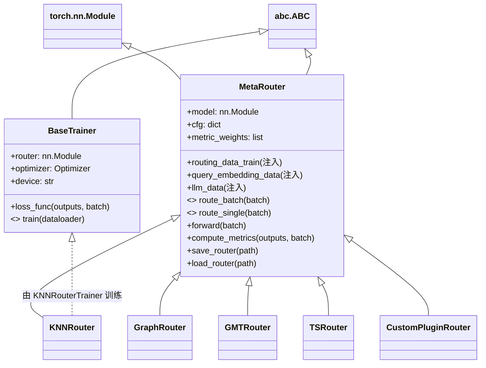

### 3.2 两个必实现方法的语义差异

| 方法 | 语义 | 是否调用 LLM API |
|---|---|---|
| `route_single(query_input: dict) -> dict` | **纯路由决策**：输入 `{"query": ...}`，输出增加 `model_name` / `predicted_llm` 字段 | ❌ 不调用（CLI `--route-only` 即走此路径） |
| `route_batch(batch, task_name=None) -> list[dict]` | **端到端执行**：路由 → 按任务模板格式化 prompt → 调 API → 计算性能指标 | ✅ 调用 |

以 `KNNRouter.route_batch` 为例，它内部串联了四步：
```
route → generate_task_query(task 模板) → call_api(LiteLLM) → calculate_task_performance(指标)
```

> **架构评价**：`route_batch` 把"路由决策"和"模型执行 + 评测"揉在一个方法里。好处是研究场景一行跑通；坏处是**关注点混杂**——想只用路由决策、自己接推理后端时，只能用 `route_single` 逐条跑，失去批量效率。这是与 Switchyard 那类生产网关最本质的架构分歧（后者严格把"决策"与"执行"分离到不同 crate）。

---

## 4. 端到端流程图

### 4.1 全生命周期总览

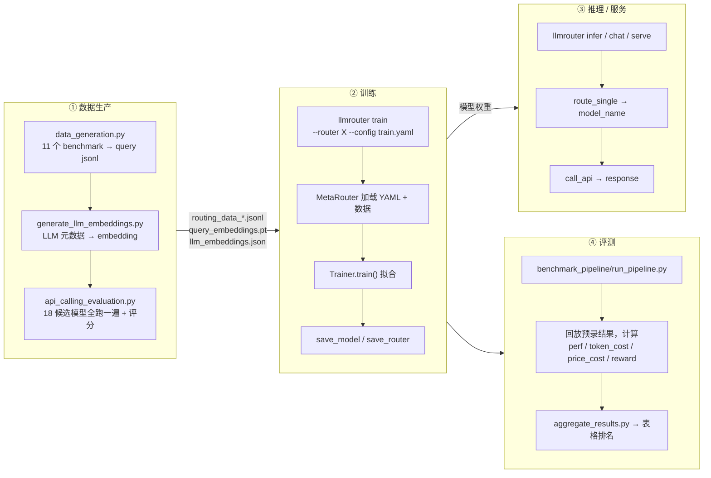

### 4.2 单次推理请求的详细时序

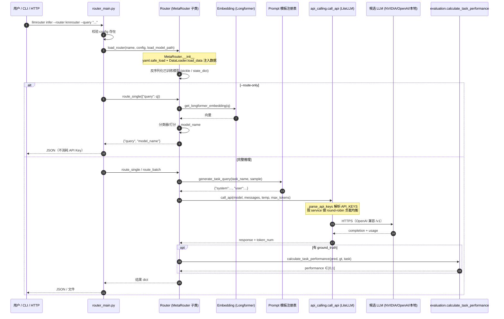

### 4.3 数据生产管线三步流

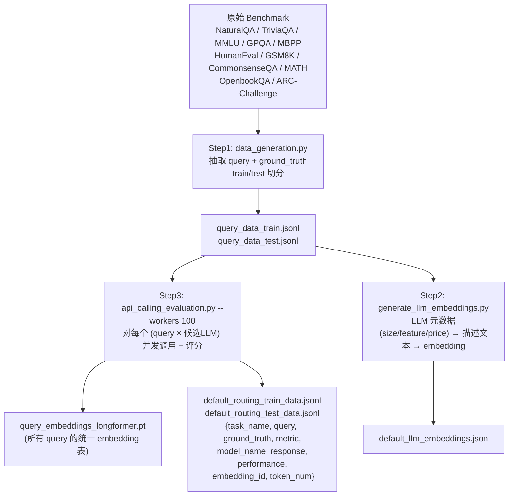

**关键设计**：`embedding_id` 是 query 到 `query_embeddings_*.pt` 张量表的**索引**，而非把向量内联进 JSONL。这样同一个 query 被 18 个模型跑过、产生 18 条 routing_data 记录时，向量只存一份。这是数据规模控制上的关键决策。

---

## 5. 各模块功能详解

### 5.1 模块地图

```
llmrouter/
├── models/            ← 算法核心：17 个路由器 + MetaRouter/BaseTrainer
├── data/              ← 数据契约定义 + 三步生产管线 + 多模态生成
├── utils/             ← 能力工具箱：embedding / API / 评测 / prompt / 数据处理
├── evaluation/        ← 指标注册表 + 批量评测器
├── cli/               ← 四个子命令实现（train/infer/chat + main 分发）
├── serve/             ← 轻量 OpenAI 兼容 Server
├── prompts/           ← YAML prompt 模板库（task/data/router/agentic_role）
└── plugin_system.py   ← 插件发现与注册

配套目录：
├── openclaw_router/   ← 生产级 OpenAI 兼容 Server（多模态 + 记忆 + 流式）
├── benchmark_pipeline/← xRouteBench 一键跑通管线
├── configs/           ← train/test 两套 YAML
├── custom_routers/    ← 插件示例（RandomRouter / ThresholdRouter）
├── custom_tasks/      ← 自定义任务示例
├── ComfyUI/           ← 可视化节点
├── notebooks/         ← 每个路由器的 训练/推理 双 Notebook
└── data/              ← 数据集转换脚本 + 示例数据 + HumanEval 执行沙箱
```

### 5.2 `llmrouter/models` —— 算法核心

| 文件 | 行数 | 职责 |
|---|---|---|
| `meta_router.py` | 154 | `MetaRouter` 抽象基类：YAML 加载、数据注入、`route_*` 契约、save/load |
| `base_trainer.py` | 69 | `BaseTrainer` 抽象基类：`loss_func` + `train` 契约 |
| `<router>/router.py` | 各异 | 具体路由器的推理逻辑 |
| `<router>/trainer.py` | 各异 | 具体路由器的训练逻辑 |
| `<router>/README.md` | — | 每个路由器独立的算法说明文档 |

**目录约定**：`models/<router_name>/{__init__.py, router.py, trainer.py, README.md}`，部分复杂路由器有额外文件（`graphrouter/graph_nn.py`、`gmtrouter/{models.py, data_loader.py}`、`automix/{methods.py, model.py, data_pipeline.py, main_automix.py}`）。这个目录约定同时也是**插件系统的发现规则**。

### 5.3 `llmrouter/utils` —— 能力工具箱（约 3200 行）

| 模块 | 关键函数 | 说明 |
|---|---|---|
| `embeddings.py` | `get_longformer_embedding` / `parallel_embedding_task` | 默认 embedding 后端 Longformer（benchmark 管线改用 Qwen3-Embedding-0.6B） |
| `api_calling.py` (427行) | `call_api` / `_parse_api_keys` | **LiteLLM 封装 + 多 Key 轮询**。支持四种 `API_KEYS` 格式（service dict / JSON 数组 / 逗号分隔 / 单 key）；按 `service` 字段各自维护 round-robin 计数器；localhost 端点自动免鉴权；GPT2 tokenizer 兜底计 token |
| `evaluation.py` (709行) | `f1_score` / `exact_match_score` / `cem_score` / `get_bert_score` / `evaluate_code` / `calculate_task_performance` | 全任务指标实现，含 MATH 的 `\boxed{}` 解析与 LaTeX 规范化（`strip_string` / `fix_fracs` / `fix_sqrt`），代码任务走沙箱执行 |
| `prompting.py` (256行) | `register_prompt` / `generate_task_query` / `format_*_prompt` | **装饰器驱动的 prompt 注册表**，是自定义任务的扩展点 |
| `data_convert.py` (583行) | 各种格式转换 | 把外部数据集转成标准 routing_data |
| `data_processing.py` | `process_final_data` / `generate_embeddings_for_data` | 管线 Step3 的核心处理 |
| `conversation.py` / `arena_conversation.py` | `extract_user_prompt` / `aggregate_preferences_by_query` / `calculate_model_scores` | Chatbot Arena 偏好数据处理（供 EloRouter 使用） |
| `constants.py` | `TASK_DESCRIPTIONS` / `TASK_CATEGORIES` / `API_KEYS` / `HF_TOKEN` | 全局常量 |

`utils/__init__.py` 里有一个值得注意的**优雅降级**设计：评测函数依赖 `sentence-transformers`/`bert-score` 等重依赖，导入失败时不抛异常，而是把每个函数替换为抛 `ImportError` 的 stub，让"只做路由不做评测"的用户不必安装全部依赖。

```python
try:
    from .evaluation import f1_score, ...
except Exception:
    def _missing_eval_dep(*_a, **_k):
        raise ImportError("Evaluation utilities require extra dependencies ...")
    f1_score = _missing_eval_dep
    ...
```

### 5.4 `llmrouter/data` —— 数据契约与生产

| 文件 | 行数 | 职责 |
|---|---|---|
| `data.py` | 456 | **数据格式契约**：`StandardQueryData` / `StandardRoutingData` / `GMTRouterDataFormat` / `DataFormatDetector`（自动识别格式）/ `print_format_help` |
| `data_loader.py` | 54 | `DataLoader`：把 YAML `data_path` 里声明的 6 类文件加载并注入 router 实例 |
| `data_generation.py` | 742 | 管线 Step1：11 个 benchmark → query jsonl |
| `generate_llm_embeddings.py` | 145 | 管线 Step2 |
| `api_calling_evaluation.py` | 687 | 管线 Step3：并发调用 + 评测 + 统一 embedding |
| `multimodal_generation.py` | 139 | VLM 图像理解：`encode_image_to_base64` / `build_vision_content` / `batch_vlm_describe_images` |

`DataLoader` 支持的 6 类数据：

| YAML key | 加载器 | 注入属性 |
|---|---|---|
| `query_data_train` / `query_data_test` | `load_jsonl` | `query_data_train/test` |
| `query_embedding_data` | `load_pt` | `query_embedding_data`（torch 张量表） |
| `routing_data_train` / `routing_data_test` | `jsonl_to_csv` | `routing_data_train/test`（pandas DataFrame） |
| `llm_data` | `load_json_file` | `llm_data` |
| `llm_embedding_data` | `load_json_file` | `llm_embedding_data` |

### 5.5 `llmrouter/evaluation` —— 指标注册表

`batch_evaluator.py` 提供 `@evaluation_metric('name')` 装饰器与内置指标（`exact_match` / `exact_match_mc` / `cem` / `cemf1` / `f1` / `bert_score` / `gsm8k`），以及 `evaluate_batch` / `register_custom_metric` / `get_available_metrics`。这是与 `utils/prompting.py` 的 `register_prompt` 配套的第二个扩展点：**任务注册 prompt 模板 + 默认 metric，metric 注册评分函数**。

### 5.6 `llmrouter/cli` —— 统一命令行

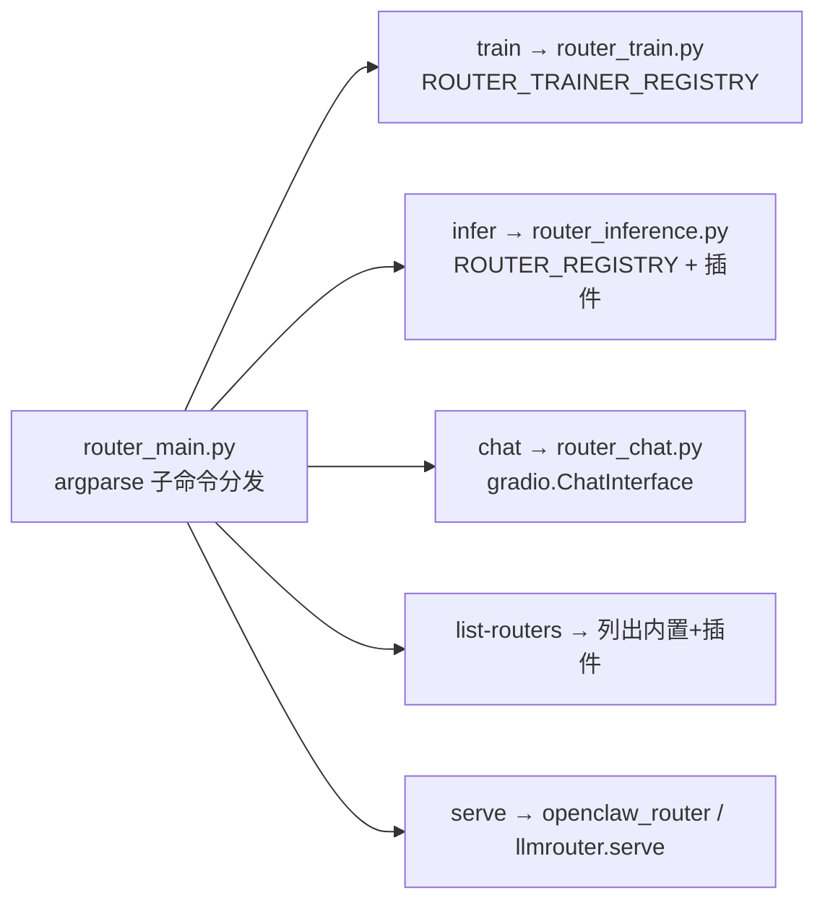

`chat` 子命令支持三种上下文模式，直接影响路由输入：

| Mode | 路由输入 |
|---|---|
| `current_only`（默认） | 仅当前 query |
| `full_context` | 全部历史 + 当前 query 拼接 |
| `retrieval` | 检索 top-k 相似历史 query 作为上下文 |

---

## 6. 16+ 路由算法族谱与技术原理

### 6.1 五大类别全景

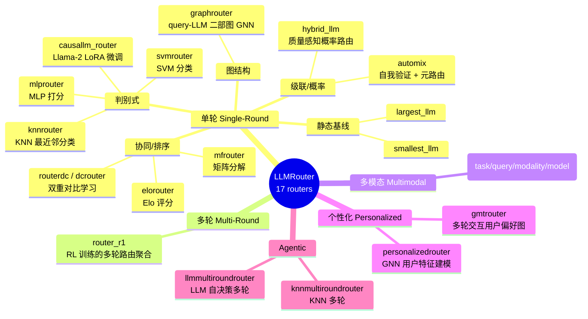

### 6.2 代表性算法技术拆解

#### (1) KNNRouter —— 最简基线，也是理解框架的最佳入口

```python
# 训练标签构造：每个 query 取 performance 最高的模型作为 label
routing_best = self.routing_data_train.loc[
    self.routing_data_train.groupby("query")["performance"].idxmax()
].reset_index(drop=True)

query_embedding_id = routing_best["embedding_id"].tolist()
self.query_embedding_list = [self.query_embedding_data[i].numpy() for i in query_embedding_id]
self.model_name_list = routing_best["model_name"].tolist()
```

推理：`get_longformer_embedding(query)` → `KNeighborsClassifier.predict` → `model_name`。

**这段代码揭示了整个框架的核心监督信号构造范式**：
> 把"路由"退化为"多分类"，类别 = 候选 LLM，标签 = 在该 query 上 performance 最高的那个模型。

成本感知版本只需把 `performance` 列换成 `α·norm(perf) − β·norm(cost)`（benchmark_pipeline 正是这么做的），**所有基于 `idxmax` 的路由器自动变成成本感知路由器**——这是一个非常漂亮的设计杠杆。

> ⚠️ **实现瑕疵**：`KNNRouter.route_single` 每次调用都执行 `self.knn_model = load_model(load_model_path)`，即**每条 query 重新从磁盘反序列化一次模型**。单条推理无感，但在 Server 场景下这是明确的性能瓶颈。

#### (2) GraphRouter —— 图神经网络路由

图结构：
- **Query 节点**：特征 = query embedding
- **LLM 节点**：特征 = LLM 描述 embedding
- **边**：每个 query 连接所有 LLM，边权 = performance

```python
self.gnn_config = {
    'learning_rate': ..., 'weight_decay': ..., 'train_epoch': 100,
    'batch_size': 4, 'train_mask_rate': 0.3,     # 训练时遮蔽 30% 的边
    'llm_num': self.num_llms, 'val_split_ratio': 0.2
}
self.gnn_predictor = GNNPredictor(
    query_feature_dim=self.query_dim, llm_feature_dim=self.llm_dim,
    hidden_features_size=self.hidden_dim,
    in_edges_size=1,     # 边特征仅 performance 一维
    ...)
```

推理时新 query 作为新节点接入图，GNN 预测它与各 LLM 的边权，取最大者。**优势**：能建模 LLM 之间的关系（哪些模型能力相近），而非把每个 LLM 当独立类别；**代价**：需要 `torch_geometric` 类依赖 + GPU。

#### (3) TSRouter —— 四部异构图 + 模态选择

这是唯一同时决策"**用哪个模态**"和"**用哪个模型**"的路由器。四类节点：`task` / `query` / `modality` / `model`。时序数据可以以文本形式喂 LLM，也可以渲染成折线图喂 VLM，或混合。TSRouter 联合选 `(modality, model)` 对，并支持零样本泛化到未见模型与新任务。配套 `data/tsrbench/` 提供 TSRBench 下载与到标准接口的转换脚本。

#### (4) AutoMix / HybridLLM —— 级联与概率路由

- **AutoMix**：小模型先答 → **自我验证（self-verification）** → 元路由器（POMDP 风格）决定是否升级到大模型。目录里有独立的 `methods.py`（验证方法）+ `model.py`（元路由器）+ `data_pipeline.py`。
- **HybridLLM**：训练一个质量差距预测器，输出"大模型比小模型好多少"的概率，按阈值做概率路由。

这两者是 Switchyard 的 `escalation` / `llm_classifier` 路由在研究侧的对应物。

#### (5) GMTRouter / PersonalizedRouter —— 个性化

关键差异在数据契约：`GMTRouterDataFormat` 引入 `GMTRouterConversationTurn` / `GMTRouterInteraction`，携带 **user_id + 多轮交互历史 + 偏好标注**。路由决策条件化在用户画像上，同一 query 不同用户可路由到不同模型。README 的实验结论指出：**在紧成本预算与个性化设定下，轻量路由器与用户条件化路由器优势显著**。

### 6.3 算法能力矩阵

| Router | 需训练 | 需 GPU | 推理时调 LLM | 输入信号 | 适用场景 |
|---|:---:|:---:|:---:|---|---|
| `smallest/largest_llm` | ❌ | ❌ | ✅ | 无 | 基线 |
| `knnrouter` | ✅ | ❌ | ✅ | query emb | 最快上手 |
| `svmrouter` | ✅ | ❌ | ✅ | query emb | 小数据 |
| `mlprouter` | ✅ | 建议 | ✅ | query emb | 通用 |
| `mfrouter` | ✅ | 建议 | ✅ | query-model 交互矩阵 | 冷启动弱 |
| `elorouter` | ✅ | ❌ | ✅ | 成对偏好 | Arena 数据 |
| `routerdc` | ✅ | 建议 | ✅ | 对比学习 | 表征强 |
| `graphrouter` | ✅ | 建议 | ✅ | 二部图 | 模型间关系 |
| `hybrid_llm` | ✅ | ❌ | ✅ | 质量差距 | 二模型成本优化 |
| `automix` | ✅ | ❌ | ✅✅ | 小模型答案 + 自验证 | 级联 |
| `causallm_router` | ✅ | ✅ ≥40GB | ✅ | 原始文本 | 最强但最重 |
| `tsrouter` | ✅ | ✅ | ✅ | 四部图 | 时序多模态 |
| `gmtrouter` | ✅ | 建议 | ✅ | 用户多轮交互 | 个性化 |
| `personalizedrouter` | ✅ | 建议 | ✅ | 用户特征 GNN | 个性化 |
| `knnmultiroundrouter` | ✅ | ❌ | ✅✅ | 多轮 | Agentic |
| `llmmultiroundrouter` | ❌ | ❌ | ✅✅ | LLM 自决策 | Agentic 零训练 |
| `router_r1` | 外部 RL | ✅ vllm | ✅✅ | 多轮 RL 策略 | 多轮聚合 |

---

## 7. 数据契约与数据流

### 7.1 三张核心表

#### ① `query_data_*.jsonl` —— 查询表
```json
{"task_name": "gsm8k", "query": "...", "ground_truth": "2", "metric": "GSM8K"}
```

#### ② `routing_data_*.jsonl` —— 路由监督表（核心）
```json
{
  "task_name": "gsm8k",
  "query": "Janet has 4 apples. She gives 2 to Bob. How many does she have left?",
  "ground_truth": "2",
  "metric": "GSM8K",
  "model_name": "llama3-chatqa-1.5-8b",
  "response": "... 4 - 2 = 2 apples left.",
  "performance": 1.0,
  "embedding_id": 42,
  "token_num": 453
}
```
**基数关系**：`|routing_data| = |query_data| × |candidate_LLMs|`。这就是"预录制执行结果"的物理形态。

#### ③ `default_llm.json` —— 候选模型表
```json
{
  "qwen2.5-7b-instruct": {
    "size": "7B",
    "feature": "...",
    "input_price": 0.3,
    "output_price": 0.3,
    "model": "qwen/qwen2.5-7b-instruct",
    "service": "NVIDIA",
    "api_endpoint": "https://integrate.api.nvidia.com/v1"
  }
}
```
`service` 字段是 API Key 路由的关键：`API_KEYS` dict 格式按 service 名匹配对应的 key 池。

### 7.2 API 端点解析优先级

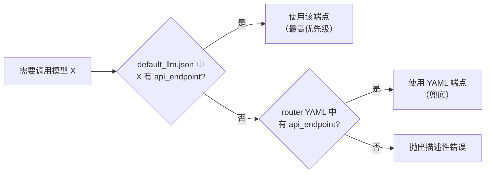

同理，API Key 解析优先级：`API_KEYS` dict 按 `service` 精确匹配 → 找不到则报错并列出可用 services；legacy 格式（数组/逗号分隔/单值）全局共用一个 key 池；localhost / 127.0.0.1 端点允许空字符串 key。

### 7.3 格式自动检测

`data/data.py` 的 `DataFormatDetector` 会检测数据是标准格式还是 GMTRouter 个性化格式，并通过 `get_format_requirements` / `print_format_help` 给出人类可读的字段要求说明。这是给"自带数据集"用户的一个体贴设计。

---

## 8. xRouteBench 基准评测管线

### 8.1 管线架构

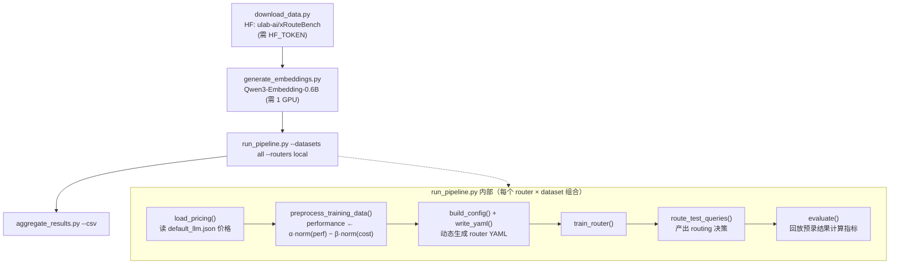

### 8.2 8 个数据集覆盖

| 数据集 | 领域 | 测试 query 数 |
|---|---|---:|
| `llmrouter_generic` | 13 个经典 NLP benchmark（MMLU/GSM8K/MATH/MBPP…） | 3,729 |
| `memory_locomo` | 长对话记忆 QA（RAG top-k=5） | 314 |
| `memory_longmemeval` | 长期记忆评测（RAG top-k=5） | 101 |
| `timeseries` | 时序理解（7 个子任务） | 127 |
| `video` | 第一人称视频 QA（Charades-Ego） | 27 |
| `multimodal_geometry3k` | 几何数学 | 61 |
| `multimodal_mathvista` | 视觉数学推理 | 100 |
| `personalized` | 个性化偏好（chat 格式） | 303 |

### 8.3 成本感知（Pareto）训练机制

```
reward = α · norm(performance) − β · norm(price_cost)
price_cost = in_tokens × in_price/1e6 + out_tokens × out_price/1e6
```

归一化按列做 min-max。扫参：`for a in 1.0 0.8 0.6 0.4 0.2; b = 1-a`。

**这个设计的巧妙之处**：它不改任何路由器的代码，只改训练数据里 `performance` 这一列的语义。因为几乎所有路由器的监督信号构造都是 `groupby("query")["performance"].idxmax()`，替换该列即让全体路由器变成成本感知。

### 8.4 分类执行策略

| 类别 | 路由器 | 执行方式 |
|---|---|---|
| Embedding-based | knn/svm/mlp/mf/elo/graph/routerdc/hybrid_llm | 主进程内训练 + 回放评测，零 API 成本 |
| Baselines | largest/smallest_llm | 无需训练 |
| Generic trainable | gmtrouter/personalizedrouter | 走仓库注册表 |
| **Heavy** | causallm_router | **子进程两阶段**（`_causallm_stage.py --stage train` / `--stage infer`），因单进程 LoRA 微调 + vLLM 会 OOM 一张 48GB GPU |
| **API-calling** | knnmultiround/llmmultiround/router_r1/automix | 需 `--include-api-routers` + `LLM_API_KEY`，**产生真实费用** |

`--routers local` = 前四类共 13 个路由器，零 API 成本。结果按 `results/<dataset>_<router>_a<alpha>_b<beta>.json` 落盘，**已完成组合自动跳过，整个 sweep 可断点续跑**。

### 8.5 论文核心结论（README 引述）

> 学习型路由器相对最强固定模型基线提升 **14.6%（相对值）**；在紧成本预算与个性化设定下，轻量与用户条件化路由器优势明显。

---

## 9. 服务化：serve 与 OpenClaw Router

项目里存在**两套 OpenAI 兼容 Server**，功能重叠：

| 维度 | `llmrouter/serve/` (531行) | `openclaw_router/` (2894行) |
|---|---|---|
| 定位 | 轻量参考实现 | 生产集成实现 |
| 路由策略 | 仅 `custom_routers.*` 动态加载 | 内置 rules/random/round_robin/llm + 全部 LLMRouter ML 路由器 |
| 多模态 | ❌ | ✅ 图像/音频/视频 → 文本（`media.py` 651行） |
| 路由记忆 | ❌ | ✅ Contriever 检索增强（`memory.py` 337行） |
| 流式 | ✅ 基础 | ✅ + `[model_name]` 前缀 |
| Tool calls | ❌ | ✅（`tests/test_openclaw_http_tool_calls.py`） |
| WebSocket | ✅ | ✅ |
| 上下文限制 | 基础 | `MODEL_CONTEXT_LIMITS` + `MODELS_WITHOUT_SYSTEM_ROLE` 兼容表 |

### 9.1 OpenClaw Router 架构

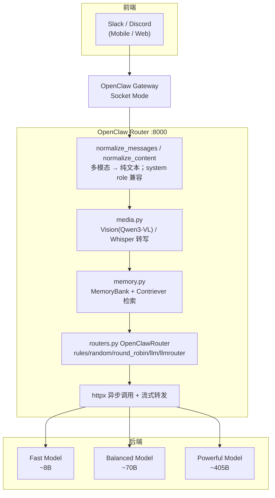

### 9.2 路由记忆（Retrieval-Augmented Routing）

`memory.py` 的 `MemoryBank` 是一个值得单独说的设计：

- **持久化**：追加写 JSONL，向量用 base64 编码的 float32 内联存储（`_encode_f32_b64`）
- **检索**：Contriever（`facebook/contriever-msmarco`）编码 + 余弦相似度，**懒加载**模型（memory 关闭时不下载）
- **线程安全**：`threading.Lock`
- **用途**：把历史 `(query → selected_model)` 决策作为下一次路由的上下文，形成**在线经验积累**

```yaml
memory:
  enabled: true
  path: "${HOME}/.llmrouter/openclaw_memory.jsonl"
  top_k: 10
  retriever_model: "facebook/contriever-msmarco"
```

这是框架里最接近"在线学习/持续适配"的组件，也呼应了 README TODO 中的"continual/online learning"。

### 9.3 鉴权模式自适应

```python
LOCAL_PROVIDER_HINTS = {"sglang", "vllm", "llama.cpp", "lmstudio", "huggingface_cli", ...}

def _resolve_auth_mode(provider, base_url, auth_mode="auto", local=None) -> str:
    if mode in ("none", "bearer"): return mode
    if provider in LOCAL_PROVIDER_HINTS or _is_local_base_url(base_url): return "none"
    return "bearer"
```

本地推理服务（vLLM/Ollama/SGLang/LM Studio）自动免鉴权，这是对"研究者在本机跑模型"场景的贴心处理。

---

## 10. 扩展机制：插件路由器与自定义任务

### 10.1 插件发现流程

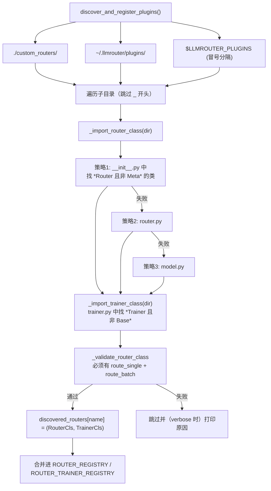

**约定优于配置**：类名以 `Router` 结尾且不以 `Meta` 开头即被识别；Trainer 类名以 `Trainer` 结尾且不以 `Base` 开头。无需注册文件、无需 entry_points。

**校验非常宽松**：`_validate_router_class` 只用 `hasattr` 检查两个方法名存在，不检查签名，也不检查是否继承 `MetaRouter`。这意味着 duck-typing 的路由器也能工作，但错误发现时机被推迟到运行时。

**异常吞噬**：`_load_router_from_directory` 用 `except Exception` 包住整个加载过程，非 verbose 模式下静默跳过。调试自定义路由器时务必开 `verbose=True`。

### 10.2 自定义任务的三点式扩展

```python
# 1. 注册 prompt 格式化器 + 默认 metric
@register_prompt('my_task', default_metric='my_metric')
def format_my_task_prompt(sample_data):
    return {"system": load_prompt_template("task_my_task"), "user": f"Question: {sample_data['query']}"}

# 2. custom_tasks/task_prompts/task_my_task.yaml
#    template: |
#      You are an expert at ...

# 3. 注册评测指标
@evaluation_metric('my_metric')
def my_metric(prediction, ground_truth, **kwargs) -> float:
    return 1.0 if prediction == ground_truth else 0.0
```

之后 `generate_task_query('my_task', ...)` 与 `calculate_task_performance(..., task_name='my_task')` 自动生效——**metric 由 task 名推断**，无需显式指定。

### 10.3 三种常见路由模式（README 提供的模板）

```python
# 规则路由
if 'code' in query.lower(): return {"model_name": "code-specialist"}

# Embedding 路由
embedding = get_longformer_embedding(query); selected = self._find_best_model(embedding)

# 成本优化路由：按价格升序找第一个能力达标的模型
for name, info in sorted(self.llm_data.items(), key=lambda x: x[1]['cost']):
    if info['capability'] >= difficulty: return {"model_name": name}
```

---

## 11. 工程质量评估与风险清单

### 11.1 优点

| 项 | 说明 |
|---|---|
| ✅ **抽象干净** | `MetaRouter` 154 行、`BaseTrainer` 69 行，接口极简，17 个算法都能塞进去，说明抽象选得准 |
| ✅ **文档密度极高** | 每个路由器有 README + 训练/推理双 Notebook；根 README 44KB，覆盖安装到部署全流程 |
| ✅ **可复现性设计优秀** | 预录制执行结果 + 断点续跑 + 显式 train/test 配置分离 |
| ✅ **扩展点设计到位** | 插件路由器 / 任务注册 / 指标注册三条正交扩展路径 |
| ✅ **依赖优雅降级** | 重依赖导入失败转为延迟报错 stub，而非启动即崩 |
| ✅ **多 Key 负载均衡** | 按 service 分池的 round-robin，对研究场景刷 benchmark 很实用 |

### 11.2 风险与改进点

| 严重度 | 问题 | 位置 | 影响 |
|:---:|---|---|---|
| 🔴 高 | **`route_single` 每次调用重新从磁盘加载模型** | `models/knnrouter/router.py`（其他 sklearn 系路由器有同类模式） | Server 场景每请求一次磁盘 IO + 反序列化，吞吐严重受限 |
| 🔴 高 | **决策与执行耦合在 `route_batch`** | `MetaRouter` 契约 | 无法只用路由决策接自有推理栈；批量场景只能退化为逐条 `route_single` |
| 🟠 中 | **数据以副作用注入 `self`** | `data/data_loader.py` | 属性在类定义中不可见；缺文件仅 `print` warning，下游变 `NoneType` 错误 |
| 🟠 中 | **两套 Server 实现并存且功能重叠** | `llmrouter/serve/` vs `openclaw_router/` | 维护成本翻倍，用户困惑该用哪个 |
| 🟠 中 | **`ROUTER_REGISTRY` 手工维护 + 分散在两个文件** | `cli/router_train.py`, `cli/router_inference.py` | 新增路由器需改多处；别名（`dcrouter`/`routerdc`、`gmt_router`/`gmtrouter`）手工同步 |
| 🟠 中 | **插件加载 `except Exception` 静默吞异常** | `plugin_system.py:128` | 自定义路由器加载失败时非 verbose 模式无任何提示 |
| 🟡 低 | **`print` 而非 `logging`** | 全局（`_safe_log` 是 openclaw 的局部补丁） | 无法按级别过滤、无结构化日志、无法接入可观测性栈 |
| 🟡 低 | **`RouterAdapter._load_router` 用 `"router" in attr.lower()` 猜类名** | `serve/server.py` | 模块内有多个含 "router" 的符号时行为不确定 |
| 🟡 低 | **`.DS_Store` 入库** | 多个目录 | 仓库卫生 |
| 🟡 低 | **项目根散落 `CUSTOM_ROUTER_SUMMARY.md` / `PROMPT_FORMAT_UPDATE.md`** | 根目录 | 应归入 docs/ |

### 11.3 测试覆盖

```
tests/
├── test_websocket.py
├── test_openclaw_http_tool_calls.py
├── test_plugin_system.py
└── train_test/
    ├── test_gmtrouter.py / test_knnmultiroundrouter.py / test_svmrouter.py
    ├── test_automix_router.py / test_causallm_router.py / test_dcrouter.py
    ├── test_mfrouter.py / test_graphrouter.py / test_tsrouter.py / test_hybrid_llm.py
```

覆盖为**训练冒烟测试为主**（每个路由器能否跑通训练），缺少：路由决策正确性的单元测试、数据契约校验测试、API 调用层的 mock 测试。对研究项目可接受，对生产使用需补齐。

---

## 12. 适用场景建议

### 12.1 推荐使用

| 场景 | 推荐度 | 说明 |
|---|:---:|---|
| **路由算法研究与论文复现** | ⭐⭐⭐⭐⭐ | 这是它的主场。17 个基线 + 8 个数据集 + 零成本回放评测 |
| **自研路由算法的评测基座** | ⭐⭐⭐⭐⭐ | 实现 `route_single`/`route_batch` 即可接入全部 benchmark |
| **成本-质量帕累托曲线分析** | ⭐⭐⭐⭐⭐ | α/β 扫参一条命令 |
| **中小规模内部服务（<10 QPS）** | ⭐⭐⭐ | OpenClaw Router 可用，但需先修模型重复加载问题 |
| **Slack/Discord 智能助手** | ⭐⭐⭐⭐ | OpenClaw 集成是现成的 |
| **高 QPS 生产 LLM 网关** | ⭐ | Python 单进程 + 每请求重载模型 + 无连接池管理，不适合 |
| **需要协议翻译（OpenAI↔Anthropic）** | ⭐ | 不支持，只做 OpenAI 兼容 |

### 12.2 落地路径建议

**阶段一：离线评估（1-2 天）**
```bash
pip install llmrouter-lib
cd benchmark_pipeline && python download_data.py && python generate_embeddings.py
python run_pipeline.py --datasets all --routers local
python aggregate_results.py --csv
```
拿到 13 个路由器在 8 个数据集上的完整对比表，确定哪个算法族适合你的流量特征。

**阶段二：自有数据接入（3-5 天）**
1. 按 `data/README.md` 准备 `default_llm.json`（含 service / api_endpoint / 价格）
2. 跑三步数据生产管线，产出 `routing_data_*.jsonl`
3. 用 `--alpha/--beta` 扫出你的成本预算下的最优路由器

**阶段三：服务化（1-2 周）**
1. 用 `openclaw_router` 起 OpenAI 兼容服务
2. **必须先修**：把 `route_single` 里的 `load_model` 提到 `__init__`
3. 加 `logging` 替代 `print`，接入监控
4. 开启 `memory` 做在线经验积累

### 12.3 与生产级网关的定位区分

如果你的需求是"**在生产流量上跑路由**"，LLMRouter 提供的是**算法**，而不是**运行时**。合理的组合是：

```
LLMRouter（离线训练出路由策略 / 确定阈值）
        ↓ 导出决策逻辑
生产网关（Rust / Go / 高性能 Python，负责协议翻译、重试、熔断、可观测性）
```

这正好对应本次同时分析的 Switchyard 的定位——详见 `Switchyard_深度技术解读报告.md`。

---

## 附录 A：核心命令速查

```bash
# 安装
pip install llmrouter-lib                     # 或 pip install -e ".[all]"

# API Key（推荐 service dict 格式）
export API_KEYS='{"NVIDIA":"k1,k2","OpenAI":["k3"],"Ollama":""}'

# 数据生产三步
python llmrouter/data/data_generation.py --config llmrouter/data/sample_config.yaml
python llmrouter/data/generate_llm_embeddings.py --config .../sample_config.yaml
python llmrouter/data/api_calling_evaluation.py --config .../sample_config.yaml --workers 100

# 训练 / 推理 / 聊天
llmrouter train --router mlprouter --config configs/model_config_train/mlprouter.yaml --device cuda
llmrouter infer --router knnrouter --config configs/model_config_test/knnrouter.yaml --query "..." --route-only
llmrouter chat  --router knnrouter --config ... --mode retrieval --top_k 5
llmrouter list-routers
llmrouter serve --config openclaw_router/config.yaml --router knnrouter

# 基准
cd benchmark_pipeline && python run_pipeline.py --datasets all --routers local --alpha 0.6 --beta 0.4
```

## 附录 B：关键文件索引

| 主题 | 文件 |
|---|---|
| 路由器基类 | `llmrouter/models/meta_router.py:11` |
| 训练器基类 | `llmrouter/models/base_trainer.py:6` |
| 插件系统 | `llmrouter/plugin_system.py:30` |
| 推理注册表 | `llmrouter/cli/router_inference.py:63` |
| 训练注册表 | `llmrouter/cli/router_train.py:49` |
| 数据加载注入 | `llmrouter/data/data_loader.py:13` |
| API 调用 + Key 轮询 | `llmrouter/utils/api_calling.py` |
| 指标注册表 | `llmrouter/evaluation/batch_evaluator.py:28` |
| Prompt 注册表 | `llmrouter/utils/prompting.py` |
| 基准主程序 | `benchmark_pipeline/run_pipeline.py` |
| 生产 Server | `openclaw_router/server.py` |
| 路由记忆 | `openclaw_router/memory.py` |

## 附录 C：引用与致谢的学术脉络

LLMRouter 的算法实现直接对应以下工作：

| 论文 | 对应路由器 |
|---|---|
| RouteLLM (ICLR 2025) | 整体框架思路 |
| RouterDC (NeurIPS 2024) | `routerdc` / `dcrouter` |
| AutoMix (NeurIPS 2024) | `automix` |
| Hybrid LLM (ICLR 2024) | `hybrid_llm` |
| GraphRouter (ICLR 2025) | `graphrouter` |
| GMTRouter | `gmtrouter` |
| PersonalizedRouter | `personalizedrouter` |
| Router-R1 (NeurIPS 2025) | `router_r1` |
| TSRouter | `tsrouter` |
| FusionFactory | 多 LLM 日志融合思路 |

主论文：`LLMRouter: Unified Infrastructure for Developing, Evaluating, and Deploying LLM Routers`（arXiv:2608.06867）
