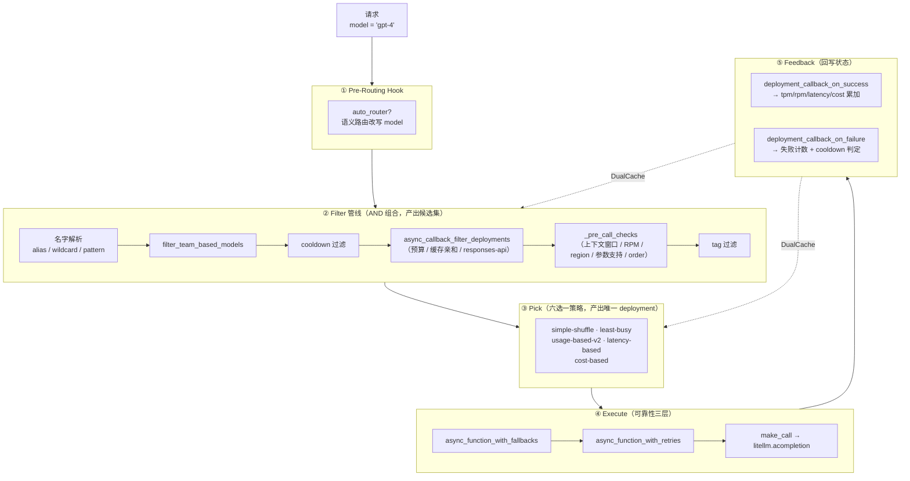
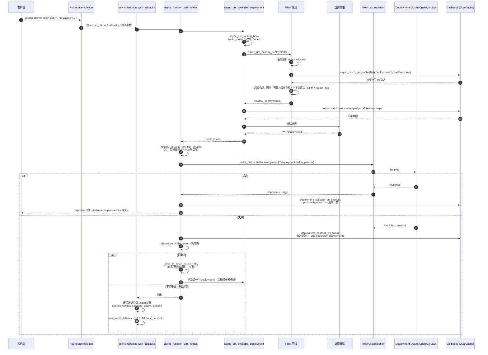
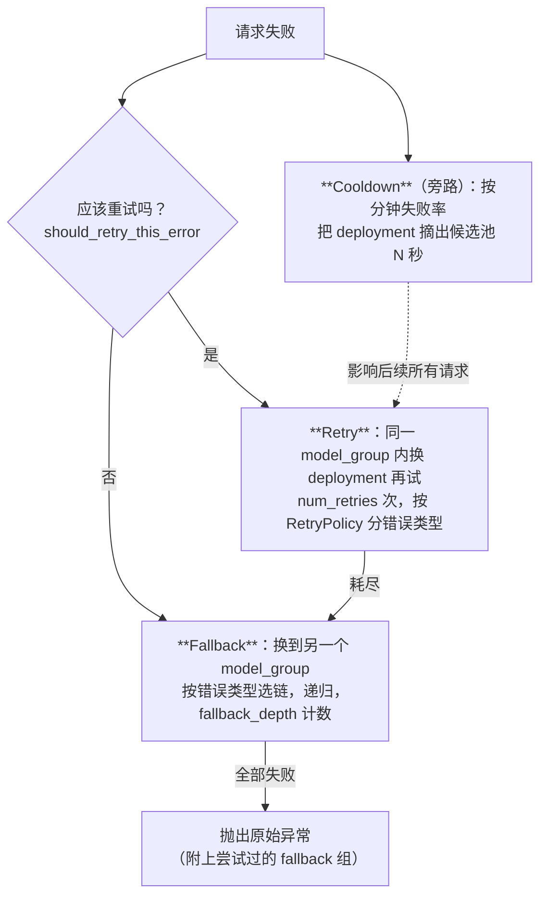
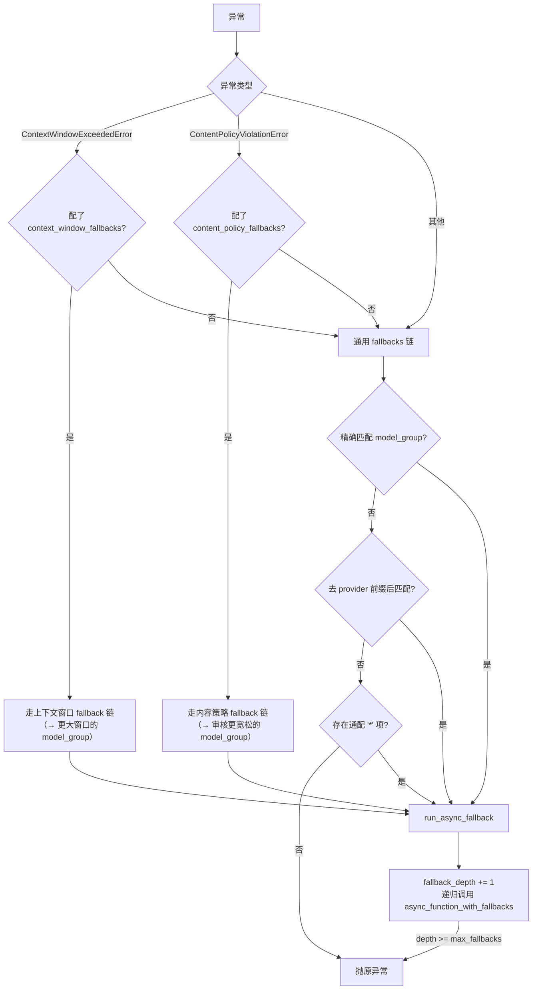
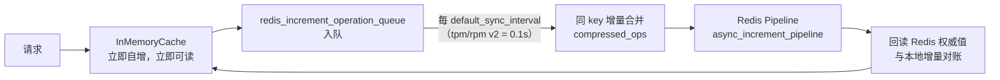
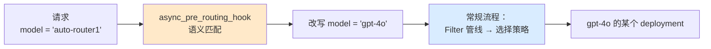
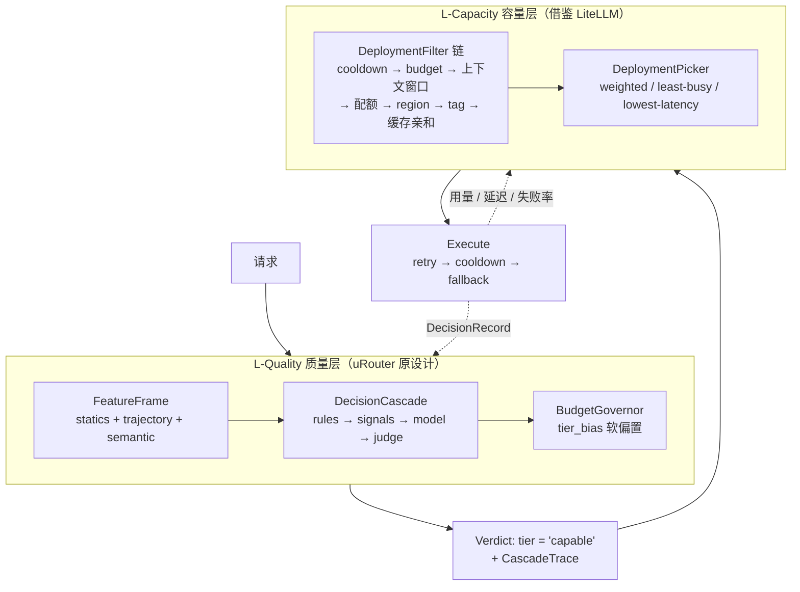

# LiteLLM Router 深度技术解读报告

> 分析对象：`opensource/litellm-647f2f5d86401441928ecbb671be3152ade5d0b3`（BerriAI/litellm）的 Router 子系统
> 分析时间：2026-08-25
> 代码规模：`litellm/router.py` 7,672 行 + `router_strategy/` 3,177 行 + `router_utils/` 2,032 行 ≈ **14,600 行**
> 语言/许可：Python 3.8+ / MIT（部分 enterprise 目录另有许可）
> 关联文档：`LLMRouter_深度技术解读报告.md`、`Switchyard_深度技术解读报告.md`、`uRouter_设计文档.md`

---

## 目录

1. [定位与总体判断](#1-定位与总体判断)
2. [核心概念模型：model_group 与 deployment 的两级命名](#2-核心概念模型model_group-与-deployment-的两级命名)
3. [整体架构：Filter → Pick → Execute → Feedback](#3-整体架构filter--pick--execute--feedback)
4. [请求生命周期端到端流程](#4-请求生命周期端到端流程)
5. [过滤器管线详解](#5-过滤器管线详解)
6. [六种选择策略的技术拆解](#6-六种选择策略的技术拆解)
7. [三层可靠性体系：Retry / Cooldown / Fallback](#7-三层可靠性体系retry--cooldown--fallback)
8. [多实例状态管理：DualCache 与批量同步](#8-多实例状态管理dualcache-与批量同步)
9. [成本与预算子系统](#9-成本与预算子系统)
10. [扩展机制](#10-扩展机制)
11. [auto_router：唯一的质量路由及其组合方式](#11-auto_router唯一的质量路由及其组合方式)
12. [工程质量评估与风险清单](#12-工程质量评估与风险清单)
13. [对 uRouter 的借鉴价值](#13-对-urouter-的借鉴价值)
14. [附录](#14-附录)

---

## 1. 定位与总体判断

### 1.1 一句话概括

**LiteLLM Router 是一个"部署级负载均衡器 + 可靠性引擎"**：它解决的核心问题不是"这个请求该用哪个模型"，而是**"这个模型的 N 个部署（deployment）里，现在该打哪一个，打失败了怎么办"**。

### 1.2 与前三个项目的定位差异

这是理解 LiteLLM Router 最关键的一点，也是它最容易被误读的地方。

| 项目 | 路由的"选择空间" | 决策依据 | 一句话 |
|---|---|---|---|
| **LLMRouter** | 不同能力的**模型**（18 个候选 LLM） | query 语义 + 历史性能矩阵 | 这题有多难？该用多强的模型？ |
| **Switchyard** | 不同能力**层级**（efficient / capable） | 会话工具轨迹信号 | Agent 现在卡住了吗？要不要升级？ |
| **LiteLLM Router** | 同一个模型的**不同部署**（Azure-east / Azure-west / OpenAI / 自建 vLLM） | **容量、健康度、延迟、单价、配额** | 哪个后端现在最空闲、最快、最便宜、没挂？ |
| **uRouter（设计中）** | 能力层级 + （尚缺）部署 | 特征平面级联 | 上面两件事都要做 |

**LiteLLM Router 的所有六种路由策略，没有一种考虑"回答质量"**。`lowest-cost` 挑最便宜的部署，但它假定 model_group 里的部署**能力等价**——挑便宜的不会掉质量，因为那是同一个模型的不同供货渠道。

唯一的例外是 `auto_router`（第 11 节），它做真正的语义路由，但实现方式很特别：它不是一种"策略"，而是一个**前置钩子，改写请求的 model 字段**，然后让常规的负载均衡照常运行。这个组合方式是本文档对 uRouter 最有价值的发现。

### 1.3 总体判断

- **可靠性工程是这个项目最强的部分**，也是三个参考项目中唯一把 retry / cooldown / fallback 做到生产成熟度的。`should_retry_this_error` 的决策表、失败率式冷却、三条类型化 fallback 链，都是被大规模真实流量打磨出来的，不是设计出来的。
- **"过滤器管线 + 单一选择器"的结构非常干净**，且过滤器之间正交可组合——预算、标签、上下文窗口、缓存亲和性都是独立的过滤器，任何一个都能和任何一种选择策略组合。这是整个 7,672 行文件里最值得学的架构决策。
- **工程整洁度是明确的短板**。`router.py` 单文件 7,672 行、`__init__` 40+ 个参数、满屏 `# noqa: PLR0915`、策略分发是 if/elif 链、路由策略状态挂在全局 `litellm.callbacks` 上。这是一个功能驱动、快速迭代出来的 God Object。
- **完全没有质量维度**：不记录决策归因、不采集质量反馈、没有任何可训练的东西。它和 uRouter 的核心命题**不竞争，而是正交互补**——它补的正好是 uRouter 设计里最薄的那一层。

---

## 2. 核心概念模型：model_group 与 deployment 的两级命名

理解 LiteLLM Router 必须先分清两个名字：

```python
model_list = [
    {
        "model_name": "gpt-4",                          # ← model_group（客户端可见的别名）
        "litellm_params": {                             # ← 一个 deployment
            "model": "azure/my-gpt4-eastus",            #    实际调用的 provider 模型
            "api_base": "https://eastus.openai.azure.com",
            "rpm": 1000, "tpm": 100000, "weight": 3,
        },
        "model_info": {"id": "..."}                     # ← deployment 唯一 ID（自动生成）
    },
    {
        "model_name": "gpt-4",                          # ← 同一个 model_group
        "litellm_params": {
            "model": "azure/my-gpt4-westus",            #    另一个部署
            "api_base": "https://westus.openai.azure.com",
            "rpm": 500,
        },
    },
]
```

| 概念 | 含义 | 类比 |
|---|---|---|
| `model_name` / **model_group** | 客户端请求里写的模型名，一个逻辑服务 | Kubernetes 的 **Service** |
| **deployment** | 一个具体的后端实例（provider + 端点 + 凭证 + 配额） | Kubernetes 的 **Pod** |
| `model_info.id` | deployment 的稳定 ID，由 litellm_params 哈希生成（`_generate_model_id`，`router.py:5056`） | Pod 的 UID |

**路由 = 在一个 model_group 内选一个 deployment**。这个定义决定了后面的一切。

三种额外的名字解析层（都在 `_common_checks_available_deployment`，`router.py:7023`）：

| 机制 | 作用 |
|---|---|
| `model_group_alias` | 别名映射：`{"gpt-4-turbo": "gpt-4"}`；也支持 `{"model": ..., "hidden": true}` 形式 |
| **Pattern / Wildcard 路由** | `PatternMatchRouter`（`pattern_match_deployments.py:49`）把 `openai/*` 转成正则 `openai/(.*)`，匹配后把捕获组回填到 deployment 的实际模型名。多个 pattern 命中时按**特异性排序**（长度 + 正则复杂字符数，`calculate_pattern_specificity`） |
| `specific_deployment` | 客户端直接指定 deployment ID，绕过路由 |

---

## 3. 整体架构：Filter → Pick → Execute → Feedback

### 3.1 四段式结构



### 3.2 三个关键的结构性决策

#### 决策一：过滤与选择严格分离

`async_get_healthy_deployments`（`router.py:7131`）只负责**收窄候选集**，返回 `List[Dict]`；选择策略只负责**从候选集里挑一个**。二者互不知情。

收益：`N 个过滤器 × M 个选择策略` 的组合是自由的。预算限制可以配合任何策略，缓存亲和可以配合任何策略。`budget_limiter.py` 的模块 docstring 把这点说得很明白：

> Note: This is a filter, like tag-routing. Meaning it will accept healthy deployments and then filter out deployments that have exceeded their budget limit.
> This means you can use this with weighted-pick, lowest-latency, simple-shuffle, routing etc

#### 决策二："过滤到空"必须抛出**类型化**的错误

每个过滤器把候选集清空时，抛的不是通用异常，而是一个能标识**为什么空了**的具体错误：

| 过滤器 | 清空时抛出 |
|---|---|
| `_pre_call_checks` 上下文窗口 | `litellm.ContextWindowExceededError` |
| `_pre_call_checks` RPM | `RouterRateLimitErrorBasic` |
| tag 过滤 | `ValueError(RouterErrors.no_deployments_with_tag_routing)` |
| 预算过滤 | `ValueError(RouterErrors.no_deployments_with_provider_budget_routing)` |
| 选择策略无候选 | `litellm.RateLimitError`（附带每个 deployment 的 tpm/rpm 现状） |

这不是为了好看的错误信息——**错误类型直接决定后面走哪条 fallback 链**（第 7.3 节）。类型化错误是过滤层和可靠性层之间的契约。

`_pre_call_checks` 里这段代码把优先级写得很清楚（`router.py:6960`）：

```python
if len(invalid_model_indices) == len(_returned_deployments):
    # 先查限流错误（如果是限流，说明它过了上下文窗口检查但没过限流检查）
    if _rate_limit_error is True:      # 让通用 fallback 逻辑接管
        raise RouterRateLimitErrorBasic(model=model)
    elif _context_window_error is True:
        raise litellm.ContextWindowExceededError(...)
```

#### 决策三：状态回写走 CustomLogger 回调，而非策略自己管

所有策略都同时是 `CustomLogger`，通过 `log_success_event` / `async_log_success_event` / `log_failure_event` 把用量、延迟、成本写回 `DualCache`。策略在做决策时只读缓存。

这让**决策路径无副作用**（除了 usage-based-v2 的 RPM 预留，见 6.3），也让同一份用量数据能被多个消费者共用。

---

## 4. 请求生命周期端到端流程



**一个容易忽略的关键点**：重试时会**重新走一遍完整的选择流程**（`make_call` 内部重新调 `async_get_available_deployment`），而不是重试同一个 deployment。这意味着失败的 deployment 如果已进入冷却，重试自然会打到别的部署上。**重试即换机**——这是 `_time_to_sleep_before_retry` 敢在有健康部署时返回 0 的前提。

---

## 5. 过滤器管线详解

### 5.1 `_pre_call_checks`（`router.py:6804`）

需要 `enable_pre_call_checks=True` 才启用。五项检查：

| 检查 | 逻辑 | 备注 |
|---|---|---|
| **上下文窗口** | `token_counter(messages) > model_info.max_input_tokens` → 摘掉 | Azure 部署需要设 `base_model` 才知道真实模型的窗口 |
| **RPM** | 取本地缓存计数与 model_group 分钟级缓存的 `max()`，≥ 配置 rpm 则摘掉 | `usage-based-routing-v2` 下跳过（它自己有更准的机制） |
| **Region** | `is_region_allowed(litellm_params, allowed_model_region)` | 数据驻留合规 |
| **参数支持** | 请求里的非默认参数（当前只查 `response_format`）不在该模型 `supported_openai_params` 里 → 摘掉 | 只在 `litellm.drop_params is False` 时生效 |
| **order 过滤** | 若 deployment 设了 `order`，只保留 order 最小的那批（`order=1` 优先于 `order=2`） | 优先级分组，是"主备"语义 |

有两处性能优化的痕迹值得注意，说明这是热路径：

```python
# Optimized: Use list() shallow copy instead of deepcopy
# We only pop from the list, not modify deployment dicts - 100x+ faster on hot path (every request)
_returned_deployments = list(healthy_deployments)

invalid_model_indices = set()  # Use set for O(1) membership checks
...
# Single-pass filter using set for O(1) lookups (avoids O(n^2) from repeated pops)
```

但 `litellm.token_counter(messages=messages)` 仍然每请求全量跑一次分词，这是剩下的主要 CPU 开销。

### 5.2 缓存亲和性路由（`prompt_caching_deployment_check.py:23`）

这是整个 litellm Router 里**唯一一个直接以省钱为目的的过滤器**，而且思路很不一样：

```python
async def async_filter_deployments(self, model, healthy_deployments, messages, ...):
    if messages is not None and is_prompt_caching_valid_prompt(messages=messages, model=model):
        # prompt > 1024 tokens
        model_id_dict = await prompt_cache.async_get_model_id(messages=messages, tools=None)
        if model_id_dict is not None:
            model_id = model_id_dict["model_id"]
            for deployment in healthy_deployments:
                if deployment["model_info"]["id"] == model_id:
                    return [deployment]      # ← 把候选集缩到 1
    return healthy_deployments
```

机制：成功调用后（`async_log_success_event`）把 `(messages 前缀哈希) → model_id` 写进缓存；下次同前缀的请求**强制路由到同一个 deployment**，让 provider 侧的 prompt cache 命中。

**为什么这值得单独说**：prompt caching 命中的输入 token 通常只要正常价格的 **10%**。对长系统提示 + 长对话历史的 Agent 流量，缓存命中带来的节省经常**超过降级模型能省的**，而且**完全不损失质量**。这是一条与"降级到便宜模型"完全正交的省钱路径。

### 5.3 Tag / Team 过滤（`tag_based_routing.py:38`）

```
请求 metadata.tags = ["free-tier"]  →  只保留 litellm_params.tags 含 "free-tier" 的 deployment
                                        若无命中，退回标了 "default" 的 deployment
                                        若也没有，抛 no_deployments_with_tag_routing
无 tags 的请求                       →  优先用标了 "default" 的 deployment
```

配合 `filter_team_based_models`（团队专属模型隔离），构成多租户的基础隔离能力。注释解释了为什么 team 过滤必须在最前面：

> IF TEAM ID SPECIFIED ON MODEL, AND REQUEST CONTAINS USER_API_KEY_TEAM_ID, FILTER OUT MODELS THAT ARE NOT IN THE TEAM
> THIS PREVENTS WRITING FILES OF OTHER TEAMS TO MODELS THAT ARE TEAM-ONLY MODELS

---

## 6. 六种选择策略的技术拆解

### 6.1 总览

| 策略 | 优化目标 | 状态来源 | 是否需要 Redis | 决策成本 |
|---|---|---|:---:|---|
| `simple-shuffle`（默认） | 无 / 按权重分摊 | 无状态 | ❌ | O(N) |
| `least-busy` | 在途请求数最少 | `{model_group}_request_count` | 建议 | O(N) |
| `usage-based-routing-v2` | 分钟内 TPM 最低 | 每 deployment 独立 tpm/rpm key | ✅ | 1 次 mget |
| `latency-based-routing` | 滑窗平均延迟最低 | `{model_group}_map` 单 key | ✅ | 1 次 get |
| `cost-based-routing` | 单价最低 | `{model_group}_map` 单 key | ✅ | 1 次 get |
| `usage-based-routing`（v1） | 同 v2，已被 v2 取代 | model_group 级聚合 | ✅ | — |

### 6.2 simple-shuffle：被低估的默认值

```python
for weight_by in ["weight", "rpm", "tpm"]:
    weight = healthy_deployments[0].get("litellm_params").get(weight_by, None)
    if weight is not None:
        weights = [m["litellm_params"].get(weight_by, 0) for m in healthy_deployments]
        weights = [w / sum(weights) for w in weights]
        selected_index = random.choices(range(len(weights)), weights=weights)[0]
        return healthy_deployments[selected_index]
return random.choice(healthy_deployments)
```

按 `weight` → `rpm` → `tpm` 的优先级取第一个存在的字段做加权随机。**默认策略是无状态的**——这是一个务实的选择：绝大多数场景下，"按配额比例加权随机 + 冷却摘除故障节点"已经足够好，而且零 Redis 依赖、零决策延迟。

### 6.3 usage-based-routing-v2：并发安全的配额预留

这是六个策略里工程含量最高的。两个机制：

**① 选择阶段**——挑分钟内累计 TPM 最低的（`_return_potential_deployments`）：

```python
if item_tpm + input_tokens > _deployment_tpm or item_rpm + 1 > _deployment_rpm:
    continue                       # 预判：加上这次请求会超限 → 直接排除
elif item_tpm < lowest_tpm:
    lowest_tpm = item_tpm
    potential_deployments = [_deployment]
```

注意 `item_tpm + input_tokens`：判断的是**加上本次请求之后**会不会超，而不是当前是否超。

**② 调用前预留**——`async_pre_call_check`（`lowest_tpm_rpm_v2.py:143`），在**信号量内**执行：

```python
local_result = await self.router_cache.async_get_cache(key=rpm_key, local_only=True)
if local_result is not None and local_result >= deployment_rpm:
    raise litellm.RateLimitError(...)          # 本地缓存已超限，快速失败，不打 Redis
else:
    result = await self._increment_value_in_current_window(key=rpm_key, value=1, ttl=...)
    if result is not None and result > deployment_rpm:
        raise litellm.RateLimitError(...)      # 自增后才发现超限
```

代码注释直接引了 issue：

> Why? solves concurrency issue - https://github.com/BerriAI/litellm/issues/2994

这是经典的**乐观并发控制**：先自增再检查。"选择"和"实际发出请求"之间的时间窗内，可能有几十个协程同时选中同一个 deployment；只有在信号量内做原子自增，才能保证真正发出去的请求数不超配额。

**两级检查（本地 → Redis）** 也是有意的：本地缓存已超限时直接失败，省掉一次 ~100ms 的 Redis 往返。

**失败模式是 fail-open**：

```python
except Exception as e:
    if isinstance(e, litellm.RateLimitError):
        raise e
    return deployment  # don't fail calls if eg. redis fails to connect
```

Redis 挂了不阻断请求。这是可用性优先的取舍，代价是 Redis 故障期间限流失效。

### 6.4 latency-based-routing：两个精细设计

**① 流式与非流式用不同的延迟指标**：

```python
if request_kwargs.get("stream") is True and len(item_ttft_latency) > 0:
    total = sum(item_ttft_latency)          # 流式看首 token 时间
else:
    total = sum(item_latency)               # 非流式看总时长
item_latency = total / len(item_latency)
```

对流式请求，用户感知的是 TTFT 而不是总时长——这个区分是对的，而且是三个参考项目里唯一做了这个区分的。

**② 缓冲区 + 区间内随机，防羊群效应**：

```python
sorted_deployments = sorted(potential_deployments, key=lambda x: x[1])
lowest_latency = sorted_deployments[0][1]
buffer = self.routing_args.lowest_latency_buffer * lowest_latency
valid_deployments = [x for x in sorted_deployments if x[1] <= lowest_latency + buffer]
deployment = random.choice(valid_deployments)[0]
```

如果永远打最快的那个，它会立刻因为流量涌入变慢，然后流量整体切到次快的——产生震荡。`lowest_latency_buffer`（默认 0）配成 0.1 意味着"延迟在最低值 110% 以内的都算并列第一，随机挑"。

滑窗大小 `max_latency_list_size` 默认 10，`ttl` 默认 1 小时。

**调试友好性**：`_latency_per_deployment` 被写回 `request_kwargs` 的 metadata，注释明确说"this is not used to make a decision on routing / this helps a user to debug why the router picked a specific deployment"。这是一个很好的习惯——**把决策依据回传给调用方**。

### 6.5 cost-based-routing：一个反面教材

```python
item_cost = item_input_cost + item_output_cost        # 直接把输入输出单价相加
...
potential_deployments = sorted(potential_deployments, key=lambda x: x[1])
selected_deployment = potential_deployments[0][0]     # 取最便宜的
```

三个问题：

1. **`input_cost + output_cost` 不是任何真实的成本**。真实成本是 `in_tokens × in_price + out_tokens × out_price`；两个单价直接相加隐含假设"输入输出 token 数相等"，对长上下文短回答的 Agent 流量偏差极大。
2. **未知模型的默认单价是 `5.0`**（`item_litellm_model_cost_map.get("input_cost_per_token", 5.0)`）——一个荒谬的大数，作用是"没在价格表里的模型排最后"。这是用魔数实现的兜底，注释也承认："if litellm['model'] is not in model_cost map -> use item_cost = $10"。
3. **纯挑最便宜，不看能力**。在 model_group 内部署能力等价的前提下这是对的；但如果有人把不同能力的模型塞进同一个 model_group（litellm 完全不阻止这么做），`cost-based-routing` 就变成了无条件降级。

**这正是 uRouter 设计文档里警告过的失败模式**：把所有流量路由到最便宜的模型能"省 95%"，但那不是路由，那是降级。litellm 的 `cost-based-routing` 只有在"同能力多渠道"的前提下才是安全的，而这个前提没有任何机制保证。

### 6.6 least-busy：在途计数

`log_pre_api_call` 时 `+1`，`log_success_event` / `log_failure_event` 时 `-1`，挑计数最小的。整个 model_group 的计数存在一个 `{model_group}_request_count` key 里。

简单有效，但读改写整个 dict 的方式在多实例下有竞争（见 12.2）。

---

## 7. 三层可靠性体系：Retry / Cooldown / Fallback

这是 LiteLLM Router 最成熟、最值得整体借鉴的部分。三层的分工是清晰的：



- **Retry**：横向——同一能力等级内换机器
- **Cooldown**：纵向——把坏机器从池子里摘掉一段时间，影响的是**后续所有请求**
- **Fallback**：降级——换一个完全不同的 model_group

### 7.1 Retry：`should_retry_this_error` 决策表

`router.py:4323`。这个函数的语义是"**不该重试就抛异常，该重试就返回 True**"，它编码了一张有实战味道的决策表：

| 错误类型 | 条件 | 决策 | 理由 |
|---|---|---|---|
| `ContextWindowExceededError` | 配了 `context_window_fallbacks` | **抛出** | 有更专门的 fallback 链能处理，重试同组毫无意义 |
| `ContentPolicyViolationError` | 配了 `content_policy_fallbacks` | **抛出** | 同上 |
| `NotFoundError` | 任何情况 | **抛出** | 模型不存在，重试一万次也不会存在 |
| `RateLimitError` | 无健康部署 **且** 有 fallbacks | **抛出** | 同组已无处可去，交给 fallback |
| `AuthenticationError` | 组内只有 1 个部署 | **抛出** | 单部署的认证错误是配置问题，不是瞬时故障 |
| 任何错误 | 无健康部署 | **抛出** | 没有可重试的目标 |
| 其他 | — | 重试 | |

**第 1、2 行是这张表最精妙的地方**：不是"能重试就重试"，而是"**如果存在一条更专门的处理路径，就不要在这里消耗重试预算**"。重试和 fallback 不是简单的串联，而是有优先级判定的。

### 7.2 退避：有健康部署时立即重试

`_time_to_sleep_before_retry`（`router.py:4422`）：

```python
## base case - single deployment
if all_deployments is not None and len(all_deployments) == 1:
    pass                                        # 单部署 → 必须退避
elif healthy_deployments is not None and len(healthy_deployments) > 0:
    return 0                                    # 有别的健康部署 → 立即重试
# 否则按 Retry-After 头 / 指数退避计算
timeout = litellm._calculate_retry_after(
    remaining_retries=..., max_retries=..., response_headers=response_headers,
    min_timeout=self.retry_after)
```

文档注释写得很直接：

> It should instantly retry only when:
>     1. there are healthy deployments in the same model group
>     2. there are fallbacks for the completion call

**这条规则很聪明且经常被忽略**：退避的目的是"等对方恢复"。如果还有别的健康部署可以打，等待就是纯粹的延迟浪费——因为重试会重新走选择流程，打到的是另一台机器。**只有在无处可去时，退避才有意义。**

同时它优先读 `Retry-After` 响应头，尊重 provider 明确给出的退避指示。

### 7.3 Fallback：三条类型化的链

`async_function_with_fallbacks_common_utils`（`router.py:3841`）。



四个设计点：

**① 错误类型选链**。这是过滤器"类型化错误"契约的回报——`_pre_call_checks` 抛的 `ContextWindowExceededError` 会精确地把请求导向配置的大窗口模型组。

**② fallback 是递归的**。`run_async_fallback` 里调的是 `litellm_router.async_function_with_fallbacks`，不是 `make_call`。意味着 **fallback 目标组享有自己完整的重试和二级 fallback**。代价是需要 `fallback_depth` / `max_fallbacks`（默认 5）作为递归深度上界。

**③ 三级名字匹配**（`get_fallback_model_group`）：精确匹配 → 去 provider 前缀后匹配（`openai/gpt-3.5-turbo` 匹配 `gpt-3.5-turbo` 的 fallback 配置）→ 通配 `"*"`。这是对 wildcard 路由的必要补丁。

**④ 错误信息累加**。原始异常的 message 会被追加"试过哪些 fallback 组"和"fallback 本身报了什么错"，且异常日志里会带上当前的冷却列表（`_async_get_cooldown_deployments_with_debug_info`）。生产排障时这个信息量是刚需。

### 7.4 Cooldown：失败率而非绝对计数

`cooldown_handlers.py`。这是三层里最容易做错、litellm 做对了的一层。

#### `_is_cooldown_required`（哪些错误值得冷却）

```python
ignored_strings = ["APIConnectionError"]     # 客户端侧连接问题，不是部署的错
if exception_status >= 400 and exception_status < 500:
    if exception_status == 429:  return True     # 限流
    elif exception_status == 401: return True    # 认证
    elif exception_status == 408: return True    # 超时
    elif exception_status == 404: return True    # 模型不存在
    else: return False                           # 其他 4xx 是**客户端的错**，不冷却部署
else:
    return True                                  # 所有 5xx 冷却
```

**关键判断**：`400 Bad Request` 不冷却。请求本身有问题，换台机器也一样失败——冷却只会白白削减容量。这条区分（"是我的错还是它的错"）是很多自研网关会漏掉的。

#### `_should_cooldown_deployment`（v2 逻辑：失败率）

```python
percent_fails = num_fails_this_minute / (num_successes_this_minute + num_fails_this_minute)

if exception_status_int == 429 and not is_single_deployment_model_group:
    return True                                          # 429 直接冷却
elif percent_fails == 1.0 and total_requests_this_minute >= SINGLE_DEPLOYMENT_TRAFFIC_FAILURE_THRESHOLD:
    return True                                          # 全失败 + 有像样的流量（默认 1000 次）
elif percent_fails > DEFAULT_FAILURE_THRESHOLD_PERCENT and not is_single_deployment_model_group:
    return True                                          # 失败率 > 50%
elif litellm._should_retry(status_code=...) is False:
    return True                                          # 不可重试的错误
```

**为什么失败率优于绝对计数**：绝对计数（"1 分钟内失败 5 次就冷却"）在高流量下会误伤——每分钟 10000 个请求里失败 5 次是 99.95% 的可用率，完全健康。litellm 早期的 v1 逻辑（`allowed_fails`）正是绝对计数，现在保留为 legacy 分支。

**单部署组保护**：`is_single_deployment_model_group` 出现了两次。如果一个 model_group 只有一个部署，冷却它 = 这个 model_group 完全不可用。宁可继续打一个不健康的后端并让上层的 fallback 接管，也不要制造一个空的候选池。这是一条用事故换来的规则。

参数（均可用环境变量覆盖，`litellm/constants.py`）：

| 常量 | 默认值 | 含义 |
|---|---:|---|
| `DEFAULT_COOLDOWN_TIME_SECONDS` | 5 | 冷却时长（秒）——**很短**，因为冷却是"快速摘除 + 快速恢复探测" |
| `DEFAULT_FAILURE_THRESHOLD_PERCENT` | 0.5 | 失败率阈值 |
| `SINGLE_DEPLOYMENT_TRAFFIC_FAILURE_THRESHOLD` | 1000 | "100% 失败也要冷却"所需的最小流量 |

#### 冷却状态的存储

`CooldownCache`（`cooldown_cache.py`）用 `deployment:{model_id}:cooldown` 为 key，**TTL 即冷却时长**——冷却到期是靠缓存自然过期实现的，没有任何定时器或清理任务。查询时用 `async_batch_get_cache`（mget）一次拿回所有 deployment 的状态。

存储的值里包含 `exception_received`，且用 `SensitiveDataMasker`（保留前 50 字符）做了脱敏——异常字符串里可能带 API key。这个细节说明团队踩过坑。

---

## 8. 多实例状态管理：DualCache 与批量同步

LiteLLM Proxy 通常多实例部署，路由状态（用量、延迟、冷却、花费）必须跨实例共享，但每请求打 Redis 又会毁掉延迟。`BaseRoutingStrategy`（`base_routing_strategy.py`）给出的答案：

### 8.1 双层缓存 + 异步批量推送



```python
async def _increment_value_in_current_window(self, key, value, ttl):
    result = await self.dual_cache.in_memory_cache.async_increment(key=key, value=value, ttl=ttl)
    self.redis_increment_operation_queue.append(RedisPipelineIncrementOperation(...))
    self.add_to_in_memory_keys_to_update(key=key)
    return result       # ← 立即返回本地值，不等 Redis
```

设计意图在注释里写得很明白：

> Optimization to hit sub 100ms latency. Performance was impacted when redis was used for read/write per request
> Use provider budgets in multi-instance environment, we use Redis to sync spend across all instances

### 8.2 对账逻辑

同步时的合并（`_sync_in_memory_spend_with_redis`）：

```python
before = 同步开始前的本地值
redis_val = 推送后 Redis 返回的权威值
after = 当前本地值                       # 同步期间可能又有新的本地自增
delta = after - before                   # 同步窗口内新增的本地量
if after <= redis_val:
    merged = redis_val + delta           # 采纳 Redis 权威值，补回窗口内的本地增量
else:
    continue                             # 本地已超前于 Redis，等下轮
```

代码里还留了一段被注释掉的"如果 Redis 落后于本地就 `os._exit(1)` 关掉 proxy"的痕迹——说明这套对账逻辑是在真实的数据不一致事故中演进出来的。

### 8.3 批量读

所有多 deployment 的状态读取都用 `async_batch_get_cache`（Redis mget），而不是循环 get：

- 冷却查询：一次拿回所有 deployment 的冷却状态
- tpm/rpm：`combined_tpm_rpm_keys = tpm_keys + rpm_keys` 拼成一次 mget，然后按长度切开
- 预算：所有 provider/deployment/tag 的花费 key 一次拿回

注释里量化过：`each redis call adds ~100ms latency`。N 个部署做 N 次 get 是不可接受的。

---

## 9. 成本与预算子系统

`RouterBudgetLimiting`（`budget_limiter.py`）以**过滤器**形态实现，三个作用域：

| 作用域 | 缓存 key | 典型用途 |
|---|---|---|
| **Provider** | `provider_spend:{provider}:{duration}` | "OpenAI 每天 100 刀，Anthropic 每周 500 刀" |
| **Deployment** | `deployment_spend:{model_id}:{duration}` | 单个部署的花费上限 |
| **Tag** | `tag_spend:{tag}:{duration}` | 按业务线/团队标签的预算 |

行为是**硬过滤**：`current_spend >= max_budget` → 该 deployment 从候选集摘除。全部摘完则抛 `no_deployments_with_provider_budget_routing`，附带每条超预算的调试信息。

滑动窗口通过 `{scope}_budget_start_time:{key}` 键 + `budget_duration` 实现：窗口到期时重置起始时间与累计花费（`_handle_new_budget_window`）。

**与 uRouter 的 `BudgetGovernor` 对比**：

| | LiteLLM | uRouter 设计 |
|---|---|---|
| 机制 | 硬过滤（超了就摘掉） | 软偏置（`tier_bias` 平移决策阈值） |
| 时机 | 超预算之后 | **超预算之前就开始收敛** |
| 副作用 | 预算耗尽 = 服务不可用（除非有 fallback） | 预算耗尽 = 降级到 `hard_floor` |
| 平滑性 | 阶跃 | 连续 |

两者是**互补而非替代**：软偏置管日常的匀速消费（"这个月花快了，最近偏向便宜模型"），硬过滤管最终兜底（"这个 provider 真的一分钱都不能再花了"）。uRouter 应该两个都有。

---

## 10. 扩展机制

三条正交的扩展路径：

### 10.1 `CustomLogger.async_filter_deployments`——通用过滤器钩子

任何注册进 `litellm.callbacks` 的 `CustomLogger` 子类，只要实现 `async_filter_deployments`，就会被拉进过滤链（`router.py:5005`）：

```python
for _callback in litellm.callbacks:
    if isinstance(_callback, CustomLogger):
        returned_healthy_deployments = await _callback.async_filter_deployments(
            model=model, healthy_deployments=returned_healthy_deployments,
            messages=messages, request_kwargs=request_kwargs, parent_otel_span=parent_otel_span)
```

预算限制器、缓存亲和检查、Responses API 检查全都是用这个钩子实现的——**框架自己的功能和用户扩展走同一条路径**，这是好的扩展点设计的标志。

注意这里的失败语义：过滤器抛异常会**中止整个请求**（`raise e`），而不是跳过该过滤器。过滤器有权否决请求。

### 10.2 `CustomRoutingStrategyBase`——整体替换选择器

```python
router.set_custom_routing_strategy(MyStrategy())
# 内部：setattr(self, "get_available_deployment", CustomRoutingStrategy.get_available_deployment)
```

直接猴子补丁两个方法。**代价是绕过了整条过滤管线**——自定义策略要自己处理冷却、预算、上下文窗口。这个扩展点的粒度太粗了。

### 10.3 `pre_routing_hook`——改写请求本身

见下一节。这是三条里最有意思的一条。

---

## 11. auto_router：唯一的质量路由及其组合方式

### 11.1 实现

`AutoRouter`（`auto_router/auto_router.py`）是第三方 `semantic_router` 库的薄封装：

```python
route_choice = self.routelayer(text=message_content)     # 语义相似度匹配
model = route_choice.name or self.default_model
return PreRoutingHookResponse(model=model, messages=messages)
```

配置形如：

```json
{"routes": [
  {"name": "gpt-4o", "description": "...", "utterances": ["写一段代码", "帮我调试"], "score_threshold": 0.7},
  {"name": "gpt-4o-mini", "utterances": ["今天天气", "翻译这句话"], "score_threshold": 0.6}
]}
```

机制是**最近邻语义匹配**：把每条 route 的示例语句（utterances）编码成向量，请求来了编码最后一条用户消息，算余弦相似度，超过 `score_threshold` 的 route 名字就是目标 model_group。

Embedding 通过 `LiteLLMRouterEncoder` 走 Router 自己的 `aembedding`——**embedding 模型本身也是被路由的一个 model_group**，可以享受同样的负载均衡和 fallback。这个自举很优雅。

算法本身很弱（本质是 KNN over 手写示例，比 LLMRouter 的任何一个可训练路由器都简单），但**接入方式是本文档最重要的发现**。

### 11.2 两级路由的组合方式



```python
async def async_get_available_deployment(self, model, request_kwargs, ...):
    pre_routing_hook_response = await self.async_pre_routing_hook(model=model, ...)
    if pre_routing_hook_response is not None:
        model = pre_routing_hook_response.model          # ← 质量层改写 model_group
        messages = pre_routing_hook_response.messages
    healthy_deployments = await self.async_get_healthy_deployments(model=model, ...)
    # ↑ 容量层从这里开始，完全不知道上面发生过什么
```

**质量路由（选 model_group）与容量路由（选 deployment）通过"改写 model 字段"这一个动作解耦**。

这是一个非常干净的接缝：
- 质量层不需要知道 deployment、配额、冷却、Redis 的存在
- 容量层不需要知道语义、embedding、能力分层的存在
- 两层各自可以独立替换、独立测试
- 质量层可以完全不存在（不配 auto_router 就是纯负载均衡）

代价是接口非常窄——质量层只能传递 `(model, messages)`，无法传递决策置信度、归因、候选排序。对 litellm 够用，对 uRouter 不够（见 13.2）。

---

## 12. 工程质量评估与风险清单

### 12.1 优点

| 项 | 说明 |
|---|---|
| ✅ **过滤/选择分离** | N 个过滤器 × M 个策略自由组合，且框架自身功能与用户扩展走同一钩子 |
| ✅ **类型化错误驱动 fallback 选链** | 过滤层与可靠性层之间有明确契约，不靠字符串匹配 |
| ✅ **可靠性三层分工清晰** | retry 横向换机、cooldown 摘除坏机、fallback 纵向降级，各司其职 |
| ✅ **失败率式冷却 + 单部署组保护** | 高流量下不误伤，且不会把唯一的部署冷掉造成全面不可用 |
| ✅ **"有健康部署就零退避"** | 退避的目的是等对方恢复；有别处可去时等待是纯浪费 |
| ✅ **并发安全的配额预留** | 信号量内乐观自增，两级检查（本地→Redis）省往返 |
| ✅ **多实例状态的批量异步同步** | sub-100ms 延迟目标下的正确解法，含对账逻辑 |
| ✅ **延迟路由的 TTFT/总时长区分与缓冲区随机** | 指标选对、防羊群，细节到位 |
| ✅ **缓存亲和路由** | 一条与"降级模型"完全正交的省钱路径，且零质量损失 |
| ✅ **决策依据回传调用方** | `_latency_per_deployment` / `_cost_per_deployment` 写回 metadata 供排障 |
| ✅ **异常信息累加 + 冷却快照** | 排障需要的上下文都在异常里 |

### 12.2 风险与限制

| 严重度 | 问题 | 位置 | 影响 |
|:---:|---|---|---|
| 🔴 高 | **`router.py` 单文件 7,672 行，`__init__` 40+ 参数** | `router.py` | God Object。满屏 `# noqa: PLR0915`（函数语句数超限豁免），修改成本与回归风险高 |
| 🔴 高 | **路由策略状态挂在全局 `litellm.callbacks`** | `routing_strategy_init`，`router.py:703` | 同进程多个 Router 实例共享全局回调列表，状态串扰；测试隔离困难 |
| 🟠 中 | **latency / cost 策略把整个 model_group 的状态存在单个 cache key，读改写整体覆盖** | `lowest_latency.py`、`lowest_cost.py` | 多实例并发写会互相覆盖丢失更新；payload 随部署数线性增长。对比 v2 的 per-deployment key 是明显退步 |
| 🟠 中 | **`cost-based-routing` 的成本模型不正确** | `lowest_cost.py:280` | `input_cost + output_cost` 不是真实成本；未知模型默认单价 `5.0` 是魔数兜底 |
| 🟠 中 | **异步策略只覆盖 5 种，其余静默退回同步实现** | `router.py:7228` | 注释自陈 "prevent regressions for other routing strategies, that don't have async get available deployments implemented"。同步路径在 async 事件循环里执行是阻塞的 |
| 🟠 中 | **限流检查 fail-open** | `lowest_tpm_rpm_v2.py:135/226` | `except Exception: return deployment` —— Redis 故障期间配额完全失效。取舍合理但是隐式的 |
| 🟠 中 | **`CustomRoutingStrategyBase` 绕过整条过滤管线** | `router.py:7638` | 自定义策略需自行处理冷却、预算、上下文窗口，否则静默失去这些保护 |
| 🟠 中 | **model_group 内部署能力等价是隐含假设，无任何校验** | 全局 | 把不同能力的模型放进同一个 model_group 不会报错，但会让 `cost-based-routing` 变成无条件降级 |
| 🟡 低 | **`_pre_call_checks` 每请求全量 `token_counter`** | `router.py:6835` | 热路径 CPU 开销；deepcopy 已优化掉，这个还在 |
| 🟡 低 | **策略分发是 if/elif 链** | `router.py:7245-7320` | 新增策略要改多处；与注册表模式相比可扩展性差 |
| 🟡 低 | **无决策归因记录** | 全局 | 只有 `verbose_router_logger.info` 的文本日志；无法回答"过去一小时有多少请求是因为冷却而改道的" |
| 🟡 低 | **完全没有质量维度** | 全局 | 不记录质量反馈、无训练、无 A/B 框架。这是定位决定的，不是缺陷，但需要明确 |

---

## 13. 对 uRouter 的借鉴价值

这一节是本文档的核心。

### 13.1 最重要的发现：uRouter 的设计里缺了一整层

回看 uRouter 设计文档里的路由配置：

```toml
[routes.auto]
tiers = { efficient = "fast", balanced = "mid", capable = "strong" }
```

**每个 tier 只映射到一个 target**。这是从 Switchyard 继承来的假设，而它在真实部署里几乎不成立：

- `capable` tier 可能对应 Azure East US + Azure West US + Anthropic 直连 三个部署
- `efficient` tier 可能对应 4 张 GPU 上的 4 个 vLLM 副本
- 每个部署有各自的 RPM/TPM 配额、各自的健康状态、各自的延迟特征、各自的单价

**选中了 `capable` 之后，"打哪一台"是一个完全不同的、同样重要的问题**，而 uRouter 的设计对此只字未提。LiteLLM Router 的全部 14,600 行，做的就是这一层。

#### 结论：uRouter 应该是显式的两级路由



两层的接缝就是 LiteLLM 的 `pre_routing_hook` 证明可行的那一个：**质量层输出一个 tier 名（≈ model_group），容量层从那里接手**。区别在于 uRouter 的接口要更宽——不只传 tier 名，还要把 `CascadeTrace` 一起传下去，因为 `DecisionRecord` 需要记录完整链路（不变量 I3）。

配置形态相应地改为：

```toml
[tiers.capable]
targets = ["opus-azure-east", "opus-azure-west", "opus-direct"]
picker = "lowest_latency"
fallback_tier = "balanced"              # 整个 tier 不可用时降级到哪一层

[targets.opus-azure-east]
id = "anthropic/claude-opus-4.7"
llm_client = "azure_east"
rpm = 1000
tpm = 200000
weight = 3
price = { input_per_mtok = 15.0, output_per_mtok = 75.0 }
```

### 13.2 结构性借鉴：Filter → Pick 分离

uRouter 现有的 `DecisionCascade` 只有"选择"（每层输出一个 `Verdict`），**没有"过滤"的概念**。这两者语义完全不同：

| | Cascade（已有） | Filter（缺失） |
|---|---|---|
| 语义 | 逐层尝试**决定**，第一个有把握的胜出 | 逐层**排除**不合格者，全部通过才是候选 |
| 组合 | OR / 短路 | AND / 全量 |
| 空集时 | fall_open 到默认 | **抛类型化错误**，驱动 fallback 选链 |

建议在 `urouter-decide` 里新增一个平行的 trait：

```rust
/// 从候选部署集里排除不合格者。全部 filter 依次执行（AND 语义）。
#[async_trait]
pub trait DeploymentFilter: Send + Sync + 'static {
    fn name(&self) -> &'static str;

    /// 返回收窄后的候选集。清空时返回类型化的 FilterExhausted 错误。
    async fn filter(
        &self,
        ctx: &FilterCtx<'_>,
        candidates: Vec<DeploymentRef>,
    ) -> Result<Vec<DeploymentRef>, FilterExhausted>;
}

/// 候选集被清空的原因——决定后续走哪条 fallback 链（借鉴 LiteLLM 的 RouterErrors）
pub enum FilterExhausted {
    AllCooling { until: Instant },
    ContextWindowTooSmall { needed: u32, largest: u32 },
    RateLimited { retry_after: Option<Duration> },
    BudgetExceeded { scope: BudgetScope },
    TagMismatch { tags: Vec<String> },
    RegionDisallowed,
}
```

标准过滤链（按成本递增排序，与 Cascade 的 `CostClass` 同一原则）：

| 顺序 | Filter | 借鉴自 | 排除条件 |
|---|---|---|---|
| 1 | `TenantFilter` | `filter_team_based_models` | 租户无权访问 |
| 2 | `CooldownFilter` | `cooldown_handlers.py` | 该部署在冷却中 |
| 3 | `ContextWindowFilter` | `_pre_call_checks` | `prompt_tokens_est > max_input_tokens` |
| 4 | `QuotaFilter` | `usage-based-routing-v2` | `current_tpm + est_tokens > tpm_limit` |
| 5 | `BudgetFilter` | `RouterBudgetLimiting` | 作用域花费已超硬上限 |
| 6 | `RegionFilter` | `is_region_allowed` | 数据驻留不合规 |
| 7 | `CacheAffinityFilter` | `PromptCachingDeploymentCheck` | **收窄到已缓存该前缀的部署** |

注意第 7 项在 LiteLLM 里是过滤器而非选择器——它把候选集缩到 1，这是"强亲和"语义。uRouter 可以做得更软：把它降级为给 picker 的一个加分项，避免缓存所在的部署恰好过载时无路可走。

### 13.3 可靠性三层：uRouter 设计里完全没有的部分

uRouter 的 `RoutingOutcome` 只有一个扁平的 `fallbacks: Vec<ModelId>`，执行层只有"重试 N 次然后换候选"。对比 LiteLLM 的三层，缺口很大。

#### ① Cooldown —— 完全缺失，必须补

冷却是**唯一能把故障隔离效果扩散到后续请求**的机制。没有它，每个请求都要独立地把坏部署踩一遍。

直接采纳 LiteLLM 的两条核心规则：

```rust
/// 哪些错误值得冷却（借鉴 _is_cooldown_required）
fn cooldown_worthy(status: u16, err: &UpstreamError) -> bool {
    if matches!(err, UpstreamError::Transport(_)) { return false; }  // 客户端侧问题
    match status {
        429 | 401 | 408 | 404 => true,
        400..=499 => false,       // 其他 4xx 是请求本身的问题，换机器也没用
        _ => true,                // 5xx 全部冷却
    }
}

/// 是否应该冷却（借鉴 _should_cooldown_deployment 的失败率逻辑）
fn should_cooldown(stats: &MinuteStats, is_sole_deployment: bool) -> bool {
    if is_sole_deployment { return false; }          // ★ 单部署保护：宁可打坏的也不要空池
    let fail_rate = stats.fails as f64 / (stats.fails + stats.successes).max(1) as f64;
    stats.last_status == 429
        || fail_rate > FAILURE_THRESHOLD           // 默认 0.5
        || (fail_rate == 1.0 && stats.total >= MIN_TRAFFIC_FOR_TOTAL_FAILURE)
}
```

**失败率而非绝对计数**、**单部署组保护**这两条都是事故换来的，直接抄，不要自己重新踩。

冷却状态用 TTL 自然过期（无需清理任务），存储时对异常字符串做脱敏（可能含 API key）。

#### ② 类型化 fallback 链 —— 从扁平列表升级

```rust
pub struct FallbackPolicy {
    /// 通用降级链：tier 名的有序列表
    pub generic: Vec<TierRef>,
    /// 上下文窗口不足时的专用链（→ 更大窗口的 tier）
    pub context_window: Option<Vec<TierRef>>,
    /// 内容策略拦截时的专用链（→ 审核更宽松的 tier）
    pub content_policy: Option<Vec<TierRef>>,
    /// 递归深度上界
    pub max_depth: u8,          // 默认 5
}
```

错误类型选链的逻辑直接对应 `FilterExhausted` 与 `UpstreamError` 的变体。递归 fallback（fallback 目标享有自己的重试和二级 fallback）也应采纳，配 `fallback_depth` 上界。

#### ③ 重试决策表 —— 补上"有更专门路径就别在这重试"

LiteLLM `should_retry_this_error` 最精妙的两行：

```python
if isinstance(error, ContextWindowExceededError) and context_window_fallbacks is not None:
    raise error      # 有专门的 fallback 链，不要在这里浪费重试预算
```

uRouter 的重试逻辑必须有同样的判定，否则会出现"对一个必然失败的错误重试 3 次再降级"的浪费。

#### ④ 零退避规则

```rust
fn backoff(&self, err: &UpstreamError, healthy_remaining: usize, total: usize) -> Duration {
    if total == 1 { return self.exponential_or_retry_after(err); }  // 单部署必须等
    if healthy_remaining > 0 { return Duration::ZERO; }             // ★ 有别处可去，立即换机
    self.exponential_or_retry_after(err)
}
```

前提是"重试会重新走选择流程"——uRouter 的 `run()` 必须保证这一点（当前设计里是"按 fallbacks 顺序换候选"，语义接近但需要显式确认冷却过滤会在重试时重新生效）。

### 13.4 多实例状态：uRouter 设计的一个盲区

uRouter 设计文档里的 `BudgetGovernor` 有 `state.spent_usd`，但**从未说明多实例部署时这个状态从哪来**。同样的问题存在于：

- 冷却状态（实例 A 发现某部署挂了，实例 B 应该立刻知道）
- TPM/RPM 计数（配额是全局的，不是每实例的）
- 会话亲和（`escalation` 的 latch 状态、`SessionFeatures.turn_count`）
- 缓存亲和映射

**LiteLLM 的 DualCache 模式是可直接移植的答案**：

```
本地 InMemoryCache（立即读写，决策不阻塞）
     ↓ 增量入队
批量合并同 key 增量
     ↓ 每 100ms
Redis Pipeline（跨实例权威值）
     ↓ 回读对账
merged = redis_val + local_delta_during_sync
```

配套的三条实践：
1. **所有多目标状态读取用 mget**，不要循环 get（每次 Redis 往返 ~100ms 级）
2. **冷却用 TTL 自然过期**，不写清理任务
3. **明确 fail-open 还是 fail-closed 并写进文档**。LiteLLM 选 fail-open（Redis 挂了不阻断请求，代价是限流失效）——uRouter 应该按状态种类分别决策：配额 fail-open，**预算硬上限 fail-closed**（钱的事不能因为 Redis 挂了就失控）。

### 13.5 缓存亲和路由：一条被 uRouter 漏掉的省钱路径

uRouter 设计文档把"省钱"完全等同于"降级到便宜模型"。LiteLLM 的 `PromptCachingDeploymentCheck` 提示了另一条路：

> 让请求打到已经缓存了这段前缀的部署上，输入 token 按 ~10% 计价。

对 uRouter 的目标场景（编码 Agent，长系统提示 + 累积的工具历史 + 20 轮以上的对话），这条路径的价值可能**超过降级模型**，而且：

- **零质量损失**（同一个模型，只是缓存命中）
- **零决策风险**（不需要判断"这题够不够简单"）
- 与 tier 决策完全正交（可以在 capable tier 内部做缓存亲和）

具体到 uRouter 的实现：

1. `StaticFeatures` 增加 `prefix_hash: u64`（系统提示 + 工具 schema + 历史前缀的滚动哈希）
2. 新增 `CacheAffinityFilter`（或 picker 加分项），把 `prefix_hash → deployment_id` 的映射存在共享缓存里
3. `DecisionRecord.execution.usage` 已有 `cached` 字段——**缓存命中率应该成为一个一等指标**：`urouter_cache_hit_ratio{tier, deployment}`
4. `counterfactual_cost` 的基线计算要把缓存折扣算进去，否则会高估"降级模型"的贡献

### 13.6 直接可抄的工程细节

| 细节 | 出处 | 为什么值得抄 |
|---|---|---|
| **流式看 TTFT，非流式看总时长** | `lowest_latency.py:497` | 延迟指标必须匹配用户感知；三个参考项目里只有 litellm 做了区分 |
| **延迟缓冲区 + 区间内随机** | `lowest_latency.py:540` | 防止流量羊群效应导致的震荡。`buffer = 0.1 * lowest` 是好的起点 |
| **配额判断用 `current + est_tokens > limit`** | `lowest_tpm_rpm_v2.py:355` | 判断"加上这次会不会超"，而不是"现在超没超" |
| **信号量内乐观自增做配额预留** | `lowest_tpm_rpm_v2.py:143` | 选择与实际发出之间的并发窗口是真实存在的 |
| **本地→Redis 两级限流检查** | 同上 | 本地已超限时快速失败，省一次 Redis 往返 |
| **决策依据回传调用方 metadata** | `_latency_per_deployment` | uRouter 的 `/v1/explain` 端点是更好的形式，但同样的信息应该也能通过响应头暴露 |
| **异常里附加冷却快照** | `router.py:4005` | 排障时"当时哪些部署在冷却"是关键上下文 |
| **冷却记录里的异常字符串脱敏** | `cooldown_cache.py:32` | 异常消息里经常带 API key |
| **pattern 特异性排序** | `pattern_match_deployments.py:16` | 多个通配规则命中时的确定性裁决（长度 + 正则复杂度） |
| **`order` 字段做主备分组** | `_get_order_filtered_deployments` | 比"权重"更适合表达"优先用自建，自建挂了才用云厂商" |

### 13.7 明确不要借鉴的

| 反面模式 | 为什么 | uRouter 的做法 |
|---|---|---|
| **单文件 7,672 行 God Object** | 修改成本与回归风险 | crate 边界已经切好，坚持不让 `urouter-gateway` 膨胀 |
| **策略状态挂全局** | 实例间串扰、测试困难 | 状态显式属于 `Router` 实例，通过依赖注入传递 |
| **单 key 存整个 model_group 的状态并读改写** | 多实例丢更新、payload 线性增长 | 每部署独立 key + 原子自增（学 v2 而非 latency/cost） |
| **if/elif 策略分发** | 新增策略要改多处 | `Box<dyn DeploymentPicker>` 注册表 |
| **`cost + cost` 当作成本** | 不是任何真实的量 | 用 `in_tokens × in_price + out_tokens × out_price`，且把缓存折扣算进去 |
| **未知模型默认单价 5.0 的魔数兜底** | 隐式行为，难排查 | 缺 `price` 声明 → **启动校验失败**（uRouter 设计已有这条） |
| **隐式 fail-open** | Redis 故障期间保护静默失效 | 按状态种类显式决策并文档化，且必须有 `urouter_*_fail_open_total` 指标 |
| **自定义策略绕过过滤管线** | 静默失去冷却/预算/窗口保护 | 扩展点只开放 picker，过滤链由框架强制 |

### 13.8 修订后的 uRouter 分层视图

综合四个项目，uRouter 的完整分层应该是：

```
┌─────────────────────────────────────────────────────────────┐
│ L-Quality  质量层  ← LLMRouter（语义）+ Switchyard（轨迹）   │
│   FeatureFrame → DecisionCascade → BudgetGovernor(软偏置)    │
│   输出：tier + CascadeTrace                                  │
├─────────────────────────────────────────────────────────────┤
│ L-Capacity 容量层  ← LiteLLM（本文档）                       │
│   DeploymentFilter 链 → DeploymentPicker                     │
│   输出：deployment + FilterTrace                             │
├─────────────────────────────────────────────────────────────┤
│ L-Reliability 可靠层 ← LiteLLM（本文档）+ Switchyard（取消） │
│   retry(零退避规则) → cooldown(失败率) → fallback(类型化链)  │
├─────────────────────────────────────────────────────────────┤
│ L-Transport 传输层 ← Switchyard                              │
│   三向协议翻译 · 流式 · 取消传播                             │
├─────────────────────────────────────────────────────────────┤
│ L-Feedback 闭环层 ← uRouter 独有                             │
│   DecisionRecord · ε-探索 · 反事实评估 · 工件热加载          │
└─────────────────────────────────────────────────────────────┘
```

**四个参考项目各自覆盖的层**：

| 层 | LLMRouter | Switchyard | LiteLLM | uRouter |
|---|:---:|:---:|:---:|:---:|
| L-Quality | ✅ 语义 | ✅ 轨迹 | ⚠️ 仅 auto_router | ✅ 两者 |
| L-Capacity | ❌ | ❌ | ✅ **最强** | ✅ 借鉴 LiteLLM |
| L-Reliability | ❌ | ⚠️ 基础重试/回退 | ✅ **最强** | ✅ 借鉴 LiteLLM |
| L-Transport | ⚠️ 仅 OpenAI | ✅ **最强** | ✅ 覆盖最广 | ✅ 借鉴 Switchyard |
| L-Feedback | ⚠️ 离线全矩阵 | ❌ | ❌ | ✅ **独有** |

这张表也解释了为什么 uRouter 值得存在：**没有任何一个现有项目覆盖两层以上**，而"不要总用最贵的模型"这个诉求需要至少三层同时工作。

### 13.9 对里程碑路线图的影响

uRouter 设计文档原定的 M0–M3 需要调整——容量层和可靠层不是可选项，而是 M0 就要有的骨架：

| 里程碑 | 原范围 | **修订后** |
|---|---|---|
| **M0** | proto + feature + decide(L0/L1) + translate + client + gateway | **追加**：`DeploymentFilter` trait + 冷却过滤 + 配额过滤 + `weighted` picker + 类型化 `FilterExhausted` |
| **M1** | DecisionRecord + ε-探索 + counterfactual_cost + /v1/explain | **追加**：可靠性三层（零退避重试 + 失败率冷却 + 类型化 fallback 链）；`FilterTrace` 一并入 `DecisionRecord`；**缓存亲和路由 + 缓存命中率指标** |
| **M2** | infer + RouterArtifact + py + lab | 不变 |
| **M3** | 三向翻译 + BudgetGovernor + canary + L3/L4 判官 + soak | **追加**：DualCache 式多实例状态同步；预算硬过滤（与软偏置并存） |

理由：冷却和配额过滤**不是优化，是正确性**。M1 阶段要跑一周真实流量采集数据，如果没有冷却机制，一个后端挂掉会污染整个数据集（大量失败样本被记为"该 tier 表现差"），训练出的工件会学到错误的相关性。

---

## 14. 附录

### 14.1 关键文件索引

| 主题 | 文件 |
|---|---|
| Router 主类与 `__init__` | `litellm/router.py:195` / `:204` |
| 选择入口（异步） | `litellm/router.py:7218` `async_get_available_deployment` |
| 过滤管线 | `litellm/router.py:7131` `async_get_healthy_deployments` |
| 前置钩子 | `litellm/router.py:7374` `async_pre_routing_hook` |
| 调用前检查 | `litellm/router.py:6804` `_pre_call_checks` |
| 通用过滤器钩子 | `litellm/router.py:5005` `async_callback_filter_deployments` |
| Fallback 主逻辑 | `litellm/router.py:3841` `async_function_with_fallbacks_common_utils` |
| Retry 主逻辑 | `litellm/router.py:4131` `async_function_with_retries` |
| 重试决策表 | `litellm/router.py:4323` `should_retry_this_error` |
| 退避计算 | `litellm/router.py:4422` `_time_to_sleep_before_retry` |
| 策略初始化（if/elif） | `litellm/router.py:703` `routing_strategy_init` |
| 自定义策略注入 | `litellm/router.py:7638` `set_custom_routing_strategy` |
| 冷却判定 | `litellm/router_utils/cooldown_handlers.py:38` / `:158` |
| 冷却存储 | `litellm/router_utils/cooldown_cache.py:29` |
| Fallback 链解析 | `litellm/router_utils/fallback_event_handlers.py:44` `get_fallback_model_group` |
| 通配/正则路由 | `litellm/router_utils/pattern_match_deployments.py:49` |
| 缓存亲和过滤 | `litellm/router_utils/pre_call_checks/prompt_caching_deployment_check.py:23` |
| 多实例状态基类 | `litellm/router_strategy/base_routing_strategy.py:15` |
| TPM/RPM v2（含配额预留） | `litellm/router_strategy/lowest_tpm_rpm_v2.py:143` |
| 延迟路由 | `litellm/router_strategy/lowest_latency.py:414` |
| 成本路由 | `litellm/router_strategy/lowest_cost.py:195` |
| 加权随机 | `litellm/router_strategy/simple_shuffle.py:21` |
| 预算过滤器 | `litellm/router_strategy/budget_limiter.py:69` |
| 标签路由 | `litellm/router_strategy/tag_based_routing.py:38` |
| 语义自动路由 | `litellm/router_strategy/auto_router/auto_router.py:80` |
| 类型契约 | `litellm/types/router.py`（`DeploymentTypedDict:423`、`RetryPolicy:528`、`RouterErrors:496`、`CustomRoutingStrategyBase:638`） |
| 可调常量 | `litellm/constants.py:29-49` |

### 14.2 关键常量速查

| 常量 | 默认 | 位置 |
|---|---:|---|
| `DEFAULT_COOLDOWN_TIME_SECONDS` | 5 | `constants.py:35` |
| `DEFAULT_FAILURE_THRESHOLD_PERCENT` | 0.5 | `constants.py:29` |
| `SINGLE_DEPLOYMENT_TRAFFIC_FAILURE_THRESHOLD` | 1000 | `constants.py:48` |
| `DEFAULT_REDIS_SYNC_INTERVAL` | 1（tpm/rpm v2 用 0.1） | `constants.py:34` |
| `max_fallbacks` | 5 | `ROUTER_MAX_FALLBACKS` |
| `lowest_latency_buffer` | 0 | `lowest_latency.py:25` |
| `max_latency_list_size` | 10 | `lowest_latency.py:26` |
| TPM/RPM key TTL | 60s | `lowest_tpm_rpm_v2.py:29` |

均可通过同名环境变量覆盖。

### 14.3 四个项目的一句话对照

```
LLMRouter   ：这题有多难？该用多强的模型？        —— 会训练，不会跑
Switchyard  ：Agent 卡住了吗？要不要换更强的？    —— 会跑，不会训练，只有一个后端
LiteLLM     ：这个模型的哪台机器现在最健康？      —— 会跑得很稳，但完全不管质量
uRouter     ：以上三件事都要做，而且要能证明省了钱、没掉质量
```
