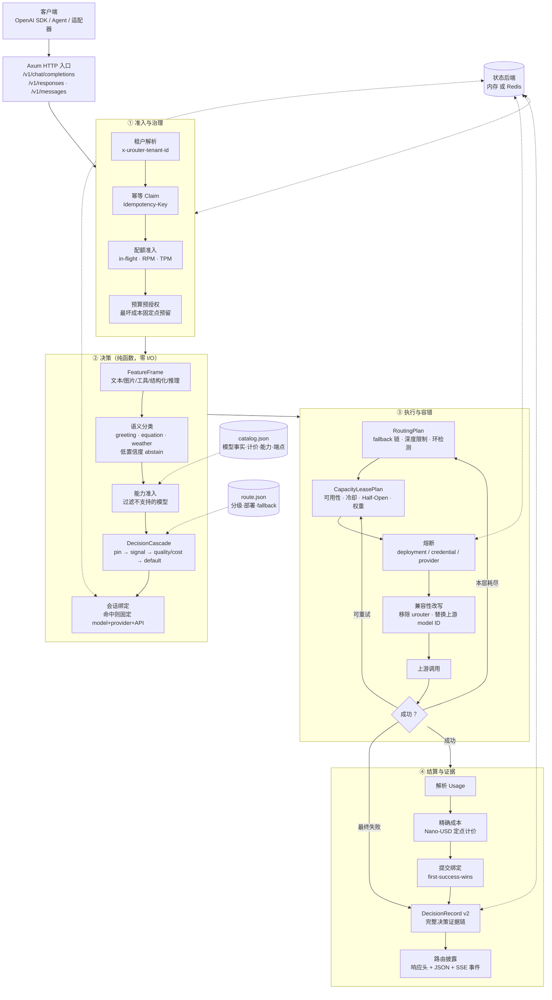
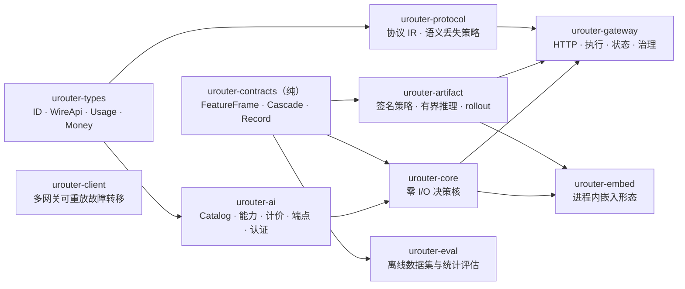

# uRouter

面向 Agent 的多模型智能路由网关，Rust 实现。

一个 OpenAI 兼容的 HTTP 网关：客户端把 `model` 填成 `urouter/auto`，uRouter 依据请求的**能力需求**（图片、工具、结构化输出、推理、上下文长度）、**任务语义**、**成本与质量偏好**选择模型并转发到上游，同时保证同一个 Agent 会话始终落在同一个模型上。

它解决的是 Agent 产品接多模型时的四个具体问题：

| 问题 | uRouter 的处理 |
|---|---|
| 简单请求用贵模型，复杂请求用弱模型 | 能力准入 + 分级路由，`efficient` / `capable` 分层 |
| 多轮对话中途换模型，导致行为跳变 | 会话绑定：`conversation + branch` 固定到精确的 model + provider + API |
| 上游故障时整条链路挂掉 | 类型化重试、熔断、按错误类型的 fallback 链 |
| 事后无法归因"这次为什么走了这个模型" | 每次请求产出 DecisionRecord v2，含完整决策证据链 |

**当前状态**：仓库内实现 M0–M4 全部 `code_complete`，测试 319 通过 / 0 失败，覆盖率 77.9%。`code_complete` 不等于生产 `accepted` —— Redis HA/ACL/TLS、真实数据集、shadow/canary 观察窗口等仍需外部环境验收。权威状态见 [`docs/requirements-traceability.md`](docs/requirements-traceability.md)。

---

## 快速开始

### 1. 启动网关

```bash
cargo run -p urouter-gateway -- --bind 127.0.0.1:8787 --log-format text
```

默认读取 `catalog/catalog.json`（模型目录）和 `gateway/route.json`（分级路由）。

> **默认配置指向本地 vLLM**：`efficient` → `http://127.0.0.1:8087/v1`，`capable` → `http://127.0.0.1:19121/starvlm/v1`。这两个端点不在线时，网关能正常启动、`/v1/explain` 和 `/v1/models` 正常工作，但实际转发会返回 502。接自己的上游见[配置](#配置)。

启动前可以先做一次纯配置校验，不碰网络、不碰 Redis、不监听端口：

```bash
cargo run -p urouter-gateway -- --dry-run
```

输出 16 项检查的 `pass/fail/warning/not_applicable/blocked`，有失败则退出码 2。

### 2. 发一个请求

```bash
curl -s http://127.0.0.1:8787/v1/chat/completions \
  -H 'content-type: application/json' \
  -d '{"model":"urouter/auto","messages":[{"role":"user","content":"你好"}]}' \
  -D - -o /dev/null
```

响应头会披露路由结果：

```
x-urouter-request-id: req_18d0e9566160cb3a
x-urouter-decision-id: dec_18d0e95761f43da3
x-urouter-tier: efficient
x-urouter-model: local-vllm/qwen3.5-4b
x-urouter-reason: default_efficient
x-urouter-source: model
x-urouter-degraded: false
x-urouter-compatibility-mode: true
x-urouter-alternatives: local-vllm-qwen38/qwen3.8-27b
```

### 3. 不发请求也能看路由决策

`/v1/explain` 只做决策，不调上游，适合调试和接入前验证：

```bash
curl -s http://127.0.0.1:8787/v1/explain \
  -H 'content-type: application/json' \
  -d '{"model":"urouter/auto","messages":[{"role":"user","content":"解二元一次方程组 x+y=10, x-y=2"}]}' \
  | python3 -m json.tool
```

返回里能看到判定链：`semantic.task = equation_solving` → `tier = capable` → `reason = capability_required`，
以及 `feature_frame`（结构化特征）、`admission`（哪些模型被准入、哪些被排除及原因）、`routing_trace`（级联决策事件）。

换成 `"你好"` 会得到 `greeting` → `efficient`。

---

## 接入方式

### 方式一：把现有 OpenAI SDK 指过来（最小改动）

`base_url` 改成网关地址，`model` 改成 `urouter/auto`，其余不动。

```python
from openai import OpenAI

client = OpenAI(base_url="http://127.0.0.1:8787/v1", api_key="unused")
resp = client.chat.completions.create(
    model="urouter/auto",
    messages=[{"role": "user", "content": "你好"}],
)
```

这种方式能用，但**拿不到会话连续性**：响应头里 `x-urouter-compatibility-mode: true` 就是在告诉你这一点。

### 方式二：完整契约（推荐，Agent 产品用）

路由控制放在请求体顶层的 `urouter` 对象里，转发给上游前会被移除。同时必须带可信租户头。

```bash
curl -s http://127.0.0.1:8787/v1/chat/completions \
  -H 'content-type: application/json' \
  -H 'x-urouter-tenant-id: tenant-a' \
  -d '{
    "model": "urouter/auto",
    "messages": [{"role": "user", "content": "继续上一步"}],
    "urouter": {
      "contract_version": 2,
      "task":  {"id": "task-42"},
      "agent": {
        "harness": "aionui",
        "prompt_profile_hash": "sha256:aaaa...",
        "toolset_hash": "sha256:bbbb..."
      },
      "call":  {"role": "primary"},
      "trace": {"turn": "t2", "conversation": "conv-1", "branch": "main"},
      "hint":  {"difficulty": "hard"},
      "data_policy": {
        "recording": "metadata_only",
        "allow_training": false,
        "allow_remote_judge": false,
        "retention_days": 7
      }
    }
  }'
```

**契约字段**

| 字段 | 作用 |
|---|---|
| `task.id` | 任务身份，任务级绑定的键 |
| `agent.harness` | 调用方标识 |
| `agent.prompt_profile_hash` / `toolset_hash` | v2 primary 调用必填。系统提示词或工具集变了，绑定会安全迁移而不是错误复用 |
| `call.role` | `primary` 参与绑定；`auxiliary`（标题、摘要等）旁路绑定并偏向低成本 tier |
| `trace.conversation` + `trace.branch` | v2 会话身份，绑定的真正键 |
| `hint.difficulty` | 难度提示，影响分级 |
| `data_policy` | `recording`（`metadata_only` / `none`）、训练与远程 judge 授权、1–365 天保留期 |

**v1 契约**（只有 `task.id`，没有 conversation/branch）仍然支持，做任务级绑定。

> #### 最容易踩的坑
>
> 缺少下面**任意一项**，请求会进入 compatibility mode：`task.id`、`agent.harness`、`call.role`、`trace.turn`、`data_policy`，或者没带 `x-urouter-tenant-id`。
>
> 此时网关**照常返回 200，但不会写入任何会话绑定** —— 下一轮请求会重新决策，可能换模型。响应头 `x-urouter-compatibility-mode: true`，网关日志也会打一条 WARN 说明原因。接入完成后请确认这个头是 `false`。

### 方式三：Agent 产品适配器（走 HTTP 头，不改请求体）

如果你的框架不方便往请求体里塞字段，用适配器入口，契约走 HTTP 头：

```
POST /v1/adapters/{harness}/chat/completions
```

`{harness}` 目前支持 `aionui`、`workbuddy`。请求头：

| 头 | 说明 |
|---|---|
| `x-urouter-conversation-id` | 会话 ID |
| `x-urouter-branch-id` | 分支，缺省 `main` |
| `x-urouter-turn-id` | 轮次 ID |
| `x-urouter-call-kind` | `primary` / `title` / `summary` 等 |
| `x-urouter-task-id` | 可选任务 ID |
| `x-urouter-migration-boundary` | 可选迁移边界 |

适配器自动推导 prompt/toolset 哈希，并把 title/summary 这类辅助调用旁路掉，不影响主会话绑定。

---

## 技术架构流程

### 请求生命周期



### Crate 结构



`urouter-core` 是零 I/O 的纯决策核。`urouter-gateway`（网关）和 `urouter-embed`（进程内嵌入）共用同一个核，对相同的 Catalog / Route / artifact / 上下文输入产出相同决策 —— 这个 parity 有测试保证。

### 关键行为

- **能力先于分级**：先过滤掉不支持请求能力的模型，再按难度和偏好选 tier。显式指定模型会绕过分级，但仍走能力准入。
- **语义路由刻意保守**：只有高置信度的窄模式才会改变路由，其余一律 abstain 回退到既有策略 —— 宁可不判，也不猜错。
  - 问候（`greeting`）→ `efficient`
  - 方程（`equation_solving`）→ `capable`，`reason = capability_required`。触发条件是明确的关键词（`二元一次方程`、`方程组`、`solve the equation`）或同时出现 `=` `x` `y`；像 `解方程 x^2-5x+6=0` 这种一元式**不会**触发，落回 `general`
  - 实时天气（`realtime_weather`）必须由 Host 声明并执行 `get_weather` 工具，**网关绝不伪造工具结果**；缺工具在调上游之前返回 400 `missing_required_tool`，后续带 tool-result 的消息继续走 capable 模型
- **重试与 fallback**：429、5xx、超时、传输错误可重试；确定性 4xx 不重试。fallback 可按 timeout / rate-limit / server / transport 分别配置链路，执行前按最坏链路成本做预算预留。
- **流式**：Chat 流在 `[DONE]` 之前追加一个 `urouter.decision` SSE 事件披露路由结果；Responses 流对应 `response.urouter` 事件。
- **多实例**：加上 `--redis-url` 后，Redis 成为绑定、熔断、幂等、配额、DecisionRecord、feedback 的**唯一权威状态**。Redis 不可用时路由状态操作返回稳定的 503（fail closed），不会用陈旧本地状态继续路由。

---

## HTTP 接口

### 推理

| 方法 | 路径 | 说明 |
|---|---|---|
| POST | `/v1/chat/completions` | OpenAI Chat 兼容，主入口 |
| POST | `/v1/responses` | OpenAI Responses，含流式 |
| POST | `/v1/messages` | Anthropic Messages，含流式 |
| POST | `/v1/adapters/{harness}/chat/completions` | Agent 适配器入口 |
| POST | `/v1/explain` | 只决策不调上游 |
| GET | `/v1/models` | 模型发现 |

> **流式**：三个入口都支持 `stream: true`。`/v1/responses` 和 `/v1/messages` 会把上游的 Chat 流**增量**转换成各自协议的 SSE 事件（`response.output_text.delta` / `content_block_delta`），不缓冲，因此保留上游的首字延迟。
>
> 被拒绝的是另一件事：当**上游 deployment** 本身用 `open_ai_responses` 或 `anthropic_messages` 协议、且请求是流式时，转发在发出之前返回 400 `unsupported_provider_streaming` —— 这些上游还没有字节安全的流适配器，宁可显式拒绝也不把不兼容的字节流当成 Chat 流返回给客户端。

### 运维与治理

| 方法 | 路径 | 说明 |
|---|---|---|
| GET | `/health/live` | 进程存活，**不依赖 Redis** |
| GET | `/health/ready` | 就绪：drain 状态 + 共享状态 + 控制面 revision |
| GET | `/metrics` | OpenMetrics：时长 / TTFT / 成本 / fallback 直方图 |
| GET | `/openapi.json` | 机器可读 API 契约 |
| GET | `/v1/tiers` | 分级与部署健康 |
| GET | `/v1/catalog` | 活动 Catalog revision + ETag |
| GET · DELETE | `/v1/tasks/{id}/binding` | 任务绑定 |
| GET · DELETE | `/v1/sessions/{conversation}/{branch}/binding` | 会话绑定 |
| GET | `/v1/decisions` · `/v1/decisions/{id}` | DecisionRecord 分页查询 |
| DELETE | `/v1/decisions/{id}` · `/v1/tasks/{id}/records` · `/v1/tenant/records` | 持久删除 |
| POST | `/v1/feedback` · GET `/v1/feedback/{turn}` | 反馈摄入 |
| GET · POST | `/v1/artifacts*` | learned policy 的 status / promote / rollback / kill / rollout / observe |

管理面端点在配置了 `--management-keyring` 后走 Bearer RBAC（reader / operator / admin），并要求同步持久化的审计文件。

### 错误信封

所有错误统一形状，`code` 是稳定的机器可读标识：

```json
{"error": {"code": "missing_required_tool", "message": "...", "type": "urouter_error"}}
```

接入时值得单独处理的：

| HTTP | code | 含义 |
|---|---|---|
| 400 | `route_rejected` | 契约或模型不合法 |
| 400 | `missing_required_tool` | 语义要求 Host 提供工具，但请求没声明 |
| 400 | `unsupported_provider_streaming` | 上游 deployment 是非 Chat 协议且请求为流式 |
| 400 | `protocol_semantic_loss` | 目标协议无法承载请求语义，拒绝而非静默丢弃 |
| 402 | `tenant_budget_exhausted` | 租户预算耗尽 |
| 409 | `idempotency_conflict` | 同一 Idempotency-Key 复用于不同请求 |
| 429 | `tenant_concurrency_exhausted` · `tenant_rate_limit_exhausted` · `tenant_token_limit_exhausted` | 并发 / RPM / TPM 超限 |
| 503 | `state_backend_unavailable` | 共享状态后端不可用，fail closed |

---

## 配置

### 接自己的上游

1. 在 `catalog/catalog.json` 加 provider 和 model（能力、计价、端点、认证都是显式事实）
2. 在 `gateway/route.json` 把 tier 指向新模型
3. 重新生成目录清单并校验：

```bash
cargo run -p urouter-catalog -- check catalog/catalog.json
cargo run -p urouter-catalog -- manifest catalog/catalog.json > catalog/manifest.json
```

仓库内已有 SiliconFlow 的现成配置可直接参考：`gateway/route.siliconflow.json`。

### 常用启动参数

网关共 61 个参数，接入阶段通常只需要这些：

```bash
cargo run -p urouter-gateway -- \
  --bind 0.0.0.0:8787 \
  --log-format json \
  --require-tenant-header \
  --records /var/log/urouter/decisions.jsonl
```

多实例（Redis 权威状态 + 租户配额 + 预算 + 管理面 RBAC）：

```bash
cargo run -p urouter-gateway -- \
  --bind 0.0.0.0:8787 \
  --redis-url redis://127.0.0.1:6379/ --redis-prefix urouter-prod \
  --on-state-unavailable fail_closed \
  --tenant-max-in-flight 32 --tenant-requests-per-minute 600 \
  --tenant-tokens-per-minute 1000000 --quota-default-max-output-tokens 4096 \
  --tenant-budget-nano-usd 50000000000 --budget-period-seconds 2592000 \
  --require-tenant-header \
  --management-keyring gateway/management-keyring.json \
  --management-audit /var/log/urouter/management-audit.jsonl
```

> 启用 `--redis-url` 时必须显式指定 `--on-state-unavailable fail_closed`，且本地 `--records` / `--feedback-records` 会被拒绝 —— 避免被删除的数据残留在另一个网关的磁盘上。

### 上游代理

环境变量 `http_proxy` / `https_proxy` **始终被忽略**：网关经常要访问回环和集群内部署，继承的代理会静默改道或卡死。企业出网代理必须显式配置：

```bash
--upstream-proxy http://egress.internal:3128 \
--upstream-no-proxy 127.0.0.1,localhost,.svc.cluster.local
```

### 日志

`--log-format json|text`（默认 `json`）、`--log-level`（`RUST_LOG` 可覆盖）。每个请求开一个 `chat` span，携带 `request_id` / `decision_id` / `tenant_key` / `tier` / `model`；每个被拒绝的请求输出一行带稳定错误码的日志。请求体和上游错误正文**不进日志** —— 它们留在受租户数据策略约束的 DecisionRecord 里。

---

## 部署

```bash
docker compose up --build          # 2 个网关 + 1 个 AOF Redis
curl -s localhost:8787/health/ready
curl -s localhost:8788/health/ready
```

`Dockerfile` 产出 distroless 镜像（无 shell，TLS 走 rustls 不依赖系统 OpenSSL）。`deploy/kubernetes/gateway.yaml` 是参考清单，重点是停机路径：

```
preStop sleep        >= readiness failureThreshold × periodSeconds
terminationGrace     >  preStop sleep + --shutdown-grace-seconds
```

liveness 刻意用 `/health/live` 而非 `/health/ready` —— 否则 Redis 故障时会把整个集群打成 crash loop，而不是仅从 Service 摘除。

清单参数由 `cargo run -p urouter-xtask -- check-deploy` 用网关自身的 `--dry-run` 校验，防止清单漂移。

> 镜像构建本身尚未在 CI 中执行过，见 [`docs/requirements-traceability.md`](docs/requirements-traceability.md) 的 acceptance 列。

---

## 开发

```bash
cargo test --workspace                          # 319 tests
cargo clippy --workspace --all-targets -- -D warnings
cargo run -p urouter-xtask -- check-secrets     # 密钥扫描
cargo run -p urouter-xtask -- check-pure-crates # 纯 crate 依赖边界
cargo run -p urouter-xtask -- check-deploy      # 部署清单校验
cargo deny check                                # 供应链：advisory / license / ban
```

Redis 相关的 7 个契约测试需要真实 Redis，否则被跳过：

```bash
UROUTER_TEST_REDIS_URL=redis://127.0.0.1:6379/ \
  cargo test --workspace -- --include-ignored
```

覆盖率必须带 Redis 测量，否则 `shared_state.rs` 会显示 0.00%（测量假象，不是真空白）：

```bash
UROUTER_TEST_REDIS_URL=redis://127.0.0.1:6379/ cargo llvm-cov --workspace \
  --ignore-filename-regex '(urouter-smoke|urouter-soak)/src' -- --include-ignored
```

---

## 文档

| 文档 | 内容 |
|---|---|
| [`docs/requirements-traceability.md`](docs/requirements-traceability.md) | **权威执行状态**。设计文档写了什么、代码存在什么，都不算完成证据 |
| [`docs/gateway-m0.md`](docs/gateway-m0.md) | 网关契约、选择规则、本地端到端证据 |
| [`docs/adr/`](docs/adr) | 架构与迁移决策记录 |
| [`docs/security/threat-model.md`](docs/security/threat-model.md) | 部署信任边界 |
| [`docs/redis-consistency-matrix.md`](docs/redis-consistency-matrix.md) | 各状态域的失败矩阵：哪些 fail closed、哪些 fail open |
| [`docs/public-api-and-semver.md`](docs/public-api-and-semver.md) | 可发布 crate 的兼容性规则 |
| [`docs/test-coverage-plan.md`](docs/test-coverage-plan.md) | 测试覆盖现状与执行计划 |
| [`uRouter_决策算法说明.md`](uRouter_决策算法说明.md) | **七层决策器逐层说明**：能力准入、语义分类、Tier 级联、部署选择、失败处理、learned policy、探索 |
| [`uRouter_技术架构流程图.md`](uRouter_技术架构流程图.md) | 更详细的架构流程图 |
| [`docs/reports/`](docs/reports) | 历史迭代验证报告（一次性快照，**不代表当前状态**） |

## 许可

Apache-2.0，见 [`LICENSE`](LICENSE)。
