# Switchyard 深度技术解读报告

> 分析对象：`opensource/Switchyard`（NVIDIA-NeMo/Switchyard）
> 分析时间：2026-08-25
> 版本基线：workspace version `0.2.0`（CHANGELOG 含 Unreleased 段）
> 语言/许可：Rust 1.96.1 (edition 2024) + Python 3.10+ (PyO3) / Apache-2.0
> 成熟度自述：**pre-alpha，官方标注"实验性软件，不用于生产"**

---

## 目录

1. [项目定位与总体判断](#1-项目定位与总体判断)
2. [技术架构设计](#2-技术架构设计)
3. [10 个 Crate 的职责边界](#3-10-个-crate-的职责边界)
4. [端到端流程图](#4-端到端流程图)
5. [核心抽象：Algorithm / Driver / Step 三件套](#5-核心抽象algorithm--driver--step-三件套)
6. [六种路由算法的技术拆解](#6-六种路由算法的技术拆解)
7. [协议翻译子系统](#7-协议翻译子系统)
8. [配置模型：三层 TOML 契约](#8-配置模型三层-toml-契约)
9. [HTTP 服务层与可观测性](#9-http-服务层与可观测性)
10. [Python 集成层](#10-python-集成层)
11. [基准测试与质量保障体系](#11-基准测试与质量保障体系)
12. [工程质量评估与风险清单](#12-工程质量评估与风险清单)
13. [适用场景建议](#13-适用场景建议)

---

## 1. 项目定位与总体判断

### 1.1 一句话概括

**Switchyard 是 NVIDIA 出品的"LLM 流量代理 + 可嵌入路由库"**：它坐在客户端（Claude Code、Codex、OpenAI/Anthropic SDK）与模型后端（vLLM、NIM、Ollama、OpenRouter）之间，做三件事——**跨协议翻译**、**类型化可组合的路由决策**、**生产级可观测性**。

### 1.2 与 LLMRouter 的根本定位差异

| 维度 | LLMRouter | Switchyard |
|---|---|---|
| 本质 | 路由**算法**研究平台 | 路由**运行时**（代理/库） |
| 路由信号 | query embedding、历史性能矩阵 | **会话轨迹信号**（工具结果、错误、进度） |
| 决策时机 | 请求前离线模型预测 | 请求前分类 / 请求中判官 / 请求后复审 |
| 训练 | 核心能力（17 个可训练路由器） | **完全没有训练**，全部是规则 + LLM-as-judge |
| 协议 | 仅 OpenAI 兼容 | OpenAI Chat / OpenAI Responses / Anthropic Messages **三向互译** |
| 目标客户 | 研究者 | 编码 Agent（Claude Code / Codex）用户与平台方 |
| 性能取向 | 单进程 Python，可用即可 | Rust + Tokio + Axum，48 小时 soak 测试做发布门禁 |

### 1.3 核心命题

README 里的一句话精确概括了产品命题：

> **"Point a coding agent such as Claude Code or Codex at an open-source model."**

即：让编码 Agent 保持说自己的母语 API，而实际由开源模型/自建模型服务；同时把简单的回合路由到便宜模型、困难的回合路由到强模型，实现**成本-质量的动态平衡**。

### 1.4 总体判断

- **架构设计是这个项目最强的部分**。10 个 crate 的边界切得非常干净：协议类型、路由算法、翻译编解码、HTTP 客户端、HTTP 服务器各自独立，`libsy` **完全不做任何 I/O**——这是一个教科书级的"策略与执行分离"。
- **路由算法思路新颖**。`stage_router` 用"工具调用轨迹信号"做零额外模型调用的路由，`advisor_gate` 用"强模型只做 APPROVE/REDO 裁决"，都不是简单的"分类器选模型"，而是针对 Agent 工作流特性设计的。
- **文档与工程规范极其严格**。AGENTS.md 明文禁止生产代码使用 `unwrap()`/`expect()`/`panic!()`；mypy strict；SPDX 头自动注入；commitlint + DCO 签名；四个专用 agent skill runbook。
- **但确实是 pre-alpha**。`known_issues.md` 列了 5 条 0.2.0 已知问题（含"客户端断连后上游继续计费"这种真金白银的问题），Unreleased 段里刚删掉了整套 Python server 栈。API 会大改。

---

## 2. 技术架构设计

### 2.1 系统上下文

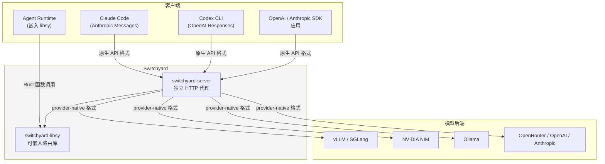

### 2.2 分层架构（Crate 依赖图）

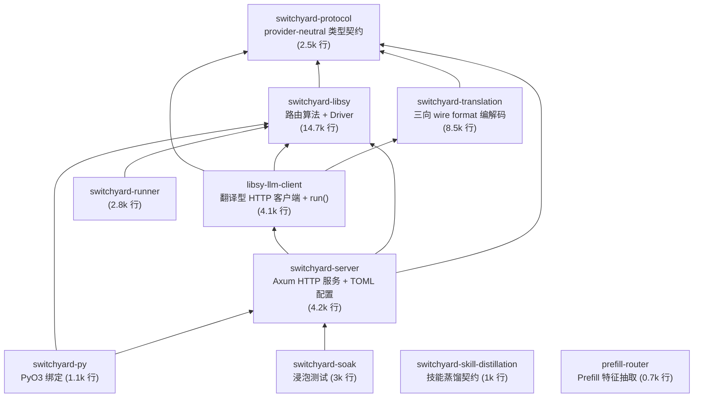

**关键约束**：箭头方向即依赖方向。`switchyard-protocol` 是所有 crate 的公共底座，且**它自己不路由、不翻译、不做网络调用**——纯类型契约。这个不变量让上层任意组合。

### 2.3 三条架构不变量

| 不变量 | 说明 | 代码证据 |
|---|---|---|
| **① libsy 零 I/O** | 算法永不发起网络调用，它只"请求"宿主代它调用 | `Algorithm::run_stream` 返回 `Step::CallModel`，宿主负责 `respond()` |
| **② 协议中立 IR** | 所有算法只看 `switchyard_protocol::Request`，不接触任何 provider SDK 对象 | 入站先 decode 成中立类型，出站再 encode 到目标格式 |
| **③ 格式必须显式声明** | 不做上游探测、不自动选格式 | `format` 在 `[llm_clients.*]` 中是**必填**字段 |

第三点在 `docs/architecture.md` 里写得很明确：

> `format` is required. Switchyard does not probe upstreams or select a format automatically.

这是一个刻意的"显式优于隐式"决策——牺牲便利性换取确定性与可审计性。

---

## 3. 10 个 Crate 的职责边界

| Crate | 行数 | 职责 | 关键导出 |
|---|---:|---|---|
| **`protocol`** | 2,507 | 中立类型契约。会话（`LlmRequest`/`Message`/`ContentBlock`）、工具（`ToolDefinition`/`ToolCall`/`ToolResult`）、响应（`AggLlmResponse`/`Usage`/`StopReason`）、流式（`LlmResponseStream`/`LlmResponseStreamEvent`/`ProviderStreamEvent`）、信封（`Request`/`Response`/`Metadata`）、路由 I/O（`RoutedLlmClient`）、格式标识（`WireFormat`/`FormatId`） | `ModelId`（newtype over String，Deref 到 str） |
| **`libsy`** | 14,725 | 路由算法核心。`Algorithm` trait、`Driver`、`Step`、`drive()`、8 个算法实现、stage 打分器、工具信号提取、classifier 契约、可观测性 | `Algorithm` / `Driver` / `Step` / `RoutingOutcome` |
| **`switchyard-translation`** | 8,467 | 三向 wire format 编解码：请求翻译、缓冲响应翻译、**流式事件翻译**、SSE 处理、诊断、扩展点、Codex 命名空间 | `engine.rs` / `codecs/` / `stream.rs` |
| **`libsy-llm-client`** | 4,126 | 翻译型 HTTP 客户端。`TranslatingLlmClient`、`Backend`（三种）、`ClientRouter`、`run()`（驱动算法 + 重试 + 候选回退） | `run` / `ClientRouter` / `ModelConfig` |
| **`switchyard-server`** | 4,187 | Axum HTTP 服务。TOML 配置加载校验、5 个 LLM 端点 + 5 个管理端点、Prometheus metrics、SSE、会话路由日志、优雅停机 | `main.rs` / `config.rs` / `stats/` |
| **`switchyard-runner`** | 2,835 | 算法运行封装（`algorithm.rs` / `runner.rs` / `route.rs` / `config.rs`） | — |
| **`switchyard-py`** | 1,148 | PyO3 绑定：`libsy_bindings` + `server_bindings`（`Server` 类，支持 context manager） | `_switchyard_rust` 模块 |
| **`switchyard-soak`** | 2,956 | 发布门禁浸泡测试。固定并发打压、场景目录、RSS 增长监控 | `switchyard-soak` 二进制 |
| **`switchyard-skill-distillation`** | 1,031 | **仅契约**：把 Agent 轨迹蒸馏成可复用技能的记录类型与端口 trait（`TrajectorySource`/`SkillDistiller`/`SkillValidator`/`SkillStore`），刻意不选定 provider/存储/运行时 | `Trajectory` / `SkillCandidate` / `ValidationReport` |
| **`prefill-router`** | 673 | Prefill 特征抽取的后端中立契约。`TransformersForward` 内嵌 Python 复现 HF Transformers forward 路径，抽 pooled hidden states（对应 NVIDIA LLM Router blueprint） | `PrefillForward` trait |

### 3.1 两个"仅契约"crate 的设计意图

`switchyard-skill-distillation` 和 `prefill-router` 都是**只定义 trait 不定实现**的 crate，注释写得很直白：

```rust
//! 这些契约本身不运行任何工作流。Switchyard 拥有的协调器负责加载轨迹和当前技能、
//! 构造蒸馏请求、检查候选、保存并决定是否激活。本 crate 不定义那个协调器、
//! 它的调度，或它的激活策略。
```

```rust
/// 契约中不含任何 Python 特定类型，因此另一个实现（如 Candle）可以替换
/// TransformersForward 而无需改动使用方。
```

这体现了 NVIDIA 团队一贯的做法：**先把边界钉死，再填实现**。对读者来说，这两个 crate 是"未来路线图的类型化声明"。

---

## 4. 端到端流程图

### 4.1 请求生命周期（五步）


### 4.2 完整时序（含路由期模型调用）

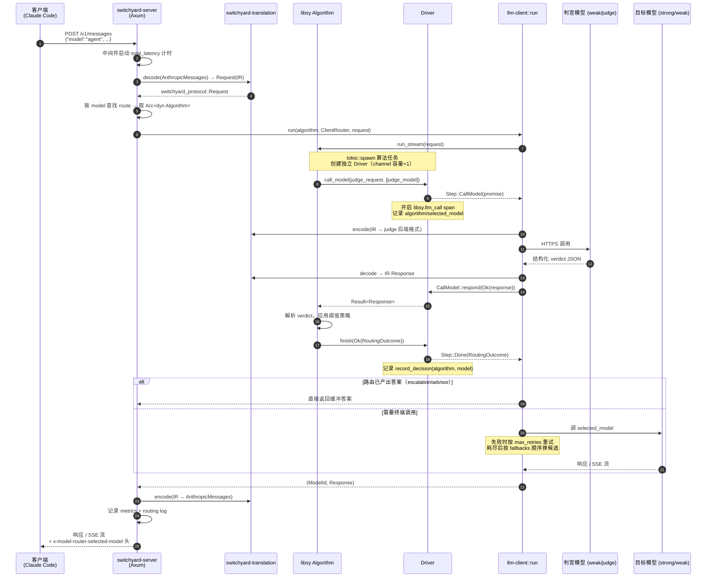

### 4.3 三层配置解析流

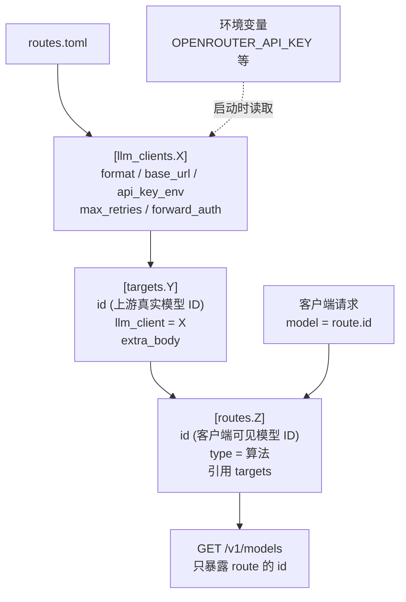

**关键点**：
- 表名（`X`/`Y`/`Z`）只是**文件内局部引用**，对外不可见。
- `target.id` = **发给上游 provider 的模型 ID**。
- `route.id` = **客户端发给 Switchyard 的模型 ID**。
- 密钥永不入 TOML，只写环境变量名。

---

## 5. 核心抽象：Algorithm / Driver / Step 三件套

这是整个项目**最值得学习的设计**。

### 5.1 问题：算法需要调模型，但库不能做 I/O

一个 LLM-as-judge 路由算法必须调用判官模型才能决策。但如果 `libsy` 自己持有 HTTP 客户端，它就绑定了 transport、绑定了 provider、无法嵌入别人的 gateway。

### 5.2 解法：把模型调用"卸载"回宿主

```rust
pub enum Step {
    /// 算法需要这次模型调用。宿主执行它，并用 CallModel::respond 兑现。
    CallModel(Box<CallModel>),
    /// 算法完成，携带路由结果 —— 一次运行的最后一步。
    Done(Box<RoutingOutcome>),
}
```

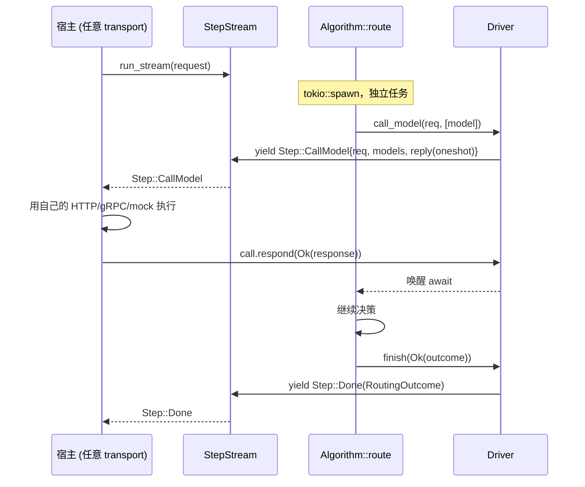

### 5.3 关键实现细节

#### (1) `Driver` 的 channel 容量刻意设为 1

```rust
// Capacity one keeps the algorithm paced by the stream consumer. It limits queued steps,
// not model calls already pulled from the stream, which can still run at the same time.
let (step_tx, step_rx) = mpsc::channel(1);
```

**背压设计**：算法被消费者节流，但**已从流中取出的模型调用仍可并发执行**——所以 hedging / fan-out 算法依然能拿到真并行。

#### (2) `drive()` 用 `FuturesUnordered` 实现并发服务

```rust
let mut in_flight = futures::stream::FuturesUnordered::new();
loop {
    tokio::select! {
        Some(result) = in_flight.next() => match result {
            Ok(()) => {},
            Err(err) => return Err(err),
        },
        step = stream.next() => match step {
            None => break,
            Some(item) => match item? {
                Step::CallModel(call) => in_flight.push(serve(*call)),
                Step::Done(outcome) => { final_outcome = Some(*outcome); break; }
            }
        },
    }
}
```

注释里明确了错误语义的分层：
> 模型调用失败属于 `respond` —— 算法可以绕开它。从 `serve` 返回 `Err` 会中止整个运行，所以只留给基础设施故障。

#### (3) panic 隔离 + 流断开即中止

```rust
let route = AssertUnwindSafe(self.route(driver.clone(), request)).catch_unwind();
// ... panic 被捕获，转成 LibsyError::AlgorithmError，流仍然发出终端步
```

```rust
struct AbortOnDrop(tokio::task::AbortHandle);
impl Drop for AbortOnDrop { fn drop(&mut self) { self.0.abort(); } }
```

**每次运行必定发出且仅发出一个终端项**（`Step::Done` 或 `Err`），即使算法 panic。消费者丢弃流则算法任务立即被 abort。这两条保证让宿主的错误处理极为简单。

#### (4) 内建可观测性

```rust
#[tracing::instrument(
    target = "libsy", name = "libsy.llm_call", skip_all,
    fields(algorithm, selected_model, openinference.span.kind = "CHAIN",
           outcome, error, input_tokens, output_tokens, total_tokens, reasoning_tokens)
)]
pub async fn call_model(&self, ...) -> Result<Response>
```

注意 `openinference.span.kind = "CHAIN"` —— 直接对齐 **OpenInference 语义约定**，可以无缝接入 Arize Phoenix、LangSmith 等 LLM 可观测平台。

### 5.4 `RoutingOutcome`：路由结果的三种形态

```rust
pub struct RoutingOutcome {
    selected_model_id: ModelId,     // 算法选中的模型
    fallbacks: Vec<ModelId>,        // 有序回退候选
    request: Request,               // 可能被算法重写过的请求
    response: Option<Response>,     // 路由过程中已产出的答案（可选）
}
```

三个构造方式：
- `route_to(...)` —— 只给决策，宿主去调
- `answered(...)` —— 路由过程已经拿到答案（escalation 的"未升级"路径、advisor 的 APPROVE 路径）
- 带 `fallbacks` —— 上下文窗口超限或失败时依序尝试

第三种形态 `answered` 是关键：**它让"边路由边执行"的算法（escalation / advisor）不必浪费一次重复调用**。

### 5.5 会话身份：`RoutingIdentity`

```rust
pub(crate) enum RoutingIdentity {
    Session(String),                                   // 主 Agent，按 session_id
    Subagent { session: String, agent: String },       // 子 Agent，按 session+agent
}
```

子请求缺任一 ID 时返回 `None`——**宁可没有路由历史，也不共享父级的历史**。这是一个很谨慎的默认。

---

## 6. 六种路由算法的技术拆解

### 6.1 算法总览

| 算法 | route `type` | 决策时机 | 是否额外调模型 | 核心思路 |
|---|---|---|:---:|---|
| Passthrough | `passthrough` | 无 | ❌ | 固定单目标 |
| Random | `random` | 请求前 | ❌ | 加权随机（可 seed） |
| LLM Classifier | `llm_classifier` (`capability`) | **请求前** | ✅ 1 次 | 判官预测 weak 模型能否完成 |
| Stage Router | `stage_router` | **请求前** | ❌（可选兜底） | 从工具轨迹信号推断 Agent 所处阶段 |
| Escalation | `llm_classifier` (`escalation`) | **请求后** | ✅ 1-2 次 | 先跑 weak，判官读结果决定是否升级 |
| Advisor Gate | `advisor` | **响应前** | ✅ 按需 | 强模型只做 APPROVE/REDO 裁决，从不服务回合 |
| Sub-Agent Aware | 嵌套 `subagents` | 请求前 | 视嵌套算法 | 父/子 Agent 用不同策略 |

### 6.2 Stage Router —— 最有原创性的算法

#### 核心洞察

编码 Agent 的一次运行会经历不同阶段：早期探索代码库、从错误中恢复（需要强模型）；后期落入机械实现（弱模型足够）。**这些阶段可以从工具调用结果历史中免费推断出来，不需要额外的模型调用。**

#### 打分机制

代码位于 `crates/libsy/src/algorithms/util/stage.rs`。四个维度：

| 维度 | 方向 | 含义 |
|---|---|---|
| `severity` | → capable | 窗口内最大错误严重度 |
| `spinning` | → capable | 深度打转、既不读也不写 |
| `exploring` | → capable | 只读只规划、不产出 |
| `production_intensity` | → efficient | 近期窗口内落地的写入与编辑 |

```rust
// score = tanh 压扁的有符号分数
score = SIGNAL_UNIT_SCALE * (severity/HARD_SEVERITY + spinning + exploring - production_intensity)
confidence = tanh(score) 的绝对值 → [0, 1]
```

**"corroborative（互证）"设计**是这个打分器的精髓：

> 单个满值信号只能打出约 **0.46** 的置信度，**必须有第二个信号互相印证**才能决定性地越过 0.5 阈值。

这直接避免了单一噪声信号（比如一次偶然的工具报错）触发昂贵的模型切换。同时保留了硬性覆盖：

```rust
const SEVERITY_CRITICAL: ...;   // critical 严重度单独就强制升级到 capable
```

#### 决策级联

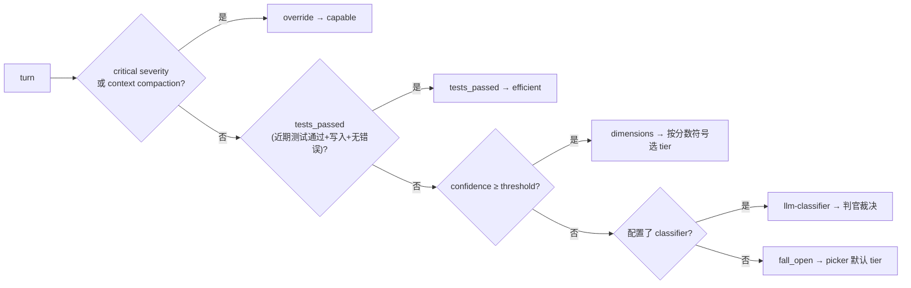

五种 `decision_source` 会被完整记录到 `/v1/stats`：`override` / `tests_passed` / `dimensions` / `llm-classifier` / `fall_open`。

#### 两种 picker

| Picker | 默认 tier | 取向 | 状态 |
|---|---|---|---|
| `efficient_first` | efficient | 成本优先 | ✅ 已标定，所有已发布阈值来自它 |
| `capable_first` | capable | 质量优先 | ⚠️ **实验性**，无标定阈值，启动时会打 warning |

#### 阈值标定方法论

文档给出了一套完整的标定流程，这在开源路由项目里罕见：

```
纯 capable 跑 ~40-75 个任务 → 得到基线结果与信号特征
按四象限分层采样 ~20 个任务跑纯 efficient：
  Easy+clean (5)   capable 过、diff 小、需求清晰   → 确立 SAFE 底线
  Easy+tricky (5)  capable 过、逻辑微妙           → 抓 LOSS 假阳性
  Hard+structural (5) capable 挂、多文件大 diff    → HARD 噪声基线
  Hard+localized (5)  capable 挂、小范围定点修复   → 最佳 RESCUE 信号

从重叠任务构造四象限：
  RESCUE = capable挂 ∩ efficient过   → 这里升级有益
  LOSS   = capable过 ∩ efficient挂   → 这里绝不能升级
  SAFE   = 双过    HARD = 双挂

扫阈值：选能救回 RESCUE 象限、又不过度升级 LOSS 象限的最低阈值
```

推荐起点 `0.5`，来自 SWE-Bench Pro Python-75 标定。

#### 阈值语义表

| `confidence_threshold` | 配 classifier | 典型用途 |
|---|---|---|
| `0.0` | 否 | 成本/延迟敏感。所有信号判决都接受，零额外 LLM 调用。critical 仍强制升级 |
| `0.5` | 否 | **推荐起点**。互证打分器下需要"一个强信号 + 佐证" |
| `0.7`–`0.9` | 是 | 分类器辅助，低置信回合交给判官 |
| `1.0` | **必须** | 分类器驱动，工具信号只做硬覆盖 |

### 6.3 LLM Classifier（capability 模式）

判官返回结构化 verdict：

```json
{
  "p_solve": 0.72,
  "capability_boundary": "supported | uncertain | unsupported | unmatched",
  "primary_rule": "...",
  "crux": "..."
}
```

阈值策略是**确定性的**（生成与决策分离）：

| boundary | 适用阈值 |
|---|---|
| `supported` | `base_threshold` |
| `uncertain` / `unmatched` | `base_threshold + threshold_step` |
| `unsupported` | `base_threshold + 2 × threshold_step` |

`p_solve ≥ 阈值` → weak，否则 → strong。**任何无效/不一致/无法解析的 verdict 或判官失败 → strong**（fail-safe 而非 fail-cheap）。

#### `classify_trigger`：判官调用频次的三档

| 值 | 行为 | 成本影响 |
|---|---|---|
| `every_request`（默认） | 每个请求都判，含每次工具续跑 | 20 步工具调用 = 21 次分类，且目标可能中途变化 |
| `user_turn` | 每个新用户消息判一次，工具续跑期间保持 | 大幅降低判官调用 |
| `new_session` | 全会话判一次 | 最省，无预热期 |

会话身份来源：`x-switchyard-session-id` 头；或 `message_hash_fallback = true` 用首条用户消息文本做 key（**注意：不同会话若首条消息相同会共享路由决策**，文档明确标注为 best-effort）。

#### custom 模式：Schema 驱动的多目标路由

```toml
mode = "custom"
targets = ["fast", "balanced", "reasoning", "premium"]
default_target = "premium"
response_schema = '''{...JSON Schema...}'''

[routes.smart.policy]
type = "target_selector"
selector = "/decision/target"     # jsonptr 指针
```

Switchyard 把 schema 塞进 provider 的 strict structured-output，收到响应后**本地再校验一次**，用 `jsonptr` 解析选择器。缺失/非字符串/未知目标 → `default_target`。

> 设计洁癖体现：包含旧版 `{{RESPONSE_SCHEMA}}` 占位符的 prompt 会在**配置校验阶段被拒绝**——schema 由运行时统一注入，prompt 只管指令。

### 6.4 Escalation Router —— 事后判定

与 capability 模式的根本区别：
> capability 模式**预测**一个请求看起来有多难；escalation **判断这次运行实际进行得好不好**。

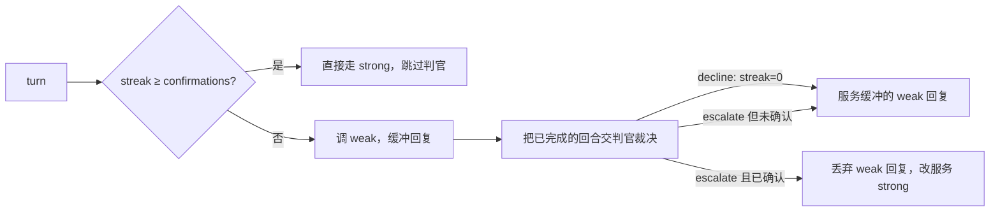

**成本账本**（文档写得非常清楚）：
- 判了但未升级的回合：1 次 weak + 1 次 judge，**无 strong 调用**
- 触发升级的回合：1 次 weak + 1 次 judge + 1 次 strong（weak 的结果被丢弃）
- 已 latch 的会话：仅 1 次 strong，**无 judge 调用**

**参数**（默认值即已标定配置，`escalation = {}` 就是有效的调优路由）：

| Key | 默认 | 含义 |
|---|---|---|
| `confirmations` | `2` | 连续多少次 escalate 才 latch 到 strong。**主成本旋钮** |
| `recent_turn_window` | `28` | 判官看到的尾部消息数 |
| `window_message_chars` | `500` | 窗口内每条消息的截断上限 |

**重要约束**：`confirmations > 1` **必须有会话身份**，否则每回合 streak 从 0 开始，永远不会 latch。

**fail-open 语义**：判官超时/报错/verdict 无法解析 → 服务缓冲的 weak 回复，且**保持现有 streak 而非清零**。判官失败永不制造 strong latch。

### 6.5 Advisor Gate —— 质量门禁而非模型切换

这是 Unreleased 段里新增的算法，思路与其他所有算法**正交**：

> 其他策略决定"**哪个模型服务这个回合**"；advisor gate 让**一个模型始终服务**，只在决定任务成败的时刻花强模型做裁决。

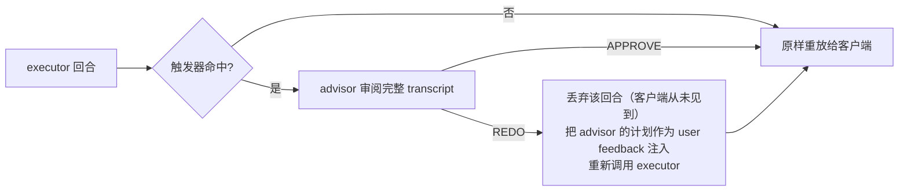

**两种触发器**：

| trigger | 触发时机 |
|---|---|
| `no_tool_call`（默认） | executor 首个不带工具调用的回合——function-calling harness 上"我做完了/我有计划了"的自然时刻。`gate_min_tool_results` 跳过早期闲聊回合 |
| `pattern` | 首个可见文本匹配 `gate_trigger_pattern` 的回合——用于纯文本协议 harness |

**外加** `gate_stall_turns`：会话达到 N 个 assistant 回合仍未触发过，则下一回合强制审阅一次——**抓住那些一直磨蹭却从不宣称完成的 executor**。

**关键工程细节**：
- 审阅预算 `max_reviews` 按 `proxy_x_session_id` 分作用域——benchmark harness 会给一次评测的所有请求（含子 Agent）打同一个 ID，所以预算含义是"这个任务的审阅次数"，即使在多任务共享网关后面也准确
- 失败的 consult **退还预算**，另计入独立上限 3 次，以此限制 advisor 宕机时的延迟放大
- 超长会话做 **middle-out 截断**：保留开头任务陈述 + 最近工作，中间标 `...<middle of the conversation truncated>...`，上限 `transcript_max_chars`（默认 200k 字符 ≈ 50k tokens）
- `fail_open = true`（默认）：advisor 任何失败降级为 APPROVE
- `/v1/stats` 的 `advisor_gate` 块记录 **REDO 丢弃回合的 token 数**——因为客户端从没见过这些回合，光看终端 usage 会漏掉这部分成本

**实测数据**（文档给出，罕见的诚实）：
> Terminal-Bench 2.1 上配合编码 Agent，把一个弱 executor 从 43.8% 提升到 **54.7% ± 0.7（k=3）**，提升 11 个点；但在强 executor 上只是持平于 takeover 式路由器——强模型很少产生审阅能抓到的"尽职缺陷"。

并直接给出选型建议：executor 已经是前沿模型 → 先试 stage-router；executor 明显弱于你能调的最强模型，或你需要审阅留痕 → 用 advisor gate。

### 6.6 Sub-Agent Aware Routing

父 Agent 流量走原算法，委派的子 Agent 走独立策略。通过 `passthrough` / `stage_router` 路由下的可选 `[routes.X.subagents]` 表配置：

```toml
[routes.agent]
type = "passthrough"
target = "parent"           # Claude Sonnet 5

[routes.agent.subagents]
type = "llm_classifier"
mode = "custom"
targets = ["worker", "reviewer"]
default_target = "worker"
classify_trigger = "new_session"
max_output_tokens = 64
```

**约束**：
- 亲和性按 `session + agent` 身份键控
- `user_turn` 不支持子 Agent 路由
- `message_hash_fallback` 不支持——亲和性需要 harness 提供的子身份
- harness 维护类请求继续走父路由

---

## 7. 协议翻译子系统

### 7.1 三种格式的映射

| `format` | 上游端点 |
|---|---|
| `openai_chat` | `/v1/chat/completions` |
| `openai_responses` | `/v1/responses` |
| `anthropic_messages` | `/v1/messages` |

**任意入站格式 × 任意上游格式 = 9 种组合全支持**。翻译永远经过中立 IR，而不是 N² 的直接映射：

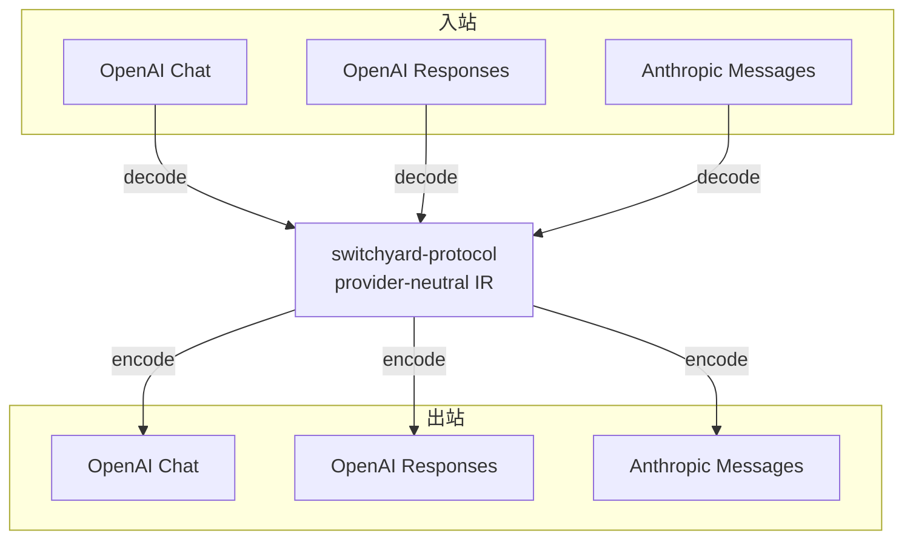

### 7.2 翻译 crate 的测试结构

```
crates/switchyard-translation/tests/
├── request_translation.rs        请求翻译
├── response_translation.rs       缓冲响应翻译
├── stream_translation.rs         流式事件翻译
├── lossless_roundtrip.rs         ★ 无损往返
└── extension_points.rs           扩展点
```

`lossless_roundtrip.rs` 是这个子系统的质量核心：**同格式往返必须无损**。为此 `protocol` 提供了 `ProviderStreamEvent`——每个流事件可保留一个**不透明的原始 provider 事件**，用于同格式回放。这是"翻译层不能丢信息"这一约束的类型化表达。

### 7.3 流式翻译的难点

CHANGELOG 里的多条修复揭示了流式翻译的实际复杂度：

| 问题 | 修复 |
|---|---|
| 混合流 chunk 中 reasoning 顺序错乱 | OpenAI Chat 解码器把同一 chunk 的 reasoning delta 排在 content delta **之前** |
| Responses 工具参数重复发出 | `output_item.done` 会重复 delta 已携带的完整 function-call 参数，解码器在两者一致时抑制重复 |
| 内容过滤 stop 被误映射 | `StopReason::ContentFilter` ↔ Anthropic `refusal`（而非 `end_turn`），保持审核停止可区分 |
| Anthropic 结构化输出丢失 | `/v1/messages` 上的 schema 现在能到达中立请求与转发的上游 body；无法映射的输出格式产生诊断而非静默丢弃 |

**"无法映射 → 产生 diagnostic 而非静默丢弃"** 是这个 crate 的核心态度（`diagnostic.rs` 存在即为证）。

### 7.4 Codex 特殊支持

`codex_namespaces.rs` 专门处理 Codex 的命名空间。`GET /v1/models` 除了标准响应，还附带 **Codex 兼容的 `models` 数组**，每项反映该 route 声明的 `context_window` / `tool_calling` / `reasoning`，让 Codex 能把 Switchyard 当直接 provider 使用。

---

## 8. 配置模型：三层 TOML 契约

### 8.1 完整示例

```toml
schema_version = 1

# 第一层：怎么连 provider
[llm_clients.openrouter]
format = "openai_chat"                      # 必填，不做探测
base_url = "https://openrouter.ai/api/v1"
api_key_env = "OPENROUTER_API_KEY"          # 只写变量名，不写密钥
max_retries = 2                             # 默认 2

# 第二层：模型
[targets.strong]
id = "anthropic/claude-opus-4.7"            # 发给上游的真实 ID
llm_client = "openrouter"
extra_body = { service_tier = "priority" }  # 浅合并，请求已有的 key 优先

[targets.weak]
id = "moonshotai/kimi-k2.6"
llm_client = "openrouter"

# 第三层：路由策略
[routes.stage]
id = "switchyard/stage"                     # 客户端发的模型 ID
type = "stage_router"
capable_target = "strong"
efficient_target = "weak"
picker = "efficient_first"
confidence_threshold = 0.5
recent_turn_window = 3
context_window = 400000                     # 供 /v1/models 声明
tool_calling = true
reasoning = true

[routes.stage.handoff_notes]
escalation_note = "the previous model was stalling; pick up the diagnosis"
only_on_wrong_signal_escalation = true
```

### 8.2 认证的三种模式

| 模式 | 配置 | 行为 |
|---|---|---|
| 配置密钥 | `api_key_env = "X"` | 启动时读环境变量。OpenAI 用 `Authorization: Bearer`，Anthropic 用 `x-api-key` + `anthropic-version` |
| 无认证 | 都不设 | 不发认证头（本地模型服务） |
| **转发调用方凭证** | `forward_auth = true` | 把调用方的凭证发给上游。OpenAI 转发 `authorization` / `chatgpt-account-id` / `x-openai-fedramp`；Anthropic 转发 `authorization` 或 `x-api-key`，保留 `anthropic-beta` 中的 `oauth-*` 值并剔除其他 |

**保留头保护**：调用方的 `host` / `content-length` / `connection` 以及后端自有的 login/api-key/version/content 头**永不被转发**——"调用方的占位凭证绝不会覆盖后端的真实 key"。

### 8.3 重试与回退的成本上界

```
每个候选先耗尽自己的 max_retries 预算，再前进到下一个候选
最坏情况 = candidates × (max_retries + 1) 次上游请求
总延迟包含每个候选被 cap 过的 Retry-After 退避
```

重试触发条件：传输失败、超时、HTTP 408/429、5xx。

**明确的风险披露**：
> 传输失败可能重复一个 provider 已处理但未完成返回的请求。
> 缓冲 body 的传输失败会重试；**流式 body 在响应已返回后不会重放**。

### 8.4 上下文窗口处理

上游 400 里被识别为上下文溢出的错误，会**在 `UpstreamHttp` 之前**被映射为 `ContextWindowExceeded { model, message }`，让调用方可以"驱逐再重试"。AGENTS.md 把这条列为"Always do"级别的硬约束：

> Map upstream context-window errors to `SwitchyardError::ContextWindowExceeded`.

选中目标超窗时，客户端会按 route 剩余目标的配置顺序继续尝试。

---

## 9. HTTP 服务层与可观测性

### 9.1 端点清单

| 方法 | 路径 | 用途 |
|---|---|---|
| POST | `/v1/chat/completions` | OpenAI Chat Completions |
| POST | `/v1/messages` | Anthropic Messages |
| POST | `/v1/responses` | OpenAI Responses |
| **POST** | **`/v1/decision`** | **只解析路由决策，不做终端回答调用** |
| POST | `/v1/messages/count_tokens` | 从 route 的 Anthropic target 计 token |
| GET | `/v1/models` | 本部署提供的 routes（+ Codex 兼容数组） |
| GET | `/v1/stats` | 每模型用量 + 算法专属统计 |
| POST | `/v1/stats/reset` | 清空累计统计 |
| GET | `/v1/routing/session-stats?session_id=ID` | 重扫持久路由日志，按服务模型分组统计（需开启 `--routing-log-file`） |
| GET | `/metrics` | Prometheus 文本 |
| GET | `/health` | 存活探针 |

#### `/v1/decision` 的设计价值

```json
{"input_format": "openai_chat", "request": {"model": "smart", "messages": [...]}}
```

返回选中目标与有序回退，含各自的 model / format / base_url / extra_body，**但不做回答调用**。路由期调用仍会执行；对 escalation / advisor 这类"边路由边产出答案"的算法，若已产生答案则以 `input_format` 编码后放在 `response` 字段返回。

这个端点的用途是：**把 Switchyard 当"路由决策服务"用，自己拿决策去调模型**——正好是给已有网关做增量集成的接入点。

### 9.2 Metrics 全表

| Metric | 类型 | Labels | 含义 |
|---|---|---|---|
| `switchyard_build_info` | gauge | `version` | 版本常量 1 |
| `switchyard_total_requests` / `_errors` | gauge | — | 终端路由调用总数 / 失败数 |
| `switchyard_requests_total` / `_errors_total` | counter | `model` | 按模型分 |
| `switchyard_model_call_latency_ms` | histogram | `model` | 成功终端调用延迟 |
| `switchyard_llm_calls_total` | counter | `algorithm`,`selected_model`,`outcome` | **逻辑**路由 + 终端调用 |
| `switchyard_llm_call_duration_ms` | histogram | 同上 | |
| `switchyard_prompt_tokens_total` | counter | `model` | 输入 token（含 cached + cache-creation） |
| `switchyard_completion_tokens_total` | counter | `model` | 输出 token |
| `switchyard_cached_tokens_total` | counter | `model` | 缓存输入 token |
| `switchyard_cache_creation_tokens_total` | counter | `model` | 缓存创建 token |
| `switchyard_reasoning_tokens_total` | counter | `model` | 推理 token |
| `switchyard_total_latency_ms` | histogram | `model` | 全回合延迟 |
| **`switchyard_routing_overhead_ms`** | histogram | `algorithm` | **路由开销**（仅 algorithm 标签） |
| `switchyard_classifier_fail_open_total` | counter | `judge_model`,`reason` | 判官失败导致无 verdict 路由 |
| `switchyard_client_responses_total` | counter | `outcome` | 最终 LLM route 响应 |
| `switchyard_upstream_attempts_total` | counter | `outcome`,`code` | **实际**上游 HTTP 尝试 |
| `switchyard_router_retry_recovered_total` | counter | — | 重试恢复的上游操作 |

#### 两个精细的度量设计

**① 逻辑调用边界 vs 物理尝试**

```
switchyard_llm_calls_total  = 逻辑调用（终端 fallback + 后端重试算作一次，标签用算法选中的模型）
switchyard_upstream_attempts_total = 实际 HTTP 尝试次数
```

两者之差 = 重试与回退的放大倍数。**路由已产出的答案只被它原来的 libsy 调用计一次，不重复计数。**

**② `routing_overhead_ms` 的严格定义**

> 记录 `run` 中从 `run_started` 到 `drive` 返回路由结果的耗时。包含算法执行与驱动期间的任何 classifier / judge 调用，在终端回答调用开始**之前**记录。不扣除任何请求服务调用的时长。若路由本身产出了答案，那次调用就发生在被测的 `drive` 区间内。该 metric **只带 `algorithm` 标签**，因为这个时长描述的是路由器而非它选的目标；产出结果前的路由失败不记录任何值。桶从 0.1 ms 起（SDK 默认从 5 ms 起，服务端用 view 覆盖）。

这段定义的精确程度，说明团队认真对待"路由开销"这个指标——毕竟这正是"引入路由器值不值"的核心论据。

**③ `total_latency_ms` 的计时起点**

> 时钟起于 router 级中间件，**在读取和解码请求 body 之前**，所以测的是请求入站到响应完成。仍不含连接 accept 与 TLS 握手（hyper 在服务器看到请求前已完成）。

### 9.3 会话路由日志

`--routing-log-file PATH` 开启后，每个完成的路由响应追加一条 JSON 记录（流式响应在流耗尽后记录）。`GET /v1/routing/session-stats` 会**重扫持久日志**，返回该会话按服务模型分组的调用与 token 总量。会话 ID 优先取 `x-switchyard-session-id`，legacy 的 `proxy_x_session_id` 作为兜底。日志未开启时该端点不注册。

### 9.4 日志与停机

- **每个 LLM 请求恰好一条结构化终端事件**：成功 `INFO`，4xx `WARN`，5xx `ERROR`
- 流式失败**单独记录**，因为它可能发生在响应已开始之后
- `RUST_LOG=switchyard_server=debug,libsy=debug` 打开路由决策与嵌套失败细节
- Ctrl+C / SIGTERM → 停止新连接，活跃请求 drain 最多 `--shutdown-timeout`（默认 30s）

---

## 10. Python 集成层

### 10.1 定位

AGENTS.md 说得很直白：

> **Python is an integration layer.**

Unreleased 段刚刚**删除**了：Python coding-agent launcher CLI、`switchyard serve`、YAML route bundles、FastAPI 端点与 legacy 链、`switchyard-components` crate、`[server]`/`[gpu]`/`[all]`/`[cli]` 打包 extras。

这是一次**明确的战略收缩**：Python 从"另一条完整实现路径"退回到"薄绑定 + 工具脚本"。

### 10.2 当前 Python 表面

```
switchyard/
├── __init__.py          # 仅版本号
└── libsy/
    ├── __init__.py
    └── algorithms.py    # 12 行，纯 re-export

switchyard_rust/         # PyO3 扩展的 Python facade
├── _native.py
├── libsy.py
├── server.py
└── py.typed             # 类型标记，mypy strict
```

```python
# switchyard/libsy/algorithms.py 全文（去掉 SPDX 头）
"""Factories for Rust-owned libsy algorithms."""
from switchyard_rust.libsy import llm_classifier, llm_task_classifier, noop, random, stage_router
__all__ = ["llm_classifier", "llm_task_classifier", "noop", "random", "stage_router"]
```

### 10.3 Server 绑定

```rust
#[pyclass(name = "Server", module = "switchyard_rust.server", unsendable)]
// 方法：new(config: PathBuf, port: u16) / port() / base_url()
//       caller_auth_kind(model) / close(timeout_secs)
//       __enter__ / __exit__ / __repr__ / Drop
```

支持 Python context manager 语法，`Drop` 里也做清理——即使用户忘了 `close()` 也不泄漏。发布包名 `nemo-switchyard`，导入名 `switchyard.*`。

---

## 11. 基准测试与质量保障体系

### 11.1 三层质量保障

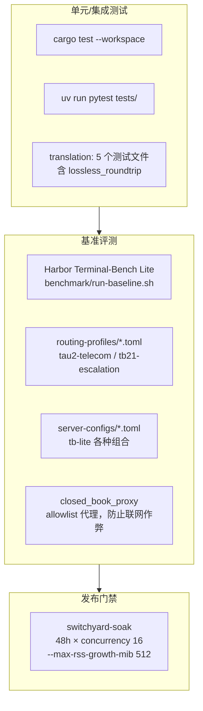

### 11.2 Harbor 基准框架

两条路径共用同一套生成数据集、任务代理、固定 Agent 版本、产物布局：

| 路径 | 说明 |
|---|---|
| **Direct upstream** | Harbor 直连 provider，Switchyard 关闭（基线） |
| **Switchyard routing** | Harbor 调 Switchyard，Switchyard 跨两个模型层路由 |

传 `--server-config` 即启动 Rust server（Docker 内）；不传则禁用 Switchyard 直连上游。

**Harbor 补丁预检**：`run-baseline.sh` 会**反向校验 diff 与已安装 Harbor 树的精确匹配**，陈旧或部分应用的补丁在启动 Harbor 前就失败。这种"环境完整性前置校验"是很成熟的工程做法。

`closed_book_proxy` 用 allowlist + rewriter 限制容器网络访问，确保 benchmark 不会因 Agent 联网查答案而失真。

### 11.3 Soak 测试

```bash
target/release/switchyard-soak \
  --model switchyard/general --duration 48h --concurrency 16 \
  --server-pid "$SWITCHYARD_SERVER_PID" --max-rss-growth-mib 512
```

**场景目录**覆盖：短/长输入、长输出、共享前缀、混合流量、增长中的会话、工具 schema、工具调用突发、路由信号、有界失败用例。短基线还会在流式与非流式两种形态下跑 Chat Completions / Messages / Responses 三种 API。

采样 health、metrics 与可选的本地 server 进程，**release gate 失败时退出码为 1**。

### 11.4 工程规范（AGENTS.md 摘录）

| 类别 | 规则 |
|---|---|
| **Rust 硬约束** | 生产代码**禁止** `panic!()` / `unwrap()` / `.expect()`（测试中允许）。用 `?` 传播，返回类型化错误 |
| Python | ruff（行长 100，忽略 E501）、mypy strict、`py.typed`、async-only、`X \| Y` 联合语法 |
| 命名 | 文件名 = 主导出类的 snake_case，触碰即重命名 |
| 注释 | 禁止在源码里放 issue/PLAN/step 引用（"这些在计划变更的瞬间就腐烂了"）；注释解释非显然之处 |
| 提交 | 一步一提交，单行 Conventional Commits，`git commit -s`（DCO），**永不主动提交**（先展示 diff 拿批准） |
| 评审 | 每条发现都要对当前代码路径验证；只解决自己的评审线程，且需先在代码中确认修复 |
| 需先问 | 改 `pyproject.toml` 依赖、加新 HTTP 端点、删/改公开 Rust/PyO3/Python API |

配套 4 个 agent skill runbook：`publish-python-release` / `switchyard-docs` / `switchyard-rust-review` / `switchyard-testing-ci`，且明确要求 **"skill 应包含稳定的操作约束，而非可变的架构清单"**——防止文档腐烂的设计。

CI/工具链：`.pre-commit-config.yaml`、`.commitlintrc.json`、`.coderabbit.yaml`（AI 代码评审）、`.sir-merge-a-lot.yml`（自动合并）、`.hooks/add_spdx_headers.py`（SPDX 头自动注入）、`rust-toolchain.toml` 固定 1.96.1。

---

## 12. 工程质量评估与风险清单

### 12.1 优点

| 项 | 说明 |
|---|---|
| ✅ **Crate 边界教科书级** | protocol 纯类型、libsy 零 I/O、translation 纯函数、client 只管 HTTP、server 只管接入。任意一层可独立替换 |
| ✅ **Step/Driver 卸载模式** | 让路由算法完全脱离 transport，可嵌入任何 gateway/agent runtime。这是本项目最值得复用的设计 |
| ✅ **失败语义分层清晰** | 模型调用失败 → `respond(Err)`（算法可绕开）；基础设施失败 → `serve` 返回 `Err`（中止运行）；算法 panic → 捕获转错误，流仍发终端项 |
| ✅ **可观测性设计深思熟虑** | 逻辑调用 vs 物理尝试分离、routing_overhead 只带 algorithm 标签、OpenInference 语义对齐、REDO 丢弃回合的 token 也计入 |
| ✅ **文档质量极高** | 每个算法有独立文档 + mermaid 图 + 调优表 + "何时不要用"章节 + 实测数据。stage_router 甚至给出完整阈值标定方法论 |
| ✅ **fail-safe 默认** | 判官失败一律走 strong；advisor 失败降级为 APPROVE；子 Agent 缺身份宁可无历史也不共享父级历史 |
| ✅ **诚实的风险披露** | `known_issues.md` 列已知缺陷；`capable_first` 明标实验性且启动打 warning；advisor gate 直说"强 executor 上无增益" |
| ✅ **发布门禁严格** | 48 小时 soak + RSS 增长上限 + Harbor 补丁完整性反向校验 |

### 12.2 风险与限制

| 严重度 | 问题 | 出处 | 影响 |
|:---:|---|---|---|
| 🔴 高 | **pre-alpha，官方声明不用于生产** | README | API 与算法在 v1.0 前会大改 |
| 🔴 高 | **客户端断连后缓冲的上游工作仍在继续** | known_issues 0.2.0 #1 | 已取消的请求仍产生真实 provider 费用 |
| 🟠 中 | **路由层归因在 stats/metrics 中缺失** | known_issues 0.2.0 #2 | 判官失败走默认目标、escalation 决策、stage_router fallback 决策都无法从指标中区分 |
| 🟠 中 | **重试恢复计数器成功后仍为 0** | known_issues 0.2.0 #3 | `switchyard_router_retry_recovered_total` 不可信 |
| 🟠 中 | **`x-switchyard-session-id` 未记入原生会话统计** | known_issues 0.2.0 #4 | 会话级分析需依赖 legacy 头 |
| 🟠 中 | **传输失败重试可能重复已被 provider 处理的请求** | llm-client README | 非幂等操作（如带副作用的工具调用）有重复执行风险 |
| 🟠 中 | **`message_hash_fallback` 会让不同会话共享路由决策** | llm_classifier 文档 | 相同开场白的独立会话被当成同一会话，文档已标 best-effort |
| 🟡 低 | **`capable_first` 无标定阈值** | stage_router 文档 | 所有已发布阈值来自 `efficient_first` |
| 🟡 低 | **无模型目录自动发现** | overview 文档 | 暴露 N 个上游模型需写 N 个 passthrough route |
| 🟡 低 | **Codex Responses 任务可能记 0 token** | known_issues 0.1.0 #1 | 用量统计失真 |
| 🟡 低 | **服务器不发 `X-Switchyard-Version` 上游头** | known_issues 0.2.0 #5 | 文档与实现不一致 |
| 🟡 低 | **AGENTS.md 首句仍写 "Python library"** | AGENTS.md L3 | 与 Unreleased 段删除 Python server 栈的事实不符，文档滞后 |

### 12.3 一个值得注意的文档不一致

`docs/routing_algorithms/stage_router_routing.md` 的 Observability 章节写着"Each response carries two routing headers"，但表格里只列了一个（`x-model-router-selected-model`）。属于文档编辑遗漏。

---

## 13. 适用场景建议

### 13.1 推荐使用

| 场景 | 推荐度 | 说明 |
|---|:---:|---|
| **让 Claude Code / Codex 跑开源模型** | ⭐⭐⭐⭐⭐ | 核心场景。协议翻译 + 三向格式互译是刚需 |
| **编码 Agent 的成本优化（强弱模型混跑）** | ⭐⭐⭐⭐⭐ | stage_router 零额外调用；escalation 事后判定；advisor gate 质量门禁。三种思路可按需选 |
| **多模型 A/B 基准测试** | ⭐⭐⭐⭐⭐ | `random` + `seed` + Harbor 框架 + `closed_book_proxy` |
| **给已有网关增量加路由能力** | ⭐⭐⭐⭐ | 两种方式：嵌入 `switchyard-libsy`（零 I/O，drop-in），或调 `/v1/decision` 只取决策 |
| **路由开销的量化分析** | ⭐⭐⭐⭐ | `routing_overhead_ms` 定义精确，从 0.1ms 起分桶 |
| **生产关键路径承载** | ⭐⭐ | pre-alpha + 已知的断连计费问题。可先做非关键流量/内部工具流量 |
| **需要可训练路由策略** | ⭐ | 完全不提供训练。需要用 LLMRouter 或自研 |
| **纯 Chat 无工具流量的路由** | ⭐⭐ | stage_router 依赖工具结果历史，纯 chat 场景下每个含糊请求都落到默认 tier |

### 13.2 三种接入形态选择

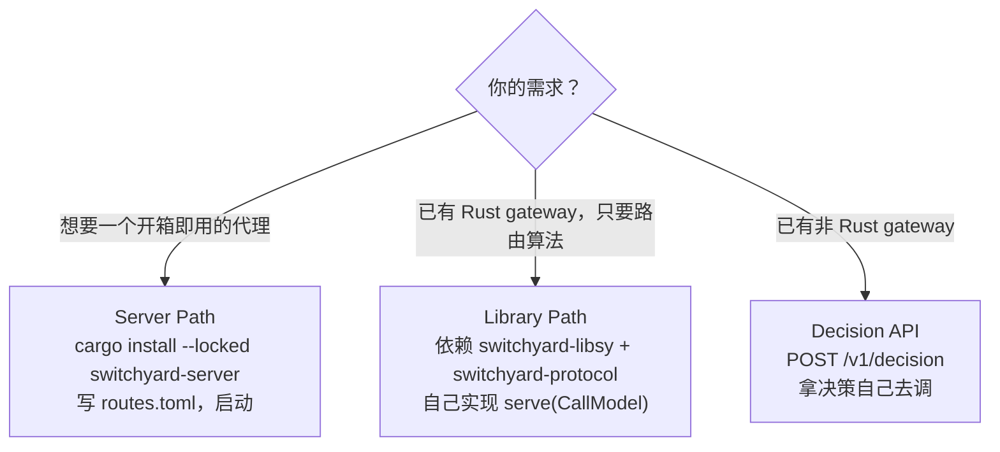

### 13.3 落地路径建议

**阶段一：算法选型（1 周）**

先用 `random` 路由跑一轮 A/B 建立基线，然后按 executor 强度选算法：

| executor 情况 | 推荐算法 | 起始配置 |
|---|---|---|
| 有大量工具调用的编码 Agent | `stage_router` | `picker = "efficient_first"`, `confidence_threshold = 0.5`, 不配 classifier |
| 多轮 Agent，弱模型偶尔卡住 | `escalation` | `escalation = {}`（默认即标定值），务必传 `x-switchyard-session-id` |
| executor 明显弱于最强可用模型 | `advisor` | `max_reviews = 3`, `gate_stall_turns = 30`, `gate_min_tool_results = 3` |
| 一次性请求、无轨迹可判 | `llm_classifier` `capability` | `classify_trigger = "new_session"` 省判官调用 |

**阶段二：标定（2-3 周）**

按 stage_router 文档的四象限方法论采集数据：纯 capable 跑 40-75 个代表任务，分层采样 20 个跑纯 efficient，构造 RESCUE/LOSS/SAFE/HARD 四象限，扫阈值。

**阶段三：观测与调优（持续）**

```bash
curl -s http://localhost:4000/v1/stats | jq '.algorithm_stats.stage_router'
# 看 decision_source 分布：override / tests_passed / dimensions / llm-classifier / fall_open
# fall_open 占比过高 → 说明信号不足，考虑加 classifier 或降阈值
```

关注 `switchyard_llm_calls_total` 与 `switchyard_upstream_attempts_total` 的比值（重试放大倍数），以及 `switchyard_routing_overhead_ms` 的 p99（路由开销是否吃掉了省下的成本）。

### 13.4 与 LLMRouter 的互补组合

两个项目在同一个问题空间的**不同层次**：

```
┌──────────────────────────────────────────────────┐
│  LLMRouter：离线                                  │
│  · 17 个可训练路由算法                             │
│  · xRouteBench 8 数据集零成本回放评测              │
│  · α/β 成本-质量帕累托扫参                         │
│  → 产出：哪类路由策略适合我的流量？阈值该设多少？    │
└──────────────────┬───────────────────────────────┘
                   │ 策略与阈值
                   ▼
┌──────────────────────────────────────────────────┐
│  Switchyard：在线                                 │
│  · Rust 运行时，协议翻译，重试/回退                │
│  · 轨迹信号路由（LLMRouter 不具备的维度）          │
│  · 生产级 metrics / soak 门禁                     │
│  → 产出：真实流量上的路由执行与观测                │
└──────────────────────────────────────────────────┘
```

若要真正打通，缺口在于：Switchyard 的算法全部是**规则 + LLM-as-judge**，没有加载训练好的模型（如 KNN/MLP 路由器）的扩展点。要接入 LLMRouter 训练出的路由器，需要：

1. 实现一个自定义 `Algorithm`，在 `route()` 里调用外部推理服务（通过 `Driver::call_model` 或直接的 ONNX/Candle 推理）
2. 或者利用 `prefill-router` crate 的 `PrefillForward` 契约——它已经预留了"抽 hidden state 特征"的接口，正是嵌入式判别路由器所需的输入

`prefill-router` 的存在，暗示 NVIDIA 团队已经在规划这条路径（其注释明确提到"NVIDIA LLM Router blueprint"）。

---

## 附录 A：快速上手

```bash
# 安装
cargo install --locked switchyard-server

# 最小配置
cat > routes.toml <<'EOF'
schema_version = 1
[llm_clients.openrouter]
format = "openai_chat"
base_url = "https://openrouter.ai/api/v1"
api_key_env = "OPENROUTER_API_KEY"
[targets.strong]
id = "openai/gpt-4o"
llm_client = "openrouter"
[targets.weak]
id = "openai/gpt-4o-mini"
llm_client = "openrouter"
[routes.stage]
id = "switchyard/stage"
type = "stage_router"
capable_target = "strong"
efficient_target = "weak"
picker = "efficient_first"
confidence_threshold = 0.5
EOF

export OPENROUTER_API_KEY="..."
switchyard-server --config routes.toml --dry-run          # 配置校验
switchyard-server --config routes.toml --host 127.0.0.1 --port 4000

# 验证
curl http://localhost:4000/health
curl http://localhost:4000/v1/models
curl http://localhost:4000/v1/chat/completions -H 'Content-Type: application/json' \
  -d '{"model":"switchyard/stage","messages":[{"role":"user","content":"hello"}]}'

# 只要决策不要回答
curl http://localhost:4000/v1/decision -H 'Content-Type: application/json' \
  -d '{"input_format":"openai_chat","request":{"model":"switchyard/stage","messages":[...]}}'

# 观测
curl -s http://localhost:4000/v1/stats | jq
curl -s http://localhost:4000/metrics
```

开发环境：
```bash
uv sync && source .venv/bin/activate
uv run ruff check . && uv run mypy switchyard && uv run pytest tests/ -v
cargo test --workspace
```

## 附录 B：关键文件索引

| 主题 | 文件 |
|---|---|
| `Algorithm` trait / `Driver` / `Step` / `drive()` | `crates/libsy/src/core/algorithm.rs` |
| libsy 公开 API 全景 | `crates/libsy/src/lib.rs` |
| Stage router 打分器 | `crates/libsy/src/algorithms/util/stage.rs` |
| 工具信号提取 | `crates/libsy/src/algorithms/util/tool_signals.rs` |
| Escalation 判官 | `crates/libsy/src/algorithms/util/escalation.rs` |
| Advisor gate | `crates/libsy/src/algorithms/advisor_gate.rs` |
| 会话亲和性 | `crates/libsy/src/algorithms/util/affinity.rs` |
| 翻译引擎 | `crates/switchyard-translation/src/engine.rs` |
| 无损往返测试 | `crates/switchyard-translation/tests/lossless_roundtrip.rs` |
| HTTP 客户端 + `run()` | `crates/libsy-llm-client/src/{client.rs, run.rs}` |
| 服务器主体 | `crates/switchyard-server/src/lib.rs` |
| 统计聚合 | `crates/switchyard-server/src/stats/` |
| PyO3 绑定 | `crates/switchyard-py/src/{libsy_bindings.rs, server_bindings.rs}` |
| TOML 完整 schema | `docs/reference/toml_schema.md` |
| 已知问题 | `docs/known_issues.md` |
| 工程规范 | `AGENTS.md` |

## 附录 C：术语对照

| 术语 | 含义 |
|---|---|
| **LLM client** | 上游连接配置：base_url + wire format + 凭证环境变量 + 重试策略 |
| **Target** | 一个上游模型 ID + 它使用的 LLM client |
| **Route** | 一个客户端可见的模型 ID + 选择/调用 target 的算法 |
| **capable / efficient** | stage_router 中的两个层级角色（**不是模型固有属性**） |
| **strong / weak** | llm_classifier 中的两个层级角色 |
| **executor / advisor** | advisor gate 中的执行者与裁决者 |
| **Step::CallModel** | 算法卸载给宿主执行的模型调用 |
| **RoutingOutcome** | 路由结果：选中模型 + 有序回退 + 可能重写的请求 + 可选的已产出答案 |
| **fall_open** | 信号含糊且无判官可用时，落到 picker 默认层级 |
| **latch** | escalation 中会话被锁定到 strong 层级的状态 |
