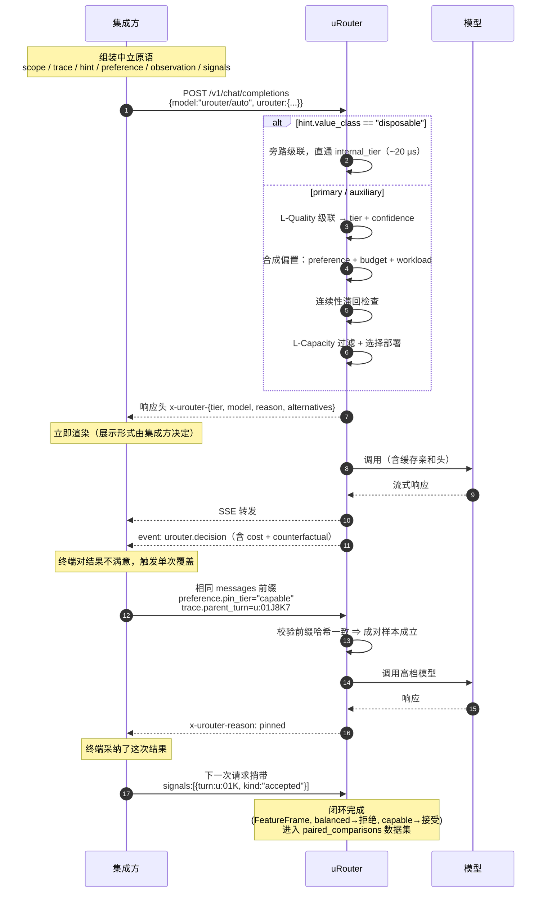

# uRouter 集成指南：在产品 Auto 模式中使用 uRouter

> 版本：v2.1（2026-08-26 runtime alignment）
> 定位：**模块集成契约**。uRouter 是一个与具体产品无关的基础模块；本文定义它对外暴露的能力与契约，以及集成方如何用这些原语拼出自己的 Auto 模式。
> 受众：集成方工程团队 + uRouter 团队
> 关联文档：`uRouter_设计文档.md`（模块内部设计，本文不重复）
> 契约状态：**对外契约，独立版本化**（`contract_version`）
>
> **v1 → v2 的修正**：v1 把产品设计写进了模块契约（UI 档位渲染、展示文案、订阅额度呈现、产品 KPI 定义、具体产品的配置样例）。
> 这些是集成方的职责，不是 uRouter 的。v2 收回到模块边界内，只定义**中立原语**与**机器可读契约**。

---

## 目录

1. [模块定位与责任边界](#1-模块定位与责任边界)
2. [集成形态](#2-集成形态)
3. [模型清单契约](#3-模型清单契约)
4. [请求契约](#4-请求契约)
5. [响应契约](#5-响应契约)
6. [覆盖契约](#6-覆盖契约)
7. [反馈契约](#7-反馈契约)
8. [偏好与预算的合成](#8-偏好与预算的合成)
9. [会话连续性策略](#9-会话连续性策略)
10. [低价值调用旁路](#10-低价值调用旁路)
11. [子作用域](#11-子作用域)
12. [模块级可观测](#12-模块级可观测)
13. [能力分级与集成依赖](#13-能力分级与集成依赖)
14. [集成检查清单](#14-集成检查清单)
15. [对主设计文档的影响](#15-对主设计文档的影响)
- [附录 A：字段映射示例（非规范）](#附录-a字段映射示例非规范)
- [附录 B：一次完整交互的时序](#附录-b一次完整交互的时序)

---

## 1. 模块定位与责任边界

### 1.1 uRouter 是什么、不是什么

**uRouter 是一个路由决策与执行模块。** 它的输入是一次 LLM 调用请求加上若干中立的上下文原语，输出是"用哪个模型执行、为什么、花了多少"。

它**不感知**任何产品概念：

| uRouter 不认识 | uRouter 认识的中立抽象 |
|---|---|
| 用户、账号、订阅 | `scope`（一个不透明的作用域键）+ 绑定在其上的预算 |
| 会话、对话、聊天记录 | `trace`（一组不透明的关联键：trace / turn / branch） |
| 点赞、点踩、采纳 diff | `signal`（带方向与强度的质量信号）|
| 下拉框、滑块、档位 | `preference_bias`（一个 `[-1, +1]` 的标量）|
| "标题生成"、"会话摘要" | `hint.value_class`（调用的价值等级）|
| 产品文案、展示语言 | `reason_code`（一个稳定的枚举值）|
| 产品 KPI（渗透率、流失率） | 决策 / 覆盖 / 降级的**原始计数与事件流** |

**这个转换是有意的。** 一旦模块里出现"用户"和"订阅"，它就绑死在一种商业模式上；出现"点赞"，就绑死在一种交互形态上。中立原语让同一个模块能被 IDE 插件、聊天产品、批处理管线、CI 机器人共用。

### 1.2 责任分界表

| 事项 | uRouter | 集成方 |
|---|:---:|:---:|
| 选哪个 tier / 哪个部署 | ✅ | — |
| 执行调用、重试、降级、协议翻译 | ✅ | — |
| 精确成本核算（含阶梯、缓存） | ✅ | — |
| 预算控制（按 scope 的软偏置 + 硬闸） | ✅ | — |
| 决策归因（`reason_code` + trace） | ✅ | — |
| 执行覆盖指令、构造成对样本 | ✅ | — |
| 摄取质量信号、闭环训练 | ✅ | — |
| 暴露机器可读的模型/能力/倍率元数据 | ✅ | — |
| **把 `scope` 映射到用户 / 团队 / 订阅** | — | ✅ |
| **决定 `preference_bias` 从哪来**（滑块 / 档位 / 固定值 / 按套餐） | — | ✅ |
| **UI 呈现与展示文案**（`reason_code` → 人话） | — | ✅ |
| **交互设计**（升级按钮、切换语义、提示时机） | — | ✅ |
| **把产品事件映射成 `signal`** | — | ✅ |
| **商业语义**（额度换算、套餐、计费呈现） | — | ✅ |
| **产品 KPI 的定义与口径** | — | ✅ |
| 声明调用的 `value_class` 与 `hint` | — | ✅ |

> **一句话判据**：需要知道"这个产品长什么样、卖给谁、怎么收费"才能决定的事，都不属于 uRouter。

### 1.3 三条边界原则

| # | 原则 | 后果 |
|---|---|---|
| **B1** | **uRouter 返回枚举，不返回文案。** 所有面向人的字符串由集成方生成 | `reason_code` 是稳定枚举且**只增不改语义**；新增值时集成方应有 fallback 分支 |
| **B2** | **uRouter 接受标量与不透明键，不接受产品语义。** 不解析 `scope` / `trace` 的内部结构 | 集成方可以用任意编码；uRouter 只做相等比较与哈希 |
| **B3** | **uRouter 产出事件与原始计数，不产出产品指标。** 它不知道什么叫"流失" | 模块指标是 `urouter_override_total{kind}` 这类；产品 KPI 由集成方在自己的分析栈里定义 |

---

## 2. 集成形态

### 2.1 三种形态

| 形态 | 说明 | 闭环完整性 |
|---|---|---|
| **Gateway**（推荐） | 集成方把 LLM 调用发给 uRouter，`model` 指向 auto route | ✅ 完整——uRouter 掌握 usage、延迟、失败、缓存命中 |
| **Decision API** | `POST /v1/decision` 只取决策，集成方自己调模型 | ⚠️ 需回传执行结果，否则该次调用不进训练集 |
| **嵌入库** | Rust 宿主直接依赖 `urouter-decide` + `urouter-capacity` + `urouter-infer` | ✅ 完整，但宿主要自己实现 `serve(CallModel)` |

**Gateway 是主路径的理由不是"简单"，而是闭环完整性**：Auto 模式的全部价值建立在"能证明省了多少、质量掉了多少"上，执行结果的缺失会直接击穿这个论证。

Decision API 的正确用途是**逃生舱**：集成方需要 provider 特有能力而 uRouter 的中立 IR 暂未覆盖时使用。此时必须通过 `POST /v1/decision/{decision_id}/outcome` 回传 usage 与结果，否则该记录标 `outcome_missing`。

### 2.2 route 是集成的配置单元

uRouter 侧一个 route 就是一套完整的 Auto 策略（tier 映射、级联、预算、旋钮默认值）。不同集成方 / 不同场景各自一个 route：

```toml
[routes.auto-a]
id = "urouter/auto"                    # 客户端可见的 model id，允许重名
tiers = { efficient = "...", balanced = "...", capable = "..." }
default_preference_bias = 0.0

[routes.auto-b]
id = "urouter/auto"
tiers = { efficient = "...", balanced = "...", capable = "..." }
default_preference_bias = 0.3
```

route 的选择由**凭证归属**（API key 绑定的 route 集合）或 `X-URouter-Route` 头决定。

**推论**：同一个 `model` id 在不同凭证下解析到不同 route，**所以 `GET /v1/models` 的返回必须按凭证动态生成**，不能是启动时算好的全局常量。这一点实现上很容易做错。

---

## 3. 模型清单契约

集成方的模型选择器需要知道 Auto 是什么、覆盖哪些模型、代价倍率多少。`GET /v1/models` 是这些信息的唯一来源。

### 3.1 响应

```json
{
  "object": "list",
  "data": [
    {
      "id": "urouter/auto",
      "object": "model",
      "owned_by": "urouter",
      "urouter": {
        "kind": "auto",
        "contract_version": 1,
        "tiers": [
          { "tier": "efficient", "model": "moonshotai/kimi-k2.6",     "cost_index": 1.00 },
          { "tier": "balanced",  "model": "anthropic/claude-sonnet-5", "cost_index": 2.81 },
          { "tier": "capable",   "model": "anthropic/claude-opus-4.7", "cost_index": 14.02 }
        ],
        "capabilities": {
          "context_window": 200000,
          "input_modalities": ["text"],
          "tool_calling": true,
          "structured_output": true,
          "reasoning": true
        },
        "preference_bias": { "supported": true, "default": 0.0, "range": [-1.0, 1.0] },
        "override": { "supported": true, "granularity": ["turn", "session"] }
      }
    },
    {
      "id": "anthropic/claude-opus-4.7",
      "object": "model",
      "owned_by": "anthropic",
      "urouter": { "kind": "model", "cost_index": 14.02, "capabilities": { "...": "..." } }
    }
  ]
}
```

**注意这里没有 `display_name`、`description`、`badge`、档位标签。** 那些是展示层的事（**B1**）。uRouter 提供的是：候选 tier 与其真实模型 id、**成本指数**、能力、支持哪些控制原语。集成方拿这些自己组织展示。

`cost_index` 是相对 `efficient` tier 的归一化成本倍率（基于目录价格与该 route 的典型 in/out token 比估算），供集成方换算成自己的额度/计费单位。**uRouter 不定义"额度"这个概念。**

### 3.2 基线能力取交集，可路由能力取可达候选并集

这是本文最重要的一条正确性约束。

```
设  efficient tier 的模型不支持视觉，capable tier 支持。

❌ Auto 声明支持视觉（并集）：
   集成方允许在 Auto 下传图片
   → 每个含图请求被迫升级到 capable
   → Auto 的成本反而高于集成方手动固定选 balanced
   → "自动省钱"的承诺在最常见的场景下失效

✅ Auto 声明不支持视觉（交集）：
   集成方在输入侧就能拦住，明确告知需要选具体模型
   → Auto 的能力承诺永远兑现
```

同理适用于 `context_window`（取最小值）、`tool_calling`、`structured_output`。

运行时同时返回 `capabilities`（基线交集）和 `routable_capabilities`（至少一个可达
候选支持的并集）。UI 可以区分“所有路径保证”与“Auto 可通过升级处理”，而不是阻止本可
由强模型处理的请求。能力驱动的升级必须记录 `reason=capability_required`。

**启动校验**（主设计文档 §16.1 追加）：

> Auto route 的 `capabilities` 必须等于所有 tier 的交集；
> `routable_capabilities` 必须由至少一个可达 tier 支持。请求只能落到满足其硬能力的模型。

> 这与主文档 §16.1 第 12 条（同一 tier **内**各部署能力必须一致）是两回事：tier **间**允许不同（efficient 本来就弱），但对外承诺只能取交集。

---

## 4. 请求契约

### 4.1 载体：`urouter` extra_body 命名空间

```json
{
  "model": "urouter/auto",
  "messages": [ ... ],
  "stream": true,
  "urouter": { ... }
}
```

选择 extra_body 而非 header 的理由：结构化（嵌套对象/数组）、不受 header 大小限制、不会被中间代理剥掉。uRouter 作为网关**在转发前剥掉 `urouter` 命名空间**，不污染上游（部分 provider 遇到未知顶层字段会直接 400）。

header 仅作为不便改 body 时的轻量 fallback：`X-URouter-Scope`、`X-URouter-Trace`。**body 优先**，冲突时以 body 为准并记 `contract_conflict` 指标。

### 4.2 字段定义

```json
{
  "urouter": {
    "contract_version": 1,

    "scope": {
      "budget": "b:9c31af…",        // 预算作用域键（不透明）。缺失则预算控制禁用
      "affinity": "a:7fA2…",        // 亲和作用域键（不透明）。缺失则会话级能力禁用
      "sub": null                    // 子作用域名（见 §11）
    },

    "trace": {
      "id": "t:01J8K…",             // 关联键，跨轮稳定
      "turn": "u:01J8K7…",          // 本次调用的唯一键。覆盖与反馈的关联锚点
      "parent_turn": null            // 覆盖重试时指向被覆盖的 turn
    },

    "hint": {
      "value_class": "primary",      // primary | auxiliary | disposable，见 §10
      "workload": "execute",         // 见 4.3，可选
      "difficulty": null,            // trivial | normal | hard，可选，集成方的先验
      "retry_of": null               // 若为原样重试，指向原 turn
    },

    "preference": {
      "bias": 0.0,                   // [-1,+1]，正=偏向低成本，负=偏向高能力
      "floor_tier": null,            // 质量下限，路由不会低于此 tier
      "pin_tier": null               // 强制指定 tier，跳过决策（见 §6）
    },

    "observation": {                 // 可选：集成方已知的执行事实，见 4.4
      "last_action_ok": false,
      "last_error_class": "compile_error",
      "verification_passed": null,
      "artifacts_changed": 3
    },

    "signals": [                     // 可选：对既往 turn 的质量信号捎带，见 §7
      { "turn": "u:01H…", "kind": "accepted", "strength": 1.0 }
    ]
  }
}
```

**全部字段可选。** 缺失只导致对应能力降级，不导致失败：

| 缺失 | 降级后果 |
|---|---|
| `scope.budget` | 预算软偏置与硬闸禁用 |
| `scope.affinity` | 会话连续性策略、escalation latch、缓存亲和的会话维度禁用 |
| `trace.turn` | 覆盖与反馈无法关联 → **闭环失效**（最严重） |
| `hint.value_class` | 全部按 `primary` 处理 → 失去 §10 的确定性收益 |
| `preference.bias` | 用 route 的 `default_preference_bias` |
| `observation` | 回退到从 messages 推断（精度下降） |

### 4.3 `hint.workload`：调用的工作负载类型

一组中立的、与产品无关的枚举：

| 值 | 含义 | 路由处理 |
|---|---|---|
| `plan` | 规划、分解、决定下一步 | 正常级联 + `workload_bias.plan`（默认 −0.15，偏向高能力） |
| `execute` | 执行、生成、调用工具 | 正常级联 |
| `verify` | 自查、审阅、校验 | 正常级联 |
| `answer` | 直接应答 | 正常级联 |
| `compress` | 上下文压缩 / 摘要 | 正常级联，但受 `value_class` 影响 |
| `extract` | 抽取、分类、结构化 | 正常级联 |

> **`plan` 默认偏向高能力**是一个刻意的策略判断：规划阶段的错误会污染整个后续执行，纠错成本远高于一次升级。这是纯 HTTP 层拿不到、只有集成方声明才能获得的收益。默认值可在 route 中配置或关闭。

`workload` 与 `value_class` 正交：一次 `compress` 可能是 `primary`（用户可见的会话摘要，质量差会污染后续所有轮），也可能是 `disposable`（内部临时压缩）。**由集成方判断，uRouter 不猜。**

### 4.4 `observation`：集成方已知的执行事实

主设计文档 §6.2 的 `TrajectoryFeatures` 是从 messages 里**推断**工具结果的（正则匹配错误模式、启发式分级）。集成方直接告知会准确得多。

**处理规则**：显式 `observation` **覆盖**推断值，并在 `DecisionRecord` 标 `observation_source: declared | inferred | mixed`。

离线训练时按 source 分层评估——若 declared 与 inferred 的路由效果差异显著，说明推断逻辑需要改进。**这是一个免费的、持续运转的校准信号**，也是采集 `observation` 的额外理由。

---

## 5. 响应契约

集成方需要在**首 token 之前**就能拿到决策，才能在流式场景下渲染。

### 5.1 响应头

```
x-urouter-decision-id: dec_01J8K…
x-urouter-tier: balanced
x-urouter-model: anthropic/claude-sonnet-5
x-urouter-reason: complexity_moderate
x-urouter-source: model
x-urouter-degraded: false
x-urouter-alternatives: capable
x-urouter-cost-index: 2.81
```

### 5.2 响应体 / 流末事件

非流式放在响应体的 `urouter` 字段；流式作为最后一个 SSE 事件 `event: urouter.decision`（因为成本依赖最终 usage）。

```json
{
  "urouter": {
    "decision_id": "dec_01J8K…",
    "turn": "u:01J8K7…",
    "tier": "balanced",
    "model": "anthropic/claude-sonnet-5",
    "provider": "anthropic",
    "source": "model",
    "reason": "complexity_moderate",
    "confidence": 0.71,
    "degraded": false,
    "alternatives": [
      { "tier": "capable", "model": "anthropic/claude-opus-4.7", "cost_index": 14.02 }
    ],
    "cost": {
      "usd": 0.0271,
      "index": 2.81,
      "counterfactual_usd": { "highest_tier": 0.1673 }
    },
    "budget": { "scope": "b:9c31af…", "period_used_ratio": 0.62 }
  }
}
```

`alternatives` 告诉集成方"可以升级到哪些 tier"。为空表示无可升级项（已在最高档 / 预算不足 / 该 tier 当前不可用）。**集成方据此决定是否渲染升级入口——但入口长什么样、叫什么，是集成方的事。**

`counterfactual_usd.highest_tier` 是"如果这次用最高档会花多少"，供集成方换算节省量。**uRouter 不做"省了多少天"这类换算**（**B1/B3**）。

### 5.3 `reason` 枚举（稳定契约）

`reason` 是**机器可读的稳定枚举**，不含任何自然语言。集成方维护自己的展示映射。

| reason | 触发 | 语义 |
|---|---|---|
| `modality_required` | 规则：请求需要特定模态 | 由能力要求决定 |
| `context_length` | 规则：上下文长度 | 由窗口要求决定 |
| `error_recovery` | 信号：近期执行错误严重度高 | 从失败中恢复，需要更强能力 |
| `exploration` | 信号：只读不产出 | 探索阶段 |
| `settled_progress` | 信号：验证通过且有产出 | 进展顺利，可用低档 |
| `complexity_high` / `complexity_moderate` / `complexity_low` | 判别式模型 | 按任务复杂度判定 |
| `workload_bias` | `hint.workload` 主导 | 工作负载类型决定 |
| `value_class_bypass` | `value_class` 旁路 | 低价值调用直通（§10） |
| `budget_guard` | 预算偏置压过其他因素 | 预算约束主导 |
| `preference` | `preference.bias` 主导 | 集成方/终端偏好主导 |
| `floor_applied` | `floor_tier` 生效 | 被质量下限抬升 |
| `pinned` | `pin_tier` 生效 | 强制指定 |
| `continuity` | 会话连续性策略生效（§9） | 维持既有档位 |
| `fallback_degraded` | 首选不可用 | 降级到备选 |
| `default` | fall_open | 无充分信号，落到默认 |

**演进规则**：只增不改。新增值时集成方的展示映射应有 `default` fallback 分支。`reason` 的新增计入 `contract_version` 的 minor 变更。

> **`budget_guard` 值得集成方特别处理**：它表示预算约束压过了 `preference.bias`。如果集成方向终端用户暴露了偏好控制，此时应当明确告知是预算原因——否则用户会认为偏好设置无效。**但如何告知是集成方的决定**，uRouter 只保证如实上报。

---

## 6. 覆盖契约

### 6.1 三类覆盖

| 类型 | 请求侧 | 语义 | uRouter 处理 |
|---|---|---|---|
| **单次覆盖** | `preference.pin_tier` + `trace.parent_turn` | 对某一次调用的重做 | 跳过决策，记 `override{kind}`，**构造成对样本** |
| **持续指定** | `preference.pin_tier`，无 `parent_turn` | 后续调用固定档位 | 跳过决策，记 `pinned`，**不构造成对样本** |
| **下限约束** | `preference.floor_tier` | 不低于某档，但仍自动 | 正常决策后夹取 |

**单次覆盖与持续指定必须区分**，因为它们的标签语义完全相反：

- 单次覆盖（带 `parent_turn`）= 对**这一次决策**的否定 → **强质量标签**
- 持续指定（无 `parent_turn`）= 集成方或终端的**偏好表达** → **不是质量标签**

如果集成方把二者混用同一个字段组合上报，训练数据会被偏好噪声污染。

### 6.2 成对样本：稀疏反馈里的黄金标签

**这是 Auto 模式为闭环带来的最有价值的东西。**

单次覆盖发生时，**同一个请求上两个 tier 的结果都有了**：

```
turn u:01J  →  balanced  →  response_A
turn u:01K  →  capable   →  response_B      （parent_turn = u:01J）
相同 messages 前缀 ⇒ 相同 FeatureFrame
```

这等价于**局部的全矩阵**——正是 LLMRouter 靠全量预录制才有、线上通常拿不到的东西。

`urouter-lab` 据此构造 `paired_comparisons` 数据集，三个用途：

| 用途 | 说明 |
|---|---|
| **训练**：pairwise ranking loss | 比 pointwise 回归更贴合"哪个更好"这个真问题 |
| **评估**：成对准确率 | 路由器选择与观测偏好一致的比例——**一个不依赖反事实估计的无偏指标** |
| **校准**：验证代理信号 | 用成对样本检验隐式信号（下一轮错误、重试）与真实偏好的相关性 |

第三条尤其重要：它把主设计文档 §21 那个"质量标签不可靠"的 🔴 高危项，从**无法验证**变成**可以持续测量**。

### 6.3 成对样本的成立条件

uRouter 只在以下条件全部满足时构造成对样本，否则该覆盖只记事件不进 `paired_comparisons`：

- [x] `trace.parent_turn` 指向的 turn 存在且属于同一 `trace.id`
- [x] 两次请求的 messages 前缀**哈希一致**（uRouter 自行校验，不信任集成方声明）
- [x] 两次决策的 tier 不同
- [x] 原始 turn 已产生完整响应（`execution.ok == true`）

**第二条是硬性的**：集成方若在重试时修改了提示词，成对关系不成立——此时两次结果的差异来自输入变化而非模型能力差异。uRouter 校验失败时记 `paired_rejected{reason}` 指标。

### 6.4 覆盖记录

```json
"override": {
  "parent_decision_id": "dec_01J8K…",
  "parent_tier": "balanced",
  "chosen_tier": "capable",
  "kind": "escalate",
  "elapsed_ms": 8200,
  "parent_completed": true,
  "paired": true
}
```

`kind ∈ { escalate, downgrade }`。

`parent_completed: false`（原调用未完成就被覆盖）→ 标签降权：这更可能是等待不耐，而非对质量的判断。

---

## 7. 反馈契约

### 7.1 两条通道

| 通道 | 用法 | 覆盖场景 |
|---|---|---|
| **捎带**（主） | `urouter.signals[]` 随下一次请求 | 绝大多数——后续交互天然会触发下一次调用 |
| **`POST /v1/feedback`**（辅） | 独立上报 | 最后一次调用；延迟很久才产生的信号 |

捎带的优点：不增加 RTT、不增加端点、不会因独立请求失败而丢失。

```json
POST /v1/feedback
{
  "contract_version": 1,
  "turn": "u:01J8K7…",
  "signals": [ { "kind": "rejected", "strength": 1.0 } ]
}
```

**幂等**：同一 `turn` 的重复上报以最后一次为准；不同 `kind` 可累加。

### 7.2 中立信号词表

集成方负责把自己的产品事件映射到这些中立信号（**B2**）。

| kind | 方向 | 默认强度 | 语义 |
|---|:---:|---:|---|
| `accepted` | 正 | 1.0 | 产出被采纳 |
| `rejected` | 负 | 1.0 | 产出被拒绝 |
| `endorsed` | 正 | 0.8 | 显式正面评价 |
| `disputed` | 负 | 0.8 | 显式负面评价 |
| `reattempted` | 负 | 0.5 | 同输入重做（未换档） |
| `abandoned` | 负 | 0.3 | 流程被放弃 |
| `advanced` | 正 | 0.3 | 流程继续推进，未重做 |
| `task_succeeded` | 正 | 0.9 | 上层任务判定成功 |
| `task_failed` | 负 | 0.9 | 上层任务判定失败 |

`strength ∈ [0,1]` 可由集成方覆盖默认值。

### 7.3 不应上报的

**输入侧变化不是质量信号。** 若终端修改了输入后重做，这表达的是需求描述的问题，不是模型能力的问题。把它当作负反馈会训练出**系统性过度升级**。

uRouter 无法自行识别这种情况（它看到的只是一次新请求），因此这是集成方的责任。契约上：

> 集成方**不得**为"输入被修改后的重做"上报 `reattempted` 或任何负向信号。

这类混淆是隐式反馈最常见的坑，值得在集成评审时专门检查。

---

## 8. 偏好与预算的合成

### 8.1 三个偏置源

uRouter 内部把三个来源的偏置线性合成，再用于平移决策阈值：

```rust
let total_bias = (
      preference_bias                          // 集成方传入，[-0.6, +0.6] 实际生效范围
    + budget_governor.bias(&budget_state)      // 预算守护，[-1.0, +1.0]
    + workload_bias(hint.workload, &cfg)       // 工作负载，[-0.2, +0.2]
).clamp(-1.0, 1.0);

effective_threshold = base_threshold + total_bias * threshold_span;
```

**正 = 偏向低成本，负 = 偏向高能力。**

预算守护的范围最大是刻意的：**它必须能压过集成方传入的偏好**。否则预算控制会在最需要它的时候失效。

### 8.2 `preference.bias` 不进 `FeatureFrame`

**这是一个必须避免的实现陷阱。**

```
✅ 正确：模型输出 tier 分布 → bias 平移阈值 → 得出 tier
❌ 错误：把 bias 作为特征喂给判别式模型
```

后者是循环的：模型会学到"bias 为正时选便宜的"，而这个映射本来就是偏置机制自己定义的。模型该学的是"这个任务有多难"，与偏好正交。

**但 `bias` 必须进 `DecisionRecord.quality.preference_bias`**，用于：

- **反事实评估的分层**：不同 bias 下的数据 propensity 分布不同，评估结论必须按 bias 分层报告
- **给集成方标定档位**：见 8.3

### 8.3 uRouter 提供分层评估，集成方据此定义档位

uRouter **不定义档位**（**B1**），但它提供集成方定义档位所需的**实测依据**：

```
urouter-lab evaluate --stratify-by preference_bias

bias=+0.6   节省 71.3%   质量回归 −5.2%  (CI95: −7.1% ~ −3.3%)
bias=+0.3   节省 58.1%   质量回归 −3.0%  (CI95: −4.2% ~ −1.8%)
bias= 0.0   节省 43.7%   质量回归 −2.1%  (CI95: −3.4% ~ −0.8%)
bias=−0.3   节省 28.4%   质量回归 −0.9%  (CI95: −1.8% ~  0.0%)
bias=−0.6   节省 11.2%   质量回归 −0.2%  (CI95: −0.9% ~ +0.5%)
```

集成方拿这张表决定暴露几档、每档取什么值、怎么描述。**没有这张表就定义档位，任何描述都是编的。**

### 8.4 预算作用域

```toml
[budgets.default]
scope_kind = "provided"          # 按请求传入的 scope.budget 分组
window = "30d"
soft_limit_usd = 2400            # 触发软偏置
hard_limit_usd = 3000            # 触发硬过滤
gain = 1.5
hard_floor = "efficient"
on_state_unavailable = "fail_closed"
```

uRouter 只认 `scope.budget` 这个不透明键。集成方把它映射到用户、团队、租户或任何其他维度——**uRouter 不需要知道**。

预算的分级响应（软偏置 → 显著偏置 → 硬降级到 `hard_floor` → 硬闸）在主设计文档 §11.2 定义，此处不重复。集成方需要知道的只有：

- `budget.period_used_ratio` 在响应里返回，供集成方自行呈现
- `reason: "budget_guard"` 表示预算压过了偏好
- 预算耗尽返回类型化错误 `budget_exhausted`，**不是通用 5xx**

---

## 9. 会话连续性策略

### 9.1 问题

Auto 模式下，同一个 `scope.affinity` 内档位来回跳变会产生可感知的不一致（风格变化、推理上下文丢失）。

### 9.2 滞回而非锁定

```toml
[routes.auto.continuity]
enabled = true
downgrade_margin = 0.15        # 降档需额外跨过的置信度余量；升档不需要
min_hold_turns = 2             # 升档后至少保持的轮数
```

**升档容易，降档难。** 触发滞回时 `reason = "continuity"`。

不受滞回约束的硬覆盖：错误严重度达临界、上下文压缩、模态需求变化、显式覆盖、预算硬降级。

### 9.3 与 escalation latch 的区别

| | Switchyard latch | uRouter 滞回 |
|---|---|---|
| 方向 | 单向不可逆 | 可逆但有摩擦 |
| 适用 | 批处理式长任务 | **交互式多轮场景** |
| 风险 | 一次错误锁死在最贵档 | 摩擦可调，成本可控 |

对按 scope 计费的场景尤其重要：单向 latch 意味着一次执行错误就把整个会话锁在最贵档，预算消耗失控。

**默认开启，可关闭。** 批处理类集成方可能更适合 latch 语义，此时设 `downgrade_margin = 1.0`。

---

## 10. 低价值调用旁路

### 10.1 `hint.value_class`

| 值 | 语义 | 路由处理 |
|---|---|---|
| `primary` | 结果直接构成主要产出 | 正常级联 |
| `auxiliary` | 辅助性，质量影响间接 | 正常级联但 `bias += auxiliary_bias`（默认 +0.3） |
| `disposable` | 结果不构成产出，质量几乎不敏感 | **旁路级联，直通 `internal_tier`** |

### 10.2 旁路的价值

`disposable` 类调用在很多集成场景中占调用次数的相当比例，且：

- 对质量几乎不敏感
- **零决策风险**——不需要判断"这题够不够难"
- 旁路后延迟从 ~1.5 ms 降到 ~20 μs（不算 embedding、不查工件、不调判官）

**这是 Auto 模式收益确定性最高的部分，且在冷启动阶段（无工件时）就能拿到。**

```toml
[routes.auto.value_class]
disposable_tier = "efficient"
auxiliary_bias = 0.3
```

### 10.3 ★ 旁路收益必须与路由收益分开记账

**这一条是模块的记账正确性要求，不是产品建议。**

`disposable` 旁路的节省来自集成方的一次声明，与路由决策的质量无关。混在一起统计会：

- 系统性高估判别式路由器的效果
- 导致训练与调参朝错误方向优化

节省分解因此是**四项**（主设计文档 §18.2 需更新）：

```
总节省
  ├─ value_class 旁路      ← 零质量代价，来自集成方声明
  ├─ 缓存亲和              ← 零质量代价，来自部署选择
  └─ 路由降档              ← 有质量代价，必须配置信区间
```

指标上分列：`urouter_savings_usd_total{source="bypass"|"cache"|"routing"}`。

**集成方对外呈现时应只使用 `routing` 项**——但这是集成方的判断，uRouter 只保证三项可分。

---

## 11. 子作用域

### 11.1 亲和键的构成

```
主作用域：  scope.affinity
子作用域：  scope.affinity + scope.sub
```

`scope.sub` 是一个不透明的子作用域名。典型用途是嵌套的智能体 / 工作流分支，但 uRouter 不假设任何结构。

**缺 `scope.affinity` 时，即便有 `scope.sub` 也不建立亲和**——宁可无历史，也不错误归并（沿用 Switchyard 的保守默认）。

### 11.2 独立策略，共享预算

| 维度 | 作用域 |
|---|---|
| 连续性 / 滞回状态 | `affinity + sub`（独立） |
| 级联配置 | 可按 `sub` 单独配置 |
| **预算消耗** | 计入 `scope.budget`（与主作用域共享） |

```toml
[routes.auto.sub.reviewer]
default_tier = "capable"
preference_bias_override = -0.5    # 忽略传入偏好，固定偏向高能力

[routes.auto.sub.retriever]
value_class_default = "disposable" # 该子作用域默认走旁路
```

> 子作用域是否遵从传入的 `preference.bias`，由 route 配置决定。检索类子作用域通常应无视偏好（永远用低档），审查类应无视偏好（永远用高档）——让偏好穿透到所有子作用域会让行为不可预测。

---

## 12. 模块级可观测

uRouter 产出**原始计数与事件流**；产品 KPI 由集成方在自己的分析栈里定义（**B3**）。

### 12.1 模块指标

| 指标 | Labels | 含义 |
|---|---|---|
| `urouter_decisions_total` | `route`,`tier`,`reason`,`source` | 决策分布 |
| `urouter_override_total` | `route`,`kind`,`from_tier`,`to_tier` | 覆盖事件（`kind ∈ escalate/downgrade`） |
| `urouter_pinned_total` | `route`,`tier` | 持续指定（**与覆盖分开计数**） |
| `urouter_paired_built_total` | `route` | 成功构造的成对样本 |
| `urouter_paired_rejected_total` | `route`,`reason` | 成对构造失败（前缀不一致等） |
| `urouter_signals_total` | `route`,`kind` | 收到的质量信号 |
| `urouter_bypass_total` | `route`,`value_class` | 旁路调用 |
| `urouter_continuity_applied_total` | `route`,`direction` | 滞回生效次数 |
| `urouter_budget_guard_total` | `route`,`scope_kind` | 预算压过偏好的次数 |
| `urouter_savings_usd_total` | `route`,`source` | 节省分解（`bypass`/`cache`/`routing`） |
| `urouter_contract_conflict_total` | `field` | body/header 冲突、契约字段异常 |
| `urouter_observation_source_total` | `source` | `declared`/`inferred`/`mixed` |

**注意 `urouter_override_total` 与 `urouter_pinned_total` 严格分开**：前者是对某次决策的否定（质量信号），后者是偏好表达。合并计数会让二者都失去意义。

### 12.2 事件流

`DecisionRecord` 已包含全部决策、覆盖、信号、成本数据（主设计文档 §13.1）。集成方可订阅这个流构建自己的分析。uRouter 不代替集成方定义"渗透率""流失率"这类概念。

---

## 13. 能力分级与集成依赖

uRouter 的能力随其自身里程碑演进。集成方可分阶段接入，**不必等到全部能力就绪**。

| uRouter 阶段 | 可用能力 | 集成方需提供 |
|---|---|---|
| **M0** | 规则路由（模态、长度）+ `value_class` 旁路 + 精确成本核算 + 决策披露 | `hint.value_class`、`trace.turn` |
| **M1** | + 轨迹信号路由 + 缓存亲和 + 预算控制 + 覆盖与成对样本 + 反馈摄取 | + `scope.*`、`observation`、`signals`、覆盖上报 |
| **M2** | + 判别式模型路由 + `preference_bias` 的分层实测标定 | 无新增（M1 数据支撑） |
| **M3** | + 判官层 + 多部署延迟/配额择优 | 无新增 |

**关键建议**：`trace.turn` 与覆盖上报应在 **M0 阶段就接入**，即使当时路由能力还很弱。它们是 M2 训练数据的来源，越早积累越好——这是"契约先于能力落地"的正当理由。

---

## 14. 集成检查清单

### 必做

- [ ] 模型清单从 `GET /v1/models` **动态拉取**，不硬编码（tier 变更、能力交集、控制原语支持情况都靠它下发）
- [ ] 按 `urouter.capabilities`（**交集**）约束送入 Auto 的请求；不支持的模态在入口就拦住
- [ ] 每次请求携带 `trace.turn`（缺失则闭环失效）
- [ ] 携带 `hint.value_class`，并**如实标注** `disposable`
- [ ] 解析响应头 `x-urouter-{tier,model,reason,alternatives}` 并按需渲染
- [ ] **区分单次覆盖与持续指定**：前者带 `trace.parent_turn`，后者不带
- [ ] 单次覆盖时**复用原 messages 前缀**（否则成对样本不成立，uRouter 会拒绝）
- [ ] `reason` 的展示映射带 `default` fallback 分支（枚举只增不改，但会增）

### 应做

- [ ] 携带 `scope.budget` 与 `scope.affinity`（否则预算与连续性能力禁用）
- [ ] 携带 `hint.workload`
- [ ] 上报 `observation`（比 uRouter 从 messages 推断更准，且提供推断逻辑的校准信号）
- [ ] 信号随下一次请求捎带；用 `POST /v1/feedback` 兜住最后一次与延迟信号
- [ ] 处理 `reason: "budget_guard"`——预算压过了传入偏好，若对外暴露过偏好控制则应如实说明
- [ ] 对外呈现节省量时只用 `savings{source="routing"}` 项

### 不要做

- [ ] ❌ 不要把 `preference.bias` 当特征传（它是策略参数，uRouter 内部作为阈值平移处理）
- [ ] ❌ 不要为"输入被修改后的重做"上报负向信号（会训练出系统性过度升级）
- [ ] ❌ 不要把单次覆盖实现成"持续指定"（`urouter_override_total` 与 `urouter_pinned_total` 会同时失去意义）
- [ ] ❌ 不要让 Auto 对外声明超出 tier 交集的能力
- [ ] ❌ 不要期望 uRouter 返回展示文案（`reason` 是枚举，文案是集成方的）
- [ ] ❌ 不要在有实测分层数据之前定义偏好档位的对外承诺

---

## 15. 对主设计文档的影响

| # | 变更 | 位置 |
|---|---|---|
| 1 | 节省分解改为**四项**（新增 `value_class` 旁路），指标加 `source` 标签 | §18.2 / §18.1 |
| 2 | 新增集成契约指标组（override / pinned / paired / signals / bypass / continuity 等 12 个） | §18.1 |
| 3 | `DecisionRecord` 新增 `hint` / `preference_bias` / `override` / `observation_source` / `paired` 字段 | §13.1 |
| 4 | `urouter-lab` 新增 `paired.py` 与成对比较数据集；评估新增"成对准确率"这一**无偏指标** | §17 |
| 5 | §21「质量标签不可靠」由 🔴 降为 🟠，缓解补充"单次覆盖 = 直接标注 + 成对样本可持续校准代理信号" | §21 |
| 6 | 新增**会话连续性（滞回）**策略，与 escalation latch 并存、可配置 | §7 新增小节 |
| 7 | 反事实评估必须**按 `preference_bias` 分层**报告；新增 `--stratify-by` | §17.2 |
| 8 | 明确「`preference_bias` 是策略参数，不进 `FeatureFrame`」 | §6 / §7 |
| 9 | `hint.value_class` 作为**级联旁路**（不是特征，是前置分流） | §7.2 |
| 10 | `GET /v1/models` 从调试端点升级为**集成契约端点**，需按凭证动态生成并返回 `urouter` 扩展 | §18.3 |
| 11 | 启动校验新增：Auto route 的 `capabilities` 必须等于其所有 tier 的**交集** | §16.1 |
| 12 | 新增 `POST /v1/feedback` 与 `POST /v1/decision/{id}/outcome` 端点 | §18.3 |
| 13 | 里程碑：M0 即交付 `value_class` 旁路 + 决策披露 + 覆盖上报契约 | §20 |

---

## 附录 A：字段映射示例（非规范）

**以下仅为示例，说明中立原语如何被映射到某类产品的概念。uRouter 不规定、不感知这些映射。**

| uRouter 中立原语 | 某聊天类产品可能的映射 | 某 CI 机器人可能的映射 |
|---|---|---|
| `scope.budget` | 用户订阅 ID | 仓库 / 组织 ID |
| `scope.affinity` | 会话 ID | 一次 CI 运行 ID |
| `scope.sub` | 子智能体名 | 流水线阶段名 |
| `trace.turn` | 消息 ID | 单次工具调用 ID |
| `hint.value_class = disposable` | 会话标题生成 | 提交信息摘要 |
| `hint.workload = plan` | 任务分解步骤 | 变更影响分析 |
| `preference.bias` | 用户设置里的一个选择 | 按仓库配置的固定值 |
| `signal.accepted` | 采纳建议 | PR 被合并 |
| `signal.rejected` | 丢弃建议 | PR 被关闭 |
| 单次覆盖 | "换更强模型重试"按钮 | 失败后的自动升级重跑 |
| 持续指定 | 从 Auto 切到具体模型 | 配置文件里固定模型 |

---

## 附录 B：一次完整交互的时序


