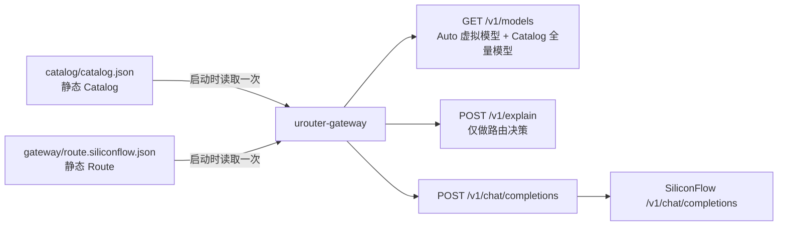
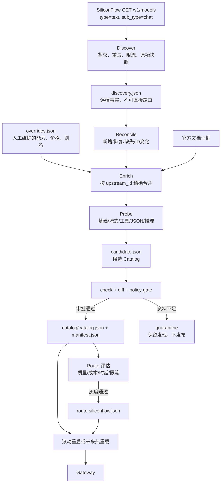
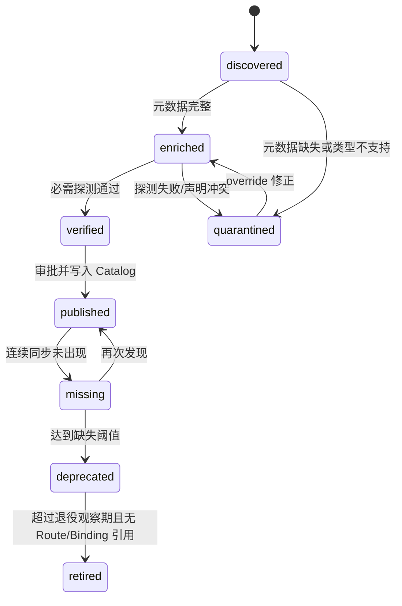

# uRouter SiliconFlow 模型同步与发布方案

## 1. 结论

SiliconFlow 的 `GET /v1/models` 适合做“模型发现”，不适合直接生成生产 Catalog，更不能直接进入 `urouter/auto` 路由。该接口主要返回模型 ID，缺少 uRouter 做准入和计费所需的上下文窗口、最大输出、工具调用、结构化输出、推理格式、流式 usage、价格和生命周期证据。

建议把模型管理拆成四层：

1. **远端发现层**：定时获取 SiliconFlow 当前可见的 chat 模型，保留原始快照。
2. **事实补全层**：用人工 override、官方资料和低成本探测补全能力、兼容性及价格。
3. **Catalog 发布层**：只把资料完整且验证通过的模型合并进 `catalog/catalog.json`。
4. **Route 发布层**：再从 Catalog 中选择少量模型加入 `gateway/route.siliconflow.json`，经过影子流量和灰度后启用。

推荐策略是“自动发现、自动差异、半自动验证、人工审批路由”。这能同步大量模型，同时避免错误能力声明、错误计费和新模型自动承接生产流量。

## 2. 当前实现分析

### 2.1 当前数据流



当前行为：

- `catalog/catalog.json` 中有 7 个真实模型，其中 SiliconFlow 模型 2 个。
- 网关 `/v1/models` 返回 8 项：1 个 `urouter/auto` 虚拟模型和 Catalog 中 7 个真实模型。
- 当前 Auto 路由只使用 `siliconflow/qwen2.5-7b-instruct` 与 `siliconflow/deepseek-r1-pro`。
- Catalog 与 Route 在进程启动时各读取一次，当前没有 Catalog/Route 热重载。
- 网关执行上游请求时只接受 `open_ai_chat`，所以首期只能同步 SiliconFlow 的 `type=text&sub_type=chat` 模型。Embedding、reranker、图片、音频和视频即使被发现，也不能由当前 chat 网关执行。
- 显式请求 Catalog 内任意 active 模型可以走 pinned 路径；加入 Catalog 会扩大 `/v1/models` 和显式调用面，但不会自动加入 `urouter/auto`。
- Route tier 可以有多个 deployment，但同一 tier 内所有 deployment 的能力声明必须与代表模型完全一致。这不适合作为任意模型池使用。

### 2.2 已有安全机制

当前项目已经具备可复用的发布基础：

- Catalog 强类型反序列化及语义校验。
- provider、model、alias、`provider + upstream_id + api` 唯一性校验。
- 非内置 provider 必须显式填写全部 compat 字段。
- `active/deprecated/retired` 生命周期；只有 active 模型参与能力准入。
- Catalog 的 content、pricing、capabilities、compat 分项哈希。
- `manifest.json` 防止 Catalog 文件与语义哈希漂移。
- `urouter-catalog check/diff/manifest` 和 `urouter-smoke` 探测工具。
- Route 启动校验、能力准入、重试、熔断和 fallback。

### 2.3 当前缺口

| 缺口 | 影响 |
|---|---|
| 没有 SiliconFlow discovery 命令 | 新模型只能手工复制 ID |
| 没有原始快照和连续缺失计数 | 无法区分暂时接口异常和模型下线 |
| `/v1/models` 元数据不足 | 无法自动生成可靠的 Capabilities/Compat/Cost |
| 探测器从 Catalog 声明决定测什么 | 未知新模型无法先探测再生成 Catalog，存在循环依赖 |
| 没有候选/隔离状态 | “已发现”和“可生产调用”混在一个文件中 |
| 没有 Catalog/Route 热重载 | 同步发布后必须重启网关 |
| `/v1/models` 暴露 Catalog 全量模型 | Catalog 收录大量候选会扩大客户端可见范围 |
| Route tier 是静态配置 | 新模型不会自动参加 Auto 路由，这一点是安全的，但需要独立发布流程 |

## 3. SiliconFlow 接口能够提供什么

官方模型列表接口：

```http
GET https://api.siliconflow.cn/v1/models?type=text&sub_type=chat
Authorization: Bearer ${SILICONFLOW_API_KEY}
```

典型响应只包含：

```json
{
  "object": "list",
  "data": [
    {
      "id": "Pro/deepseek-ai/DeepSeek-R1",
      "object": "model",
      "created": 0,
      "owned_by": ""
    }
  ]
}
```

接口支持按 `type=text|image|audio|video` 和 `sub_type=chat|embedding|reranker|...` 过滤。官方也说明模型可能上下线或调整服务能力。因此：

- `id` 可以作为 `upstream_id` 的发现证据。
- `type/sub_type` 可以证明 API 大类，但不能证明细粒度能力。
- `created/owned_by` 不能用于推断价格、上下文或工具调用。
- 模型名称中的 `Pro`、`R1`、`VL`、参数规模只能用于生成待审核提示，不能作为生产事实。

官方参考：

- [SiliconFlow Get Model List](https://docs.siliconflow.cn/en/api-reference/models/get-model-list)
- [SiliconFlow Chat Completions](https://docs.siliconflow.cn/en/api-reference/chat-completions/chat-completions)
- [SiliconFlow JSON mode](https://docs.siliconflow.cn/en/userguide/guides/json-mode)

## 4. 目标架构



核心原则：Catalog 是经过验证的事实库，Route 是经过运营审批的流量策略。二者不能由一次远端列表请求同时改写。

## 5. 建议的数据文件

建议新增以下目录；密钥始终只从环境变量读取：

```text
catalog/providers/siliconflow/
  discovery.json          # 最近一次成功发现的标准化结果
  discovery-history/      # 可选，按日期保存压缩快照或只保留最近 N 份
  overrides.json          # 人工审核的能力、兼容性、价格及别名
  probe-results.json      # 最近验证结果、延迟和失败原因
  sync-state.json         # first_seen/last_seen/missing_count/status
  candidate.json          # 本轮生成结果，不直接供网关读取
  sync-report.json        # 本轮 diff 和 gate 结果
```

`overrides.json` 应以不易变化的 `upstream_id` 为主键：

```json
{
  "schema_version": 1,
  "models": {
    "Pro/deepseek-ai/DeepSeek-R1": {
      "canonical_id": "siliconflow/deepseek-r1-pro",
      "name": "DeepSeek R1 Pro (SiliconFlow)",
      "api": "open_ai_chat",
      "cost": {
        "currency": "CNY",
        "input_per_million": "4",
        "output_per_million": "16",
        "source": "official-pricing-url",
        "checked_at": "YYYY-MM-DD"
      },
      "capabilities": {
        "context_window": 32768,
        "max_output_tokens": 8192,
        "input_modalities": ["text"],
        "tool_calling": true,
        "structured_output": false,
        "reasoning": "boolean"
      },
      "compat_profile": "siliconflow_reasoning_openai_chat",
      "approval": {
        "status": "approved",
        "owner": "model-platform",
        "reviewed_at": "YYYY-MM-DD"
      }
    }
  }
}
```

生产 Catalog 仍使用 USD/百万 token。若官方价格是 CNY，必须同时保存汇率值、汇率日期和来源；不能只保存换算后的 USD 数字，否则后续无法审计。

## 6. 同步状态机

每个远端 `upstream_id` 使用以下状态，而不是发现即 active：



建议默认阈值：

- 单次列表请求失败：整轮失败，不改变任何模型状态。
- 模型连续 3 次成功同步都未出现：标记 `missing`，告警但不删除。
- 连续缺失 24 小时或 3 个日周期：生成 `deprecated` 变更，需审批。
- deprecated 保留至少 30 天后才允许 retired。
- 永不自动物理删除模型条目；历史 DecisionRecord 依赖模型 ID 和 Catalog 哈希追溯。
- Route 正在引用或仍有有效 task/session binding 时，禁止 retired。

## 7. 同步算法

### 7.1 Discover

1. 读取 `SILICONFLOW_API_KEY`，日志中只记录变量名，不记录值。
2. 请求 `GET /v1/models?type=text&sub_type=chat`。
3. 对 429、503、504 指数退避并尊重 `Retry-After`；401/403 立即失败。
4. 校验响应 `object=list`、`data` 为数组、ID 非空且无控制字符。
5. 按 ID 排序、去重，计算 SHA-256，原子写入 discovery 快照。
6. 只有完整成功响应才进入 reconcile；超时或解析错误不得把“空列表”当作全量下线。

### 7.2 Reconcile

按 `upstream_id` 做集合比较：

- `remote - known`：新增发现，进入 discovered/quarantined。
- `remote ∩ known`：更新 last_seen，清零 missing_count。
- `known - remote`：missing_count + 1，不立即从 Catalog 删除。
- ID 大小写或前缀变化按不同模型处理，除非 override 显式声明 alias/migration。

本地 canonical ID 必须一经发布保持稳定。不要每次从显示名重新 slug。新模型可先生成候选 ID，例如 `siliconflow/<规范化名称>-<8位ID哈希>`，由 reviewer 在首次发布前确定友好 ID；发布后 mapping 固化。

### 7.3 Enrich

优先级从高到低：

1. 针对精确 `upstream_id` 的人工 override。
2. SiliconFlow 官方模型详情或 API 文档。
3. 真实 API 探测得到的兼容性事实。
4. 家族模板，仅用于生成候选，不得单独越过发布 gate。

价格、能力和 compat 分开记录来源及日期。不能因为同属 Qwen/DeepSeek 家族就复制上下文、工具能力或推理格式。

### 7.4 Probe

现有 `urouter-smoke` 需要模型先存在于 Catalog，建议增加 discovery probe 模式：直接接收 provider、upstream ID 和候选 profile，而不是要求已发布模型。

最低探测矩阵：

| 探测 | 验证内容 | 通过条件 |
|---|---|---|
| basic | chat 请求、响应结构、finish_reason | HTTP 200 且有 assistant content |
| stream | SSE 与 `[DONE]` | chunk 可解析，声明支持时存在 usage |
| tools | `tool_choice=required` | 返回标准 `tool_calls`，不能把伪函数文本算通过 |
| JSON | `response_format` | 返回可解析 JSON；格式与 compat 声明一致 |
| reasoning | `enable_thinking`/reasoning_content | 请求字段被接受且响应格式与声明一致 |
| limits | 小样本 max_tokens/上下文边界 | 错误码和字段行为可预测 |
| stability | 连续多次基础请求 | 成功率、P95 延迟满足阈值 |

探测必须有每轮 token/费用上限，默认只对新增或事实发生变化的模型执行。能力探测失败时采用保守值 `false/unsupported`，不能因为 basic 成功就声明工具或推理支持。

### 7.5 Generate 与 Gate

只有满足以下条件的模型才能进入 candidate Catalog：

- 是 `text/chat` 模型，`api=open_ai_chat`。
- provider、endpoint 和鉴权 profile 已知。
- context window 与 max output 都有证据且合法。
- 所有 compat 字段完整。
- 价格已确认；免费模型也需要官方或 override 证据，不能把“未知”写成 0。
- basic 探测通过，所有声明为 true 的能力探测通过。
- canonical ID、alias 与现有 Catalog 无冲突。

发布 gate：

```text
discover -> reconcile -> enrich -> probe
         -> generate candidate
         -> urouter-catalog check candidate
         -> urouter-catalog diff current candidate
         -> policy check
         -> reviewer approval
         -> atomic replace catalog + manifest
```

Policy check 至少阻断：价格下降/上涨超过阈值、能力降级、active 模型消失、Route 引用失效、alias 冲突、未知价格被填 0、探测证据过期。

## 8. Route 发布策略

Catalog 同步与 Route 同步必须是两个独立动作：

- 新模型加入 Catalog 后默认只能显式 pinned 调用，不能自动进入 `urouter/auto`。
- Route 候选需单独进行质量、中文能力、工具调用、TTFT、P95、成功率、429 率及单位任务成本评估。
- 首先使用测试 tenant 或 1% 影子/灰度流量；达到门槛后再提高权重。
- 同一 tier 的 deployment 要求能力完全相同，因此只有能力声明完全一致的模型才能放在同一 tier。否则应新增 tier 或扩展 Route 数据结构。
- efficient、balanced、capable、reasoning 建议是运营分层，不应简单按参数量或模型名自动推断。
- 任何 Route 修改都必须先执行 `route.validate(candidate_catalog)`，再做 `/v1/explain` 回归矩阵和真实 SDK 冒烟测试。

一个新模型的 Route 候选示意：

```json
{
  "tier": "balanced",
  "model": "siliconflow/example-model",
  "fallbacks": ["capable"]
}
```

这只是审批后的目标配置，不应由 discovery 自动生成并直接发布。

## 9. CLI 设计

建议扩展 `urouter-catalog`，而不是引入独立脚本语言，复用 Rust 类型、校验与哈希：

```powershell
# 只发现和生成报告，不改生产 Catalog
cargo run -q -p urouter-catalog -- sync siliconflow `
  --mode discover `
  --type text `
  --sub-type chat

# 对新增/变化模型做受预算约束的探测
cargo run -q -p urouter-catalog -- probe siliconflow `
  --changed-only `
  --max-models 10 `
  --max-cost-usd 1.00

# 生成候选 Catalog
cargo run -q -p urouter-catalog -- sync siliconflow `
  --mode candidate `
  --output catalog/providers/siliconflow/candidate.json

# 校验和审查差异
cargo run -q -p urouter-catalog -- check catalog/providers/siliconflow/candidate.json
cargo run -q -p urouter-catalog -- diff `
  catalog/catalog.json `
  catalog/providers/siliconflow/candidate.json

# 明确审批后发布；内部应原子写 Catalog 和 manifest
cargo run -q -p urouter-catalog -- publish siliconflow `
  --candidate catalog/providers/siliconflow/candidate.json `
  --approval-id CHANGE-1234
```

`sync` 默认必须 dry-run。只有 `publish` 可以改生产文件，并且 publish 需要：候选哈希、审批 ID、无阻断 gate、Catalog 与 Route 联合校验全部通过。

## 10. 网关需要的改造

### P0：无需改网关即可落地

- 实现 discovery/candidate/publish 工具。
- 继续使用静态 Catalog 与显式网关重启。
- 新模型只加入 Catalog，不自动修改 Route。
- 同步后用现有 `/v1/models`、`/v1/explain` 和 OpenAI SDK 验证。

### P1：控制可见性与安全发布

- 为 ModelSpec 增加 `visibility` 或单独 publication 状态，区分 `cataloged`、`explicit`、`route_eligible`。
- `/v1/models` 默认只列 published/explicit 模型；管理接口可查看 quarantined/discovered。
- 增加 `GET /v1/models/{id}`，返回来源、验证时间和生命周期，但不返回密钥。
- 增加 admin-only Catalog sync status 和 diff 查询。

### P2：安全热重载

- 将 `AppState.catalog/route` 改成原子快照（例如 `ArcSwap` 或受控 `RwLock<Arc<...>>`）。
- 加载新 Catalog 和 Route 到临时对象，完成联合校验后一次性交换。
- 请求开始时固定一个 catalog hash 和 route revision，整个请求/重试/fallback 使用同一快照。
- reload 失败保留旧快照，记录错误指标；绝不能部分更新。
- reload 后重新注册 capacity/circuit deployment，并处理被移除模型的 binding。

热重载不是首期同步的前置条件。先使用滚动重启更容易保证一致性。

## 11. 定时任务与可观测性

推荐调度：

- 每 6 小时 discover，仅远端读取和写快照。
- 每日生成 diff 和告警。
- 新模型或事实变化时触发受预算限制的 probe。
- 每周人工审核价格与能力证据。
- Catalog/Route 发布由变更单触发，不按定时任务自动执行。

关键指标：

- `catalog_sync_success{provider}`
- `catalog_sync_last_success_timestamp`
- `catalog_discovered_models`
- `catalog_new_models`
- `catalog_missing_models`
- `catalog_quarantined_models`
- `catalog_probe_success_rate{model,check}`
- `catalog_fact_age_days{model,category}`
- `catalog_publish_revision` / `catalog_content_hash`
- `route_model_requests_total{model,tier,outcome}`
- `route_model_latency_seconds{model,tier}`
- `route_model_cost_usd_total{model}`

告警条件包括：整轮同步失败、模型数量突降超过 20%、Route 引用模型 missing、价格变化、能力回退、连续 401/403、probe 成功率下降。

## 12. 安全与一致性要求

- API Key 只放 `SILICONFLOW_API_KEY`，不写入命令参数、JSON、报告、日志或 Git。
- discovery 原始响应按不可信输入处理，限制响应大小、模型数、ID 长度。
- 写文件采用同目录临时文件 + fsync + rename，保证 Catalog 与 manifest 成对发布。
- 同步任务使用单实例锁，避免两个任务交叉覆盖。
- 每次发布保留 old hash/new hash、远端快照 hash、override hash、probe report hash 和审批 ID。
- Catalog 发布失败或网关启动校验失败时立即回滚到上一完整 revision，而不是手工拼接 JSON。
- 不把上游 404 立即解释为模型永久下线；需要连续成功发现的缺失证据。

## 13. 测试方案

### 单元测试

- 远端列表乱序、重复 ID、空 ID、未知字段、超大响应。
- 新增/恢复/缺失/连续缺失状态转换。
- override 精确合并、未知字段拒绝、canonical ID 稳定。
- 候选生成可重复：相同输入产生相同 JSON 和 hash。
- 未知价格不会被默认成 0。
- 失败同步不会更改 last-good discovery 和 Catalog。

### 集成测试

- fixture `/v1/models` 返回 200、401、429、503、超时、半截 JSON。
- `Retry-After` 和指数退避。
- candidate 通过 `CatalogSnapshot` 校验。
- Catalog + Route 联合校验。
- publish 中途失败仍保持旧 Catalog/manifest 完整。
- gateway 重启后 `/v1/models` 数量及模型 ID 符合预期。

### 回归测试

- 当前 84 个 workspace 测试继续通过。
- 当前智能路由 explain 矩阵不变。
- OpenAI SDK 的简单问候、hard equation、tool weather、stream、fallback 全部通过。
- 新模型显式 pinned 调用成功，但在 Route 审批前不会被 Auto 选择。

## 14. 分阶段实施计划

| 阶段 | 工作量估计 | 交付物 | 验收标准 |
|---|---:|---|---|
| P0.1 发现 | 1-2 天 | sync 子命令、快照、diff、状态文件 | 可稳定发现 text/chat，失败不污染状态 |
| P0.2 补全 | 2-4 天 | override schema、候选生成、policy gate | 未知事实不能进入 active Catalog |
| P0.3 探测 | 2-4 天 | discovery probe、预算控制、报告 | 工具/JSON/推理声明都有实测证据 |
| P0.4 发布 | 1-2 天 | 原子 publish、manifest、审计信息 | Catalog/manifest 一致，可回滚 |
| P1 路由灰度 | 2-3 天 | benchmark、灰度配置、告警 | 新模型不会未经审批承接 Auto 流量 |
| P2 热重载 | 3-5 天 | 原子快照切换、revision 指标 | 并发请求不跨 Catalog revision |

建议先完成 P0，不把热重载和全类型模型支持塞进第一版。当前网关只能执行 chat completion，先把 text/chat 的生命周期做正确，再扩展 embedding、reranker 和多媒体 Wire API。

## 15. 当前立即加入一个模型的手工流程

在自动同步实现前，可以按以下安全流程接入单个 SiliconFlow chat 模型：

1. 从 `GET /v1/models?type=text&sub_type=chat` 确认精确 upstream ID。
2. 从官方模型页确认价格、上下文和支持参数，记录 URL 与检查日期。
3. 在 Catalog 中添加完整 ModelSpec，provider 复用 `siliconflow`，`api` 使用 `open_ai_chat`。
4. 对不确定能力先填保守值；不能把未知价格写成免费。
5. 更新 manifest，运行 `urouter-catalog check` 和 workspace tests。
6. 使用 `urouter-smoke --model <canonical-id>` 做真实 API 探测。
7. 重启网关，检查 `/v1/models` 与显式 pinned 请求。
8. 若需要 Auto 路由，再单独修改 Route、执行 explain 回归和 SDK E2E，最后灰度发布。

这套流程保证“同步更多可见模型”“允许客户端显式使用”和“让 Auto 自动选中”是三个独立、可审计的权限边界。
