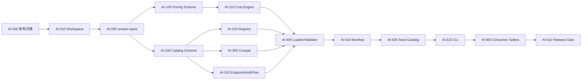

# uRouter `urouter-ai` Task 级迭代计划

> 日期：2026-08-25  
> 状态：MVP 已完成；两个本地真实端点已通过自动 smoke，付费云端 smoke 为可选外部验证  
> 目标：优先交付可被 Gateway、Capacity、Feedback 共同消费的模型事实内核  
> 计划口径：1 名熟悉 Rust 的工程师；估时为净工程日，不含外部审批和等待时间

---

## 1. 可行性结论

**优先实现 `urouter-ai` 可行，并且比直接开工完整 Gateway 更合理。**

理由：

1. 能力过滤、上下文校验、实际成本核算、协议选择和 endpoint 解析都依赖模型事实。
2. `DecisionRecord` 和未来训练数据必须从第一天携带可复现的目录版本与价格来源。
3. 先冻结事实 schema，可以减少 Gateway、Capacity、Feedback 各自发明模型结构造成的返工。
4. 目录与计价大部分可以做成纯函数，适合独立测试和提前稳定。

但“优先完成”必须满足两个条件：

- **不是孤立完成完整版**：每个迭代都要有 CLI 或最小 consumer 验证，避免产出无人使用的目录框架。
- **不是照原范围全部实现**：OAuth、动态刷新、跨 provider handoff、86 厂商目录和 PyO3 不进入首轮关键路径。

建议决策：

| 方案 | 判断 | 原因 |
|---|---|---|
| 先完成 `urouter-ai` MVP，再做 Gateway | **推荐** | 稳定模型事实、能力和实际成本契约 |
| 完整实现原设计的全部 `urouter-ai` 后再做其他模块 | 不推荐 | 反馈周期过长，易过度抽象 |
| 先做 Gateway，模型事实暂时写死 | 不推荐 | 未来会重写配置、记录和过滤契约 |
| `urouter-ai` 与完整 M0 所有 crate 同时展开 | 不推荐 | 当前无实现骨架，边界变化和集成风险过大 |

---

## 2. 首轮范围

## 2.1 必须交付

- Rust workspace 与最小公共类型 crate。
- 稳定 ID：provider、model、API、catalog version。
- `ProviderSpec`、`ModelSpec`、`Capabilities`、`Compat`。
- `Usage`、`ModelCost`、阶梯计价和缓存计价纯函数。
- 静态目录加载、索引、校验、manifest 和来源追踪。
- 3 个经过验证的 provider/model fixture。
- API key 认证计划、endpoint 模板解析和 header 合并纯逻辑。
- 自定义 provider 必须显式声明 compat。
- `catalog check/show/cost` CLI。
- 给 Capacity、Gateway、DecisionRecord 使用的窄接口。
- 单元、属性、fixture、schema 和兼容性测试。

## 2.2 明确延后

- OAuth、AWS profile、gcloud ADC。
- Redis 跨实例凭证刷新锁。
- 动态 `/v1/models` 刷新、ETag 和模型退休状态机。
- 跨 provider 消息 handoff。
- OpenAI/Anthropic wire translation 与 HTTP client。
- PyO3 和 Python 包装。
- 从 models.dev 自动导入全部厂商。
- 企业控制台、管理 HTTP API。
- `ModelProfile` 的任务适配分数和路由效用。

## 2.3 关键边界修正

`urouter-ai` 只保存事实，不保存策略判断：

```text
属于 urouter-ai：
  模型 ID、provider、API、价格、上下文、模态、工具能力、协议怪癖

不属于 urouter-ai：
  “适合编码 0.92”、efficient/balanced/capable、任务成功率、偏好权重
```

后者应放入未来的 `urouter-policy` / `urouter-decide` 工件，引用 `ModelSpec`，否则目录更新会与训练策略更新互相污染。

---

## 3. 建议模块边界

```text
uRouter/
├── Cargo.toml
├── crates/
│   ├── urouter-types/              # 最小稳定值对象，无 I/O
│   │   ├── ids.rs
│   │   ├── usage.rs
│   │   ├── money.rs
│   │   └── api.rs
│   └── urouter-ai/
│       ├── catalog/
│       │   ├── spec.rs
│       │   ├── registry.rs
│       │   ├── loader.rs
│       │   └── validate.rs
│       ├── pricing/
│       │   ├── model.rs
│       │   └── calculate.rs
│       ├── capabilities.rs
│       ├── compat.rs
│       ├── endpoint.rs
│       ├── auth.rs                 # AuthSpec/AuthPlan，不直接读环境
│       └── projection.rs           # /v1/models 所需中立投影
├── catalog/
│   ├── schema/
│   ├── fixtures/
│   ├── providers/
│   └── manifest.json
└── tools/
    └── urouter-catalog/
```

### 为什么先建 `urouter-types`

`urouter-ai` 需要稳定的 ID、API 枚举、Usage 和金额类型；后续 Gateway、Capacity、Feedback 也需要这些类型。如果它们直接定义在 `urouter-ai` 内，其他 crate 会为了一个 `ModelId` 被迫依赖整个目录模块。

`urouter-types` 必须保持极小，不包含网络、文件、时钟和异步运行时依赖。

### 金额类型要求

原文使用 `f64` 计算美元，不适合作为账务和训练标签的权威表示。首轮应采用：

- 目录费率：定点十进制，例如 `Decimal` 或明确精度的整数。
- 计算结果：`MoneyMicrousd(i128)` 或等价 checked decimal。
- 展示和指标边界才转换为浮点数。
- 所有乘法使用 checked arithmetic，溢出返回类型化错误。

---

## 4. 依赖关系



严格关键路径：

```text
AI-000 -> AI-010 -> AI-020 -> AI-200 -> AI-400
       -> AI-410 -> AI-500 -> AI-510 -> AI-600 -> AI-610
```

---

## 5. Iteration 0：契约冻结与工程骨架

目标：在写目录数据前，冻结事实/策略边界和基础数值语义。

预计：3-4 工程日。

### AI-000：记录架构决策

估时：0.5 天。

产出：

- `docs/adr/0001-catalog-facts-vs-policy.md`
- `docs/adr/0002-money-and-pricing-precision.md`
- `docs/adr/0003-catalog-versioning.md`

必须确认：

- `ModelSpec` 只包含可验证事实。
- tier、workload suitability、质量分不进入目录。
- actual cost 与 counterfactual estimate 使用不同类型。
- 静态 catalog 是首轮唯一权威源。

验收：ADR 明确列出 accepted、rejected alternatives 和迁移影响。

### AI-010：初始化 Rust workspace

依赖：AI-000。估时：0.5 天。

任务：

- 建根 `Cargo.toml` workspace。
- 创建 `urouter-types`、`urouter-ai`、`urouter-catalog` CLI。
- 固定 Rust edition、MSRV、format、clippy 和 test 命令。
- 加入依赖审计和最小依赖策略。

验收：

- `cargo fmt --check`
- `cargo clippy --workspace --all-targets -- -D warnings`
- `cargo test --workspace`

### AI-020：实现最小公共类型

依赖：AI-010。估时：1.5 天。

任务：

- newtype：`ProviderId`、`ModelId`、`CatalogHash`。
- `WireApi`：首轮只含 `OpenAiChat`、`OpenAiResponses`、`AnthropicMessages`、`Custom`。
- `Usage`：input/output/cache_read/cache_write/reasoning。
- `MoneyMicrousd` 和定点费率类型。
- ID 解析、规范化、显示与 serde。

验收：

- 非法空 ID、控制字符和歧义分隔符被拒绝。
- 金额加乘溢出被拒绝，不发生 wrap。
- serde round-trip 和固定 fixture 通过。
- crate 不依赖 Tokio、HTTP、文件系统封装或时钟库。

### AI-030：定义错误分类

依赖：AI-020。估时：0.5 天。

任务：

- `CatalogError`
- `ValidationError`
- `PricingError`
- `EndpointTemplateError`
- 错误携带字段路径和稳定 code，不携带 secret。

验收：错误可序列化为 CLI/未来 HTTP API 共用的机器可读结构。

### Iteration 0 Go/No-Go

满足以下条件才进入下一轮：

- 事实与策略边界已书面冻结。
- 金额不使用 `f64` 作为权威值。
- 公共类型无 I/O 依赖。
- 关键 schema 变更必须走 ADR。

---

## 6. Iteration 1：计价内核与模型事实 schema

目标：完成 `urouter-ai` 最稳定、最值得优先实现的纯函数内核。

预计：7-9 工程日。

### AI-100：定义计价 schema

依赖：AI-020。估时：1 天。

任务：

- `CostRates`
- `CostTier`
- `ModelCost`
- `LongCacheWriteRule`
- `CostBreakdown`
- `PriceSource`：catalog/override。
- 费率币种与计价单位显式化。

验收：

- 禁止负价格、重复阈值、未排序阶梯和不完整费率。
- cache write long 不得超过 cache_write usage。
- schema 能表达“超过阈值后整次请求换价”，不假设分段累进。

### AI-110：实现实际成本计算器

依赖：AI-100。估时：2 天。

任务：

- 纯函数 `calculate_actual_cost()`。
- 阶梯匹配。
- input/output/cache read/cache write 分列。
- checked arithmetic。
- 返回命中的 price tier 和 price source。

验收测试：

- 阈值前、等于阈值、阈值后一 token。
- 多阶梯取最高匹配项。
- 无缓存、短缓存、长缓存、混合缓存。
- usage 为零。
- 最大允许 token 与金额边界。
- 目录覆盖价格可审计。

### AI-120：定义反事实成本估计类型

依赖：AI-110。估时：0.5 天。

任务：

- `CounterfactualCostEstimate` 与 actual cost 分开。
- 记录 method、assumptions、可选区间。
- 首轮仅提供 `same_usage_reprice`，名称明确表明是假设估计。

验收：API 不允许把估计值隐式转换为 actual cost。

### AI-130：跨语言 golden vectors

依赖：AI-110。估时：1 天。

任务：

- 建立 JSON golden fixture。
- 至少 30 个计价样本。
- fixture 含输入、模型价格、精确期望分项和命中阶梯。
- 为未来 PyO3/其他 SDK 提供共同测试向量。

验收：所有结果逐微美元一致，不使用近似浮点断言。

### AI-200：定义 Provider/Model schema

依赖：AI-020。估时：1.5 天。

任务：

- `ProviderSpec`
- `ModelSpec`
- `CatalogSourceMeta`
- `Capabilities`
- `PromptCacheSupport`
- `ThinkingSupport`
- `LifecycleStatus`：active/deprecated/retired。

需要补充的事实字段：

- 数据来源 URL/文件、抓取时间、人工验证时间。
- `effective_from` 或价格生效时间。
- 事实置信等级：official/verified/community/override。
- model alias 与 canonical ID 分开。

验收：

- schema 不包含 tier、质量分或 workload 排名。
- context window、max output 和模态约束可校验。
- 同一模型不同 API 可以建成不同 variant，而非互相覆盖。

### AI-210：实现不可变 Catalog 与索引

依赖：AI-200。估时：1.5 天。

任务：

- 构建后不可变的 `CatalogSnapshot`。
- canonical ID、provider/model/API 三元索引。
- alias 解析返回 canonical ID 和来源。
- 禁止读路径触发 I/O 或懒加载。

验收：

- 重复 canonical ID 启动失败。
- alias 冲突启动失败。
- 查询结果顺序确定，确保 manifest 可复现。
- 多线程并发读测试通过。

### Iteration 1 Go/No-Go

- 可以仅凭 fixture 精确复算实际调用成本。
- Catalog 是不可变快照，读取无 I/O。
- schema 中没有混入路由策略。
- 计价和目录单测覆盖率达到 90% 以上的分支覆盖目标。

---

## 7. Iteration 2：Compat、Endpoint 与目录校验

目标：让目录从数据结构变成可验证、可消费的连接事实。

预计：7-9 工程日。

### AI-300：定义首轮 Compat schema

依赖：AI-200。估时：1.5 天。

首轮字段只覆盖直接影响请求成功和数据质量的项目：

- token limit 字段映射。
- streaming usage 支持。
- finish reason 支持。
- developer/system role 支持。
- tool calling 和 tool result 约束。
- structured output 方式。
- reasoning/thinking 参数格式。
- prompt cache 与 session affinity 声明。

验收：

- 内置 provider 可引用已验证 compat preset。
- custom provider 必须显式声明所需字段。
- `unknown` 与 `false` 是不同状态；未知不能伪装成不支持。

### AI-310：实现 EndpointTemplate

依赖：AI-200。估时：1 天。

任务：

- 编译期/加载期解析 `{var}`。
- 输出所需变量集合。
- 禁止未解析占位符进入运行时 URL。
- URL scheme/host/path 基础校验。

验收：

- 缺变量、重复/非法变量、非法 URL 产生字段级错误。
- secret 不进入错误字符串。
- localhost 免认证不能仅由字符串前缀判断，必须使用明确配置。

### AI-320：定义 AuthSpec 与 AuthPlan

依赖：AI-310。估时：1 天。

任务：

- `AuthSpec` 只描述认证要求。
- `AuthPlan` 描述需要从哪个 credential source 取值。
- `CredentialResolver` trait 留给 Gateway/runtime 实现。
- 首轮实现 API key 和 explicit none。

验收：

- `urouter-ai` 核心不直接读取环境变量。
- 错误和 Debug 输出不包含 key。
- remote endpoint 配置 `none` 默认拒绝，必须显式允许。

### AI-330：实现 HeaderPlan 合并

依赖：AI-320。估时：1 天。

任务：

- 大小写不敏感合并。
- 固定 provider -> model -> auth -> request 的优先级。
- 禁止 request 默认覆盖 `Authorization`、Host 等保护字段。
- 为受控 transform 预留显式 hook，不接受任意闭包进入事实结构。

验收：冲突、重复头、保护头和脱敏 snapshot 测试通过。

### AI-400：实现 loader 和 validator

依赖：AI-110、AI-210、AI-300、AI-330。估时：2 天。

任务：

- JSON/YAML 二选一作为权威输入；建议首轮只选一种。
- 完整字段路径错误。
- 聚合报告全部错误，而不是遇到第一项退出。
- schema version 与向后兼容入口。

至少校验：

- 引用存在性与唯一性。
- 价格完整性和阶梯规则。
- 能力数值关系。
- compat 是否完整。
- endpoint 变量是否声明。
- auth 与 endpoint 安全组合。
- alias 和生命周期冲突。

### AI-410：可复现 manifest

依赖：AI-400。估时：1.5 天。

任务：

- canonical serialization。
- 内容 hash 与 schema version。
- 每个源文件 hash。
- `generated_at` 不进入 structure/content hash。
- 价格或能力任何变化都会改变 content hash。

建议拆分：

```json
{
  "schema_version": 1,
  "content_hash": "sha256:...",
  "compat_hash": "sha256:...",
  "pricing_hash": "sha256:...",
  "files": {}
}
```

拆分 hash 能让工件判断“只是价格变化”还是“候选能力结构变化”，避免所有变更都只能发同一种 warning。

### Iteration 2 Go/No-Go

- 无法材料化的 endpoint 在加载期失败。
- 自定义 provider 的关键 compat 未声明时失败。
- secret 不进入目录 snapshot、hash 或错误。
- 同一输入在不同机器生成相同 content hash。

---

## 8. Iteration 3：种子目录、CLI 与真实验证

目标：用少量真实模型验证 schema，而不是追求目录数量。

预计：6-8 工程日。

### AI-500：选择种子矩阵

依赖：AI-410。估时：0.5 天。

选择 3 个有代表性的接入：

1. 标准 OpenAI-compatible 云 API。
2. Anthropic Messages 风格 API。
3. 自建或本地 OpenAI-compatible endpoint。

每类至少一个模型，覆盖：

- tool calling。
- streaming usage 有/无。
- structured output。
- prompt cache。
- 至少一个阶梯或特殊缓存费率 fixture。

种子选择应以 AionUI 首个集成切片实际使用的模型为准，不为目录完整性选择无用户的 provider。

### AI-510：录入并验证种子目录

依赖：AI-500。估时：2 天。

任务：

- 每个事实记录官方来源和验证日期。
- 价格 fixture 与官方计算样例交叉验证。
- compat 不确定项标 `unknown`，不得猜测为 true。
- 自建 endpoint fixture 不包含真实内网地址或 key。

验收：目录校验全通过；每个模型都有完整来源记录和成本测试。

### AI-520：实现 `urouter-catalog` CLI

依赖：AI-510。估时：2 天。

命令：

```text
urouter-catalog check <path>
urouter-catalog show <model-id>
urouter-catalog list [--provider ...] [--capability ...]
urouter-catalog cost <model-id> --usage usage.json
urouter-catalog diff <old> <new>
urouter-catalog manifest <path>
```

验收：

- 默认输出适合人读，`--json` 提供稳定机器格式。
- `check` 一次报告所有错误。
- `diff` 区分 pricing/capability/compat/lifecycle 变化。
- CLI 日志不输出认证材料。

### AI-530：真实端点 smoke harness

依赖：AI-510。估时：1.5 天。

范围：测试工具，不放进 `urouter-ai` 核心。

任务：

- 对显式配置的测试端点发送最小非流式请求。
- 可选检查 streaming usage、tool call 和 structured output。
- 实际 usage 通过 cost engine 计算。
- 默认只在人工/受控 CI 环境运行，不消耗普通单测费用。

验收：至少 2 个不同协议端点通过；失败能定位到 catalog、compat、auth plan 或 upstream。

### AI-540：目录变更工作流

依赖：AI-520。估时：1 天。

任务：

- 新模型 PR 模板。
- 来源、价格、能力、compat 和测试证据检查单。
- 自动 manifest/diff 检查。
- 价格变更审阅规则。

验收：新增一个 fixture 模型无需改 Rust 代码；CI 能展示语义 diff。

### Iteration 3 Go/No-Go

- 至少 3 类代表性 endpoint 的 schema 能力得到验证。
- 新增模型只改目录数据和 fixture。
- CLI 可独立排查价格、能力和 compat。
- 尚未接入 Gateway 之前，模块已经有真实 consumer。

---

## 9. Iteration 4：下游接口与首个纵向切片

目标：证明 `urouter-ai` 的边界能支撑真实 uRouter，而不是只完成目录工具。

预计：6-8 工程日。

### AI-600：Capability Gate consumer spike

依赖：AI-520。估时：1.5 天。

实现一个临时/最小 consumer：

```rust
pub fn eligible_models(
    catalog: &CatalogSnapshot,
    requirement: &CapabilityRequirement,
) -> Result<Vec<ModelVariantRef>, AdmissionError>;
```

验证：

- 视觉请求自动排除非视觉模型，而不是要求 Auto 能力取所有模型交集。
- context window、tool calling、structured output 均为硬门。
- 返回详细排除原因。

### AI-610：Deployment 引用验证 spike

依赖：AI-520。估时：1 天。

定义最小 Deployment 配置，验证：

- 一个 ModelSpec 可被多个 deployment 引用。
- 部署只覆盖 quota、region、weight 和带 reason 的价格。
- 部署不得静默覆盖 capability/compat。
- 自定义覆盖进入 effective spec 和 price source。

### AI-620：DecisionRecord catalog envelope

依赖：AI-410。估时：1 天。

定义：

```rust
pub struct CatalogEvidence {
    pub schema_version: u16,
    pub content_hash: CatalogHash,
    pub pricing_hash: CatalogHash,
    pub model_id: ModelId,
    pub provider_id: ProviderId,
    pub api: WireApi,
    pub price_source: PriceSource,
}
```

验收：给定记录和对应 catalog snapshot，可以重算实际成本；缺 snapshot 时明确不可复现。

### AI-630：`/v1/models` 中立投影

依赖：AI-210。估时：1 天。

实现纯投影函数，不实现 HTTP server：

- 模型事实投影。
- baseline/routable/conditional 能力结构的数据基础。
- 不返回 UI 文案。
- 不把所有候选能力强制求交集。

### AI-640：API 稳定性与 semver review

依赖：AI-600 至 AI-630。估时：1 天。

任务：

- 检查公开类型是否泄漏 loader/serde 实现细节。
- 对未来动态 snapshot 和 Gateway 消费是否留有窄接口。
- 所有枚举决定是否 `non_exhaustive`。
- 生成 rustdoc 和最小使用示例。

### AI-650：发布候选与基准

依赖：AI-640。估时：1.5 天。

门禁：

- 1 万模型目录加载基准。
- 100 万次 catalog lookup/cost calculation 基准。
- 无 I/O 查询路径并发测试。
- fuzz：ID、endpoint template、catalog loader、cost boundary。
- 文档、schema、fixture 和 crate version 一致。

### Iteration 4 Go/No-Go

满足以下条件才宣布 `urouter-ai MVP` 完成：

- Capability、Deployment、DecisionRecord 三个独立 consumer 均无需复制模型事实。
- 公开 API 经过 semver review。
- 实际成本逐定点单位可复算。
- 目录读取路径无 I/O、无 secret、可并发。
- 完成种子目录真实 smoke 验证。

---

## 10. 总任务清单

| ID | Task | 依赖 | 估时 | 交付 |
|---|---|---|---:|---|
| AI-000 | 架构 ADR | - | 0.5d | 3 个 ADR |
| AI-010 | Rust workspace | AI-000 | 0.5d | workspace/CI |
| AI-020 | 公共 ID/Usage/Money | AI-010 | 1.5d | `urouter-types` |
| AI-030 | 类型化错误 | AI-020 | 0.5d | error schema |
| AI-100 | 计价 schema | AI-020 | 1d | pricing types |
| AI-110 | 实际成本引擎 | AI-100 | 2d | pure calculator |
| AI-120 | 反事实估计类型 | AI-110 | 0.5d | estimate contract |
| AI-130 | Golden vectors | AI-110 | 1d | JSON fixtures |
| AI-200 | Provider/Model schema | AI-020 | 1.5d | catalog spec |
| AI-210 | CatalogSnapshot/索引 | AI-200 | 1.5d | immutable registry |
| AI-300 | Compat schema | AI-200 | 1.5d | compat types |
| AI-310 | EndpointTemplate | AI-200 | 1d | template parser |
| AI-320 | AuthSpec/AuthPlan | AI-310 | 1d | auth contract |
| AI-330 | HeaderPlan | AI-320 | 1d | merge engine |
| AI-400 | Loader/Validator | 多项 | 2d | catalog loader |
| AI-410 | Manifest/hashes | AI-400 | 1.5d | reproducible manifest |
| AI-500 | 种子矩阵 | AI-410 | 0.5d | selected scope |
| AI-510 | 种子目录 | AI-500 | 2d | verified data |
| AI-520 | Catalog CLI | AI-510 | 2d | check/show/cost/diff |
| AI-530 | Endpoint smoke | AI-510 | 1.5d | smoke harness |
| AI-540 | 数据变更流程 | AI-520 | 1d | PR/CI workflow |
| AI-600 | Capability consumer | AI-520 | 1.5d | eligibility spike |
| AI-610 | Deployment consumer | AI-520 | 1d | deployment spike |
| AI-620 | Record envelope | AI-410 | 1d | evidence contract |
| AI-630 | Models projection | AI-210 | 1d | pure projection |
| AI-640 | API/semver review | consumers | 1d | public API freeze |
| AI-650 | Release gate/bench | AI-640 | 1.5d | MVP RC |

串行总量约 32 工程日。考虑评审、修复和真实端点验证，单人建议预留 **6-8 周**。两人协作可压缩到约 **4-5 周**，但 AI-000/020/200/400/640 仍是串行关键路径。

---

## 11. 每周建议节奏

| 周 | 目标 | 可演示结果 |
|---|---|---|
| Week 1 | Iteration 0 + Pricing schema | CLI fixture 能精确算一条成本 |
| Week 2 | Cost engine + Model schema | golden vectors、CatalogSnapshot 查询 |
| Week 3 | Compat + Endpoint/AuthPlan | 自定义 provider 配置可完整校验 |
| Week 4 | Loader + Manifest | catalog check/diff 可运行 |
| Week 5 | 种子目录 + 真实 smoke | 2-3 类真实 endpoint 验证 |
| Week 6 | 三个 consumer spike | capability/deployment/record 闭环 |
| Week 7 | fuzz、bench、API review | 发布候选 |
| Week 8 | 缓冲与文档 | MVP tag；必要时可提前结束 |

每周必须交付一个可运行演示，不能只提交类型定义。

---

## 12. 风险与控制

| 风险 | 概率 | 影响 | 控制 |
|---|:---:|:---:|---|
| 过早支持过多 provider | 高 | 高 | 首轮固定 3 类代表性端点 |
| schema 混入路由策略 | 中 | 高 | ADR + consumer review |
| 价格事实错误 | 中 | 高 | 官方来源、golden vector、双人 review |
| `f64` 累积误差 | 高 | 中 | 定点金额与 checked arithmetic |
| compat 字段无限膨胀 | 高 | 中 | 首轮只收直接影响成功/数据质量字段 |
| 没有 Gateway 导致过度抽象 | 中 | 高 | Iteration 4 三个 consumer spike |
| 目录 hash 语义不清 | 中 | 中 | content/pricing/compat 分 hash |
| secret 泄漏到 snapshot/log | 中 | 高 | AuthPlan 分离、脱敏测试、无真实 key fixture |
| 公共数据源滞后 | 高 | 中 | 来源与验证日期；不自动信任导入数据 |
| 动态刷新影响 API | 低 | 中 | MVP 只用不可变 snapshot，后续原子替换 |

---

## 13. `urouter-ai MVP` Definition of Done

功能：

- [x] 能加载、校验和索引静态目录。
- [x] 能表达 3 类真实 provider/API。
- [x] 能按硬能力查询候选模型。
- [x] 能材料化 endpoint/auth/header plan。
- [x] 能精确计算并分列实际成本。
- [x] 能生成稳定 manifest 和语义 diff。

正确性：

- [x] 金额权威值不使用浮点数。
- [x] actual 与 counterfactual 类型严格分离。
- [x] custom provider 的关键 compat 不得隐式猜测。
- [x] 目录 schema 不包含 tier/质量/任务适配分。
- [x] secret 不进入目录、错误、hash 和 fixture。

工程：

- [x] fmt/clippy/test 全通过。
- [x] loader、template、cost 完成 fuzz/property tests。
- [x] 查询路径无 I/O，CatalogSnapshot 不可变且可并发读。
- [x] 至少三个下游 consumer spike 通过。
- [x] CLI 和 rustdoc 足以让 Gateway 团队独立接入。

产品验证：

- [x] 种子目录与 AionUI 首个 Auto 切片的模型一致。
- [x] 真实请求 usage 可以被复算并写入 CatalogEvidence。
- [x] 视觉/工具/上下文要求能正确排除不合格模型。
- [x] 目录变更能显示其对价格、能力和兼容性的影响。

---

## 14. MVP 之后的下一步

> 2026-08-26 更新：下面的 Gateway M0 纵向切片已完成，并通过 8087/8094
> 两个本地 vLLM 端点的真实请求验证。实现与复现步骤见 `docs/gateway-m0.md`。

完成 `urouter-ai MVP` 后，不建议继续向 OAuth/86 provider 横向扩张。下一步应立即做一个 Gateway 纵向切片：

```text
请求解析
  -> CatalogSnapshot
  -> Capability Gate
  -> 固定规则选择一个模型
  -> 一个 OpenAI-compatible client
  -> streaming/non-streaming
  -> actual usage/cost
  -> DecisionRecord CatalogEvidence
```

这个切片跑通并获得真实流量后，再依据实际阻塞项选择：

1. provider 扩展；
2. 动态目录；
3. OAuth；
4. 跨 provider handoff；
5. PyO3；
6. 可训练路由。

Gateway M0 task 状态：

- [x] GW-000：定义 Auto route 与 tier 配置。
- [x] GW-010：从请求推导硬能力要求并执行 capability gate。
- [x] GW-020：实现确定性 tier 选择、pin/floor/bias/value_class 规则。
- [x] GW-030：实现 OpenAI-compatible 非流式和流式代理。
- [x] GW-040：实现 developer role、token 字段和模型 ID 改写。
- [x] GW-050：返回 headers/body/SSE 三种决策披露。
- [x] GW-060：记录 usage、实际成本、latency、admission 和 CatalogEvidence。
- [x] GW-070：用 Qwen3.5-4B:8087 与 Qwen3.8-27B:8094 做端到端验证。
- [x] GW-100：增加取消传播、全链路 timeout 分类和 retry budget。
- [x] GW-110：增加有界后台 JSONL、启动恢复、分页查询和文件轮转。
- [x] GW-120：实现独立/捎带反馈与单次覆盖校验，形成 paired sample 闭环。
- [x] GW-130：增加指标、并发真实请求、断流和 503 故障注入测试。
- [x] GW-200：定义 tier 内多 deployment 合同，支持 model/base URL/weight/order 并完成配置校验。
- [x] GW-210：实现进程内 CapacityManager，按健康、order 和 weight 选择部署并跟踪 in-flight。
- [x] GW-220：实现滚动失败窗口、cooldown 以及 Closed/Open/Half-Open 单探针状态机。
- [x] GW-230：可重试故障优先重选其他 deployment，单 deployment 保留有限重试保护。
- [x] GW-240：实现有向无环 tier fallback，支持深度上限并禁止 400 类确定性错误降级。
- [x] GW-250：DecisionRecord 记录 tier/deployment/model/fallback depth，增加 `/v1/tiers` 健康视图和 fallback 指标。
- [x] GW-260：通过重选、熔断恢复、深度边界、跨层降级、禁止错误降级和流取消测试，并复验 8087/8094。
- [x] GW-300：扩展 Task/Agent/Call 请求契约，引入 `primary/auxiliary` 和类型化安全迁移边界。
- [x] GW-310：实现有界进程内 TaskBindingStore，主调用按任务精确绑定 model/tier。
- [x] GW-320：实现 auxiliary 旁路，旁路调用不读写主任务绑定。
- [x] GW-330：实现显式重试/终端故障有界升级，普通调用禁止无安全边界的模型迁移。
- [x] GW-340：增加绑定查询/删除、compatibility mode、绑定指标和只记录 task hash 的审计字段。
- [x] GW-350：真实验证同任务 hard 首轮选 8094、后续普通主调用继续 8094、auxiliary 旁路 8087。
- [x] GW-400：增加 `data_policy`，支持 `none/metadata_only`、训练/远程 judge 授权和 1-365 天 retention。
- [x] GW-410：以可信 `x-urouter-tenant-id` 隔离 task binding、feedback、decision 查询和 override 配对。
- [x] GW-420：实现启动清理、读取清理与 60 秒后台 TTL sweep；兼容请求不得进入训练或远程 judge。
- [x] GW-430：实现 decision/task/tenant 持久删除，原子重写 JSONL、清除轮转副本、关联 feedback 与 binding。
- [x] GW-440：实现 `POST /v1/explain`，不调用模型即可返回能力门禁、候选、选择原因和有效数据策略。
- [x] GW-450：增加治理回归测试，并真实验证 8094 Qwen3.8-27B、跨 tenant 404、无记录和删除语义。

GW-200..260 完成边界：当前健康与熔断状态为单网关进程内内存状态；多实例共享状态、
Redis 协调和跨 wire API/provider 转换仍属于后续迭代。

GW-300..450 完成边界：单实例内已具备 task-aware continuity、tenant 隔离和可执行的数据治理；
绑定表仍为有界内存状态，进程重启后重建。Tenant header 是可信上游身份，不是终端用户凭证，
部署时必须由 loopback/sidecar 或认证代理剥离并重写。GW-500..550 已补齐 Redis binding、
共享 circuit、管理面角色权限以及共享 decision/feedback 权威状态。

下一批优先任务：

- [x] GW-500：抽象异步 TaskBinding 状态端口，保持有界内存实现作为默认单实例后端。
- [x] GW-510：增加 Redis Hash + Lua CAS TaskBinding，保持 first-success-wins、TTL、tenant 删除与 generation 语义。
- [x] GW-511：两个网关实例共享 Redis 真实验证：A 建立 27B 绑定，B 读取并保持；另一 tenant 不可见。
- [x] GW-520：共享 Redis cooldown/circuit，定义 credential/provider/deployment 三层故障作用域和全局单 Half-Open probe。
- [x] GW-521：`GET /v1/tiers` 合并本地 health 与三层共享 circuit 状态；增加真实双实例 deployment skip 验证。
- [x] GW-530：增加 tenant 角色授权、管理端点审计和密钥轮换边界。
- [x] GW-540：双实例故障注入、重启恢复与一致性测试。
- [x] GW-550：共享 DecisionRecord/feedback 状态端口、跨实例查询与删除一致性。
- [x] GW-600：定义 `conversation_id + branch_id` SessionBinding 契约、精确 pin 与安全迁移边界。
- [x] GW-610：实现 AionUI/WorkBuddy 请求适配器与完整主调用/辅助调用工作流验证。
- [x] GW-620：Redis feedback pipeline 批量水合，消除 DecisionRecord 列表的逐条 Redis 往返。
- [x] GW-630：实现 tenant/task deletion generation，拒绝跨删除边界的在途 binding/record 写入。
- [x] GW-640：增加 `urouter-soak` 核心 SLO 门禁，覆盖错误率、P50/P95/P99、吞吐和 RSS 增长。

优先级由真实接入需求决定，而不是按目录章节顺序实现。

---

## 15. 最终建议

**批准优先实现 `urouter-ai`，但批准的是 6-8 周的事实内核 MVP，不是原设计里的完整通信平台。**

开始条件：

1. 接受 `urouter-types` 作为前置最小模块。
2. 接受 ModelSpec 事实与 ModelProfile 策略分离。
3. 接受首轮只验证 3 类 endpoint。
4. 接受金额改用定点表示。
5. 接受 Iteration 4 consumer spike 是完成条件，而非可选工作。

在这些条件下，优先做 `urouter-ai` 不仅可行，而且能显著降低后续 Gateway、Capacity、Feedback 和训练管线的 schema 返工风险。
