# uRouter 多模型提供商扩展方案

## 1. 设计结论

未来接入百炼、火山方舟以及其他模型服务商时，不应继续在同步代码里增加 `if provider == ...`，也不能假设所有厂商都有相同的 `/v1/models`。

建议把系统拆成四个稳定层次：

1. **Provider Driver**：负责发现并解析某个厂商的模型目录。
2. **Provider Instance**：描述某个厂商在特定地域、Workspace、套餐和凭证作用域下的实际服务实例。
3. **Runtime Protocol Adapter**：负责 OpenAI Chat、OpenAI Responses、Anthropic Messages 或厂商原生协议的请求转换与响应归一化。
4. **Normalized Catalog**：保存经过补全、探测和审批的统一模型事实，供路由器使用。

同步与运行时必须解耦：某个厂商没有可机读模型列表，不妨碍通过审核后的静态清单接入；某个厂商提供丰富目录，也不能绕过探测和发布门禁直接接管生产流量。

### 当前实施状态（2026-08-29）

本方案的安全发现纵切已经落地：

- `urouter-catalog providers list/check`：列出并离线校验 Provider Instance。
- `urouter-catalog sync discover`：执行单个实例发现并保存 last-good 快照。
- `urouter-catalog sync status`：对比最近快照和生产 Catalog，输出新增与缺失 upstream ID。
- 已实现 `open_ai_models`、`bailian_catalog`、`reviewed_static` 三类 Driver。
- 百炼 Driver 支持分页、最大页数保护和原始丰富字段保留。
- 快照按内容哈希不可变保存；latest 指针更新失败时恢复上一版本。
- 快照读取会校验实例、路径边界、complete 标记和重新计算的 SHA-256。
- 目录请求限制为 16 MiB，HTTP 错误正文截断，凭证只从环境变量读取。
- 已配置 `siliconflow-main`、`bailian-cn-beijing-main` 和 `ark-cn-beijing-main`。
- 火山审核清单已完成本地发现与 Catalog 差异验证。

尚未自动化的部分有意保留在发布门禁之后：模型事实补全、付费能力 probe、candidate Catalog 生成、审批 publish、Route 灰度和运行时协议抽离。这些步骤不能在缺少目标账户凭证、价格证据和审批信息时安全地自动完成。

## 2. 为什么不能只做一个通用 `/v1/models` 同步器

各提供商在四个维度上并不一致：

| 维度 | SiliconFlow | 阿里云百炼 | 火山方舟 |
|---|---|---|---|
| 模型目录 | OpenAI 风格 `GET /v1/models` | 独立 `GET /api/v1/models`，支持分页与丰富筛选 | 公共模型目录、定制模型管控面与推理面分离 |
| 目录信息量 | 主要是 ID | 可返回能力、特性、上下文、定价等 | 依具体目录/管控接口，不能假定与推理接口同构 |
| 推理 Base URL | 固定 `/v1` | 地域 + Workspace 的 `/compatible-mode/v1` | 地域化 `/api/v3` |
| 模型可调用性 | 取决于账户与模型状态 | 取决于地域、Workspace、服务开通和套餐 | 取决于地域、授权、模型/Endpoint 和套餐 |
| 协议 | OpenAI Chat 为主 | OpenAI Chat、Responses、Anthropic、原生 DashScope | OpenAI 兼容 Chat/Responses 及方舟原生能力 |
| 模型标识 | 如 `Pro/deepseek-ai/DeepSeek-R1` | 如 `qwen-plus` | 如 `doubao-seed-2-0-lite-260215`；定制模型另有管控标识 |

百炼官方的模型列表 API 能按作者、推理供应商、能力、features、上下文、地域等条件查询，并返回模型定价和推理元数据；其推理 URL 又与地域和 Workspace 绑定。[百炼查询模型列表](https://help.aliyun.com/zh/model-studio/list-models)、[百炼 OpenAI Chat](https://help.aliyun.com/zh/model-studio/qwen-api-via-openai-chat-completions)

火山方舟官方示例使用地域化的 `https://ark.cn-beijing.volces.com/api/v3` 和 `ARK_API_KEY`，模型目录与定制模型管控 API 是不同表面。[火山方舟快速开始](https://www.volcengine.com/docs/82379/1795150)、[火山方舟模型列表](https://www.volcengine.com/docs/82379/1554711)、[定制模型管控 API](https://www.volcengine.com/docs/82379/1262842?lang=zh)

因此，统一的是 uRouter 内部模型，不是厂商外部 API。

## 3. 目标架构

```mermaid
flowchart LR
    subgraph Sources["厂商模型来源"]
        SF["SiliconFlow\nOpenAI models API"]
        BL["百炼\nCatalog API + 分页"]
        ARK["火山方舟\n公共目录 / 管控面 / 审核清单"]
        ST["其他厂商\n标准 API 或静态清单"]
    end

    subgraph Drivers["Provider Driver 层"]
        DSF["SiliconFlowDriver"]
        DBL["BailianDriver"]
        DAK["ArkDriver"]
        DGEN["OpenAIModelsDriver / StaticDriver"]
    end

    Sources --> Drivers
    Drivers --> RAW["RawInventory\n保留厂商原始字段和快照哈希"]
    RAW --> NORM["Normalizer\n映射到 PartialModelFacts"]
    OV["Overrides + 官方证据"] --> NORM
    NORM --> PROBE["Account-scoped Probe\n可调用性与协议兼容性"]
    PROBE --> CAND["Candidate Catalog"]
    CAND --> GATE["Validation + Diff + Policy + Approval"]
    GATE --> CAT["Published Catalog"]

    subgraph Runtime["运行时"]
        GW["uRouter Gateway"]
        PA["Protocol Adapter\nChat / Responses / Anthropic / Native"]
        END["Provider Instance Endpoint"]
    end

    CAT --> GW
    GW --> PA --> END
```



## 4. 核心领域模型

### 4.1 Vendor、Instance、Offering 必须分开

建议定义三个不同概念：

- `vendor`：商业厂商，例如 `siliconflow`、`aliyun-bailian`、`volcengine-ark`。
- `provider_instance`：实际调用边界，例如 `bailian-cn-beijing-main`，绑定地域、Workspace、套餐、Base URL 和 credential scope。
- `model_offering`：一个 instance 下可调用的具体模型与协议组合。当前 `ModelSpec` 实际更接近 offering。

同一个逻辑模型可能同时由 SiliconFlow、百炼和火山提供，也可能在同一厂商不同地域有不同价格、限流和可用性。路由应选择 offering，不能只选择抽象模型家族。

建议 ID：

```text
vendor:             aliyun-bailian
provider_instance:  bailian-cn-beijing-main
logical_model:      qwen/qwen-plus
model_offering:     bailian-cn-beijing-main/qwen-plus
upstream_id:        qwen-plus
```

已发布 canonical ID 必须稳定。地域迁移或显示名变化不能自动改 ID；需要显式 alias/migration。

### 4.2 Provider Instance 配置

建议从 Catalog 的模型事实中拆出部署实例配置：

```json
{
  "id": "bailian-cn-beijing-main",
  "vendor": "aliyun-bailian",
  "driver": "bailian_catalog_v1",
  "region": "cn-beijing",
  "workspace": "${BAILIAN_WORKSPACE_ID}",
  "runtime": {
    "base_url": "https://${BAILIAN_WORKSPACE_ID}.cn-beijing.maas.aliyuncs.com/compatible-mode/v1",
    "protocols": ["open_ai_chat"],
    "auth": {
      "kind": "api_key_env",
      "env": "DASHSCOPE_API_KEY"
    }
  },
  "discovery": {
    "base_url": "https://${BAILIAN_WORKSPACE_ID}.cn-beijing.maas.aliyuncs.com/api/v1/models",
    "pagination": "page_no_page_size"
  },
  "credential_scope": "bailian-cn-beijing-main"
}
```

火山方舟实例：

```json
{
  "id": "ark-cn-beijing-main",
  "vendor": "volcengine-ark",
  "driver": "ark_reviewed_inventory_v1",
  "region": "cn-beijing",
  "runtime": {
    "base_url": "https://ark.cn-beijing.volces.com/api/v3",
    "protocols": ["open_ai_chat"],
    "auth": {
      "kind": "api_key_env",
      "env": "ARK_API_KEY"
    }
  },
  "credential_scope": "ark-cn-beijing-main"
}
```

`${...}` 只引用环境变量或部署期配置，不把 Workspace、账户和密钥硬编码进共享 Catalog。当前项目只支持 `{VAR}` 从 ProviderSpec.env 展开，若采用环境变量模板，需要扩展 EndpointTemplate，或者在部署阶段生成无密钥实例文件。

### 4.3 统一的部分事实模型

Driver 的输出不能直接是完整 `ModelSpec`，因为不同厂商字段完备程度不同：

```rust
struct PartialModelFacts {
    upstream_id: String,
    display_name: Option<String>,
    logical_family: Option<String>,
    protocols: BTreeSet<WireApi>,
    input_modalities: FactSet<Modality>,
    context_window: Option<Fact<u64>>,
    max_output_tokens: Option<Fact<u64>>,
    tool_calling: Option<Fact<bool>>,
    structured_output: Option<Fact<bool>>,
    reasoning: Option<Fact<ThinkingSupport>>,
    pricing: Option<Fact<ProviderPricing>>,
    availability: Availability,
    raw_ref: SnapshotRef,
}

struct Fact<T> {
    value: T,
    source: String,
    checked_at: String,
    confidence: FactConfidence,
}
```

当前 `ModelSpec` 只有一个总的 `source`，无法表达“价格来自官方目录、工具能力来自实测、上下文来自 override”。建议证据保存在 provider registry 中，发布时将归一化值投影到现有扁平 Catalog，并把证据哈希写入 manifest。后续 Catalog V2 再支持字段级 provenance。

## 5. Provider Driver SPI

首版使用 Rust 编译期注册的 Driver，不建议一开始加载第三方动态库。同步程序会处理供应商密钥，动态插件会显著扩大供应链和凭证泄露风险。

建议接口：

```rust
#[async_trait]
trait ProviderDriver: Send + Sync {
    fn kind(&self) -> &'static str;
    fn validate_instance(&self, instance: &ProviderInstance) -> Result<(), DriverError>;

    async fn discover(
        &self,
        context: &DiscoveryContext,
        cursor: Option<String>,
    ) -> Result<DiscoveryPage, DriverError>;

    fn normalize(
        &self,
        raw: &RawProviderModel,
        instance: &ProviderInstance,
    ) -> Result<PartialModelFacts, NormalizeError>;

    fn probe_profile(&self, facts: &PartialModelFacts) -> ProbeProfile;
}
```

统一错误分类：

```text
unauthorized | forbidden | rate_limited | transient | invalid_response
unsupported | configuration | pagination_loop | response_too_large
```

Driver 必须负责：

- 请求目录、分页、重试和厂商响应校验。
- 保存原始字段，而不是丢掉暂时无法映射的信息。
- 输出保守的部分事实，不为未知字段填默认生产值。
- 声明目录快照是全量还是增量。
- 提供稳定 cursor/dedup key，并检测分页循环。

Driver 不负责：

- 修改生产 Catalog。
- 修改 Route。
- 决定模型属于 efficient 还是 capable。
- 将“目录可见”解释成“当前账户可调用”。

## 6. 三类 Discovery Connector

不需要每个厂商都从零实现。建议提供三种基础 Connector：

### 6.1 `openai_models`

适用于 SiliconFlow 或真正提供兼容 `GET /models` 的服务：

```yaml
driver: openai_models
path: /models
filters:
  type: text
  sub_type: chat
```

输出通常只有 ID，因此大部分能力需要 override 和 probe。

### 6.2 `vendor_catalog`

适用于百炼这种丰富目录：Driver 解析分页和厂商字段映射。

百炼可进行初步映射：

| 百炼字段 | uRouter 候选事实 |
|---|---|
| `model` | `upstream_id` |
| `name` | display name |
| `capabilities` 包含 `TG` | 文本生成候选 |
| `capabilities` 包含 `VU` | image 输入候选 |
| `features` 包含 `function-calling` | tool calling 候选，仍需 probe |
| `features` 包含 `structured-outputs` | structured output 候选，仍需 probe |
| `inference_metadata` | 输入/输出模态、上下文等候选事实 |
| 定价字段 | 保留原币种与阶梯后归一化 |

目录声明是官方证据，但协议行为仍要实测。例如某能力只支持 Responses 或厂商原生协议，不能直接声明 OpenAI Chat 同样支持。

### 6.3 `reviewed_static` / `control_plane`

适用于没有稳定公共目录 API、目录仅网页可见，或模型需要在账户内创建 Endpoint 的厂商：

- 公共模型采用有来源 URL 和审核日期的静态 allowlist。
- 定制模型通过厂商管控面 API 获取。
- 推理前用当前 credential scope 做低成本 availability probe。
- 不建议爬取网页 HTML 直接自动发布；页面结构变化会造成错误下线或字段错配。

火山方舟首版建议采用该模式：官方模型清单/价格作为 reviewed facts，账户可用性用 API probe 验证；定制模型再接 `ListCustomModels`。等官方提供稳定且字段完整的机器目录后，可替换 Driver，而不影响下游 Catalog。

## 7. Runtime Protocol Adapter

发现模型只是第一步。当前网关在执行阶段硬性要求 `WireApi::OpenAiChat`，所以百炼和火山首期都应只接它们的 OpenAI Chat 兼容入口。

后续建议将执行逻辑从 gateway 主文件抽成：

```rust
#[async_trait]
trait ProtocolAdapter: Send + Sync {
    fn wire_api(&self) -> WireApi;
    fn build_request(
        &self,
        model: &ModelSpec,
        request: &NormalizedRequest,
    ) -> Result<UpstreamRequest, AdapterError>;
    async fn decode_response(&self, response: reqwest::Response)
        -> Result<NormalizedResponse, AdapterError>;
    async fn decode_stream(&self, response: reqwest::Response)
        -> Result<NormalizedStream, AdapterError>;
}
```

首批 Adapter：

1. `OpenAiChatAdapter`：复用现有实现，覆盖 SiliconFlow、百炼和火山的兼容模式。
2. `OpenAiResponsesAdapter`：用于厂商只在 Responses 暴露的内置工具/推理能力。
3. `AnthropicMessagesAdapter`：用于百炼 Anthropic 兼容入口等。
4. 厂商原生 Adapter：仅在兼容协议无法表达必要能力时增加。

Provider Driver 与 Protocol Adapter 是多对多关系。百炼 Driver 发现的不同 offering 可能分别使用 OpenAI Chat、Responses 或 Anthropic Adapter。

## 8. 鉴权扩展

当前 `AuthSpec` 支持环境变量 API Key 和无鉴权，足以覆盖百炼和火山官方 API Key 示例，但长期应扩展为 credential provider：

```rust
enum CredentialSpec {
    ApiKeyEnv { env: String, header: String, prefix: String },
    TemporaryToken { provider: String, role: String },
    SignedRequest { scheme: String, access_key_env: String, secret_key_env: String },
    WorkloadIdentity { audience: String },
    None { allow_remote: bool },
}
```

要求：

- Catalog 只保存 secret reference，不保存 secret value。
- discovery 与 runtime 可以使用不同权限的凭证。
- `credential_scope` 参与熔断、限流、可用性和成本统计。
- 地域、Workspace、套餐不同应使用不同 instance，不能共享一个模糊 provider ID。
- 临时凭证应支持刷新，且不记录在 DecisionRecord。

## 9. Availability 与 Entitlement

必须区分三种状态：

```text
listed       厂商目录存在
entitled     当前账户/Workspace 已开通
callable     当前地域、协议、凭证下真实探测成功
```

模型只有同时满足以下条件才能发布为 active offering：

- 目录或审核清单中存在。
- 目标 instance 的协议支持该模型。
- 当前 credential scope 已授权。
- basic probe 成功。
- 所有声明为 true 的能力 probe 成功。
- 价格、上下文和 compat 事实完整。

401 表示凭证问题，403 通常表示权限/开通问题，404 可能是错误地域、错误模型 ID、错误 Endpoint 或模型下线。这些错误必须分别记录，不能统一当作模型不存在。

## 10. 多供应商 Catalog 与路由

### 10.1 Catalog 收录的是 offering

示例：

```json
{
  "id": "bailian-cn-beijing-main/qwen-plus",
  "upstream_id": "qwen-plus",
  "provider": "bailian-cn-beijing-main",
  "api": "open_ai_chat",
  "lifecycle": "active"
}
```

```json
{
  "id": "ark-cn-beijing-main/doubao-seed-2-lite",
  "upstream_id": "doubao-seed-2-0-lite-260215",
  "provider": "ark-cn-beijing-main",
  "api": "open_ai_chat",
  "lifecycle": "active"
}
```

### 10.2 Route 不应按厂商硬编码

路由流程应是：

```text
需求能力过滤
  -> 数据合规/地域过滤
  -> tenant/provider allowlist
  -> 质量等级过滤
  -> 实时健康与限流过滤
  -> 成本/延迟优化
  -> offering 选择
```

建议给 Route 增加策略字段：

```json
{
  "tier": "capable",
  "requirements": {
    "quality_class": "capable",
    "regions": ["cn-beijing"],
    "allowed_vendors": ["aliyun-bailian", "volcengine-ark", "siliconflow"]
  },
  "deployments": [
    {"model": "bailian-cn-beijing-main/qwen-plus", "weight": 50},
    {"model": "ark-cn-beijing-main/doubao-seed-2-lite", "weight": 30},
    {"model": "siliconflow/deepseek-r1-pro", "weight": 20}
  ]
}
```

当前 Route 要求同 tier deployment 的 `Capabilities` 完全相等，这对多厂商模型过于严格。建议改为：

- tier 声明最低能力 contract。
- 每个 deployment 的模型必须满足 contract，而不要求完整 Capabilities 完全相等。
- Route 的 baseline capabilities 取 contract，不再取代表模型的完整能力。
- selection/fallback 每一步重新做 admission，避免降级到不支持工具或多模态的模型。

这是多提供商扩展中最重要的 Route 改造。

## 11. 目录结构

```text
catalog/
  providers/
    siliconflow/
      instances.json
      overrides.json
      discovery.json
      probe-results.json
    aliyun-bailian/
      instances.json
      overrides.json
      discovery.json
      probe-results.json
    volcengine-ark/
      instances.json
      reviewed-models.json
      custom-models.json
      probe-results.json
  generated/
    candidate.json
    sync-report.json
  catalog.json
  manifest.json
```

供应商目录是输入和证据；`catalog.json` 是经过 gate 后的生成产物。不要手工在一个巨大 JSON 中混合抓取结果、override 和最终模型。

## 12. CLI 设计

```powershell
# 查看已注册 Driver 和能力
cargo run -q -p urouter-catalog -- providers list

# 校验实例配置，不调用外网
cargo run -q -p urouter-catalog -- providers check aliyun-bailian

# 分别发现，不修改生产 Catalog
cargo run -q -p urouter-catalog -- sync discover --instance siliconflow-main
cargo run -q -p urouter-catalog -- sync discover --instance bailian-cn-beijing-main
cargo run -q -p urouter-catalog -- sync discover --instance ark-cn-beijing-main

# 只探测新增或变化 offering，并限制费用
cargo run -q -p urouter-catalog -- sync probe `
  --instance bailian-cn-beijing-main `
  --changed-only `
  --max-cost-usd 1.00

# 汇总所有 provider input，生成同一个候选 Catalog
cargo run -q -p urouter-catalog -- sync generate `
  --output catalog/generated/candidate.json

# 联合校验并发布
cargo run -q -p urouter-catalog -- sync publish `
  --candidate catalog/generated/candidate.json `
  --approval-id CHANGE-1234
```

命令默认 dry-run。单个 Provider 发现失败时，保留它的 last-good snapshot；不能用空集合覆盖，也不能影响其他 Provider 的发布输入。

## 13. 新增一个 Provider 的标准流程

以后新增腾讯混元、百度千帆、AWS Bedrock 等供应商，固定走以下流程：

1. 创建 `ProviderInstance`，明确 vendor、region、account/workspace、runtime URL、credential scope。
2. 选择已有 discovery connector；只有响应结构或鉴权确实不同才开发新 Driver。
3. 编写 raw fixture，覆盖分页、空列表、重复、429、401、半截响应。
4. 实现 normalize 映射，并保留未知原始字段。
5. 选择已有 Protocol Adapter；优先兼容协议，必要时才实现原生协议。
6. 配置 override 和官方证据，执行 account-scoped probe。
7. 生成 candidate，执行 Catalog diff、价格/能力 gate 和安全审核。
8. 先发布 Catalog，验证显式 pinned 调用。
9. 完成质量、费用、P95、工具调用和限流测试后，单独灰度加入 Route。

Provider 接入的完成定义：

- Driver 单元测试和 fixture 测试通过。
- 不需要修改核心同步流程。
- 不需要在路由器中添加 vendor 分支。
- 未设置该 Provider 凭证时，其他 Provider 正常工作。
- 目录故障不会下线 last-good Catalog。
- 新 offering 不会未经 Route 审批获得 Auto 流量。

## 14. 迁移当前项目的实施顺序

### P0：抽象同步层，不动在线流量

1. 新建 `tools/urouter-provider-sync` 或扩展 `urouter-catalog sync`。
2. 定义 `ProviderDriver`、`RawInventory`、`PartialModelFacts`、`ProviderInstance`。
3. 将 SiliconFlow 实现为第一个 Driver，验证抽象是否足够。
4. 保持现有 `catalog/catalog.json`、`ModelSpec` 和 Route 不变。

### P1：接入百炼

1. 实现分页的 BailianDriver。
2. 映射官方 capabilities/features/inference metadata/pricing。
3. 加入北京区域 Workspace instance，凭证使用 `DASHSCOPE_API_KEY`。
4. 仅发布 OpenAI Chat offering，并执行真实 probe。

百炼适合作为第二个 Driver，因为其目录数据较丰富，可以验证字段级证据、分页、区域和 Workspace 模型。

### P2：接入火山方舟

1. 先实现 reviewed static inventory + runtime probe。
2. 使用 `ARK_API_KEY` 和区域化 `/api/v3`。
3. 如需定制模型，再实现 control-plane connector。
4. 对模型名、Endpoint/定制模型 ID 分别建模，不混为一个 upstream ID。

火山适合验证“没有统一运行时模型目录时仍可接入”的路径。

### P3：抽离运行时协议

1. 把现有 OpenAI Chat 执行从 gateway 主文件抽成 Adapter。
2. 加 Responses，再加 Anthropic Messages。
3. 每个 offering 显式绑定协议；能力准入同时考虑协议能力。

### P4：多供应商动态路由

1. tier 改为最低能力 contract。
2. 增加 vendor/region/data-policy 约束。
3. 以 provider instance + credential scope 做限流、熔断、健康和成本统计。
4. 灰度验证跨供应商 fallback，防止数据跨境或协议能力降级。

## 15. 风险与关键决策

| 风险 | 处理方式 |
|---|---|
| 目录可见但账户无权限 | entitlement + callable probe 分层 |
| 不同地域同名模型价格不同 | offering 绑定 provider instance 和 region |
| 同一模型不同协议能力不同 | offering key 包含 WireApi |
| 厂商网页变化导致误下线 | 不用网页抓取直接发布，保留 last-good |
| 第三方直供造成供应商身份混淆 | vendor、model author、inference provider 分开保存 |
| 同 tier 能力不完全相同 | tier 使用最低 contract，而不是全等比较 |
| 密钥泄露 | 只存 env reference，日志脱敏，分离 discovery/runtime 权限 |
| 模型 ID 或版本漂移 | stable canonical ID + explicit alias/migration |
| 跨境与数据合规 | region/data residency 在 admission 阶段硬过滤 |
| 自动同步扩大生产流量 | Catalog publish 与 Route publish 两级审批 |

## 16. 推荐的最终边界

```text
Provider Driver       回答“厂商现在列出了什么”
Normalizer/Evidence   回答“我们知道这些模型的哪些事实”
Probe                 回答“这个账户和协议现在真的能做什么”
Catalog               回答“哪些 offering 已获准被调用”
Route                 回答“这次请求应使用哪个 offering”
Protocol Adapter      回答“如何正确调用并归一化响应”
```

只要保持这六个边界，未来接入供应商的成本主要落在一个小型 Driver、实例配置和验证数据上，而不会持续侵入网关核心路由逻辑。
