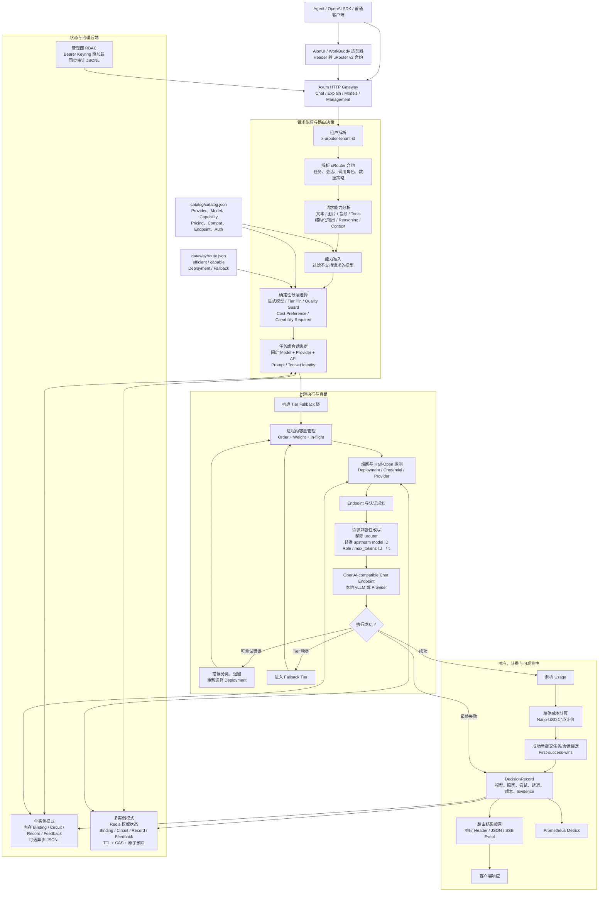
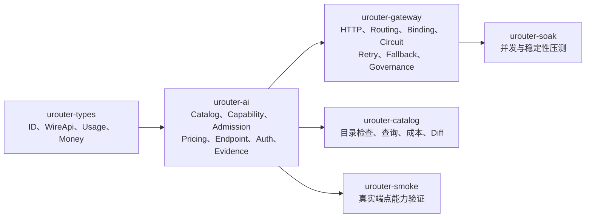

# uRouter 技术架构流程图

uRouter 是一个使用 Rust 实现的、面向 Agent 的多模型智能路由网关。核心目标是根据请求能力、任务上下文、成本与质量偏好选择模型，并提供会话绑定、故障转移、治理审计和可观测性。

## 技术架构流程图

## 核心模块关系

## 当前实际路由

| Tier | 模型 | 主要能力 | 故障转移 |
|---|---|---|---|
| `efficient` | `local-vllm/qwen3.5-4b` | 文本、结构化输出 | `capable` |
| `capable` | `local-vllm-qwen38/qwen3.8-27b` | 文本、图片、Tools、Reasoning、大上下文 | 无 |

## 关键架构行为

- `urouter/auto` 先执行能力过滤，再根据难度、调用角色和偏好选择 Tier。
- 显式模型请求绕过 Auto 分层，但仍执行能力准入。
- Primary 调用可以绑定到精确模型；Auxiliary 调用绕过主任务绑定并偏向低成本 Tier。
- v2 合约使用 `conversation + branch` 维持会话连续性，并校验 Prompt、Toolset 身份。
- 429、5xx、超时和传输错误可以重试；确定性 4xx 不重试。
- 非流式响应在 JSON 中加入路由披露；流式响应在 `[DONE]` 前追加 `urouter.decision` SSE 事件。
- 启用 Redis 后，Redis 是多实例 Binding、Circuit、DecisionRecord 和 Feedback 的唯一权威状态；Redis 不可用时路由状态操作返回稳定的 503。
- 当前网关执行层仅支持 `open_ai_chat`。目录虽然可以描述 Anthropic Messages 和 OpenAI Responses，但尚未实现跨协议转换。

## 主要实现位置

- 网关入口与请求执行：`crates/urouter-gateway/src/main.rs`
- 路由配置与决策算法：`crates/urouter-gateway/src/lib.rs`
- 模型事实与目录快照：`crates/urouter-ai/src/catalog.rs`
- 公共类型与计价类型：`crates/urouter-types/src/`
- 当前 Auto 路由配置：`gateway/route.json`
- 模型与 Provider 目录：`catalog/catalog.json`

## 验证说明

本架构图依据当前代码、配置和已有测试定义进行静态分析。尝试运行 workspace 测试时，本机未缓存 `axum`，且环境无法连接 crates.io，因此未完成编译验证。
