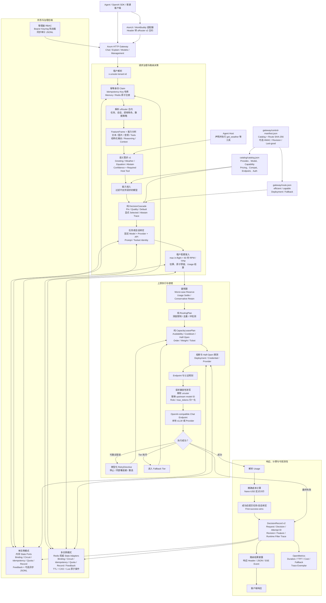
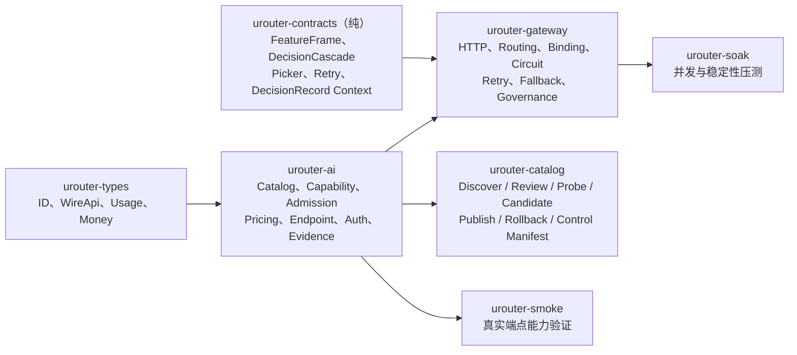

# uRouter 技术架构流程图

uRouter 是一个使用 Rust 实现的、面向 Agent 的多模型智能路由网关。核心目标是根据请求能力、任务上下文、成本与质量偏好选择模型，并提供会话绑定、故障转移、治理审计和可观测性。

## 技术架构流程图

## 核心模块关系

## 当前可执行路由配置

| 配置 | Tier | 模型 | 故障转移 |
|---|---|---|---|
| `gateway/route.json` 默认本地基线 | `efficient` | `local-vllm/qwen3.5-4b` | `capable` |
| `gateway/route.json` 默认本地基线 | `capable` | `local-vllm-qwen38/qwen3.8-27b` | 无 |
| `gateway/route.siliconflow.json` 商用验证 | `efficient` | `siliconflow/qwen2.5-7b-instruct` | `capable` |
| `gateway/route.siliconflow.json` 商用验证 | `capable` | `siliconflow/deepseek-r1-pro` | 无 |

配置文件存在不代表对应上游持续在线。Gateway 可从签名 control manifest 启动并周期校验 Catalog/Route；单请求固定一个不可变快照，坏 revision 按 `last_good` 或 `fail_closed` 处理。

## 关键架构行为

- `urouter/auto` 先执行能力过滤，再根据难度、调用角色和偏好选择 Tier。
- 语义规则对高置信度 greeting 使用 efficient，对方程要求 reasoning-capable；低置信度明确 abstain。实时天气必须由 Host 声明并执行 `get_weather`，Gateway 不伪造工具结果。
- 可选 `Idempotency-Key` 在租户域内复用逻辑 `request_id`；键只保留哈希，不同请求复用同一键返回 409，当前不缓存响应。
- Pin、Quality、Default 规则通过纯 DecisionCascade 执行，并记录 selected/abstain 事件。
- 部署选择由纯 order/weight/ticket picker 计算，运行时只负责注入可用性和管理 lease。
- 显式模型请求绕过 Auto 分层，但仍执行能力准入。
- Primary 调用可以绑定到精确模型；Auxiliary 调用绕过主任务绑定并偏向低成本 Tier。
- v2 合约使用 `conversation + branch` 维持会话连续性，并校验 Prompt、Toolset 身份。
- 429、5xx、超时和传输错误可以重试；确定性 4xx 不重试。
- fallback 可按 timeout、rate-limit、server、transport 等错误类型配置不同链路；最坏链路成本在执行前进行固定点预算预留。
- 非流式响应在 JSON 中加入路由披露；流式响应在 `[DONE]` 前追加 `urouter.decision` SSE 事件。
- 启用 Redis 后，Redis 是多实例 Binding、Circuit、Idempotency、Quota、DecisionRecord 和 Feedback 的唯一权威状态；Redis 不可用时路由状态操作返回稳定的 503。
- Catalog discovery、人工字段证据、费用受限 probe、隔离 candidate、control-last publish 和 rollback 形成独立发布链；未经 review 的上游模型不会进入 active Catalog。
- `/health/ready` 同时检查 drain、共享状态、control 错误和 required revision；`/health/live` 只表示进程存活。
- 部署退役先停止新请求并允许已有 binding 在截止时间前继续，宽限结束后再将 Catalog lifecycle 标为 retired。
- `--tenant-max-in-flight` 按租户限制逻辑请求并发，完成、失败和客户端取消会归还许可；RPM 使用滚动 60 秒窗口；TPM 在准入时保守预留并在获得 Usage 后结算，失败、取消或 Usage 缺失保留预留。当前仍缺逐 Provider tokenizer 精确估算与超长流租约续期。
- 网关执行层支持 `open_ai_chat`，以及非流式的 OpenAI Responses/Anthropic Messages 请求与响应转换；非 Chat 流式 handoff 在发送前明确拒绝，并可进入既有 typed fallback。

## 主要实现位置

- 网关入口与请求执行：`crates/urouter-gateway/src/main.rs`
- 幂等状态端口：`crates/urouter-gateway/src/idempotency.rs`
- 配额状态端口：`crates/urouter-gateway/src/quota.rs`
- 预算状态端口：`crates/urouter-gateway/src/budget.rs`
- Catalog/Route 控制面：`crates/urouter-gateway/src/control.rs`
- 路由配置与决策算法：`crates/urouter-gateway/src/lib.rs`
- 模型事实与目录快照：`crates/urouter-ai/src/catalog.rs`
- 公共类型与计价类型：`crates/urouter-types/src/`
- 当前 Auto 路由配置：`gateway/route.json`
- 模型与 Provider 目录：`catalog/catalog.json`
- 机器可读 API 契约：`gateway/openapi.json`，运行时为 `GET /openapi.json`
- Provider 同步与发布：`tools/urouter-catalog/src/provider_sync.rs`
- 后续实施状态：`docs/requirements-traceability.md`、`docs/p2-p3-execution-status.md`

## P4-P6 当前实现流程（覆盖旧的“仅 open_ai_chat”说明）

```mermaid
flowchart LR
    Client[Chat / Responses / Anthropic client] --> IR[urouter-protocol normalized IR]
    IR --> Core[shared RouteConfig decision core]
    Core --> Artifact[verified active/candidate RouterArtifact]
    Artifact --> Guard{support/revision/bounded infer}
    Guard -- fail --> Rules[rule decision fallback]
    Guard -- pass --> Rollout[shadow or stable task canary]
    Rules --> Transport[provider transport adapter]
    Rollout --> Transport
    Transport --> Chat[OpenAI Chat]
    Transport --> Responses[OpenAI Responses non-stream]
    Transport --> Anthropic[Anthropic Messages non-stream]
    Transport --> Record[DecisionRecord v2 + artifact/exploration evidence]
    Record --> Normalize[urouter-lab normalize]
    Normalize --> Dataset[privacy/revision/deletion/feedback quarantine]
    Dataset --> Eval[benchmark + IPS/SNIPS/DR + support domain]
    Eval --> Signed[signed deterministic artifact]
    Signed --> Candidate[candidate slot]
    Candidate --> RolloutAPI[shadow -> 1% -> 5% -> 10%]
    RolloutAPI --> Observe[quality/error/cost/latency observation]
    Observe -- threshold breach --> Rollback[last-good rollback]
    Observe -- approved --> Active[active artifact]
```

公共模块依赖为 `urouter-contracts -> urouter-eval/urouter-artifact`，
`urouter-protocol` 负责协议语义边界，`urouter-client` 负责可安全重放的多网关故障转移，
`urouter-embed` 直接复用 Gateway 决策核。Responses/Anthropic 的 provider 流式转换当前明确拒绝，
不会把不兼容字节流静默当成 Chat 流返回。

规则级联现包含 pin、signal、quality/cost 和 default/abstain；成功 deployment 会按
`prompt_profile_hash` 写入有界本地 cache-affinity，后续仅在已通过准入的候选中优先复用，
状态缺失时 fail-open。Explain 保持 `summary`，执行后的 DecisionRecord v2 trace 标记为 `full`，
包含候选、级联、策略准入、artifact/exploration 和 runtime deployment 证据。

## 验证说明

本架构图依据当前代码、配置和测试定义维护。2026-08-30 的等价分拆全 workspace 门禁为 188 passed、0 failed、7 个 Redis 条件测试忽略，另有 1 个 rustdoc 通过；严格 Clippy、纯 crate 边界和 Secret 扫描通过。HTTP 契约覆盖 liveness/readiness、Catalog/Artifact 管理、OpenAPI、模型、Explain、Chat、Responses/Anthropic 转换和标准错误 envelope。Redis 条件测试仍需要显式提供 `UROUTER_TEST_REDIS_URL`；生产 Redis HA/ACL/TLS、真实数据集、shadow/canary 观察、跨云发布和真实 Agent Host 工具联调仍属于外部验收。
