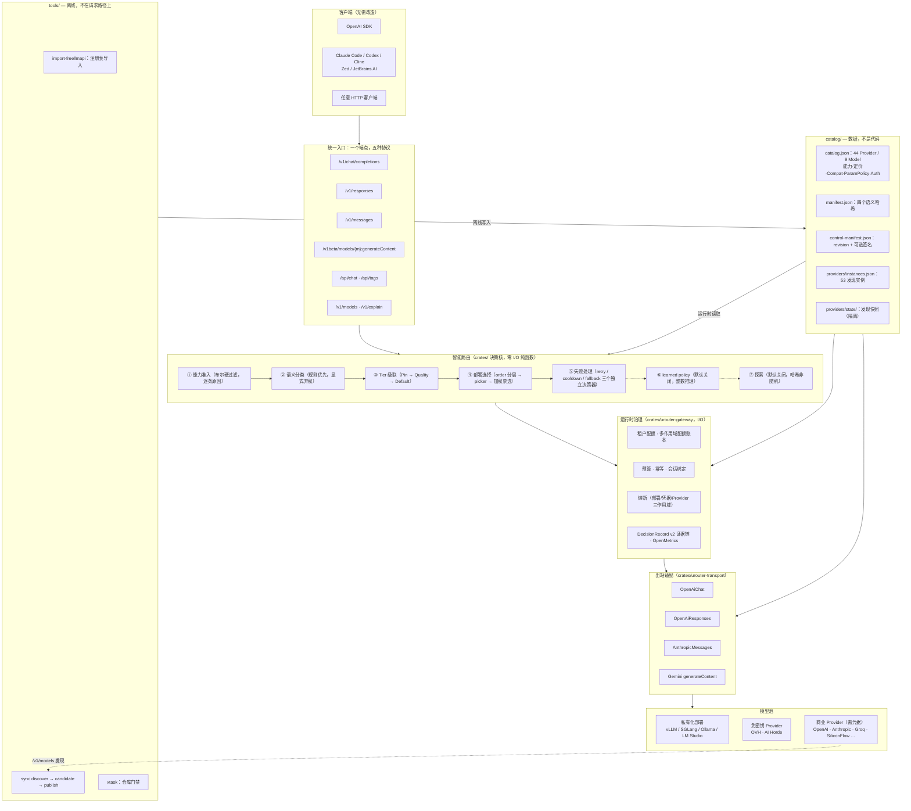
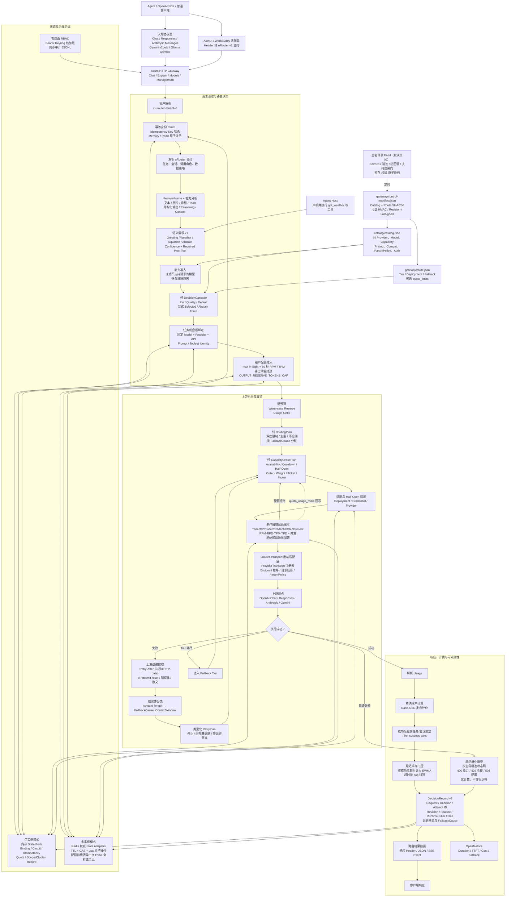
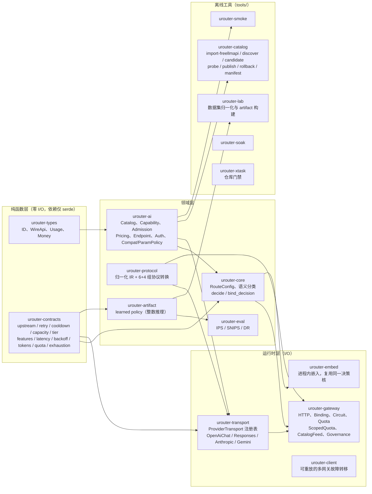

# uRouter 技术架构流程图

uRouter 是一个使用 Rust 实现的、面向 Agent 的多模型智能路由网关。核心目标是根据请求能力、任务上下文、成本与质量偏好选择模型，并提供会话绑定、故障转移、治理审计和可观测性。

## 总体架构图

三个顶层目录承担三种不同的职责，变更节奏与发布方式各不相同。

**读法**：请求从左上进入，只认 OpenAI 协议就够；决策核是纯函数，同样的输入在网关和进程内嵌入模式下产出同样的结果；`catalog/` 被三层同时读取但不被任何一层写入——写它的只有 `tools/`，且必须走评审与重新签名。

---

## 技术架构流程图

## 核心模块关系

依赖方向单向：`tools/ → crates/`，`crates/` 中没有任何一个依赖 `tools/`；`catalog/` 是纯数据，被两侧读取但不含代码。

**为什么这样切**：`urouter-contracts` 的依赖清单只有 `serde` + `serde_json`，这是它的契约本身，由 `xtask check-pure-crates` 在 CI 强制。决策核零 I/O 带来三个后果——`urouter-gateway` 与 `urouter-embed` 对同一输入产出同一决策（有 parity 测试）、决策可穷举测试无需起网络、决策可重放。`urouter-transport` 单独成 crate 是因为它需要 `reqwest`，不能进 contracts；也不该塞进已有 6600 行的 `main.rs`。

## 当前可执行路由配置

| 配置 | Tier | 模型 | 故障转移 |
|---|---|---|---|
| `gateway/route.json` 默认本地基线 | `efficient` | `local-vllm/qwen3.5-4b` | `capable` |
| `gateway/route.json` 默认本地基线 | `capable` | `local-vllm-qwen36/qwen3.6-35b-a3b` | 无 |
| `gateway/route.free.json` 免密钥验证 | `free` | `aihorde/angelic-eclipse-12b` | `free-fast` |
| `gateway/route.free.json` 免密钥验证 | `free-fast` | `ovh/mistral-7b-instruct-v0.3` | 无 |
| `gateway/route.siliconflow.json` 商用验证 | `efficient` | `siliconflow/qwen2.5-7b-instruct` | `capable` |
| `gateway/route.siliconflow.json` 商用验证 | `capable` | `siliconflow/deepseek-r1-pro` | 无 |

配置文件存在不代表对应上游持续在线。Gateway 可从签名 control manifest 启动并周期校验 Catalog/Route；单请求固定一个不可变快照，坏 revision 按 `last_good` 或 `fail_closed` 处理。

### 模型池现状

| | 数量 | 说明 |
|---|---:|---|
| Catalog Provider | 44 | 池子的**容量**，40 家由 `import-freellmapi` 自动导入 |
| 发现实例 | 53 | `sync discover` 的配置，新导入的默认 `enabled: false` |
| Catalog Model | 9 | 池子的**存量** |
| 无模型的 Provider | 36 | 受阻于凭据，非代码缺口 |

模型只经 `discover → candidate → 人工补证据 → publish` 进入 active Catalog。发现管线已在 OVH 上验证：`discovered=25 cataloged=1`。

## 关键架构行为

- `urouter/auto` 先执行能力过滤，再根据难度、调用角色和偏好选择 Tier。
- 语义规则对高置信度 greeting 使用 efficient，对方程要求 reasoning-capable；低置信度明确 abstain。实时天气必须由 Host 声明并执行 `get_weather`，Gateway 不伪造工具结果。
- 可选 `Idempotency-Key` 在租户域内复用逻辑 `request_id`；键只保留哈希，不同请求复用同一键返回 409，当前不缓存响应。
- Pin、Quality、Default 规则通过纯 DecisionCascade 执行，并记录 selected/abstain 事件。
- 部署选择由纯 order/weight/ticket picker 计算，运行时只负责注入可用性和管理 lease。
- 显式模型请求绕过 Auto 分层，但仍执行能力准入。
- Primary 调用可以绑定到精确模型；Auxiliary 调用绕过主任务绑定并偏向低成本 Tier。
- v2 合约使用 `conversation + branch` 维持会话连续性，并校验 Prompt、Toolset 身份。
- 429、5xx、超时和传输错误可以重试；确定性 4xx 不重试。
- fallback 可按 timeout、rate-limit、server、transport 等错误类型配置不同链路；最坏链路成本在执行前进行固定点预算预留。
- 非流式响应在 JSON 中加入路由披露；流式响应在 `[DONE]` 前追加 `urouter.decision` SSE 事件。
- 启用 Redis 后，Redis 是多实例 Binding、Circuit、Idempotency、Quota、DecisionRecord 和 Feedback 的唯一权威状态；Redis 不可用时路由状态操作返回稳定的 503。
- Catalog discovery、人工字段证据、费用受限 probe、隔离 candidate、control-last publish 和 rollback 形成独立发布链；未经 review 的上游模型不会进入 active Catalog。
- `/health/ready` 同时检查 drain、共享状态、control 错误和 required revision；`/health/live` 只表示进程存活。
- 部署退役先停止新请求并允许已有 binding 在截止时间前继续，宽限结束后再将 Catalog lifecycle 标为 retired。
- `--tenant-max-in-flight` 按租户限制逻辑请求并发，完成、失败和客户端取消会归还许可；RPM 使用滚动 60 秒窗口；TPM 在准入时保守预留并在获得 Usage 后结算，失败、取消或 Usage 缺失保留预留。当前仍缺逐 Provider tokenizer 精确估算与超长流租约续期。
- 出站由 `urouter-transport` 的 `ProviderTransport` 注册表分发，取代原先 `main.rs` 中三处 `match model.api`。Endpoint 路径由 transport 推导而非固定后缀，因此 Gemini 的 `models/{id}:generateContent`（模型名在路径里、流式换动词）这类形状可以表达；`WireApi::Custom` 从"命名了但不存在"变成真扩展点。目录 feed 会先经支持度闸门，引用了本二进制不认识的 wire 的修订整份拒绝，而不是留给第一个路由到它的请求去发现。
- 入站协议面：`/v1/chat/completions`（原生）、`/v1/responses`、`/v1/messages`、`/v1beta/models/{model}:generateContent`、`/api/chat` 与 `/api/tags`。备用协议内部统一漏斗到 OpenAI Chat 再翻回；Gemini 与 Ollama 的流式在建流之前显式拒绝，不发半翻译的 chunk。
- Provider 请求怪癖以 `ParamPolicy` 落在 catalog 数据里（drop / rename / json_object→schema / max_tokens 上下界 / 单工具调用），provider 级与 model 级合并：drop 与 rename 取并集，cap 取更严者。新增一个 OpenAI 兼容 provider 因此是一条目录条目，不是一次代码变更。
- 每个 provider 可声明自己的超时（`timeout_millis`）。单一全局超时无法同时服务亚秒级边缘推理和分钟级排队网络：短了慢 provider 永远不可用，长了死 provider 占着 lease 数分钟。
- 上游退避按优先级提取：`Retry-After`（整数秒与 HTTP-date 三种格式）→ `x-ratelimit-reset*` → 错误体深度封顶 DFS（含 protobuf duration `"17s"`）→ 锚点约束的散文扫描。散文必须有明确重试短语才采信，否则 `"you have 30 tokens remaining"` 会变成 30 秒退避。全部整数运算并 clamp 到 24 小时。
- 上游提示按 `max_backoff_ms` 夹逼后用于 sleep，未夹逼的原值用于本网关自己的出站 `Retry-After`；提示超过上界且无处可去时返回 `Stop` 而非握着四个 lease 长睡。退避提示在重选部署时同样保留——同一 provider 的兄弟部署通常共享其配额。
- 错误体参与分类：`context_length_exceeded` 保持 `BadRequest`（同 prompt 重试同部署无意义，且该部署健康），但 `FallbackCause` 变为 `ContextWindow`，从而可落到长上下文 tier——此前所有 400 都塌成终止性错误。
- 多作用域配额账本按 Tenant / Provider / Credential / Deployment 四作用域、Minute / Day 两窗口、请求·令牌·并发三维度记账。分钟窗滑动（固定桶会让跨边界爆 2 倍，正好触发上游自己的限流器），日窗按 UTC 午夜分桶并带 TTL 自清理。纯函数核决定"该扣什么"，Redis 只负责原子执行扣费清单，两个后端共用同一谓词。
- 配额拒绝不是请求失败：该部署像任何不可用候选一样被排除，循环继续尝试下一个，并把 `quota_provider_day_tokens` 这类原因写入 trace。观测到的利用率回写 `quota_usage_millis`，使 `LowestQuotaUsage` picker 依据实时消耗而非操作员手填的常数排序。
- 输出预留封顶：`max_tokens` 是客户端几乎不会达到的上界，按全量预留会排空整个候选池并在零上游调用的情况下返回假性耗尽。准入与配额共用同一个 `reserved_output_tokens`，上游请求体永不改写。
- 延迟 EWMA 只采信成功与超时两种结果，超时按上限封顶。8ms 返回的 401 不是"快"的证据而是"坏"的证据；此前它会把 EWMA 拉低，使最坏的部署在 `LowestLatency` 眼里最快。
- 候选池耗尽时返回按可操作性桶化的计数摘要（能力 / 缺凭据 / 策略 / 停用 / 限流冷却 / 降权），由主导桶决定状态码：能力与策略问题 400、冷却 429 并附 `Retry-After`、其余 503。摘要结构上无法携带部署 id、区域或凭据名，逐候选细节只留在 `/v1/explain` 与 DecisionRecord。
- 目录可从 Ed25519 签名的远端 feed 定时更新（默认关闭）。验签在收到的原始字节上进行、先于任何解析；防回滚同时对内置基线与当前生效版本取严格更新；轮询抖动由安装身份派生因而重启后稳定。远端 feed 用非对称签名而非本地 manifest 的 HMAC——对称密钥意味着每个安装都能伪造 feed。

## 主要实现位置

- 网关入口与请求执行：`crates/urouter-gateway/src/main.rs`
- 启动配置检查（`--dry-run`）：`crates/urouter-gateway/src/dry_run.rs`
- 结构化日志与 span：`crates/urouter-gateway/src/logging.rs`
- 客户端协议转换：`crates/urouter-gateway/src/protocol_translation.rs`
- DecisionRecord/Feedback 持久化：`crates/urouter-gateway/src/persistence.rs`
- 幂等状态端口：`crates/urouter-gateway/src/idempotency.rs`
- 租户配额状态端口：`crates/urouter-gateway/src/quota.rs`
- 多作用域配额账本：`crates/urouter-gateway/src/scoped_quota.rs`
- 签名目录 feed 与定时同步：`crates/urouter-gateway/src/catalog_feed.rs`
- 出站适配层：`crates/urouter-transport/src/`（`lib.rs` 注册表、`policy.rs` 参数策略、四个 wire 实现）
- 纯决策模块：`crates/urouter-contracts/src/`（`backoff` `quota` `exhaustion` `latency` `tokens` 等 12 个模块）
- 预算状态端口：`crates/urouter-gateway/src/budget.rs`
- Catalog/Route 控制面：`crates/urouter-gateway/src/control.rs`
- 路由配置与决策算法：`crates/urouter-core/src/lib.rs`（Gateway 的 `lib.rs` 仅重新导出）
- 模型事实与目录快照：`crates/urouter-ai/src/catalog.rs`
- 公共类型与计价类型：`crates/urouter-types/src/`
- 当前 Auto 路由配置：`gateway/route.json`
- 模型与 Provider 目录：`catalog/catalog.json`
- 机器可读 API 契约：`gateway/openapi.json`，运行时为 `GET /openapi.json`
- Provider 同步与发布：`tools/urouter-catalog/src/provider_sync.rs`
- FreeLLMAPI Provider 注册表导入：`tools/urouter-catalog/src/freellmapi_import.rs`
- 后续实施状态：`docs/requirements-traceability.md`、`docs/p2-p3-execution-status.md`
- 交付形态：`Dockerfile`、`docker-compose.yml`、`deploy/kubernetes/gateway.yaml`
- 仓库门禁：`tools/urouter-xtask/`、`deny.toml`

## P4-P6 当前实现流程（覆盖旧的“仅 open_ai_chat”说明）

```mermaid
flowchart LR
    Client[Chat / Responses / Anthropic client] --> IR[urouter-protocol normalized IR]
    IR --> Core[shared RouteConfig decision core]
    Core --> Artifact[verified active/candidate RouterArtifact]
    Artifact --> Guard{support/revision/bounded infer}
    Guard -- fail --> Rules[rule decision fallback]
    Guard -- pass --> Rollout[shadow or stable task canary]
    Rules --> Transport[provider transport adapter]
    Rollout --> Transport
    Transport --> Chat[OpenAI Chat]
    Transport --> Responses[OpenAI Responses non-stream]
    Transport --> Anthropic[Anthropic Messages non-stream]
    Transport --> Record[DecisionRecord v2 + artifact/exploration evidence]
    Record --> Normalize[urouter-lab normalize]
    Normalize --> Dataset[privacy/revision/deletion/feedback quarantine]
    Dataset --> Eval[benchmark + IPS/SNIPS/DR + support domain]
    Eval --> Signed[signed deterministic artifact]
    Signed --> Candidate[candidate slot]
    Candidate --> RolloutAPI[shadow -> 1% -> 5% -> 10%]
    RolloutAPI --> Observe[quality/error/cost/latency observation]
    Observe -- threshold breach --> Rollback[last-good rollback]
    Observe -- approved --> Active[active artifact]
```

公共模块依赖为 `urouter-contracts -> urouter-eval/urouter-artifact`，
`urouter-protocol` 负责协议语义边界，`urouter-client` 负责可安全重放的多网关故障转移，
`urouter-embed` 直接复用 Gateway 决策核。Responses/Anthropic 的 provider 流式转换当前明确拒绝，
不会把不兼容字节流静默当成 Chat 流返回。

规则级联现包含 pin、signal、quality/cost 和 default/abstain；成功 deployment 会按
`prompt_profile_hash` 写入有界本地 cache-affinity，后续仅在已通过准入的候选中优先复用，
状态缺失时 fail-open。Explain 保持 `summary`，执行后的 DecisionRecord v2 trace 标记为 `full`，
包含候选、级联、策略准入、artifact/exploration 和 runtime deployment 证据。

## 验证说明

本架构图依据当前代码、配置和测试定义维护。当前全 workspace 门禁为 **457 passed / 0 failed**；严格 Clippy（workspace 开启 pedantic）**0 告警**；`cargo deny check` 的 advisories / bans / licenses / sources 全部通过；纯 crate 边界、Secret 扫描、部署清单 dry-run 校验通过；`--dry-run` **18 项全过**（新增 `quota_limit_consistency` 与 `quota_scope_topology`）。

HTTP 契约覆盖 liveness/readiness、Catalog/Artifact 管理、OpenAPI、模型、Explain、Chat、Responses/Anthropic/Gemini/Ollama 转换和标准错误 envelope。统一入口已用**官方 openai SDK v7.10.0** 实测：仅替换 `base_url`，`models.list()` 与 `chat.completions.create()` 原样工作。

分级路由、能力准入、语义分类、配额账本、退避提取与耗尽桶化均已针对真实上游端到端验证（本地 vLLM ×2、OVH AI Endpoints、AI Horde）。

Redis 条件测试仍需显式提供 `UROUTER_TEST_REDIS_URL`；生产 Redis HA/ACL/TLS、真实数据集、shadow/canary 观察、跨云发布和真实 Agent Host 工具联调仍属于外部验收。模型池当前受阻于各 provider 凭据而非代码：44 家 provider 中 36 家无模型，发现管线本身已验证。
