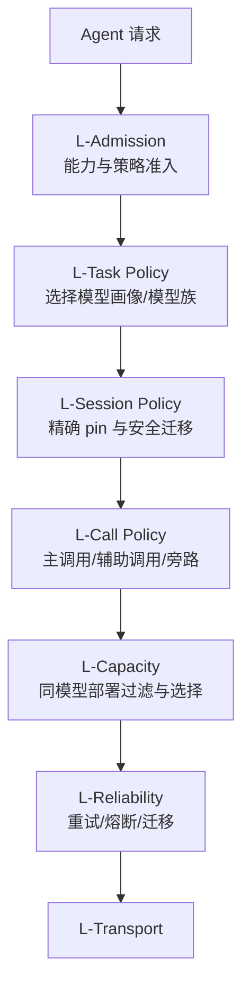

# uRouter 技术架构深度评审与优化方案

> 评审日期：2026-08-25  
> 评审对象：`uRouter_设计文档.md` v3.2、`uRouter_Auto模式接入设计.md` v2  
> 目标场景：AionUI、WorkBuddy 等智能体产品在模型选择器中提供 `Auto` 选型  
> 结论状态：**有条件通过。保留基础设施分层，重构 Agent Auto 的决策模型后再进入实现。**

---

## 1. 执行摘要

uRouter 当前方案在生产网关基础设施方面设计扎实：质量决策与容量选择分离、类型化错误、统一模型目录、可复现特征、版本化策略工件、快照一致性、失败降级和线上反馈闭环，都具有明确的工程价值。

但现有设计把核心问题近似成：

> 对每一次 LLM 请求，先选择 `efficient / balanced / capable` 中的一个 tier，再选择该 tier 内的部署。

这与 AionUI、WorkBuddy 一类长任务智能体的真实决策对象存在偏差。在这些产品中，用户选择 `Auto` 后，系统面对的不是一条孤立 prompt，而是一个由规划、工具调用、文件修改、验证、重试、压缩和子智能体组成的持续任务。模型切换还受到 harness、工具协议、provider 状态、提示词模板和会话缓存约束。

因此，建议把 uRouter 的核心定义调整为：

> **uRouter 是面向 Agent 任务的分层模型策略引擎：在硬能力与兼容性约束下，于任务、会话、调用和部署四个层级决定何时固定、何时升级、何时旁路以及打向哪个副本。**

总体判断：

| 维度 | 评价 | 结论 |
|---|---:|---|
| 网关分层与 crate 边界 | 8/10 | 保留 |
| 容量、可靠性、目录 | 8/10 | 修正少数故障语义后保留 |
| Agent 场景建模 | 4/10 | 需要重构 |
| Auto 接入契约 | 5/10 | 能力声明与流式扩展需要修改 |
| 数据闭环与评估 | 5/10 | 方向正确，统计假设过强 |
| 安全与数据治理 | 2/10 | 必须补入 M0 |
| 里程碑可执行性 | 4/10 | M0 范围过大，需重新切分 |

---

## 2. 值得保留的设计

### 2.1 L-Quality 与 L-Capacity 分离

先回答“需要什么能力”，再回答“当前打哪个部署”，是正确的边界。它避免把任务难度、价格、冷却、配额和延迟揉进一个不可解释的综合分数。

优化后仍保留这一原则，但在 L-Quality 前增加 `L-Admission`，并把 L-Quality 的输出从单一 `TierRef` 扩展为有约束的候选策略。

### 2.2 决策核零 I/O 与快照注入

零 I/O 决策核使在线决策、离线回放、单元测试和未来嵌入形态能够共用实现。一次请求固定目录、工件和容量快照，也能防止决策过程中版本漂移。

该约束应继续作为 CI 硬门禁。

### 2.3 类型化错误和完整归因

`CascadeTrace`、`FilterTrace`、`FilterExhausted` 和 `UpstreamError` 是生产排障和离线评估的基础。建议继续禁止依赖字符串匹配的 fallback。

需要新增 Agent 级归因：任务策略、会话 pin、迁移原因、安全边界和兼容性损失。

### 2.4 模型目录与实际成本核算

目录、认证、compat、阶梯计价和缓存费率属于路由决策的事实层。实际发生的调用成本应继续由同一个纯函数在线、离线复算。

但必须区分“实际成本”与“反事实成本估计”，不能把后者描述为精确值。

### 2.5 工件版本化、shadow、canary 和回滚

把路由策略作为可训练、可灰度、可回滚工件是 uRouter 最有差异化的部分。该设计应保留，但工件 schema 需要记录候选空间、模型画像版本、harness profile 和评估适用域。

---

## 3. 关键问题与具体修正

## 3.1 P0：路由粒度与 Agent 生命周期不匹配

### 问题

现有主链路以单次 LLM 请求为决策单元。即使加入会话滞回，仍然可能在每轮重新选择 tier，并在 tier 内切换模型/provider。

Agent 任务包含至少四种不同决策：

1. 这项任务由哪个 Agent/harness 执行。
2. 该任务的主模型应是什么，是否允许中途迁移。
3. 标题、摘要、抽取、审查等子调用是否使用不同模型。
4. 同一模型的请求发往哪个健康副本。

把四者都压缩成一次请求的 tier 选择，会造成会话漂移、工具协议破坏、缓存丢失和不可解释的模型跳变。

### 优化方案：四级路由



| 层级 | 主键 | 默认稳定周期 | 允许改变的内容 |
|---|---|---|---|
| Task | `task_id` | 一个用户任务 | 模型画像、初始模型族、成本策略 |
| Session | `conversation_id + branch_id` | 一段上下文链 | 精确模型/provider/API；仅安全边界迁移 |
| Call | `turn_id + call_role` | 一次调用 | 辅助调用旁路、验证调用升级 |
| Deployment | `deployment_id` | 一次物理尝试 | 同一模型的副本、区域、凭证 |

### 核心原则

- 主 Agent 调用默认在任务开始时选择并 pin 精确模型。
- 辅助调用可独立路由，但必须显式标记 `call_role`。
- 只有到达安全迁移边界，才允许主模型跨 provider/API 迁移。
- 物理失败首先在同一模型的部署副本间重试，然后才考虑模型迁移。
- `Auto` 不等于“每轮都重新抽模型”。

---

## 3.2 P0：单一 tier 无法表达多维模型能力

### 问题

`efficient / balanced / capable` 隐含全序关系，但模型能力通常是偏序：擅长编码的模型未必擅长视觉，长上下文模型未必有最可靠的工具调用，昂贵模型也不一定在所有语言和工作负载上占优。

### 优化方案：Capability Gate + Suitability Score

先做硬约束，再优化期望效用：

```text
eligible = candidates
  ∩ required_capabilities
  ∩ harness_compatibility
  ∩ context_requirement
  ∩ tenant/provider policy
  ∩ data residency

utility(model) =
    expected_task_success
  - lambda_cost * estimated_cost
  - lambda_latency * estimated_latency
  - lambda_migration * migration_risk
```

建议引入：

```rust
pub struct ModelProfile {
    pub id: ModelProfileId,
    pub model: ModelId,
    pub provider: ProviderId,
    pub api: ApiKind,
    pub hard_capabilities: CapabilitySet,
    pub suitability: BTreeMap<WorkloadKind, CalibratedScore>,
    pub harness_compat: BTreeMap<HarnessId, CompatibilityGrade>,
    pub migration: MigrationProfile,
    pub cost_model: ModelCostRef,
}

pub struct RoutingIntent {
    pub required: CapabilitySet,
    pub workload: WorkloadKind,
    pub quality_floor: Option<CalibratedScore>,
    pub max_cost_usd: Option<f64>,
    pub max_ttft_ms: Option<u32>,
}
```

Tier 仍可存在，但降级为策略标签：

```text
tier = 一组质量/成本策略预设
profile = 真正可执行的模型候选
deployment = profile 的物理端点
```

这样可以继续向 UI 展示“经济/平衡/高质量”，但内部不会假设模型严格全序。

---

## 3.3 P0：Auto 能力取所有 tier 交集会废掉能力路由

### 问题

接入文档要求 Auto 只声明全部 tier 的能力交集。例如便宜 tier 不支持视觉，则整个 Auto 对外声明不支持视觉。这会迫使 UI 阻止本可由强模型处理的请求。

### 优化方案：三类能力声明

```json
{
  "capabilities": {
    "baseline": {
      "text": true,
      "tool_calling": true
    },
    "routable": {
      "vision": {
        "supported": true,
        "eligible_profiles": ["vision-balanced", "vision-capable"]
      },
      "long_context": {
        "supported": true,
        "max_context_window": 1000000
      }
    },
    "conditional": {
      "computer_use": {
        "supported": true,
        "constraints": ["approved_harness", "region_allowlist"]
      }
    }
  }
}
```

启动校验改为：

- `baseline` 必须是默认候选集的交集。
- `routable` 必须至少有一个可达 profile 满足。
- 每个 routable 能力必须验证 fallback 后仍不会落到不支持该能力的模型。
- 对能力驱动的升级记录 `reason=capability_required`，不能记作质量路由收益。

---

## 3.4 P0：会话连续性只 pin tier，不足以保证 Agent 正确性

### 问题

同一 tier 内只校验 `capabilities` 和 `context_window` 一致，无法证明模型在工具调用、reasoning block、系统提示和 provider 会话语义上可互换。

### 优化方案：精确会话绑定与迁移矩阵

```rust
pub struct SessionBinding {
    pub profile_id: ModelProfileId,
    pub model: ModelId,
    pub provider: ProviderId,
    pub api: ApiKind,
    pub prompt_profile_hash: Sha256,
    pub toolset_hash: Sha256,
    pub bound_at_turn: TurnId,
    pub migration_policy: MigrationPolicy,
}

pub enum MigrationBoundary {
    NewTask,
    AfterCompaction,
    ToolRoundCompleted,
    BeforeFirstAssistantToken,
    ExplicitUserRetry,
    TerminalProviderFailure,
}
```

目录增加迁移兼容矩阵：

| from → to | 同模型同 API | 同模型跨 provider | 跨模型同 API | 跨模型跨 API |
|---|:---:|:---:|:---:|:---:|
| 默认 | 安全 | 通常安全，需验证 | 有损 | 高风险 |
| tool call 未闭合 | 禁止 | 禁止 | 禁止 | 禁止 |
| 压缩后新上下文 | 安全 | 安全 | 可配置 | 可配置 |

跨模型迁移前应执行 `HandoffPlan`，明确哪些消息可保留、哪些 reasoning block 必须降级、工具调用是否闭合、是否需要重新生成模型专属 system prompt。

---

## 3.5 P0：成对样本和反事实评估存在统计误判

### 问题一：覆盖不等于偏好

用户点“换更强模型重试”只能证明用户发起了覆盖，不能证明第二个回答更好。覆盖行为受到首个回答质量、延迟、UI 位置、用户耐心和任务难度共同影响。

因此：

- `override` 是高价值行为信号，但不是直接质量标签。
- 相同输入的两次结果构成候选对，但没有 preference outcome 时不能计算“成对准确率”。
- “无偏指标”的表述应删除。

### 修正后的样本状态

```rust
pub enum PairOutcome {
    Unknown,
    FirstAccepted,
    SecondAccepted,
    BothRejected,
    VerificationDelta { first: f32, second: f32 },
    ExplicitPreference { preferred: DecisionId },
}
```

只有以下事件可把候选对转成训练标签：

- 用户明确选择其中一个结果。
- 后续产物采纳可唯一归因到某个结果。
- 两次执行使用同一确定性验证器并得到可比较分数。
- 人工或独立 judge 在盲测条件下完成比较。

### 问题二：探索支持域不足

`up_only` 探索只能观察向上动作，不能自动支持任意新策略的反事实评估。IPS/SNIPS/DR 必须满足目标策略动作在 logging policy 下具有非零概率。

每条记录必须保存完整动作概率：

```json
{
  "logging_policy": {
    "policy_id": "router-v7",
    "eligible_actions": ["efficient", "balanced", "capable"],
    "action_probabilities": {
      "efficient": 0.00,
      "balanced": 0.97,
      "capable": 0.03
    },
    "support_limited": true
  }
}
```

评估器必须拒绝评估超出支持域的策略，而不是只给出高方差结果。

### 问题三：反事实成本不是精确值

不同模型的 tokenizer、输出长度、reasoning token 和工具调用轮数不同。使用实际模型的 usage 套用目标模型价格，只能得到条件成本估计。

建议输出：

```json
{
  "actual_cost_usd": 0.0271,
  "counterfactual_cost": {
    "estimate_usd": 0.163,
    "method": "same_usage_reprice",
    "ci95": [0.121, 0.224],
    "assumptions": ["same_output_length", "same_tool_rounds"]
  }
}
```

产品侧不得把它展示成精确节省金额。

---

## 3.6 P1：流式扩展不是透明协议

### 问题

在 OpenAI 风格 SSE 末尾追加 `event: urouter.decision`，可能在 `[DONE]` 后被 SDK 忽略，也可能被严格客户端视为未知事件。非流式响应增加顶层字段同样需要兼容性验证。

### 优化方案

采用能力协商：

```http
X-URouter-Contract-Version: 2
X-URouter-Extensions: response-metadata-v1
```

| 信息 | 默认通道 | 扩展通道 |
|---|---|---|
| 决策 ID、profile、model、reason | 首响应头 | 原生响应 metadata |
| 最终 usage、成本、fallback trace | `GET /v1/decisions/{id}` | 客户端协商后的流末事件 |
| 实时事件 | 独立事件流 | WebSocket/SSE 管理通道 |

协议测试矩阵至少覆盖：

- OpenAI Chat Completions streaming/non-streaming
- OpenAI Responses streaming/non-streaming
- Anthropic Messages streaming/non-streaming
- 取消、首 chunk 后失败、usage 缺失、工具调用增量
- 官方 SDK、常用代理和 AionUI 实际客户端

---

## 3.7 P1：安全、隐私和数据治理缺失

### 风险

Agent 请求可能包含源码、合同、表格、邮件、浏览器内容、凭证片段和工具输出。特征向量也不是天然匿名数据；离线 judge 可能把原始上下文再次发送到外部 provider。

### 必须加入的 L-Governance 横切层

```rust
pub struct DataPolicy {
    pub tenant_id: TenantId,
    pub recording: RecordingMode,
    pub retention: Duration,
    pub allow_remote_judge: bool,
    pub allow_training: bool,
    pub residency: RegionSet,
    pub redaction_profile: RedactionProfileId,
}

pub enum RecordingMode {
    None,
    MetadataOnly,
    FeaturesWithoutEmbedding,
    FullWithConsent,
}
```

M0 必须具备：

- tenant 级认证、授权和存储隔离。
- TLS、静态加密、密钥轮换和审计日志。
- 默认不记录原文；embedding 可单独关闭。
- retention TTL、按 tenant/task 删除和导出能力。
- 远程 judge 与训练用途显式 opt-in。
- 日志、错误、工具结果和 header 的统一脱敏器。
- 防止反馈投毒：速率限制、来源可信度、异常权重和隔离数据集。
- 管理端点与数据面端点使用不同权限。

新增硬不变量：

> **I7 数据最小化与租户隔离：任何回流数据必须携带可执行的数据策略；没有策略时默认 MetadataOnly，不得进入训练集或远程 judge。**

---

## 3.8 P1：可靠性规则需要修正

### 单部署永不冷却

当前逻辑在 `tier_size <= 1` 时永不冷却，会持续请求已故障的唯一部署。应改成标准 circuit breaker：

```text
Closed --连续/比例失败--> Open
Open --cooldown 到期--> HalfOpen
HalfOpen --探测成功--> Closed
HalfOpen --探测失败--> Open
```

唯一部署进入 Open 后，应触发模型/策略 fallback，而不是继续打故障端点。

### TransportError 不进入冷却

连接拒绝、DNS、TLS、连接重置通常与具体 endpoint 健康有关。应细分：

```rust
pub enum TransportError {
    ClientCancelled,        // 不冷却
    LocalResourceExhausted, // 不冷却部署，降低本实例并发
    DnsFailure,             // endpoint/provider 级熔断
    ConnectRefused,         // deployment 级熔断
    TlsFailure,             // 配置错误，长期摘除
    ConnectionReset,        // 进入失败率统计
}
```

### Unauthorized 的作用域

认证失败通常属于 credential/provider，而不是单个模型部署。冷却状态必须支持 `deployment / credential / provider` 三种作用域，避免逐台重试同一失效凭证。

### 首 token 之后失败

首 token 发出后不能透明重试完整请求。应返回类型化终止原因，由 Agent 决定是否从安全边界重做，且原调用计为 `partial_failure`，不能与完整失败混在一起。

---

## 3.9 P1：预算语义存在矛盾

“硬上限后降到 efficient”仍可能继续产生费用，因此不是真正硬上限。

建议区分：

```rust
pub enum BudgetAction {
    BiasCheaper,              // 软控制
    ForceProfile(ProfileId),  // 仍允许花费
    LocalOnly,                // 仅零边际成本资源
    Reject,                   // 真正硬闸
}
```

配置明确表达：

```toml
[budgets.team_monthly]
soft_limit_usd = 2400
degraded_limit_usd = 2800
hard_limit_usd = 3000
on_degraded = { action = "force_profile", profile = "efficient" }
on_hard = { action = "reject", error = "budget_exhausted" }
on_state_unavailable = { action = "local_only" }
```

如果业务选择“超预算仍用便宜模型”，字段应叫 `target` 或 `guardrail`，不能叫 hard limit。

---

## 3.10 P1：主设计文档与接入文档已发生 schema 漂移

接入文档列出的 `hint`、`preference_bias`、`override`、`paired`、`observation_source`、新指标和启动校验尚未完整进入主文档。

建议建立机器可验证的契约源：

```text
schemas/
  request.schema.json
  response.schema.json
  decision-record.schema.json
  catalog.schema.json
  artifact-manifest.schema.json
```

Markdown 示例从 schema 测试 fixture 生成或在 CI 中验证，禁止手工维护互相漂移的 JSON 示例。

契约版本采用：

- major：字段删除、语义改变、枚举重解释。
- minor：新增可选字段、枚举值。
- patch：文档和约束澄清。

---

## 4. 建议的目标架构

## 4.1 七层模型

在原六层基础上调整为七层，其中 Governance 是横切约束：

| 层 | 职责 | 主要输出 |
|---|---|---|
| L-Admission | 能力、harness、租户、安全、驻留硬约束 | `EligibleProfiles` |
| L-Task | 任务级模型画像与策略选择 | `TaskPolicy` |
| L-Session | 精确 pin、滞回和安全迁移 | `SessionBinding` |
| L-Call | 主调用、辅助调用、验证调用和旁路 | `CallPlan` |
| L-Capacity | 同一执行 profile 的部署过滤与选择 | `Selection` |
| L-Reliability | 重试、熔断、fallback、迁移 | `RecoveryPlan` |
| L-Transport/Catalog | 协议执行与事实供应 | `Response/Usage` |

横切层：

- L-Feedback：记录、反馈、评估、训练和工件发布。
- L-Governance：数据策略、隔离、审计和安全。

## 4.2 新的核心输出

```rust
pub struct RouteDecision {
    pub task_policy: TaskPolicyRef,
    pub session_binding: SessionBinding,
    pub call_plan: CallPlan,
    pub eligible_profiles: Vec<ModelProfileId>,
    pub selected_profile: ModelProfileId,
    pub selected_deployment: DeploymentRef,
    pub migration_boundary: Option<MigrationBoundary>,
    pub trace: DecisionTrace,
}
```

`DecisionTrace` 应回答：

1. 哪些模型因硬能力被排除。
2. 哪些模型因 harness/API 不兼容被排除。
3. 为什么维持或改变会话绑定。
4. 这是质量选择、能力强制、预算策略还是故障迁移。
5. 是否发生有损协议交接。
6. 最终部署为何胜出。

## 4.3 Agent-aware 请求契约

建议将当前 `urouter` 请求扩展为：

```json
{
  "model": "urouter/auto",
  "messages": [],
  "urouter": {
    "contract_version": 2,
    "task": {
      "id": "task_01J...",
      "kind": "coding",
      "risk": "normal"
    },
    "agent": {
      "harness": "aion-built-in",
      "harness_version": "1.8.0",
      "profile": "cowork",
      "prompt_profile_hash": "sha256:...",
      "toolset_hash": "sha256:..."
    },
    "trace": {
      "conversation": "conv_01J...",
      "branch": "main",
      "turn": "turn_01J...",
      "parent_turn": null
    },
    "call": {
      "role": "primary",
      "phase": "execute",
      "value_class": "primary",
      "safe_migration_boundary": false
    },
    "requirements": {
      "capabilities": ["tools", "structured_output"],
      "min_context_window": 120000,
      "region": ["local", "cn"]
    },
    "policy": {
      "preference_bias": 0.0,
      "quality_floor": null,
      "pin_profile": null,
      "allow_cross_provider_migration": false
    },
    "data_policy": {
      "recording": "metadata_only",
      "allow_training": false,
      "allow_remote_judge": false,
      "retention_days": 7
    }
  }
}
```

所有字段不应全部可选。对于 Agent 主调用，以下字段应为强制：

- `trace.turn`
- `task.id`
- `agent.harness`
- `call.role`
- `data_policy`

缺失时可接受请求，但只能进入明确标记的 `compatibility_mode`，不得进入训练集。

---

## 5. 面向 AionUI / WorkBuddy 的接入边界

## 5.1 支持矩阵

| 场景 | 推荐接入 | uRouter 能控制什么 | 限制 |
|---|---|---|---|
| AionUI 内置 Agent + API Key | Gateway | 模型、provider、部署、成本、反馈 | 最完整 |
| AionUI 自定义 OpenAI-compatible provider | Gateway | 模型与部署 | 受协议兼容约束 |
| Claude Code/Codex/Gemini CLI | Adapter/Decision API | 建议模型或启动参数 | 不保证能接管订阅调用 |
| ACP 外部 Agent | ACP adapter | 会话开始时选择 backend/profile | 需 Agent 支持模型设置 |
| 多 Agent Team | Task API | Leader/Teammate 分别选择 profile | 必须独立 `task/subtask` scope |
| 本地模型 | Gateway + Local Broker | 模型、设备、加载状态、队列 | 需要 GPU/内存容量快照 |

## 5.2 UI 中的 Auto 应表达什么

UI 只需要展示：

- `Auto` 是一个可选模型项。
- 当前任务实际使用的模型与变更原因。
- 因能力、预算或故障发生迁移时的状态。
- 用户可选择“本次换模型重试”或“本任务固定模型”。

UI 不应把 tier 名当成稳定的模型能力事实。tier 是策略实现，实际模型和能力来自动态契约。

## 5.3 外部 Agent 的现实边界

外部 CLI Agent 可能使用订阅认证、自己的 provider 客户端、私有协议或内部模型选择逻辑。uRouter 必须明确：

- Gateway 模式只承诺覆盖实际经过 uRouter 的模型调用。
- Decision API 返回建议，不代表调用已被执行或结果已回流。
- 没有 outcome 回传的决策不得进入效果训练集。
- Agent/harness 选择和模型选择是两个独立功能，不应共用一个 `TierRef`。

---

## 6. 数据闭环优化方案

## 6.1 先定义最终目标

Agent Auto 的主指标不应是单轮回答评分，而应是任务级效用：

```text
task_utility =
    w_success * task_success
  + w_quality * artifact_quality
  - w_cost * total_task_cost
  - w_latency * task_wall_time
  - w_retry * user_retries
  - w_risk * unsafe_actions
```

其中权重必须按 route/workload 标定，不能全产品共用一个 `alpha/beta`。

## 6.2 分离四类样本

| 样本类型 | 可用于什么 | 不可用于什么 |
|---|---|---|
| Observational | 漂移监控、相关性分析 | 无条件因果结论 |
| Exploration | 支持域内 IPS/DR | 支持域外策略 |
| Paired with outcome | pairwise 训练、比较评估 | 未观测动作的全局评估 |
| Deterministic benchmark | 回归门禁、模型画像 | 直接代表线上分布 |

## 6.3 标签可信度

```rust
pub struct QualityEvidence {
    pub source: EvidenceSource,
    pub score: f32,
    pub confidence: f32,
    pub scope: EvidenceScope,
    pub attributable_to: DecisionId,
    pub verifier_version: Option<String>,
}
```

不得把多个代理信号直接覆盖成一个 `quality_label`。保留证据列表，由数据集构建阶段根据版本化规则融合。

## 6.4 训练与发布门禁

建议至少包含：

1. 支持域覆盖率达到预设阈值。
2. 按 workload、harness、模型画像分层报告。
3. 任务成功率的置信区间不低于基线下限。
4. 实际任务成本显著下降，而非只降低单次调用成本。
5. 模型迁移率、迁移失败率不过线。
6. 高风险任务不因路由降档产生显著回归。
7. 数据政策违规样本为零。
8. shadow 结果不允许冒充真实质量结果。
9. canary 按任务分流，不按请求分流。
10. 具备自动回滚阈值和人工 kill switch。

---

## 7. 重新规划里程碑

## M0：Agent-aware 最小闭环，4-6 周

范围：

- OpenAI-compatible Gateway，仅支持 2-3 个经过验证的模型。
- `Task/Session/Call/Deployment` 四级标识。
- Capability Gate、规则路由和精确 session pin。
- 同模型部署选择、基础重试和 circuit breaker。
- 实际 usage/cost 记录。
- MetadataOnly 默认数据策略、tenant 隔离和删除接口。
- 决策头、`GET /v1/decisions/{id}`、基础 explain。

不做：

- ONNX、DR、远程 judge、动态目录、OAuth、三向全协议翻译。
- 跨 provider 的会话中途迁移。
- 自动训练和 canary。

验收：

- AionUI 内置 Agent 可以选择 `Auto` 完成真实任务。
- 同一主任务不会无理由换模型。
- 能力不满足时在调用前选到合格模型或返回类型化错误。
- 实际成本可审计，用户可关闭记录并删除已有记录。

## M1：可靠性与任务级观测，3-4 周

范围：

- Redis 多实例状态。
- credential/provider/deployment 多作用域熔断。
- 任务级 outcome 与验证器证据。
- 辅助调用旁路和节省来源分列。
- AionUI adapter；外部 Agent Decision API 原型。

验收：

- 单端点故障不会被持续锤击。
- 同一故障凭证不会逐部署重试。
- 节省可分为旁路、缓存、质量路由和容量选择。

## M2：评估与模型画像，4-5 周

范围：

- workload benchmark 与模型画像。
- 任务级基线：always-profile-A/B、规则策略。
- shadow 与 paired outcome 管线。
- 支持域检查、成本估计模型和置信区间。

验收：

- 至少一个 workload 上相对固定强模型显著省钱，任务成功率不低于预设下限。
- 报告能区分真实观测、估计和假设。

## M3：可训练策略，4-6 周

范围：

- RouterArtifact v2、ONNX、探索策略、IPS/SNIPS/DR。
- 任务级 shadow/canary/rollback。
- 模型迁移矩阵与有限的安全跨 provider handoff。

验收：

- 新策略仅在支持域内发布。
- canary 按 task hash 分流。
- 回归触发自动回滚。

## M4：协议和生态扩展，持续迭代

范围：

- OpenAI Responses、Anthropic Messages 的完整验证。
- ACP/CLI Agent adapters。
- 本地模型 broker 与硬件容量调度。
- OAuth、动态目录、更多 provider。

原则：每增加一个协议/provider，都必须交付契约测试、usage/cost 测试、取消测试和迁移兼容声明。

---

## 8. 对现有文档的逐项修改清单

### `uRouter_设计文档.md`

| 位置 | 修改 |
|---|---|
| §1 定位 | 从“LLM 路由决策核”收敛为“Agent 任务分层模型策略引擎 + 网关运行时” |
| §2 不变量 | 新增 I7 数据治理；新增“主 Agent 会话不得在非安全边界迁移” |
| §3 分层 | 增加 Admission/Task/Session/Call；Catalog 与 Governance 作为横切层 |
| §5 Catalog | 增加 ModelProfile、HarnessCompat、MigrationProfile |
| §6 FeatureFrame | 增加 task、harness、call role、phase、toolset hash；禁止把 tenant/user ID 当模型特征 |
| §7 Quality | 输出候选 profile 分布和策略，不直接输出唯一 tier |
| §8 Capacity | 默认只在同一 profile 的物理部署间选择 |
| §9 Reliability | 改成 circuit breaker；细分 transport error；增加 credential/provider 作用域 |
| §10 Artifact | 记录 profile schema、harness 适用域、logging policy support |
| §11 Budget | 区分 degraded limit 与 hard reject |
| §12 State | 增加 TaskPolicy、SessionBinding、CircuitState；定义 TTL 和一致性 |
| §13 Feedback | 删除“覆盖即质量标签”；保存 evidence list 与 pair outcome |
| §14 Transport | 增加协议能力协商和安全迁移边界 |
| §15 流程 | 改为任务开始、会话续跑、辅助调用、迁移、部署失败五条主链路 |
| §16 配置 | route 下配置 profiles、workload、migration、data policy |
| §17 Lab | 增加支持域门禁、任务级效用、估计不确定性 |
| §18 可观测 | 增加 task success、binding、migration、governance 指标 |
| §20 里程碑 | 按本报告 M0-M4 重排 |
| §21 风险 | 新增协议破坏、会话漂移、反馈投毒、数据泄漏、支持域不足 |

### `uRouter_Auto模式接入设计.md`

| 位置 | 修改 |
|---|---|
| §2 集成形态 | 增加 Gateway/Decision API/Agent Adapter 的适用边界 |
| §3 模型清单 | 交集改为 baseline/routable/conditional 能力 |
| §4 请求 | 增加 task、agent、call、requirements、data_policy |
| §5 响应 | 自定义 SSE 改为协商扩展；增加 decision 查询端点 |
| §6 覆盖 | override 只创建候选对，不直接创建偏好标签 |
| §7 反馈 | 增加 attribution、confidence、verifier、幂等事件 ID |
| §8 偏好 | 从简单阈值平移升级为策略约束；偏好不能突破硬能力和安全下限 |
| §9 连续性 | 从 tier 滞回改为精确 profile binding + migration boundary |
| §10 旁路 | 强制 `call.role != primary` 才允许 disposable 默认旁路 |
| §11 子作用域 | 子智能体必须有独立 task/subtask ID 和 binding |
| §13 能力分级 | M0 先保证 Agent-aware 契约，不以训练模型作为首要目标 |

---

## 9. 建议新增的测试体系

## 9.1 决策属性测试

- 硬能力不满足的 profile 永远不会被选择。
- budget/preference 不能突破 capability、安全和租户约束。
- 非安全边界不能跨模型/provider 迁移。
- 同一 task 的 canary 分组始终稳定。
- fallback 图无环且深度有上界。

## 9.2 Agent 会话测试

- 多轮 tool call ID 和 tool result 关联不被切换破坏。
- 压缩前后 binding 行为符合策略。
- 主调用与标题/摘要调用使用独立 call role。
- 子智能体独立 binding、共享预算但不共享轨迹。
- 用户手动 pin 后 Auto 不再覆盖。

## 9.3 故障注入

- DNS、连接拒绝、TLS、429、401、5xx、慢首 token、流中断。
- Redis 不可用、部分实例网络分区、目录刷新失败。
- 唯一部署失败后正确 Open，并进入 fallback。
- credential 失效时不逐部署放大请求。
- 首 token 后失败不透明重试。

## 9.4 数据与统计测试

- propensity 总和为 1，动作与概率一致。
- 支持域外目标策略被评估器拒绝。
- 未获得 outcome 的覆盖样本不产生 preference label。
- actual cost 可复算；counterfactual cost 始终标记估计方法。
- data policy 不允许的记录无法进入 sink、judge 或训练集。

## 9.5 协议兼容测试

- 使用真实 SDK 做 golden tests，而不仅是 JSON round-trip。
- 流式 `[DONE]`、usage、tool delta、reasoning delta 顺序正确。
- 未协商扩展时响应与上游协议完全兼容。
- 取消在网关、客户端、上游三处均可观测。

---

## 10. 关键指标与发布门禁

### 任务级核心指标

| 指标 | 说明 |
|---|---|
| `task_success_rate` | 按 workload/harness/profile 分层 |
| `task_cost_usd` | 整个任务而非单次调用 |
| `task_wall_time` | 包含重试、工具回合和迁移 |
| `model_migrations_per_task` | 主模型稳定性 |
| `migration_failure_rate` | 迁移造成的协议/质量失败 |
| `manual_override_rate` | 用户否定 Auto 的频率，仅作行为信号 |
| `verified_regression_rate` | 有验证器证据的质量回归 |

### M0 发布门禁建议

- 能力错误路由为 0。
- 非安全边界迁移为 0。
- 未协商协议扩展为 0。
- 数据政策违规写入为 0。
- 决策记录丢失率低于 0.1%，丢失不影响请求。
- 网关额外 TTFT p99 小于 10 ms，不包含远程 judge。
- 故障 endpoint 熔断时间小于 3 个失败请求或配置阈值。
- 固定模型基线与 Auto 在同一批任务上可复现实验。

### canary 发布门禁建议

- 按任务分流，严禁按请求分流。
- 任务成功率置信区间下界不低于预设质量预算。
- 成本下降必须使用实际账单/usage，不使用反事实估计代替。
- 高风险 workload 单独审批，不被全局平均值掩盖。
- 自动回滚检查窗口和 kill switch 已演练。

---

## 11. 推荐的首个可验证产品切片

不要从“支持所有 provider 的通用网关”开始。建议第一个切片是：

> AionUI 内置 Agent，接入三个 OpenAI-compatible 模型画像，为编码/办公 Agent 提供 Auto；任务开始选主模型并固定，标题和摘要调用旁路到低成本模型，只有上下文超限、硬能力缺失或显式重试时迁移。

该切片能验证最关键的三个假设：

1. 用户是否愿意选择 Auto。
2. 任务级固定 + 有界升级是否比固定强模型省钱且不降低成功率。
3. Agent 提供的 task/phase/tool outcome 是否足以形成高质量路由信号。

首轮策略建议全部规则化：

```text
视觉/超长上下文/特定工具要求 -> 硬能力 profile
高风险写操作/复杂规划          -> 高质量 profile
普通执行且会话稳定             -> 保持当前 profile
标题/标签/临时摘要              -> 辅助 profile
连续验证失败                    -> 在安全边界升级一次
升级后不自动降级，直到新任务或压缩边界
```

先用这套规则积累可信任务数据，再决定是否需要 ONNX 路由模型。若规则已经覆盖大多数收益，训练模型只应解决规则无法区分的剩余流量。

---

## 12. 最终结论

uRouter 的基础设施方向是成立的，但“tier + deployment”不应成为最终产品抽象。对 AionUI、WorkBuddy 这类智能体项目，正确的主轴应是：

```text
硬能力准入
  -> 任务级模型画像选择
  -> 会话内精确绑定
  -> 仅在安全边界迁移
  -> 辅助调用独立旁路
  -> 同模型部署容量选择
  -> 任务级反馈与评估
```

实施上应保留当前设计的目录、容量、可靠性、工件、快照和可观测能力，但优先完成以下五项架构修正：

1. 从每请求 tier 路由改为 Task/Session/Call/Deployment 四级路由。
2. 从一维 tier 改为 Capability Gate + 多维 ModelProfile。
3. 从 tier 滞回改为精确会话绑定和安全迁移矩阵。
4. 修正覆盖样本、探索支持域和反事实成本的统计语义。
5. 把安全、隐私和数据治理提升为 M0 硬约束。

完成这五项后，uRouter 才具备成为智能体产品 `Auto` 模型选项的稳定架构基础。

---

## 参考资料

- 本地设计：`uRouter_设计文档.md`
- 本地接入契约：`uRouter_Auto模式接入设计.md`
- AionUI 官方仓库：https://github.com/iOfficeAI/AionUi
- AionUI 官网：https://www.aionui.com/en/
- Work Buddy 文档：https://docs.work-buddy.ai/
