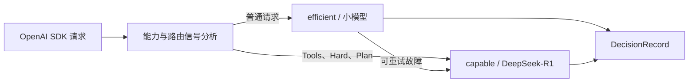

# uRouter 智能分级路由测试方案

## 1. 测试目标

验证 uRouter 能否按照请求成本、能力要求和任务难度，在小模型与大模型/推理模型之间做出稳定、可解释、可审计的选择。

重点验证以下场景：

1. 简单问候和日常问答使用低成本小模型。
2. 天气查询等工具调用任务使用具备工具能力的高等级模型。
3. 数学推理、复杂规划等任务使用大模型或推理模型。
4. 每次选择都能通过响应 Header、DecisionRecord 和 Metrics 复核。
5. 路由失败、重试和降级不会静默切换到不符合能力要求的模型。

## 2. 当前能力边界

当前路由器不会理解 Prompt 的业务语义。它不会仅因为文本中出现“天气”“方程”或“分析”就自动提升 Tier。

当前可用于路由的信号包括：

- 请求能力：`tools`、图片、音频、结构化输出、Reasoning 和上下文长度。
- 路由 Hint：`difficulty=hard`、`workload=plan`、`value_class`。
- 路由偏好：`pin_tier`、`floor_tier`、`bias`。
- 调用角色：`primary`、`auxiliary`。
- 已建立的任务或会话模型绑定。

因此，本方案把测试分成两组：

- A 组：验证当前已经实现的能力驱动和 Hint 驱动路由。
- B 组：验证未来需要补充的 Prompt 语义分类能力，其中部分用例在当前版本应作为“预期失败”记录。

## 3. 测试路由拓扑

建议测试环境使用两个 SiliconFlow 模型：

| Tier | 建议上游模型 | 定位 |
|---|---|---|
| `efficient` | `Qwen/Qwen2.5-7B-Instruct` | 问候、翻译、摘要、普通问答 |
| `capable` | `Pro/deepseek-ai/DeepSeek-R1` | 数学推理、复杂规划、工具任务 |

路由关系：



注意：Catalog 必须描述真实模型能力，不能为了让测试通过而故意把模型已有能力标记为不支持。如果小模型也支持 Tools，则 `tools` 本身不会强制升级，调用方应增加 `difficulty=hard` 或 `workload=plan`，或者在路由器中实现明确的工具任务升级策略。

## 4. 测试环境

### 4.1 服务地址

- Gateway：`http://127.0.0.1:8787`
- OpenAI SDK Base URL：`http://127.0.0.1:8787/v1`
- Auto Model：`urouter/auto`

### 4.2 密钥要求

商业 API Key 只能通过 `SILICONFLOW_API_KEY` 环境变量传给 Gateway，不得写入：

- Catalog 或 Route JSON。
- SDK 测试代码。
- Git 跟踪文件。
- DecisionRecord、日志或错误响应。

### 4.3 数据隔离

每个测试用例使用不同的 `task.id`、`trace.turn` 和 `conversation`，避免任务绑定影响其他用例。

工具调用的多轮请求使用同一个 Task/Session，以验证模型连续性。

## 5. 分层测试策略

### 5.1 L0：配置和 Catalog 校验

验证内容：

- Provider Endpoint 和认证环境变量正确。
- 模型 ID、上游模型 ID、API 类型和 Compat 完整。
- Route 中所有 Tier 和 Fallback 均有效且无环。
- Catalog Manifest 与 Catalog 内容一致。

建议命令：

```powershell
cargo run -q -p urouter-catalog -- check catalog/catalog.json
cargo test -q -p urouter-ai -j 1
```

通过标准：Catalog 校验成功，相关测试全部通过。

### 5.2 L1：Explain 无计费路由测试

优先使用 `POST /v1/explain` 验证选择逻辑。该阶段不调用商业模型，用于快速执行路由矩阵。

重点检查：

- `tier`
- `model`
- `reason`
- `alternatives`
- `requirement`
- `admission`

### 5.3 L2：OpenAI SDK 端到端测试

对 L1 中的关键用例发起真实 Chat Completions 请求，验证：

- 请求确实经过 Gateway。
- 上游模型与 Explain 结果一致。
- 非流式和流式响应均可完成。
- 响应包含 `x-urouter-decision-id`。
- DecisionRecord 中记录实际模型、Tier、Attempt、Usage 和成本。

### 5.4 L3：工具调用闭环测试

天气查询至少执行两轮：

1. 第一轮向模型提供 Weather Tool，模型返回 Tool Call。
2. 测试客户端执行固定的 Mock Weather Tool。
3. 第二轮把 Tool Result 发回模型。
4. 模型根据工具结果生成最终回答。

Gateway 只负责路由和转发，不执行工具。测试客户端必须负责 Tool Call 闭环。

### 5.5 L4：可靠性和治理测试

验证：

- 小模型临时不可用时是否按配置降级。
- HTTP 400 不重试、不跨 Tier 降级。
- HTTP 429、5xx、Timeout 和 Transport Error 按策略重试。
- 任务绑定是否在多轮调用中保持精确模型。
- `recording=none` 时不保留 DecisionRecord。
- API Key 不出现在响应、日志和记录中。

## 6. 核心测试用例矩阵

| ID | 输入场景 | 请求特征 | 当前预期 | 目标预期 | 类型 |
|---|---|---|---|---|---|
| R-001 | `你好` | 无 Tools、无 Hint | `efficient` | `efficient` | 必须通过 |
| R-002 | `把这句话翻译成英文` | 无 Tools、无 Hint | `efficient` | `efficient` | 必须通过 |
| R-003 | `今天武汉天气如何？` | 只有文本 | `efficient` | `capable` | 当前预期失败 |
| R-004 | 武汉天气查询 | 携带 Weather Tool | 能力满足的最低 Tier | `capable` | 条件通过 |
| R-005 | 武汉天气查询 | Tools + `workload=plan` | `capable` | `capable` | 必须通过 |
| R-006 | 解方程 `2x+y=7, x-y=2` | 只有文本 | `efficient` | `capable` | 当前预期失败 |
| R-007 | 同一方程 | `difficulty=hard` | `capable` | `capable` | 必须通过 |
| R-008 | 复杂实施方案 | `workload=plan` | `capable` | `capable` | 必须通过 |
| R-009 | 自动生成会话标题 | `call.role=auxiliary` | `efficient` | `efficient` | 必须通过 |
| R-010 | 强制高质量回答 | `pin_tier=capable` | `capable` | `capable` | 必须通过 |
| R-011 | 强制最低能力线 | `floor_tier=capable` | `capable` | `capable` | 必须通过 |
| R-012 | 指定具体模型 | `model=具体模型 ID` | `pinned` | `pinned` | 必须通过 |
| R-013 | 小模型故障 | 可重试 Transport/5xx | Fallback 到 `capable` | 同左 | 必须通过 |
| R-014 | 非法请求 | 上游 HTTP 400 | 不重试 | 同左 | 必须通过 |

## 7. 代表性请求

### 7.1 简单问候

```json
{
  "model": "urouter/auto",
  "messages": [
    {"role": "user", "content": "你好"}
  ],
  "urouter": {
    "contract_version": 1,
    "task": {"id": "R-001"},
    "agent": {"harness": "routing-test"},
    "call": {"role": "primary"},
    "trace": {"turn": "R-001-turn-1"},
    "data_policy": {
      "recording": "metadata_only",
      "allow_training": false,
      "allow_remote_judge": false,
      "retention_days": 1
    }
  }
}
```

预期：`tier=efficient`，`reason=default_efficient`。

### 7.2 武汉天气工具调用

```json
{
  "model": "urouter/auto",
  "messages": [
    {"role": "user", "content": "今天武汉天气如何？"}
  ],
  "tools": [
    {
      "type": "function",
      "function": {
        "name": "get_weather",
        "description": "查询指定城市的实时天气",
        "parameters": {
          "type": "object",
          "properties": {
            "city": {"type": "string"},
            "date": {"type": "string"}
          },
          "required": ["city", "date"]
        }
      }
    }
  ],
  "urouter": {
    "contract_version": 1,
    "task": {"id": "R-005"},
    "agent": {"harness": "routing-test"},
    "call": {"role": "primary"},
    "trace": {"turn": "R-005-turn-1"},
    "hint": {"difficulty": "hard", "workload": "plan"},
    "data_policy": {
      "recording": "metadata_only",
      "allow_training": false,
      "allow_remote_judge": false,
      "retention_days": 1
    }
  }
}
```

预期：`tier=capable`，`model=siliconflow/deepseek-r1-pro`。

### 7.3 二元一次方程

```json
{
  "model": "urouter/auto",
  "messages": [
    {"role": "user", "content": "求解二元一次方程：2x+y=7，x-y=2，并验证结果。"}
  ],
  "urouter": {
    "contract_version": 1,
    "task": {"id": "R-007"},
    "agent": {"harness": "routing-test"},
    "call": {"role": "primary"},
    "trace": {"turn": "R-007-turn-1"},
    "hint": {"difficulty": "hard", "workload": "solve"},
    "data_policy": {
      "recording": "metadata_only",
      "allow_training": false,
      "allow_remote_judge": false,
      "retention_days": 1
    }
  }
}
```

预期：`tier=capable`，`reason=quality_guard`。

## 8. OpenAI SDK 验证方式

```python
import os
from openai import OpenAI

client = OpenAI(
    api_key="local-gateway-test",
    base_url="http://127.0.0.1:8787/v1",
)

raw = client.chat.completions.with_raw_response.create(
    model="urouter/auto",
    messages=[{"role": "user", "content": "你好"}],
    extra_body={
        "urouter": {
            "contract_version": 1,
            "hint": {"value_class": "primary"},
        }
    },
)

print("decision:", raw.headers.get("x-urouter-decision-id"))
print("tier:", raw.headers.get("x-urouter-tier"))
print("model:", raw.headers.get("x-urouter-model"))
print(raw.parse().choices[0].message.content)
```

测试代码不得把 SiliconFlow API Key 传给客户端。商业密钥只应存在于 Gateway 进程环境中。

## 9. 结果判定

每个用例至少保留以下证据：

1. 请求 ID 或测试用例 ID。
2. HTTP 状态码。
3. `x-urouter-decision-id`。
4. 实际 Tier、模型和选择原因。
5. Attempt 数量、重试和 Fallback 深度。
6. Input、Output、Cache 和 Reasoning Usage。
7. 网关记录的成本。
8. 首 token 延迟和总响应时间。
9. Tool Call 名称、参数和最终 Tool Result。

推荐从以下接口收集证据：

- `POST /v1/explain`
- `GET /v1/decisions/{decision_id}`
- `GET /v1/tiers`
- `GET /metrics`

## 10. 验收标准

### 10.1 功能正确性

- A 组所有“必须通过”用例连续执行 3 次，Tier 和模型选择保持一致。
- 简单请求不得使用 `capable`，除非发生已记录的 Fallback。
- 带 Hard/Plan 信号的请求必须选择 `capable`。
- 工具调用必须形成合法 Tool Call，并完成 Tool Result 闭环。
- 所有实际选择必须与 Explain 或明确的运行时状态变化一致。

### 10.2 成本和性能

- 简单请求的平均成本显著低于推理请求。
- `efficient` 首 token 延迟应低于 `capable` 的基线目标。
- 无故障情况下不得出现 Retry 或 Fallback。

### 10.3 安全与治理

- 仓库、日志、响应和 DecisionRecord 中不存在商业 API Key。
- 测试记录遵守 `retention_days=1`。
- 删除 Task/Tenant 记录后，对应数据不可再次读取。

## 11. 语义路由后续验收

若要让纯文本“武汉天气”和“求解方程”在没有 Hint/Tools 的情况下自动升级，需要新增 Intent/Complexity Classifier。完成该功能后，将 R-003 和 R-006 从“当前预期失败”改为“必须通过”。

分类器至少需要输出：

- `intent`: chat、weather、math、coding、planning、tool_use。
- `difficulty`: easy、medium、hard。
- `tool_likelihood`: 0 到 1。
- `reasoning_required`: true 或 false。
- 可审计的分类原因和分类器版本。

分类器不可仅依赖关键词；测试集需要加入“武汉是个适合旅游的城市吗”和“请把方程两个字翻译成英文”等反例，防止误升级。

## 12. 当前执行阻塞

当前系统盘空间不足，Rust linker 和命令执行环境无法创建临时文件，测试 Gateway 已停止。实际执行本方案前，需要先释放系统盘空间或清理可重新生成的 `target/` 构建产物，再启动双 Tier Gateway。
