# uRouter 设计文档

> 版本：v3.2（2026-08-25 修订：v3 新增 `urouter-ai` 模型目录与通信层；v3.1 补全技术架构流程与时序图；v3.2 确立「网关优先」前置定义）
> 参考基线：
> - `opensource/LLMRouter`（ulab-uiuc，Python，路由**算法**研究平台）
> - `opensource/Switchyard`（NVIDIA-NeMo，Rust，路由**运行时**）
> - `opensource/litellm-647f2f5d…`（BerriAI，Python，部署级**负载均衡 + 可靠性引擎**）
> - `opensource/pi/packages/ai`（earendil-works，TypeScript，统一多厂商 **LLM 目录与通信层**）
> 技术选型：Rust 运行时（Axum + Tokio）+ Python 离线管线（PyTorch/ONNX）
> 产品形态：**独立网关（形态 B）为第一形态，优先实现**；可嵌入决策库（形态 A）为衍生形态，M4 交付（见 §1.5、§4.4）
>
> **版本演进**
> - v1：L-Quality（决策级联）+ L-Transport + L-Feedback（闭环）
> - v2：新增 L-Capacity（容量层）、L-Reliability（可靠层）、多实例状态、缓存亲和 —— 源自 LiteLLM 分析
> - v3：新增 L-Catalog（`urouter-ai` 模型目录与通信层）—— 源自 pi/ai 分析
> - v3.1：补全技术架构流程与时序图 —— 运行时三平面（§4.3）、两种产品形态（§4.4）、§15 的 13 张流程 / 时序 / 状态图
> - **v3.2：确立前置定义「形态 B（独立网关）优先实现」—— §1.5 新增，§4.4 / §20 / §21 据此修订**
>
> 详见 [附录 D：版本变更说明](#附录-d版本变更说明)。

---

## 目录

**第一部分：定位与骨架**
1. [定位：uRouter 要填的缺口](#1-定位urouter-要填的缺口)
   — 缺口矩阵 · 闭环 · [**前置定义：形态 B（独立网关）优先**](#15-前置定义形态-b独立网关优先)
2. [六条架构不变量](#2-六条架构不变量)
3. [六层分层模型](#3-六层分层模型)
4. [系统架构与 Crate 划分](#4-系统架构与-crate-划分)
   — 依赖图 · [运行时三平面](#43-运行时组件视图三个平面) · [两种产品形态](#44-两种产品形态的装配差异)

**第二部分：核心抽象**
5. [L-Catalog：urouter-ai 模型目录与通信层](#5-l-catalogurouter-ai-模型目录与通信层)
6. [特征平面 FeatureFrame](#6-特征平面-featureframe)
7. [L-Quality：决策级联 DecisionCascade](#7-l-quality决策级联-decisioncascade)
8. [L-Capacity：过滤器管线与选择器](#8-l-capacity过滤器管线与选择器)
9. [L-Reliability：重试 / 冷却 / 降级三层](#9-l-reliability重试--冷却--降级三层)
10. [路由工件 RouterArtifact](#10-路由工件-routerartifact)
11. [成本控制：软偏置 + 硬过滤 + 缓存亲和](#11-成本控制软偏置--硬过滤--缓存亲和)
12. [多实例状态：DualStore](#12-多实例状态dualstore)
13. [L-Feedback：决策记录与闭环回流](#13-l-feedback决策记录与闭环回流)
14. [L-Transport：Step 卸载、翻译、取消传播](#14-l-transportstep-卸载翻译取消传播)

**第三部分：工程**
15. [端到端流程](#15-端到端流程)（13 张流程 / 时序 / 状态图）
    - 主链路：[生命周期总览](#151-请求生命周期总览) · [数据形态变化](#152-数据在层间的形态变化) · [成功路径时序](#153-主链路时序图成功路径)
    - 分支路径：[启动就绪](#154-启动与就绪时序) · [重试冷却降级](#155-失败路径重试--冷却--类型化降级) · [Step 卸载](#156-stepcallmodel-卸载时序l3-判官--l4-事后升级) · [流式与取消](#157-流式与取消传播时序) · [状态同步](#158-dualstore-同步与-redis-故障降级时序) · [目录与 OAuth 刷新](#159-目录刷新与-oauth-并发刷新时序) · [热加载与灰度](#1510-工件热加载--影子--灰度--回滚时序) · [闭环慢环](#1511-闭环回流的慢环时序)
    - 全局视图：[部署健康状态机](#1512-部署健康状态机) · [时延预算](#1513-时延预算与关键路径)
16. [配置模型](#16-配置模型)
17. [离线管线 urouter-lab](#17-离线管线-urouter-lab)
18. [可观测性](#18-可观测性)
19. [目录骨架](#19-目录骨架)
20. [里程碑路线图](#20-里程碑路线图)
21. [风险清单](#21-风险清单)
22. [与四个参考项目的借鉴与分歧](#22-与四个参考项目的借鉴与分歧)
23. [附录](#23-附录)

---

# 第一部分：定位与骨架

## 1. 定位：uRouter 要填的缺口

### 1.1 一句话

**uRouter 是一个"可训练、可标定、可灰度、可回滚的 LLM 路由决策核 + 生产级路由运行时"**，核心命题是：

> **路由策略应该像模型一样被训练、被版本化、被灰度、被回滚——而不是像配置一样被拍脑袋。**

> **前置定义（形态）**：uRouter **首先是一个独立网关**（形态 B）。M0–M3 的全部交付物都以网关形态验收，配置模型、可观测性、闭环回流都围绕网关设计。可嵌入决策库（形态 A）是同一个决策核的第二种驱动方式，**M4 交付，且不允许为它牺牲网关形态的任何东西**。详见 [§1.5](#15-前置定义形态-b独立网关优先) 与 [§4.4](#44-两种产品形态的装配差异)。

### 1.2 四个参考项目各自回答了不同的问题

```
LLMRouter   ：这题有多难？该用多强的模型？        —— 会训练，不会跑
Switchyard  ：Agent 卡住了吗？要不要换更强的？     —— 会跑，不会训练，每个 tier 只有一个后端
LiteLLM     ：这个模型的哪台机器现在最健康？       —— 跑得很稳，但完全不管质量
pi/ai       ：这个模型是谁家的、怎么连、多少钱、
              有什么怪癖？                        —— 目录与通信做到极致，但不路由
uRouter     ：以上全部，而且要能证明省了钱、没掉质量
```

**关键认知**：这四个项目路由/管理的"对象"完全不同，不是同一件事的四种做法。

| 项目 | 对象 | 决策/管理依据 |
|---|---|---|
| LLMRouter | 不同能力的**模型** | query 语义 + 历史性能矩阵 |
| Switchyard | 不同能力**层级**（efficient / capable） | 会话工具轨迹信号 |
| LiteLLM | 同一模型的**不同部署** | 容量、健康度、延迟、单价、配额 |
| **pi/ai** | **厂商与模型的元数据本身** | 目录、认证、计费、能力、兼容性怪癖 |

前两个选"用多强的"，第三个选"打哪台机器"，**第四个提供前三个赖以决策的"事实"**。

### 1.3 缺口矩阵

| 能力 | LLMRouter | Switchyard | LiteLLM | pi/ai | **uRouter** |
|---|:---:|:---:|:---:|:---:|:---:|
| 可训练的判别式路由器 | ✅ 17 个 | ❌ | ❌ | ❌ | ✅ |
| query 语义特征路由 | ✅ | ❌ | ⚠️ auto_router | ❌ | ✅ |
| 会话轨迹信号路由 | ❌ | ✅ | ❌ | ❌ | ✅ |
| 部署级负载均衡 | ❌ | ❌ | ✅ **最强** | ❌ | ✅ |
| 配额 / 限流 / 冷却 | ❌ | ❌ | ✅ **最强** | ❌ | ✅ |
| 重试 / 类型化降级链 | ❌ | ⚠️ 基础 | ✅ **最强** | ❌ | ✅ |
| 多实例状态同步 | ❌ | ❌ | ✅ | ❌ | ✅ |
| 缓存亲和路由 | ❌ | ❌ | ✅ | ⚠️ 会话亲和头 | ✅ |
| **模型目录（厂商 × 模型 × API）** | ⚠️ 手写 JSON | ⚠️ 手写 TOML | ⚠️ 手写 YAML | ✅ **最强**（86 厂商，构建期生成） | ✅ |
| **分层计费模型（阶梯 / 缓存费率）** | ⚠️ 平价 | ❌ | ⚠️ 平价且模型错误 | ✅ **最强** | ✅ |
| **认证解析链（key/OAuth/环境凭据）** | ⚠️ 多 key 轮询 | ⚠️ env + 转发 | ⚠️ env | ✅ **最强** | ✅ |
| **兼容性怪癖矩阵** | ❌ | ⚠️ 三向翻译 | ⚠️ drop_params | ✅ **最强**（20+ 开关） | ✅ |
| 三向协议翻译 | ❌ | ✅ **最强** | ✅ 覆盖最广 | ✅ 多 API 实现 | ✅ |
| 离线评测与帕累托标定 | ✅ | ❌ 人工 | ❌ | ❌ | ✅ |
| **线上 → 离线的数据闭环** | ❌ | ❌ | ❌ | ❌ | ✅ **独有** |
| **策略工件热加载 / 影子 / 灰度** | ❌ | ❌ | ❌ | ❌ | ✅ **独有** |
| **在线成本预算控制** | ❌ 离线 α/β | ❌ | ⚠️ 硬过滤 | ❌ | ✅ 软偏置 + 硬闸 |
| 决策与执行分离 | ❌ | ✅ | ⚠️ | ✅ | ✅ |

**没有任何一个现有项目覆盖两层以上**，而"不要总用最贵的模型"这个诉求需要六层同时工作。

### 1.4 为什么闭环是关键

四个参考项目在**同一个位置断裂**：

- LLMRouter 的训练数据来自 `|query| × |18 个候选模型|` 的**全量预录制**。离线成立，线上永远不成立。
- Switchyard 的阈值标定要求人工跑 40–75 个任务构造四象限。方法论扎实，但**是一次性人工工程**。
- LiteLLM 根本没有质量维度——它连"这次回答好不好"都不记录。
- pi/ai 精确追踪了每次调用的 token 与成本，但**不记录决策，也没有决策可记录**。

uRouter 的答案是把这条断裂缝合成一个持续运转的环：

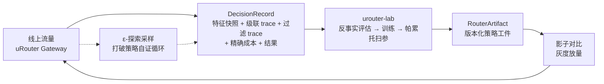
```mermaid
flowchart LR
    ONLINE["线上流量<br/>uRouter Gateway"]
    REC["DecisionRecord<br/>特征快照 + 级联 trace + 过滤 trace<br/>+ 精确成本 + 结果"]
    EXPLORE["ε-探索采样<br/>打破策略自证循环"]
    LAB["urouter-lab<br/>反事实评估 → 训练 → 帕累托扫参"]
    ART["RouterArtifact<br/>版本化策略工件"]
    SHADOW["影子对比<br/>灰度放量"]

    ONLINE --> REC --> LAB --> ART --> SHADOW --> ONLINE
    ONLINE -.-> EXPLORE -.-> REC
```

**闭环的精度上限由成本核算的精度决定**——这正是 v3 新增 L-Catalog 的直接理由（见 §5.1）。

### 1.5 前置定义：形态 B（独立网关）优先

"双形态"容易被读成"两个平权的目标"，那会让每个设计决策都要在两种上下文里各论证一遍，最终两边都做不透。**本文档明确取消这个歧义：网关是第一形态，嵌入库是衍生形态。**

#### 这条定义具体约束什么

| 维度 | 网关优先意味着 | 反面（若按双形态平权做） |
|---|---|---|
| **需求裁决** | 出现取舍时，**以网关形态的完整性为准**。嵌入库拿不到的能力（如 DualStore 跨实例配额）就是拿不到，不为它降级网关设计 | 为了让库形态也能用，把 `CapacitySnapshot` 做成可选，于是 L-Capacity 出现两条代码路径 |
| **配置模型** | §16 的 TOML 是**网关的**配置。嵌入库不读 TOML，由宿主用构造器直接组装 | 设计一套"两边都能用"的配置抽象，为一个尚不存在的用户增加一层间接 |
| **可观测性** | §18 指标与管理端点按网关设计（Prometheus + HTTP 端点）。嵌入库只暴露 `DecisionRecord` 与回调 | 为库形态发明一套 metrics 抽象层 |
| **闭环回流** | Sink、vector side-store、ε-探索采样全部是网关内置能力 | 把回流做成"宿主可插拔"，闭环的完整性依赖使用方正确实现 |
| **验收** | M0–M3 的全部交付判据都是"网关跑起来能做到什么" | 每个里程碑要验两遍 |
| **性能预算** | §15.13 的时延预算是**网关进程内**的预算，含 decode/encode 与 HTTP 栈 | 预算口径含糊 |

#### 为什么嵌入库仍然留在设计里

**因为 I1（决策核零 I/O）不是为嵌入库设的**——它首先是为了让决策逻辑可单测、可离线回放、可被 `urouter-lab` 复用。嵌入库只是这条不变量**免费带来的副产品**：当 `urouter-decide` / `urouter-capacity` / `urouter-reliability` 已经不碰任何 I/O 时，把它们打包给宿主用几乎不需要额外工作。

所以正确的表述是：

> **网关是被实现的东西，嵌入库是被保持可能的东西。**

这也解释了为什么 §4.4 的形态 A 不需要独立排期到 M0——它不是一个要被"做出来"的功能，而是一个要在 CI 里被"守住"的约束（`cargo-deny` 依赖白名单）。真到 M4 要交付时，工作量集中在文档、构造器 API 的人体工学和示例，而非架构改造。

#### 一条明确的推论

**网关成为单点故障（SPOF）不能再用"库形态兜底"来缓解**（§21 的原缓解措施据此修订）。既然形态 A 在 M4 之前不存在，网关的高可用必须靠网关自己解决：无状态多副本 + DualStore 的按种类故障语义（§12.3）+ 客户端侧多网关地址。这是"网关优先"这条定义**付出的代价**，必须写明而不是回避。

这六条是**硬约束**，配置校验和 CI 都会强制。

| # | 不变量 | 强制方式 | 针对的教训 |
|---|---|---|---|
| **I1** | **决策核零 I/O**。`urouter-decide` / `urouter-capacity` 不得依赖任何 HTTP/文件/时钟 crate；模型调用通过 `Step::CallModel` 卸载，共享状态通过注入快照读取 | `cargo-deny` 依赖白名单 + CI | Switchyard `libsy` 的设计；"可嵌入"的唯一实现方式 |
| **I2** | **特征只算一次，线上线下同源**。同一个 `FeatureFrame` 供全部决策层消费并原样落盘；工件加载时校验 `feature_schema`，不一致**拒绝加载** | 启动期 schema 校验 + 运行期 assert | LLMRouter 的"副作用注入 `self` + 缺字段只 print warning" |
| **I3** | **每个决策必须可归因**。决策必须携带 `CascadeTrace` + `FilterTrace` + 特征快照 | 归因字段为必填 | Switchyard `known_issues #2`；LiteLLM 只有文本日志 |
| **I4** | **质量层与容量层解耦**。L-Quality 只输出 tier，不接触 deployment / 配额 / 冷却；L-Capacity 只消费 tier，不接触语义 / 轨迹 / 工件 | 类型隔离（不同 crate，L-Capacity 不依赖 `urouter-infer`） | LiteLLM `auto_router` 证明了这个接缝可行 |
| **I5** | **失败必须类型化**。任何"候选集清空"或"上游失败"都必须产出能标识原因的类型化错误，禁止字符串匹配 | `FilterExhausted` / `UpstreamError` 为封闭枚举 | LiteLLM 的错误类型直接决定走哪条 fallback 链 |
| **I6**<br/>*(v3 新增)* | **模型事实单一来源**。价格、上下文窗口、能力、兼容性开关**只能来自 `urouter-ai` 目录或显式声明的覆盖**；任何硬编码或散落在多处的副本都是缺陷。成本核算必须是**离线在线共用的同一份实现** | 配置解析只允许 `catalog_ref + overrides` 两种来源；`calculate_cost` 通过 PyO3 暴露给 `urouter-lab` | pi/ai 的目录设计；且这是 **I2 在成本维度上的延伸**——reward 依赖成本，成本算错等价于标签错 |

---

## 3. 六层分层模型

### 3.1 总览

```
┌──────────────────────────────────────────────────────────────┐
│ L-Quality  质量层   ← LLMRouter（语义）+ Switchyard（轨迹）   │
│   FeatureFrame → DecisionCascade → BudgetGovernor（软偏置）   │
│   输入：Request      输出：TierRef + CascadeTrace             │
│   回答："这个请求需要多强的模型？"                             │
├──────────────────────────────────────────────────────────────┤
│ L-Capacity 容量层   ← LiteLLM                                 │
│   DeploymentFilter 链 → DeploymentPicker                      │
│   输入：TierRef      输出：DeploymentRef + FilterTrace         │
│   回答："这个 tier 下的 N 个部署，现在该打哪一台？"             │
├──────────────────────────────────────────────────────────────┤
│ L-Reliability 可靠层 ← LiteLLM + Switchyard（取消传播）        │
│   retry（零退避规则）→ cooldown（失败率）→ fallback（类型化链）│
│   回答："打失败了怎么办？"                                     │
├──────────────────────────────────────────────────────────────┤
│ L-Transport 传输层  ← Switchyard                              │
│   三向协议翻译 · 流式 · 取消传播                               │
│   回答："怎么把请求变成上游听得懂的字节？"                      │
├──────────────────────────────────────────────────────────────┤
│ L-Catalog  目录层   ← pi/ai            ★ v3 新增              │
│   ProviderSpec · ModelSpec · ModelCost · Auth · Compat         │
│   回答："有哪些模型？怎么连？多少钱？能干什么？有什么怪癖？"      │
│   ── 横切基础层，为上面全部四层提供"事实"，自身不做任何决策 ──   │
├──────────────────────────────────────────────────────────────┤
│ L-Feedback 闭环层   ← uRouter 独有                            │
│   DecisionRecord · ε-探索 · 反事实评估 · 工件热加载            │
│   回答："怎么让这一切下个月比这个月更好？"                      │
└──────────────────────────────────────────────────────────────┘
```

L-Catalog 画在 L-Transport 之下、L-Feedback 之上，是因为它**既向上供给事实，又向下（闭环）供给成本核算**——它是唯一被全部其他层依赖的层。

### 3.2 两级路由的接缝

L-Quality 与 L-Capacity 之间的接口就是一个 tier 名 + 归因：

```rust
/// L-Quality 的输出，L-Capacity 的输入
pub struct QualityDecision {
    pub tier: TierRef,                  // 语义层级名，不是具体模型
    pub tier_fallbacks: Vec<TierRef>,   // tier 整体不可用时的降级顺序
    pub trace: CascadeTrace,            // 完整级联归因（I3）
    pub request: Request,               // 可能被 decider 改写过
    pub response: Option<Response>,     // escalation / advisor 路径已产出的答案
}
```

LiteLLM 的 `auto_router` 用"改写 `model` 字段"实现了同样的解耦。uRouter 采纳这个接缝，但把接口加宽：**除了 tier 名，还带 `CascadeTrace` 下去**。

**收益**：L-Quality 可以完全不存在（等价于 LiteLLM）；L-Capacity 可以退化为 passthrough（等价于 Switchyard）；两层各自独立替换、测试、标定。

---

## 4. 系统架构与 Crate 划分

### 4.1 依赖图

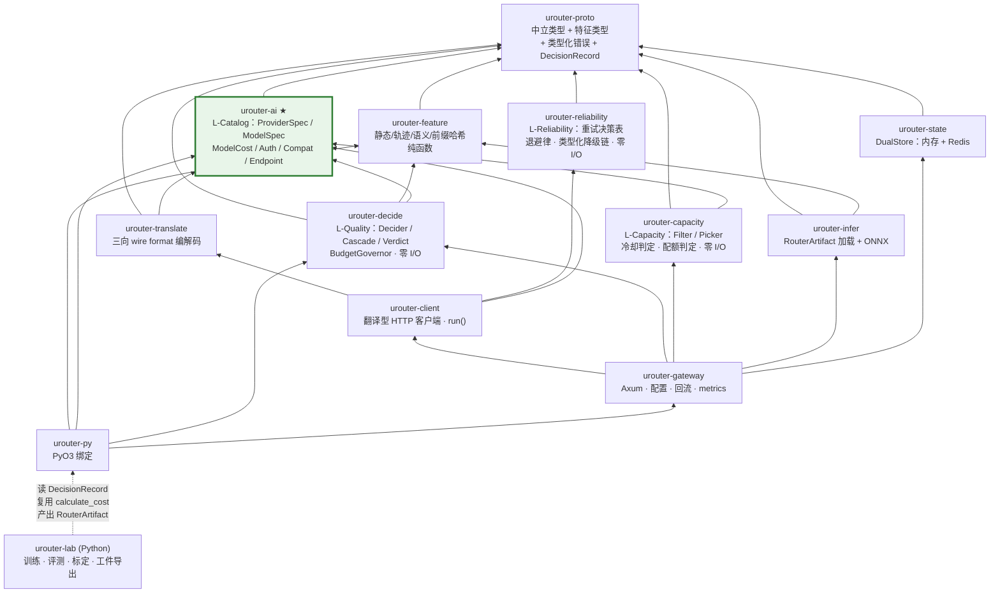
```mermaid
flowchart BT
    PROTO["urouter-proto<br/>中立类型 + 特征类型<br/>+ 类型化错误 + DecisionRecord"]
    AI["urouter-ai ★<br/>L-Catalog：ProviderSpec / ModelSpec<br/>ModelCost / Auth / Compat / Endpoint"]
    FEAT["urouter-feature<br/>静态/轨迹/语义/前缀哈希<br/>纯函数"]
    DECIDE["urouter-decide<br/>L-Quality：Decider / Cascade / Verdict<br/>BudgetGovernor · 零 I/O"]
    CAP["urouter-capacity<br/>L-Capacity：Filter / Picker<br/>冷却判定 · 配额判定 · 零 I/O"]
    REL["urouter-reliability<br/>L-Reliability：重试决策表<br/>退避律 · 类型化降级链 · 零 I/O"]
    INFER["urouter-infer<br/>RouterArtifact 加载 + ONNX"]
    STATE["urouter-state<br/>DualStore：内存 + Redis"]
    TRANS["urouter-translate<br/>三向 wire format 编解码"]
    CLIENT["urouter-client<br/>翻译型 HTTP 客户端 · run()"]
    GW["urouter-gateway<br/>Axum · 配置 · 回流 · metrics"]
    PY["urouter-py<br/>PyO3 绑定"]
    LAB["urouter-lab (Python)<br/>训练 · 评测 · 标定 · 工件导出"]

    AI --> PROTO
    FEAT --> PROTO
    DECIDE --> PROTO
    DECIDE --> FEAT
    DECIDE --> AI
    CAP --> PROTO
    CAP --> AI
    REL --> PROTO
    INFER --> PROTO
    INFER --> FEAT
    STATE --> PROTO
    TRANS --> PROTO
    TRANS --> AI
    CLIENT --> TRANS
    CLIENT --> REL
    CLIENT --> AI
    GW --> CLIENT
    GW --> DECIDE
    GW --> CAP
    GW --> INFER
    GW --> STATE
    PY --> FEAT
    PY --> AI
    PY --> DECIDE
    PY --> GW
    LAB -.->|"读 DecisionRecord<br/>复用 calculate_cost<br/>产出 RouterArtifact"| PY

    style AI fill:#e8f5e9,stroke:#2e7d32,stroke-width:3px
```

绿色为 v3 新增。注意 `urouter-ai` 被 `decide` / `capacity` / `translate` / `client` / `py` 五个 crate 依赖——它是**依赖扇入最高的非 proto crate**，这正是"横切基础层"的形状。

### 4.2 Crate 职责边界

| Crate | 层 | 职责 | 关键导出 | 不允许做的事 |
|---|---|---|---|---|
| `urouter-proto` | — | 中立类型 + `FeatureFrame`/`Verdict`/`FilterExhausted`/`UpstreamError`/`DecisionRecord` | 类型 + serde | 路由、翻译、I/O |
| **`urouter-ai`** | **L-Catalog** | 厂商与模型目录、端点解析、认证链、计费模型、能力与兼容性矩阵、跨 provider 消息交接 | `ProviderSpec`/`ModelSpec`/`ModelCost`/`calculate_cost`/`AuthResolver`/`Compat`/`Catalog` | 路由决策；请求路径上的阻塞网络调用（目录刷新是独立的异步任务） |
| `urouter-feature` | — | 从 `Request` 抽取四族特征。纯函数 | `FeatureExtractor`、四个 `*Features` | 调用 embedding 模型 |
| `urouter-decide` | L-Quality | `Decider` trait、`Cascade`、`Verdict`、`BudgetGovernor`、`Step`/`Driver` | `Decider`/`Cascade`/`Driver`/`Step` | 任何 I/O（**I1**）、接触 deployment（**I4**） |
| `urouter-capacity` | L-Capacity | `DeploymentFilter`/`DeploymentPicker`、冷却判定律、配额判定律 | `DeploymentFilter`/`DeploymentPicker`/`CooldownPolicy` | 任何 I/O、接触语义特征（**I4**） |
| `urouter-reliability` | L-Reliability | 重试决策表、退避律、类型化降级链解析。**纯决策，不执行** | `RetryDecision`/`BackoffPolicy`/`FallbackPolicy` | 发起调用 |
| `urouter-infer` | L-Quality | 加载 `RouterArtifact`，本地 ONNX 推理 | `ArtifactStore`、`OnnxDecider` | 网络调用 |
| `urouter-state` | — | `DualStore`：内存 + Redis 双层，批量增量管线，对账 | `DualStore`、`CapacitySnapshot` | 决策逻辑 |
| `urouter-translate` | L-Transport | 三向互译，含流式；**消费 `Compat` 决定怪癖处理** | `decode`/`encode`/`stream` | 路由决策 |
| `urouter-client` | L-Transport | 翻译型 HTTP 客户端 + `run()`；**消费 `Endpoint` 与解析后的认证** | `run`、`ClientRouter` | 决策逻辑 |
| `urouter-gateway` | — | Axum 服务、TOML 配置、工件热加载与灰度、回流写入、Prometheus | `main`、`config` | 算法逻辑 |
| `urouter-py` | — | PyO3 绑定，暴露 `urouter-feature` **与 `urouter-ai::calculate_cost`** 给训练侧 | `_urouter_rust` | — |
| `urouter-lab` | L-Feedback | Python：数据集构建、反事实评估、训练、扫参、工件导出 | CLI `urouter-lab` | 自行实现成本核算（**I6**） |

### 4.3 运行时组件视图：三个平面

依赖图说的是"编译期谁依赖谁"，运行期真正需要分清的是**三个平面**——它们的时延预算、失败语义、变更频率完全不同。

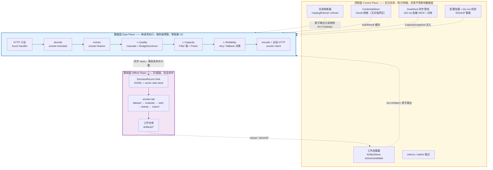
```mermaid
flowchart TB
    subgraph DP["数据面 Data Plane —— 每请求执行，微秒级预算，零阻塞 I/O"]
        direction LR
        IN["HTTP 入站<br/>Axum handler"] --> DEC["decode<br/>urouter-translate"]
        DEC --> FE["extract<br/>urouter-feature"]
        FE --> QL["L-Quality<br/>Cascade + BudgetGovernor"]
        QL --> CL["L-Capacity<br/>Filter 链 + Picker"]
        CL --> RL["L-Reliability<br/>retry / fallback 决策"]
        RL --> OUT["encode + 出站 HTTP<br/>urouter-client"]
    end

    subgraph CP["控制面 Control Plane —— 后台任务，秒/分钟级，失败不得影响数据面"]
        direction LR
        CFG["配置加载 + dry-run 校验<br/>SIGHUP 重载"]
        CATR["目录刷新器<br/>CatalogRefresh::refresh"]
        ARTL["工件加载器<br/>ArtifactStore active/candidate"]
        CRED["CredentialStore<br/>OAuth 刷新（互斥临界区）"]
        SYNC["DualStore 同步管线<br/>100 ms 批量 INCR + 对账"]
        MET["metrics / admin 端点"]
    end

    subgraph OP["离线面 Offline Plane —— 天/周级，完全异步"]
        direction LR
        SINK["DecisionRecord Sink<br/>JSONL + vector side-store"]
        LAB["urouter-lab<br/>dataset → evaluate → train → sweep → export"]
        REG["工件仓库<br/>artifacts/*"]
    end

    CATR -.->|"原子换出只读快照 Arc&lt;Catalog&gt;"| DP
    ARTL -.->|"Arc&lt;Artifact&gt; 原子换出"| DP
    CRED -.->|"AuthResult 缓存"| DP
    SYNC -.->|"CapacitySnapshot 注入"| DP
    CFG -.-> DP
    DP -.->|"异步 mpsc，满则丢弃并计数"| SINK
    SINK --> LAB --> REG -.->|"reload / SIGHUP"| ARTL

    style DP fill:#e3f2fd,stroke:#1565c0,stroke-width:2px
    style CP fill:#fff8e1,stroke:#f9a825,stroke-width:2px
    style OP fill:#f3e5f5,stroke:#7b1fa2,stroke-width:2px
```

**三条平面间的硬约束**（都是 **I1** 的运行期表述）：

| 约束 | 内容 | 违反的后果 |
|---|---|---|
| **C1 单向注入** | 控制面只能通过**原子换出只读快照**（`Arc<Catalog>` / `Arc<Artifact>` / `CapacitySnapshot`）向数据面供给，数据面**从不主动等待**控制面 | 目录刷新一慢，全部请求跟着卡——pi/ai 用 `models()` 同步读 / `refresh()` 异步取的分离正是为此（§5.8） |
| **C2 回流不阻塞** | 数据面 → 离线面只走有界 mpsc，**队列满时丢弃并计数**（`urouter_record_dropped_total`），绝不背压到请求 | 日志盘卡住 = 网关卡住 |
| **C3 快照一致** | 一次请求在入口处**一次性取齐** `Arc<Catalog>` + `Arc<Artifact>` + `CapacitySnapshot`，全程不再重取 | 级联中途目录被换出，L2 用旧价格打分、成本用新价格核算，`DecisionRecord` 自相矛盾（**I2/I6**） |

C3 值得展开：一次请求持有的三个快照句柄构成一个**决策上下文的版本三元组** `(catalog.structure_hash, artifact_id, snapshot.taken_at)`，三者全部写进 `DecisionRecord`。半年后回看某条记录时，这三个值决定了它能否被复现。

### 4.4 两种产品形态的装配差异

> **本节的前置定义见 §1.5：形态 B（独立网关）优先实现，M0–M3 全部以网关形态交付；形态 A（可嵌入决策库）是 I1 的副产品，M4 交付。**

同一套 crate，两种装配方式。**决策核完全相同，差异只在谁来执行 `Step` 和谁来持有状态**。

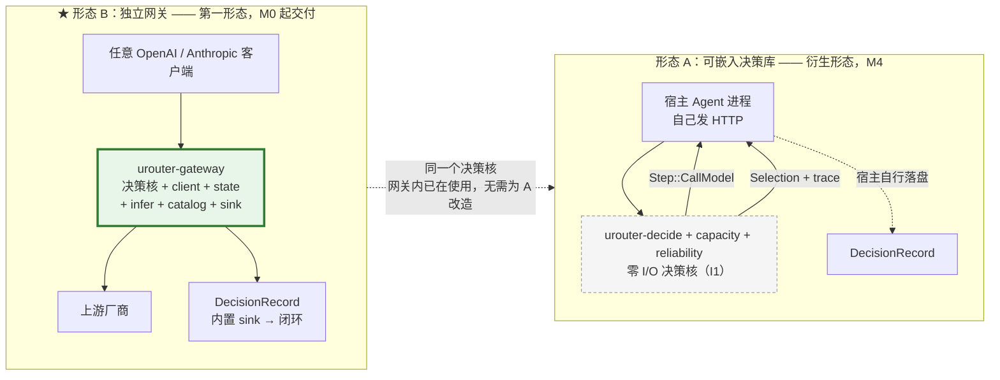
```mermaid
flowchart LR
    subgraph GWM["★ 形态 B：独立网关 —— 第一形态，M0 起交付"]
        CLI2["任意 OpenAI / Anthropic 客户端"] --> GW2["urouter-gateway<br/>决策核 + client + state<br/>+ infer + catalog + sink"]
        GW2 --> UP["上游厂商"]
        GW2 --> RECB["DecisionRecord<br/>内置 sink → 闭环"]
    end

    subgraph EMB["形态 A：可嵌入决策库 —— 衍生形态，M4"]
        HOST["宿主 Agent 进程<br/>自己发 HTTP"]
        HOST --> LIB["urouter-decide + capacity + reliability<br/>零 I/O 决策核（I1）"]
        LIB -->|"Step::CallModel"| HOST
        LIB -->|"Selection + trace"| HOST
        HOST -.->|"宿主自行落盘"| RECA["DecisionRecord"]
    end

    GWM -.->|"同一个决策核<br/>网关内已在使用，无需为 A 改造"| EMB

    style GW2 fill:#e8f5e9,stroke:#2e7d32,stroke-width:3px
    style LIB fill:#f5f5f5,stroke:#9e9e9e,stroke-dasharray: 4 3
```

| 维度 | **形态 B：网关（优先）** | 形态 A：嵌入库（M4） |
|---|---|---|
| 交付时间 | **M0 起，每个里程碑都以它验收** | M4 |
| 谁执行模型调用 | `urouter-client` | 宿主（通过 `Driver` 应答 `Step::CallModel`） |
| 容量状态从哪来 | `urouter-state::DualStore`（跨实例） | 宿主注入 `CapacitySnapshot`（可以是全零 = 退化为纯质量路由） |
| 目录从哪来 | `[catalog]` 配置 + 刷新器 | 宿主构造 `Arc<Catalog>`（可只含自己用的几个模型） |
| 配置 | §16 的 TOML + `--dry-run` 16 项校验 | 无 TOML，构造器直接组装 |
| 可观测性 | Prometheus + §18.3 管理端点 | 只暴露 `DecisionRecord` 与回调 |
| 回流闭环 | **内置完整**（sink + vector side-store + ε-探索） | 宿主自行处理，闭环完整性由使用方保证 |
| 典型用户 | 想要开箱即用的多厂商负载均衡 + 质量路由 | 已有自研 LLM 客户端、只想要"该用多强的模型"这个答案 |

**这不是两套代码**，而是同一个决策核的两种驱动方式——这正是 **I1（决策核零 I/O）** 唯一的实现方式，也是 Switchyard `libsy` 的设计给出的答案。

**形态 A 的成本几乎全部已经付掉了**：M0 就要求 `urouter-decide` / `urouter-capacity` / `urouter-reliability` 零 I/O 并有 `cargo-deny` 白名单守着，网关自己就是它们的第一个宿主（§15.6 的 `Step::CallModel` 卸载链路在网关里天天在跑）。M4 剩下的是构造器 API 的人体工学、文档和示例——**不是架构改造**。反过来说：**如果哪天为了赶网关进度而让决策核碰了 I/O，形态 A 就不是"延后"，而是"没了"**，同时失去的还有决策逻辑的可单测性与 `urouter-lab` 的离线复用。这是 I1 在 CI 里被强制的真正理由。

---

# 第二部分：核心抽象

## 5. L-Catalog：urouter-ai 模型目录与通信层

> **v3 全新章节。** 参考 `opensource/pi/packages/ai`（23,056 行、86 个厂商、40+ 内置 provider）。

### 5.1 为什么需要独立的目录层

v2 里"模型的事实"散落在三处，每一处都是缺陷来源：

| 散落位置 | 问题 |
|---|---|
| `[targets.*]` TOML 手写 `price` / `max_input_tokens` / `capabilities` | **维护地狱 + 静默错误**。每加一个部署要手抄一遍。价格抄错 → reward 算错 → 训练出错误策略。这是一条从"配置录入失误"直通"模型学到错误偏好"的路径，而且**没有任何环节会报错** |
| `urouter-translate` 内部处理 wire format 差异 | v2 假装 `format = "openai_chat"` 就够了。**"OpenAI 兼容"是个谎言**——pi 用 20+ 个逐 provider 开关才让 40 多个"OpenAI 兼容"端点真正跑通 |
| `urouter-client` 处理 `api_key_env` | 只覆盖了最简单的一种认证。OAuth、AWS profile、gcloud ADC、provider 级非密钥配置（Cloudflare account/gateway id）全都没有位置放 |

而 v2 的成本模型本身也是**不完整的**：`price = {input_per_mtok, output_per_mtok, cached_input_per_mtok}` 漏掉了阶梯定价、cache write 费率、以及 Anthropic 1h 缓存写入按 2× 基础输入价计费的规则。

**这三件事合起来意味着：v2 的闭环精度上限，被"模型事实"的录入质量卡死了。** 而闭环是 uRouter 的核心命题。所以 L-Catalog 不是锦上添花的工程整洁，是**核心命题的前提条件**——因此引入不变量 **I6**。

### 5.2 定位与职责

`urouter-ai` 回答四个问题，服务于其余全部五层，**自身不做任何决策**：

| 问题 | 产出 | 消费者 |
|---|---|---|
| **有哪些模型？** | `Catalog`（provider × model × api） | 配置解析、`/v1/models`、`/v1/tiers` |
| **怎么连上？** | `Endpoint`（base_url + 解析后的认证 + headers + provider env） | L-Transport（`urouter-client`） |
| **多少钱？** | `ModelCost` + `calculate_cost()` 纯函数 | L-Quality（reward/预算）、L-Capacity（`BudgetFilter`）、L-Feedback（**离线 reward 列，同一份实现**） |
| **能干什么 / 有什么怪癖？** | `Capabilities` + `Compat` | L-Capacity（`CapabilityFilter`）、L-Transport（翻译）、**L-Feedback（数据可用性判定）** |

### 5.3 核心类型

```rust
// ═══════════ 厂商 ═══════════

pub struct ProviderSpec {
    pub id: ProviderId,                     // "anthropic" / "azure-openai" / "vllm-local"
    pub name: String,                       // 展示名
    pub base_url: Option<String>,           // 默认端点，模型可覆盖；支持 {var} 占位符
    pub auth: ProviderAuth,                 // 认证语义，见 5.6
    pub headers: Option<HeaderMap>,         // 厂商级固定头
    pub catalog_source: CatalogSource,      // Static | Dynamic { refresh: ... }
}

// ═══════════ 模型 ═══════════

pub struct ModelSpec {
    pub id: ModelId,                        // 发给上游的真实模型 ID
    pub name: String,
    pub provider: ProviderId,
    pub api: WireApi,                       // openai_chat / openai_responses / anthropic_messages / ...
    pub base_url: String,                   // 可含 {var} 占位符
    pub cost: ModelCost,                    // 见 5.5
    pub capabilities: Capabilities,         // 见 5.4
    pub compat: Compat,                     // 见 5.7
    pub headers: Option<HeaderMap>,         // 模型级固定头
    pub default_sampling: Option<SamplingParams>,
}

// ═══════════ 能力 ═══════════

pub struct Capabilities {
    pub context_window: u32,
    pub max_output_tokens: u32,
    pub input_modalities: EnumSet<Modality>,    // text | image | audio | video
    pub tool_calling: bool,
    pub structured_output: bool,
    pub reasoning: bool,
    /// uRouter 的 thinking 档位 → 该模型的具体取值。
    /// None = 用厂商默认；Unsupported = 该档位不可用。
    pub thinking_levels: ThinkingLevelMap,
    pub prompt_cache: PromptCacheSupport,       // 见 5.7
}
```

### 5.4 能力矩阵：v2 的 `CapabilityFilter` 终于有了数据来源

v2 的 `[targets.*].capabilities = ["tool_calling", "vision"]` 是手写的字符串数组。v3 起它来自目录，且 `ContextWindowFilter` / `CapabilityFilter` 直接读 `ModelSpec.capabilities`：

```rust
impl DeploymentFilter for CapabilityFilter {
    fn filter(&self, ctx: &FilterCtx, candidates: Vec<DeploymentRef>)
        -> Result<Vec<DeploymentRef>, FilterExhausted>
    {
        let need = &ctx.features.statics;
        let kept: Vec<_> = candidates.into_iter().filter(|d| {
            let cap = &ctx.catalog.model(d).capabilities;
            (!need.has_images       || cap.input_modalities.contains(Modality::Image))
                && (!need.structured_output || cap.structured_output)
                && (need.tool_count == 0    || cap.tool_calling)
        }).collect();
        if kept.is_empty() { return Err(FilterExhausted::CapabilityUnmet { .. }); }
        Ok(kept)
    }
}
```

**配置校验的新一条**：同一 tier 内所有部署的 `capabilities` 与 `context_window` 必须一致（见 §16.1 第 12 条）。这正是为了避免 LiteLLM 那个"把不同能力模型塞进同一 model_group 导致 cost-routing 变成无条件降级"的陷阱——而现在有了目录，这条校验**可以自动执行**而不是靠人守纪律。

### 5.5 计费模型：v2 成本模型的实质性修正

#### 类型

```rust
pub struct CostRates {
    pub input: f64,        // $/M tokens
    pub output: f64,
    pub cache_read: f64,   // 缓存命中的输入
    pub cache_write: f64,  // 写入缓存的输入
}

pub struct CostTier {
    /// 当请求的总输入 token 超过此阈值时，**整个请求**改用本档费率
    pub input_tokens_above: u32,
    pub rates: CostRates,
}

pub struct ModelCost {
    pub base: CostRates,
    /// 长上下文阶梯定价。取所有满足条件的档中阈值最高的那档。
    pub tiers: Vec<CostTier>,
    /// 长时缓存写入的特殊规则（Anthropic 1h 缓存按 2× 基础输入价计费）
    pub long_cache_write: Option<LongCacheWriteRule>,
}

/// 纯函数。通过 PyO3 暴露给 urouter-lab（不变量 I6）。
pub fn calculate_cost(cost: &ModelCost, usage: &Usage) -> CostBreakdown {
    let total_input = usage.input + usage.cache_read + usage.cache_write;

    // 阶梯：整个请求按最高匹配档计价，不是分段累进
    let mut rates = &cost.base;
    let mut matched = -1i64;
    for tier in &cost.tiers {
        if total_input as i64 > tier.input_tokens_above as i64
            && tier.input_tokens_above as i64 > matched {
            rates = &tier.rates;
            matched = tier.input_tokens_above as i64;
        }
    }

    let long_write  = usage.cache_write_long.unwrap_or(0);
    let short_write = usage.cache_write - long_write;
    let long_multiplier = cost.long_cache_write
        .as_ref().map(|r| r.input_multiplier).unwrap_or(1.0);

    CostBreakdown {
        input:       rates.input      / 1e6 * usage.input as f64,
        output:      rates.output     / 1e6 * usage.output as f64,
        cache_read:  rates.cache_read / 1e6 * usage.cache_read as f64,
        cache_write: (rates.cache_write * short_write as f64
                     + rates.input * long_multiplier * long_write as f64) / 1e6,
    }
}
```

#### 为什么阶梯定价对 uRouter 是实质性的，而不是细节

考虑一个真实场景（数字为示意）：

| 模型 | 基础输入价 | > 200k 档 | 输出价 |
|---|---:|---:|---:|
| A（"强"模型） | $3.0/M | $6.0/M | $15/M |
| B（"更强"模型） | $15/M | 无阶梯 | $75/M |

在 250k 上下文、短输出的请求上，A 的输入成本是 `250k × $6/M = $1.50`，B 是 `250k × $15/M = $3.75`。用平价模型算，A 是 `$0.75`——**低估了一倍**。

后果链条：

```
成本低估 → reward = α·quality − β·cost 中 cost 项偏小
        → 训练出的策略认为"升级到 A 很便宜"
        → 系统性过度升级
        → 上线后实际花费远超离线预测
        → 而离线评测报告会显示"我们省了 58%"
```

**长上下文正是编码 Agent 的常态**（累积的工具历史 + 大 system prompt），所以这不是边缘 case，是主路径。v2 的成本模型会在主路径上系统性算错，且**错得毫无征兆**——这是我认为 pi/ai 分析带来的最重要的单点修正。

#### 三条配套规则

1. **`calculate_cost` 是纯函数，且离线在线共用同一份实现**（PyO3 暴露）。理由与 `urouter-feature` 走 PyO3 完全相同：reward 依赖成本，成本核算的训练/服务偏差等价于标签噪声（**I6**）。
2. **缺 `cost` 的模型不允许进候选池**。启动校验第 5 条，见 §16.1。**绝不用魔数兜底**——LiteLLM 用 `5.0` 作为未知模型的默认单价，行为隐式且难排查。
3. **`CostBreakdown` 四项分列落盘**，不只存 total。`DecisionRecord` 需要它来区分"降级省的钱"与"缓存省的钱"（见 §11.1、§18.2）。

### 5.6 认证解析链

#### 优先级

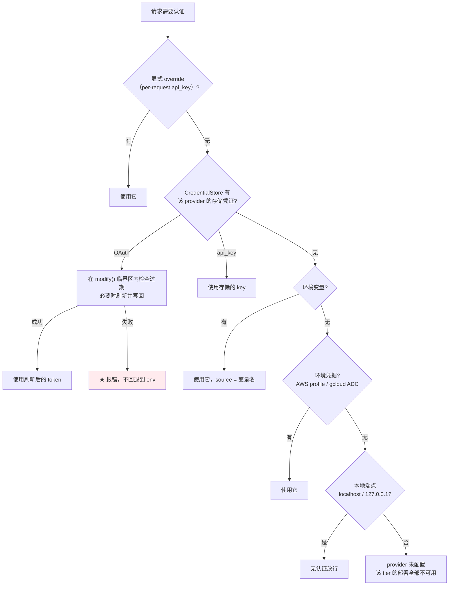
```mermaid
flowchart TB
    A["请求需要认证"] --> B{"显式 override<br/>（per-request api_key）?"}
    B -->|有| USE1["使用它"]
    B -->|无| C{"CredentialStore 有<br/>该 provider 的存储凭证?"}
    C -->|OAuth| D["在 modify() 临界区内检查过期<br/>必要时刷新并写回"]
    D -->|成功| USE2["使用刷新后的 token"]
    D -->|失败| ERR["★ 报错，不回退到 env"]
    C -->|api_key| USE3["使用存储的 key"]
    C -->|无| E{"环境变量?"}
    E -->|有| USE4["使用它，source = 变量名"]
    E -->|无| F{"环境凭据?<br/>AWS profile / gcloud ADC"}
    F -->|有| USE5["使用它"]
    F -->|无| G{"本地端点<br/>localhost / 127.0.0.1?"}
    G -->|是| USE6["无认证放行"]
    G -->|否| UNCONF["provider 未配置<br/>该 tier 的部署全部不可用"]

    style ERR fill:#ffebee
```

#### 三条关键规则（借鉴 pi/ai）

**① 存储凭证一旦存在就拥有该 provider——刷新失败绝不静默回退到环境变量。**

pi 的注释写得很直接：

> A stored credential owns the provider: ambient/env is consulted only when nothing is stored. No silent env fallback after a failed refresh.

为什么重要：OAuth 过期后悄悄改用一个不同账号的 env key，会让**计费、配额、审计全部记到错的主体上**。对 uRouter 尤其致命——预算控制的作用域会失效，`DecisionRecord` 里的成本归属会错。宁可这个 provider 整体不可用（由 L-Reliability 的 tier 降级接管），也不要错误的凭证。

**② OAuth 刷新必须在 `CredentialStore::modify()` 的串行化临界区内。**

```rust
pub trait CredentialStore: Send + Sync {
    async fn read(&self, provider: &ProviderId) -> Result<Option<Credential>>;
    /// 唯一写入路径。按 provider id 互斥（支持跨进程文件锁）。
    /// fn 能看到当前凭证——正确的写入（刷新、刷新期间登录）依赖于此。
    async fn modify(
        &self, provider: &ProviderId,
        f: impl FnOnce(Option<Credential>) -> BoxFuture<Result<Option<Credential>>>,
    ) -> Result<Option<Credential>>;
    async fn delete(&self, provider: &ProviderId) -> Result<()>;
}
```

网关是高并发的：token 过期的瞬间可能有几十个请求同时发现"该刷新了"。没有串行化就会并发刷新，而多数 OAuth 实现会**轮换 refresh token**——第二个刷新拿着已作废的 token，直接把这个 provider 打死。这个 bug 只在高并发 + token 恰好过期时出现，极难复现。

**③ `AuthResult` 必须带 `source` 标签。**

```rust
pub struct AuthResult {
    pub auth: RequestAuth,           // api_key / headers / base_url 覆盖
    pub env: Option<ProviderEnv>,    // provider 级非密钥配置
    pub source: String,              // "ANTHROPIC_API_KEY" / "OAuth" / "~/.aws/credentials"
}
```

`source` 进 `/v1/tiers` 和启动日志。运维排查"为什么这个部署认证失败"时，第一个问题永远是"它到底用的哪个凭证"。

#### provider env：非密钥的厂商级配置

Cloudflare 的 account id / gateway id、Azure 的 deployment name、Vertex 的 project/location——这些不是密钥，但也不是模型属性。pi 用 `ProviderEnv = Record<String, String>` 承载，并在 `base_url` 里用 `{var}` 占位符材料化：

```toml
[providers.cloudflare-gateway]
base_url = "https://gateway.ai.cloudflare.com/v1/{CF_ACCOUNT_ID}/{CF_GATEWAY_ID}/openai"
env = { CF_ACCOUNT_ID = "$env:CF_ACCOUNT_ID", CF_GATEWAY_ID = "prod-gw" }
```

占位符在 `Endpoint` 解析时替换，**未解析的占位符导致启动失败**（而不是发出一个带字面量 `{CF_ACCOUNT_ID}` 的请求）。

### 5.7 Compat 矩阵：怪癖是路由的输入，不只是翻译的输入

pi 为 `openai-completions` 一个 API 就定义了 20+ 个逐 provider 的兼容开关。这不是过度设计——`maxTokensField` 到底是 `max_tokens` 还是 `max_completion_tokens`、工具结果要不要带 `name`、thinking 参数有 11 种格式，这些差异真实存在且会让请求直接 400。

uRouter 采纳这个矩阵，但要强调一个 v2 完全没有意识到的点：**有三个 compat 项会直接影响路由决策与训练数据质量，不只影响翻译。**

#### ① `supports_usage_in_streaming` —— 影响训练数据可用性

```rust
pub struct Compat {
    /// 流式响应是否返回 token usage（OpenAI 的 stream_options.include_usage）。
    /// ★ false 意味着该部署的流式请求拿不到 usage
    ///   → 没有成本 → 没有 reward → 这条 DecisionRecord 不能用于训练
    pub supports_usage_in_streaming: bool,
    /// 流式响应是否包含 finish_reason。false 时需要从流结束推断 stop/toolUse。
    pub supports_finish_reason: bool,
    // ... 其余翻译相关开关
}
```

后果处理：

```rust
// 写 DecisionRecord 时
let usage_unavailable = request.is_streaming()
    && !catalog.model(&selected).compat.supports_usage_in_streaming;
```

`DecisionRecord.execution.usage_unavailable = true` 的记录，`urouter-lab` 在 `build-dataset` 阶段**直接剔除**（不是降权——没有成本就没有 reward，这条样本无法构造标签）。且指标 `urouter_usage_unavailable_total{deployment}` 必须暴露：**如果某个 tier 的主力部署恰好不支持流式 usage，你会在毫不知情的情况下损失掉该 tier 的绝大部分训练数据**。

#### ② 缓存相关开关 —— 决定缓存亲和路由有没有收益

```rust
pub struct PromptCacheSupport {
    pub enabled: bool,
    pub min_cacheable_tokens: u32,           // 低于此值缓存无收益（OpenAI 1024）
    pub retention: CacheRetention,           // Default | Long { ttl }
    pub control_format: Option<CacheControlFormat>,   // Anthropic 显式 cache_control
    pub session_affinity: Option<SessionAffinityFormat>, // 发哪个头做亲和
}
```

§11.3 的缓存亲和路由**必须查这个**：

- `enabled = false` 的部署，亲和加分恒为 0
- `statics.cacheable_prefix_tokens < min_cacheable_tokens` 时跳过亲和逻辑
- `session_affinity` 决定发 `x-session-id` 还是 `session_id` + `x-client-request-id`——**发错了亲和就不生效，而且不会报错**，只是缓存命中率悄悄归零

#### ③ 自动探测 + 显式覆盖的两级策略

pi 的做法是：`compat` 未设置时按 `base_url` 自动探测已知端点，部分设置时未指定字段用探测默认值。

uRouter **收紧这条**：自动探测仅对目录内置的已知厂商生效；**自定义端点（企业网关、自建 vLLM）必须显式声明 `compat`，否则启动失败**。理由是 uRouter 的成本核算和训练数据依赖 compat 的正确性，静默猜错的代价比 pi（一个客户端库）高得多。

### 5.8 目录的生成、校验与刷新

#### 静态目录：构建期生成 + 完整性校验

pi 从 [models.dev](https://models.dev) 生成 86 个厂商的模型 JSON，配 `.manifest.json`：

```json
{
  "schemaVersion": 3,
  "generatedAt": "2026-08-20T...",
  "structureHash": "sha256:...",
  "files": { "anthropic.json": "sha256:...", "openai.json": "sha256:..." }
}
```

CI 用 `check-model-data` 校验：文件哈希、结构哈希、以及**生成代码里声明的模型 ID 集合与 JSON 数据完全一致**（`assertExactModelIds`）。

uRouter 采纳同一套机制，两点调整：

1. **数据源可插拔**：`models.dev` / 厂商 `/v1/models` / 企业自维护 YAML 三种来源，由 `urouter-catalogen` 工具统一产出。企业内部往往有议价后的私有价格，不能只依赖公共源。
2. **目录版本进 `DecisionRecord` 与 `RouterArtifact`**：

```json
"catalog": { "version": 3, "structure_hash": "sha256:9f2c…" }
```

**理由**：目录里的价格改了，历史 `DecisionRecord` 的 reward 就不能和新数据混在一起训练。目录版本是数据集分区的一部分。这一条 pi 不需要（它不训练），但对 uRouter 是必须的。

#### 动态目录：刷新绝不阻塞请求路径

本地 vLLM、OpenRouter、企业网关的模型列表是会变的。

```rust
pub trait CatalogRefresh {
    /// 同步读最后已知列表。★ 请求路径只走这个，永不阻塞。
    fn models(&self) -> &[ModelSpec];

    /// 显式的异步刷新动词。失败保留旧列表。
    async fn refresh(&self, ctx: RefreshCtx<'_>) -> Result<()>;
}

pub struct CatalogEntry {
    pub models: Vec<ModelSpec>,
    pub etag: Option<String>,        // 原样存储，回传 If-None-Match
    pub last_modified: Option<u64>,
    pub checked_at: u64,
}
```

三条规则：

- **读是同步的，取是异步的**（pi 的 `getModels()` vs `refresh()`）。请求路径上永远不会因为目录刷新而阻塞。
- **ETag / If-None-Match 条件请求**，避免每次拉全量列表。
- **刷新失败保留旧列表**，不清空。目录短暂陈旧远好于候选池突然为空。

#### 与 L-Capacity 的联动

动态目录里消失的模型，其对应的部署应当被**优雅摘除**而不是硬删：进入一个 `CatalogFilter` 的排除集，并抛 `FilterExhausted::ModelRetired`。硬删会让正在进行的会话在中途失去 tier。

### 5.9 目录条目 vs 部署：`targets` 配置的简化

这是 L-Catalog 对配置模型最直接的改善。

```
ModelSpec   = "厂商 X 的模型 Y 通过 API Z"        —— 事实，来自目录
Deployment  = "某个 llm_client 上的某个 ModelSpec  —— 部署，来自配置
               + 部署级配额 + 显式覆盖"
```

多个 deployment 可以引用同一个 `ModelSpec`（Azure East / West 都是 `claude-opus-4.7`），这正好对上 L-Capacity 的 tier → deployments 结构。

**v2 → v3 的配置对比**：

```toml
# ── v2：每个部署手抄一遍事实 ──
[targets.opus-azure-east]
id = "claude-opus-4.7"
llm_client = "azure_east"
rpm = 1000
tpm = 200000
max_input_tokens = 400000                       # 手抄
capabilities = ["tool_calling", "vision", "structured_output"]   # 手抄
price = { input_per_mtok = 15.0, output_per_mtok = 75.0, cached_input_per_mtok = 1.5 }  # 手抄，且模型不完整

# ── v3：引用目录 + 显式覆盖 ──
[targets.opus-azure-east]
model = "anthropic/claude-opus-4.7"             # ← 指向目录条目
llm_client = "azure_east"
rpm = 1000                                       # 部署级配额（目录不含）
tpm = 200000
weight = 3
# context_window / capabilities / compat / cost 全部来自目录

[targets.opus-azure-east.cost_override]          # ← 企业议价，必须显式
reason = "2026 Q3 EA discount"
input = 12.0
output = 60.0
```

**覆盖必须显式且带 `reason`**，并记录到 `DecisionRecord.execution.price_source`（`catalog` / `override`）。理由：价格覆盖直接改变 reward，是训练数据的一个隐藏维度。半年后回看数据集时，"为什么这批样本的成本和目录对不上"必须能一眼答出。

### 5.10 跨 provider 消息交接

**这是 v2 完全没有考虑、但 uRouter 天然会遇到的问题。**

`EscalationDecider`（L4）的语义就是"weak 模型先跑，判官觉得不行就换 strong 重跑"，而 weak 和 strong 很可能来自**不同厂商**。同样，tier 级降级也会跨厂商。此时上一轮的 assistant 消息里可能带着：

- Anthropic 的 `thinking` block（OpenAI 不认）
- OpenAI Responses 的 `reasoning` item（Anthropic 不认）
- 各家格式不同的 tool call id
- 某些模型不支持 `system` role

pi 的处理（`Cross-Provider Handoffs`）：

- user / tool result 消息原样透传
- **同 provider + 同 API** 的 assistant 消息原样保留
- **跨 provider** 的 assistant 消息，thinking block 降级为带 `<thinking>` 标记的文本
- tool call 与普通文本保留

uRouter 采纳，并明确 `urouter-ai` 与 `urouter-translate` 的分工：

| | 职责 |
|---|---|
| `urouter-translate` | **wire format** 的编解码：同一份语义在三种协议之间的表示转换 |
| `urouter-ai` | **provider 间的语义兼容**：thinking block 降级、tool call id 规范化、system role 降级为首条 user 消息 |

判据：如果一个转换在"同厂商换协议"时也需要做，它属于 translate；如果只在"换厂商"时需要做，它属于 ai。

同时增加一个指标 `urouter_handoff_downgrade_total{from_provider, to_provider, kind}`——跨厂商交接的信息损失是 escalation 效果的一个潜在混淆因素，必须可观测。

### 5.11 crate 内部结构

```
urouter-ai/
├── src/
│   ├── catalog/
│   │   ├── spec.rs           ProviderSpec / ModelSpec / Capabilities
│   │   ├── registry.rs       Catalog：按 (provider, model) 索引，同步读
│   │   ├── refresh.rs        动态刷新 + ETag + CatalogEntry 持久化
│   │   └── generated/        构建期生成的静态目录 + .manifest.json
│   ├── pricing/
│   │   ├── cost.rs           ModelCost / CostRates / CostTier
│   │   └── calculate.rs      ★ calculate_cost 纯函数（PyO3 导出）
│   ├── auth/
│   │   ├── resolve.rs        解析链（5.6）
│   │   ├── store.rs          CredentialStore trait + modify 串行化
│   │   └── oauth.rs          刷新流程
│   ├── endpoint/
│   │   └── resolve.rs        base_url 占位符材料化 + header 合并顺序
│   ├── compat/
│   │   ├── matrix.rs         Compat 各字段
│   │   └── detect.rs         已知厂商的 base_url 自动探测
│   └── handoff/
│       └── downgrade.rs      跨 provider 消息语义降级（5.10）
└── tools/
    └── catalogen/            目录生成器（models.dev / /v1/models / 企业 YAML）
```

**header 合并顺序**（借鉴 pi，必须固定且文档化）：

```
provider.headers → model.headers → 解析后的认证头 → 请求级 headers → transform 钩子
```

大小写不敏感合并，后者覆盖前者。`transform` 钩子有最终控制权（用于注入 trace id 等）。

---

## 6. 特征平面 FeatureFrame

### 6.1 设计动机

LLMRouter 只看 query embedding，Switchyard 只看工具轨迹，LiteLLM 只看容量指标。三者的盲区都很明确：

- 纯 chat 流量下 stage_router 失效（Switchyard 文档自承："每个含糊请求都落到默认 tier"）
- 编码 Agent 的第 15 轮工具续跑，query embedding 几乎没有信息量——真正的信号在"上一次 `cargo build` 报了什么错"里
- 而无论前两者怎么选 tier，"该打哪台机器"都需要第三组信号

**uRouter 把前两类统一成一个特征平面**（容量信号属于 L-Capacity 的 `CapacitySnapshot`，模型事实属于 L-Catalog，都不进 `FeatureFrame`——这是 **I4** 与 **I6** 的体现）。

### 6.2 类型定义

```rust
/// 一次质量决策的全部输入特征。计算一次，级联共享，原样落盘。
#[derive(Debug, Clone, Serialize, Deserialize)]
pub struct FeatureFrame {
    pub schema_version: u16,            // 与 RouterArtifact.feature_schema 比对（I2）
    pub statics: StaticFeatures,
    pub session: SessionFeatures,
    pub trajectory: Option<TrajectoryFeatures>,
    pub semantic: Option<SemanticFeatures>,   // 懒计算
}

/// 零成本，纯解析请求得到
pub struct StaticFeatures {
    pub prompt_tokens_est: u32,
    pub max_output_tokens: Option<u32>,
    pub message_count: u32,
    pub system_prompt_chars: u32,
    pub tool_count: u32,
    pub tool_schema_chars: u32,
    pub has_images: bool,
    pub has_audio: bool,
    pub structured_output: bool,
    pub temperature: Option<f32>,
    pub lang_hint: LangHint,
    /// 可缓存前缀的滚动哈希：system prompt + tool schema + 历史消息前缀
    pub prefix_hash: u64,
    /// 可缓存前缀的估算 token 数。与 ModelSpec.capabilities.prompt_cache
    /// .min_cacheable_tokens 比较，低于则亲和路由无收益。
    pub cacheable_prefix_tokens: u32,
}

/// 零成本，从工具结果历史抽取（借鉴 Switchyard ToolSignals，字段对齐）
pub struct TrajectoryFeatures {
    pub severity: f32,              // 0.0 clean / 0.3 soft / 0.7 hard / 1.0 critical
    pub no_error_streak: u32,
    pub edit_count: u32, pub write_count: u32,
    pub read_count: u32, pub plan_count: u32,
    pub recent_edit_count: u32, pub recent_write_count: u32,
    pub recent_read_count: u32, pub recent_plan_count: u32,
    pub pure_bash_streak: u32,
    pub tests_passed: bool,
    pub turn_depth: u32,
    pub compacted: bool,
}

/// 会话累积，需要 session id；无 session 时为默认值
pub struct SessionFeatures {
    pub turn_count: u32,
    pub tier_history: TierHistogram,
    pub escalation_streak: u32,
    pub spent_cost_usd: f64,
    pub budget_remaining_ratio: Option<f64>,
    pub cache_hit_ratio: Option<f32>,
    /// v3：本会话是否发生过跨 provider 交接。交接会造成信息损失
    /// （thinking block 降级），是 escalation 效果的混淆因素。
    pub had_cross_provider_handoff: bool,
}

/// 有成本（1–5 ms 本地 ONNX），懒计算
pub struct SemanticFeatures {
    pub embedder_id: String,
    pub vector: Vec<f32>,
    pub vector_ref: Option<VectorRef>,   // 落盘时不内联（借鉴 LLMRouter embedding_id）
}
```

### 6.3 懒语义特征：级联成本的关键优化

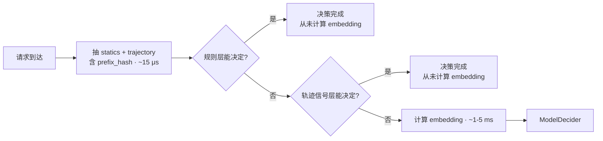
```mermaid
flowchart LR
    R["请求到达"] --> S["抽 statics + trajectory<br/>含 prefix_hash · ~15 μs"]
    S --> C0{"规则层能决定?"}
    C0 -->|是| D0["决策完成<br/>从未计算 embedding"]
    C0 -->|否| C1{"轨迹信号层能决定?"}
    C1 -->|是| D1["决策完成<br/>从未计算 embedding"]
    C1 -->|否| E["计算 embedding · ~1-5 ms"] --> C2["ModelDecider"]
```

在编码 Agent 流量上，预期绝大多数工具续跑回合在前两层就被解决。这让语义能力的**平均成本远低于它的单次成本**。

### 6.4 特征归一化契约

每一维的归一化参数（min/max 或 mean/std）**存在工件里，不在代码里**。运行时按工件声明的参数归一化。换数据集重训 → 参数随工件更新，运行时无需改代码（**I2**）。

---

## 7. L-Quality：决策级联 DecisionCascade

### 7.1 Decider trait

```rust
#[derive(PartialOrd, Ord)]
pub enum CostClass {
    Free,       // 纯 CPU，< 100 μs
    Local,      // 本地模型推理，1–10 ms
    Remote,     // 远程 LLM 调用，100 ms+，产生费用
    PostHoc,    // 先执行再判定，最贵
}

pub struct Verdict {
    pub tier: TierRef,              // 语义层级名，不是具体模型（I4）
    pub confidence: f64,            // [0.0, 1.0]
    pub source: DecisionSource,     // 必填（I3）
    pub rationale: Option<String>,
}

#[async_trait]
pub trait Decider: Send + Sync + 'static {
    fn name(&self) -> &'static str;
    fn cost_class(&self) -> CostClass;
    /// 返回 None = 弃权（abstain），级联下沉到下一层。
    async fn decide(&self, ctx: &mut DecisionCtx<'_>, driver: Option<&Driver>)
        -> Result<Option<Verdict>>;
}
```

`DecisionCtx` 持有 `&FeatureFrame`、`&Catalog`、`&mut Request`、`&BudgetState`，以及 `lazy_semantic()`。

### 7.2 五层标准级联

| 层 | Decider | CostClass | 决策依据 | 弃权条件 |
|---|---|:---:|---|---|
| L0 | `RuleDecider` | Free | 正则/关键词/token 长度/模态/租户白名单 | 无规则命中 |
| L1 | `SignalDecider` | Free | 轨迹特征打分（互证式，见 7.3） | `confidence < threshold` |
| L2 | `ModelDecider` | Local | 加载 `RouterArtifact` 的判别式模型打分 | 无工件 / 低置信 / schema 不匹配 |
| L3 | `JudgeDecider` | Remote | LLM-as-judge 事前分类，结构化 verdict | 未配置 / 判官失败 |
| L4 | `EscalationDecider` | PostHoc | 先跑 efficient tier，判官读结果决定是否升级 | 未配置 |

**级联终止仍未决 → `fall_open`**：落到 route 的 `default_tier`，记 `DecisionSource::FallOpen`。

**fail-safe 而非 fail-cheap**：L3/L4 的判官失败一律**升级到 capable tier**（沿用 Switchyard 语义）。

### 7.3 SignalDecider：互证打分的 N 层泛化

Switchyard 的 stage 打分器只支持 2 层，核心常数 `SIGNAL_UNIT = 0.10`、`SCORE_GAIN = 5.0`、`HARD_SEVERITY = 0.7`——设计意图是"单个满值信号只能打出约 0.46 置信度，必须有第二个信号互证才能越过 0.5"。这个**抗单点噪声**的设计保留，做两处泛化：

1. **N 层 tier**：输出各 tier 上的分布，`argmax` + 置信度间隔（top1 − top2）作为 confidence
2. **信号权重进工件**：四个维度（`severity` / `spinning` / `exploring` / `production_intensity`）的权重从 `RouterArtifact.calibration.signal_weights` 读取——**让它可训练**。默认值用 Switchyard 已标定的那组

保留的硬覆盖：`severity == critical` → 强制 capable；`compacted == true` → 强制 capable 并会话内 latch；`tests_passed && recent_production > 0 && severity == 0` → 强制 efficient。

### 7.4 级联可视化

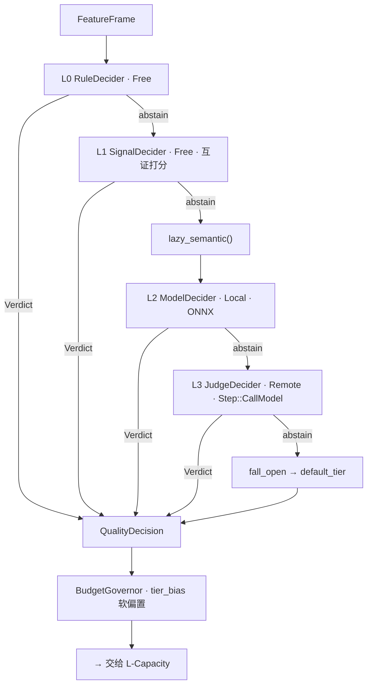
```mermaid
flowchart TB
    F["FeatureFrame"] --> L0["L0 RuleDecider · Free"]
    L0 -->|Verdict| OUT["QualityDecision"]
    L0 -->|abstain| L1["L1 SignalDecider · Free · 互证打分"]
    L1 -->|Verdict| OUT
    L1 -->|abstain| LZ["lazy_semantic()"]
    LZ --> L2["L2 ModelDecider · Local · ONNX"]
    L2 -->|Verdict| OUT
    L2 -->|abstain| L3["L3 JudgeDecider · Remote · Step::CallModel"]
    L3 -->|Verdict| OUT
    L3 -->|abstain| FO["fall_open → default_tier"]
    FO --> OUT
    OUT --> BG["BudgetGovernor · tier_bias 软偏置"]
    BG --> CAP["→ 交给 L-Capacity"]
```

---

## 8. L-Capacity：过滤器管线与选择器

> v1 设计里 `tiers = { capable = "strong" }` 每个 tier 只映射一个 target——这是从 Switchyard 继承的假设，真实部署里几乎不成立。**选中 tier 之后"打哪一台"是同样重要的问题**，LiteLLM 的全部 14,600 行做的就是这一层。

### 8.1 Filter → Pick 分离

LiteLLM 最值得学的结构性决策：**过滤器只收窄候选集，选择器只从候选集里挑一个，二者互不知情**。收益是 `N 个过滤器 × M 个选择器` 的组合自由。

与 L-Quality 的 `Cascade` 语义完全不同：

| | `Cascade`（L-Quality） | `Filter` 链（L-Capacity） |
|---|---|---|
| 语义 | 逐层尝试**决定**，第一个有把握的胜出 | 逐层**排除**不合格者，全部通过才是候选 |
| 组合 | OR / 短路 | AND / 全量 |
| 空集时 | `fall_open` 到默认 tier | **抛类型化错误**，驱动降级选链（**I5**） |

### 8.2 DeploymentFilter

```rust
/// 零 I/O：状态从注入的 CapacitySnapshot 读，事实从注入的 Catalog 读（I1/I6）
pub trait DeploymentFilter: Send + Sync + 'static {
    fn name(&self) -> &'static str;
    fn cost_class(&self) -> CostClass;
    fn filter(&self, ctx: &FilterCtx<'_>, candidates: Vec<DeploymentRef>)
        -> Result<Vec<DeploymentRef>, FilterExhausted>;
}

#[non_exhaustive]
pub enum FilterExhausted {
    AllCooling      { until: Instant, reasons: Vec<CooldownReason> },
    ContextWindowTooSmall { needed: u32, largest_available: u32 },
    CapabilityUnmet { needed: Vec<Capability> },
    RateLimited     { retry_after: Option<Duration>, snapshot: Vec<QuotaState> },
    BudgetExceeded  { scope: BudgetScope, spent: f64, limit: f64 },
    TagMismatch     { requested: Vec<String> },
    RegionDisallowed{ allowed: Vec<String> },
    TenantForbidden,
    ProviderUnconfigured { provider: ProviderId },   // v3：认证未配置
    ModelRetired    { model: ModelId },              // v3：动态目录中已下架
}
```

`FilterExhausted` 携带诊断快照，直接进异常消息和 `DecisionRecord`。

### 8.3 标准过滤链

按成本递增排序：

| 顺序 | Filter | 借鉴自 | 排除条件 | 数据来源 |
|---|---|---|---|---|
| 1 | `TenantFilter` | LiteLLM | 租户无权访问 | 配置 |
| 2 | `ProviderAuthFilter` **(v3)** | pi/ai | provider 认证未配置 | `urouter-ai` |
| 3 | `CatalogFilter` **(v3)** | pi/ai | 动态目录中已下架 | `urouter-ai` |
| 4 | `CooldownFilter` | LiteLLM | 该部署在冷却中（见 9.4） | `CapacitySnapshot` |
| 5 | `ContextWindowFilter` | LiteLLM | `prompt_tokens_est > context_window` | **`urouter-ai`** |
| 6 | `CapabilityFilter` | LiteLLM + pi/ai | 请求用了该部署不支持的能力 | **`urouter-ai`** |
| 7 | `QuotaFilter` | LiteLLM | `current_tpm + est > tpm_limit` | `CapacitySnapshot` |
| 8 | `BudgetFilter` | LiteLLM | 作用域花费超**硬上限**（见 11.2） | `CapacitySnapshot` + **`urouter-ai` 计价** |
| 9 | `RegionFilter` | LiteLLM | 数据驻留不合规 | 配置 |
| 10 | `OrderFilter` | LiteLLM | 只保留 order 最小的那批（主备语义） | 配置 |

**v3 的变化**：第 2/3 条全新（认证与目录状态过滤），第 5/6/8 条的判据从"手写配置"改为"目录事实"（**I6**）。

**关键细节**：`QuotaFilter` 判断的是 `current + est_tokens > limit`，即"加上这次请求会不会超"，而不是"现在超没超"。

**缓存亲和不在这条链上**——见 §11.3，它是选择器的加分项而非硬过滤。

### 8.4 DeploymentPicker

```rust
pub trait DeploymentPicker: Send + Sync + 'static {
    fn name(&self) -> &'static str;
    fn pick(&self, ctx: &PickCtx<'_>, candidates: &[DeploymentRef]) -> Selection;
}

pub struct Selection {
    pub deployment: DeploymentRef,
    pub score: f64,
    pub rationale: PickRationale,           // 必填（I3）
    pub runners_up: Vec<DeploymentRef>,     // tier 内的降级顺序
}
```

| Picker | 优化目标 | 状态需求 | 说明 |
|---|---|---|---|
| `weighted`（默认） | 按 `weight`/`rpm`/`tpm` 加权随机 | 无状态 | **零依赖、零决策延迟，绝大多数场景够用** |
| `least_loaded` | 在途请求数最少 | 计数器 | |
| `lowest_latency` | 滑窗平均延迟最低 | 延迟环形缓冲 | 见 8.5 |
| `lowest_quota_usage` | 分钟内 TPM **占用率**最低 | 配额计数 | 注意是占用率而非绝对值，否则大配额部署永远被冷落 |

> **明确不做 `lowest_cost` picker**。LiteLLM 的 `cost-based-routing` 是反面教材：用 `input_cost + output_cost` 当成本，且只在"同 tier 内能力等价"时安全。uRouter 里**成本是 L-Quality 的职责**，tier 内部署按定义能力等价（§16.1 第 12 条强制校验），单价差异体现在 `weight` 上。

### 8.5 lowest_latency 的两个精细设计（直接采纳）

**① 流式看 TTFT，非流式看总时长**：

```rust
let latency = if ctx.request.is_streaming() && !stats.ttft.is_empty() {
    stats.ttft.mean()          // 流式：用户感知的是首 token 时间
} else {
    stats.total.mean()
};
```

四个参考项目里只有 LiteLLM 做了这个区分，而它是对的。

**② 缓冲区 + 区间内随机，防羊群效应**：

```rust
let lowest = sorted[0].latency;
let buffer = self.buffer_ratio * lowest;              // 默认 0.1
let tied: Vec<_> = sorted.iter().take_while(|d| d.latency <= lowest + buffer).collect();
let chosen = weighted_choice(&tied);
```

永远打最快的那台，它会立刻因流量涌入变慢，然后流量整体切走——产生震荡。

### 8.6 tier 内的 fallback 顺序

L-Reliability 的重试优先在 tier 内换部署（`runners_up`），全部耗尽才升级到 tier 级降级（`tier_fallbacks`）。

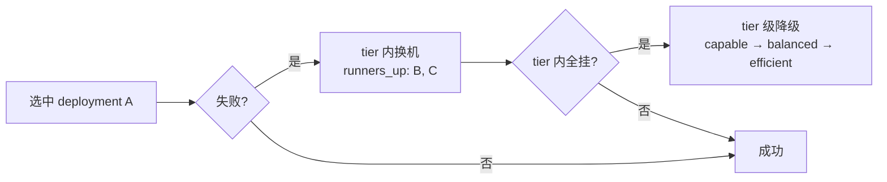
```mermaid
flowchart LR
    S["选中 deployment A"] --> F1{"失败?"}
    F1 -->|是| R1["tier 内换机<br/>runners_up: B, C"]
    R1 --> F2{"tier 内全挂?"}
    F2 -->|是| R2["tier 级降级<br/>capable → balanced → efficient"]
    F2 -->|否| OK["成功"]
    F1 -->|否| OK
```

---

## 9. L-Reliability：重试 / 冷却 / 降级三层

### 9.1 三层分工

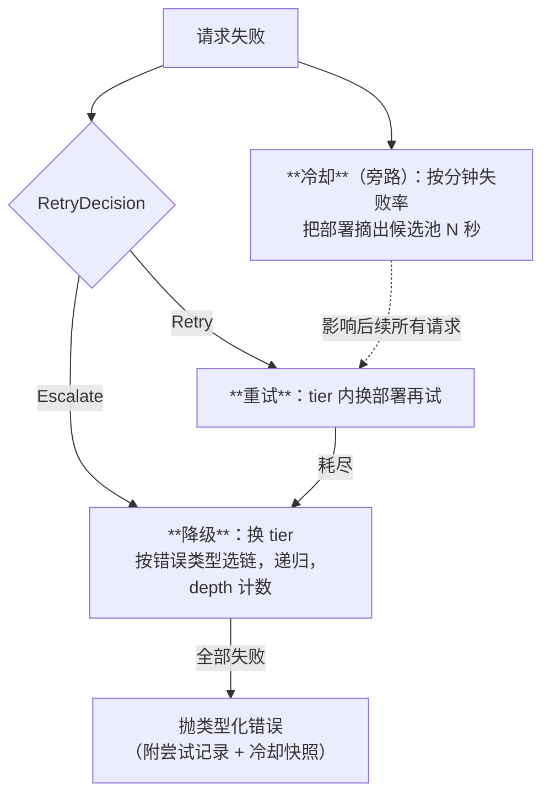
```mermaid
flowchart TB
    F["请求失败"]
    F --> R{"RetryDecision"}
    R -->|Retry| RT["**重试**：tier 内换部署再试"]
    R -->|Escalate| FBK
    RT -->|"耗尽"| FBK["**降级**：换 tier<br/>按错误类型选链，递归，depth 计数"]
    F --> CD["**冷却**（旁路）：按分钟失败率<br/>把部署摘出候选池 N 秒"]
    CD -.->|"影响后续所有请求"| RT
    FBK -->|"全部失败"| E["抛类型化错误<br/>（附尝试记录 + 冷却快照）"]
```

- **重试**：横向——同一 tier 内换机器
- **冷却**：纵向——把坏机器摘出池子一段时间，影响**后续所有请求**
- **降级**：跨层——换到能力不同的 tier

### 9.2 重试决策表

```rust
pub enum RetryDecision {
    Retry { max_attempts: u8 },
    Escalate { reason: EscalateReason },
    Terminal,
}

pub fn decide_retry(err: &UpstreamError, healthy_remaining: usize,
                    tier_size: usize, policy: &FallbackPolicy) -> RetryDecision {
    use UpstreamError::*;
    match err {
        // ★ 借鉴 LiteLLM 最精妙的两条：存在更专门的处理路径时，不消耗重试预算
        ContextWindowExceeded { .. } if policy.context_window.is_some()
            => RetryDecision::Escalate { reason: EscalateReason::ContextWindow },
        ContentPolicy { .. } if policy.content_policy.is_some()
            => RetryDecision::Escalate { reason: EscalateReason::ContentPolicy },

        NotFound { .. } => RetryDecision::Terminal,          // 重试一万次也不会存在
        Unauthorized { .. } if tier_size <= 1 => RetryDecision::Terminal,  // 配置问题
        _ if healthy_remaining == 0
            => RetryDecision::Escalate { reason: EscalateReason::TierExhausted },

        RateLimited { .. } | ServerError { .. } | Timeout | Transport(_)
            => RetryDecision::Retry { max_attempts: policy.retries_for(err) },

        BadRequest { .. } => RetryDecision::Terminal,        // 换机器也一样
    }
}
```

**前两条是这张表的精髓**：不是"能重试就重试"，而是"**如果存在一条更专门的处理路径，就不要在这里消耗重试预算**"。

### 9.3 退避律：有健康部署时立即重试

```rust
pub fn backoff(err: &UpstreamError, healthy_remaining: usize,
               tier_size: usize, attempt: u8, cfg: &BackoffConfig) -> Duration {
    if tier_size == 1 { return retry_after_or_exponential(err, attempt, cfg); }  // 无处可去
    if healthy_remaining > 0 { return Duration::ZERO; }   // ★ 有别处可去，立即换机
    retry_after_or_exponential(err, attempt, cfg)
}
```

**前提是"重试必须重新走一遍 L-Capacity 的过滤 + 选择"**——失败的部署此时可能已进冷却。这条在 `urouter-client::run()` 里必须显式保证，且要有集成测试覆盖。

`retry_after_or_exponential` 优先读上游的 `Retry-After` 响应头。

### 9.4 冷却：失败率而非绝对计数

冷却是**唯一能把故障隔离效果扩散到后续请求**的机制。

#### 哪些错误值得冷却

```rust
pub fn cooldown_worthy(err: &UpstreamError) -> bool {
    use UpstreamError::*;
    match err {
        Transport(_) => false,                    // 客户端侧连接问题，不是部署的错
        RateLimited { .. } | Unauthorized { .. } | Timeout | NotFound { .. } => true,
        // ★ 其他 4xx 是**请求本身**的问题，换机器也一样失败 —— 冷却只会白白削减容量
        BadRequest { .. } | ContentPolicy { .. } | ContextWindowExceeded { .. } => false,
        ServerError { .. } => true,
    }
}
```

**"是我的错还是它的错"这个区分**是很多自研网关会漏掉的。

#### 是否应该冷却

```rust
pub fn should_cooldown(stats: &MinuteStats, tier_size: usize, cfg: &CooldownPolicy) -> bool {
    // ★ 单部署保护：冷掉唯一的部署 = 该 tier 完全不可用
    if tier_size <= 1 { return false; }
    let total = stats.successes + stats.fails;
    let fail_rate = if total == 0 { 0.0 } else { stats.fails as f64 / total as f64 };
    stats.last_was_rate_limited
        || fail_rate > cfg.failure_threshold                                   // 默认 0.5
        || (fail_rate == 1.0 && total >= cfg.min_traffic_for_total_failure)     // 默认 1000
}
```

**为什么失败率优于绝对计数**：每分钟 10000 个请求失败 5 次是 99.95% 可用率，完全健康。绝对计数会误伤。

**单部署保护**在 LiteLLM 的判定逻辑里出现了两次，是用事故换来的规则。

#### 存储

TTL 自然过期（无需清理任务），key `cooldown:{deployment_id}`。**异常字符串必须脱敏后再存**（LiteLLM 用 `SensitiveDataMasker` 保留前 50 字符，因为异常消息里经常带 API key）。

| 参数 | 默认 | 说明 |
|---|---:|---|
| `cooldown_secs` | 5 | **很短**——冷却是"快速摘除 + 快速恢复探测"，不是惩罚 |
| `failure_threshold` | 0.5 | 失败率阈值 |
| `min_traffic_for_total_failure` | 1000 | "100% 失败也要冷却"所需的最小流量 |

### 9.5 类型化降级链

```rust
pub struct FallbackPolicy {
    pub generic: Vec<TierRef>,
    pub context_window: Option<Vec<TierRef>>,     // → 更大窗口的 tier
    pub content_policy: Option<Vec<TierRef>>,     // → 审核更宽松的 tier
    pub max_depth: u8,                            // 默认 5
    pub retries: HashMap<ErrorKind, u8>,
}
```

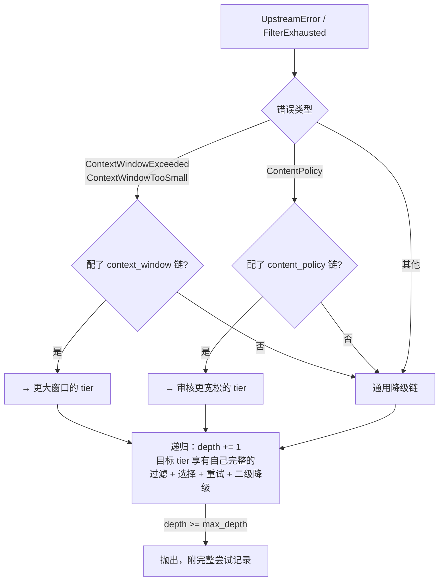
```mermaid
flowchart TB
    E["UpstreamError / FilterExhausted"] --> T{"错误类型"}
    T -->|ContextWindowExceeded<br/>ContextWindowTooSmall| C1{"配了 context_window 链?"}
    C1 -->|是| CW["→ 更大窗口的 tier"]
    C1 -->|否| G
    T -->|ContentPolicy| C2{"配了 content_policy 链?"}
    C2 -->|是| CP["→ 审核更宽松的 tier"]
    C2 -->|否| G
    T -->|其他| G["通用降级链"]
    CW --> RUN["递归：depth += 1<br/>目标 tier 享有自己完整的<br/>过滤 + 选择 + 重试 + 二级降级"]
    CP --> RUN
    G --> RUN
    RUN -->|"depth >= max_depth"| RAISE["抛出，附完整尝试记录"]
```

**降级是递归的**，代价是需要 `max_depth` 上界。**跨 tier 降级时必须走 `urouter-ai` 的跨 provider 消息交接**（§5.10）——目标 tier 很可能是另一个厂商。

**错误信息累加**：最终抛出的错误必须附带"试过哪些 tier / 哪些部署 / 各自失败原因"以及"当时的冷却快照"。

---

## 10. 路由工件 RouterArtifact

Switchyard 的报告里明确指出了这个缺口：

> Switchyard 的算法全部是规则 + LLM-as-judge，**没有加载训练好的模型的扩展点**。

LiteLLM 与 pi/ai 更彻底——它们连质量维度都没有。

### 10.1 工件目录结构

```
artifacts/coding-agent-v7/
├── manifest.json          # 契约核心
├── model.onnx             # 判别式路由模型
├── calibration.json       # 阈值 + 信号权重 + 归一化参数
└── report.html            # 离线评测报告（运行时忽略）
```

### 10.2 manifest.json

```json
{
  "artifact_id": "coding-agent-v7",
  "manifest_version": 2,
  "created_at": "2026-08-20T09:14:00Z",

  "feature_schema": {
    "version": 3,
    "dims": [
      {"name": "statics.prompt_tokens_est", "norm": {"kind": "log_minmax", "min": 0, "max": 200000}},
      {"name": "statics.cacheable_prefix_tokens", "norm": {"kind": "log_minmax", "min": 0, "max": 200000}},
      {"name": "trajectory.severity",       "norm": {"kind": "identity"}},
      {"name": "semantic.vector",           "norm": {"kind": "l2"}, "size": 1024}
    ],
    "total_size": 1052
  },

  "catalog": { "version": 3, "structure_hash": "sha256:9f2c…" },

  "embedder": { "id": "qwen3-embedding-0.6b-int8",
                "onnx": "embedders/qwen3-0.6b-int8.onnx", "output_dim": 1024 },

  "tiers": ["efficient", "balanced", "capable"],
  "objective": {"alpha": 0.6, "beta": 0.4, "cost_unit": "usd_per_1k_req"},

  "training": {
    "dataset_fingerprint": "sha256:...",
    "n_records": 412903,
    "exploration_ratio": 0.03,
    "estimator": "doubly_robust",
    "excluded": {"usage_unavailable": 8241, "capacity_constrained": 19077},
    "trained_by": "urouter-lab 0.4.1"
  },

  "offline_metrics": {
    "quality_vs_always_capable": -0.021,
    "cost_vs_always_capable": -0.583,
    "quality_vs_always_efficient": 0.147,
    "pareto_dominates_baselines": ["always_capable", "always_efficient", "random_50"],
    "ci95_quality_delta": [-0.034, -0.008]
  }
}
```

### 10.3 四个关键设计点

**① `feature_schema` 是加载门禁，不是文档**

网关启动时把编译进来的 `FeatureFrame` schema 与工件声明逐维比对，**任何不匹配直接拒绝加载并退出**。这是 **I2** 的强制点。对比 LLMRouter 的"缺字段只 print warning"，uRouter 明确选择"**启动即失败**优于运行时静默错位"。

**② `catalog` 版本是新增的第二道门禁（v3）**

工件是用某个目录版本下的价格训练的。目录改价后，历史 reward 与新数据不可混用。加载时若运行时目录的 `structure_hash` 与工件声明不符，发出 **warning**（不是硬失败——价格变动是常态，但必须让人知道）；若 `catalog.version`（schema 版本）不符则**硬失败**。

**③ `offline_metrics` 里必须有置信区间**

`ci95_quality_delta: [-0.034, -0.008]` 不含 0 才算有效结论。**没有置信区间的离线指标不允许进工件**——反事实估计的方差往往很大。

**④ 工件只认语义 tier 名，不含密钥 / base_url / 具体模型 ID**

既是 **I4** 的体现，也让同一个工件可以在不同部署（换供应商、换模型代次、增减副本）复用。

### 10.4 热加载与灰度

| 模式 | 行为 | 用途 |
|---|---|---|
| `shadow` | candidate 与 active 并行决策，**只有 active 生效**；不一致时记 `shadow_disagreement` | 零风险验证 |
| `canary` | 按 `traffic_split` 真实生效，按会话 hash 分流 | 灰度放量 |
| 回滚 | 改 `[artifacts.active].path` + `SIGHUP` | 快速止血 |

影子模式成本几乎为零——两个工件共享同一个 `FeatureFrame`，只多一次 ONNX 前向（~1 ms）。

---

## 11. 成本控制：软偏置 + 硬过滤 + 缓存亲和

### 11.1 三条正交的省钱路径

| 路径 | 机制 | 质量代价 | 层 |
|---|---|---|---|
| **降级模型** | `BudgetGovernor` 软偏置 + tier 选择 | 有（需用置信区间证明可接受） | L-Quality |
| **预算硬闸** | `BudgetFilter` 摘除超预算部署 | 有（可能不可用） | L-Capacity |
| **缓存亲和** | 路由到已缓存该前缀的部署 | **零** | L-Capacity |

**三条路径的成本核算全部依赖 `urouter-ai::calculate_cost`**（**I6**），且 `CostBreakdown` 四项分列落盘，否则无法区分三者的贡献（§18.2）。

### 11.2 预算：软偏置 + 硬过滤

LLMRouter 的 α/β 是**离线常数**；LiteLLM 的预算是**硬过滤**（阶跃）。两者都不完整。

| | LiteLLM 硬过滤 | uRouter 软偏置 | **uRouter：两者并用** |
|---|---|---|---|
| 时机 | 超预算之后 | 超预算**之前**就开始收敛 | 全程 |
| 副作用 | 预算耗尽 = 不可用 | 预算耗尽 = 降级到 `hard_floor` | 分级 |
| 平滑性 | 阶跃 | 连续 | 连续 + 最终阶跃 |

#### 软偏置（L-Quality）

```rust
impl BudgetGovernor {
    /// 返回 tier_bias ∈ [-1, +1]。正 = 偏向便宜，负 = 偏向强模型。
    fn bias(&self, state: &BudgetState) -> f64 {
        let spent_ratio   = state.spent_usd / self.soft_limit_usd;
        let elapsed_ratio = state.elapsed.as_secs_f64() / self.window.as_secs_f64();
        (self.gain * (spent_ratio - elapsed_ratio)).clamp(-1.0, 1.0)
    }
}
```

作用方式是平移级联阈值：`effective_threshold = base_threshold + bias * threshold_span`。刻意选最简单的比例控制律：可解释、无 windup、单旋钮可标定。

#### 硬过滤（L-Capacity）

三个作用域：`budget:provider:{name}:{duration}` / `budget:deployment:{id}:{duration}` / `budget:tenant:{id}:{duration}`。

`current_spend >= hard_limit` → 摘除，抛 `FilterExhausted::BudgetExceeded`。

配置校验强制 `soft_limit < hard_limit`，典型 `soft = 0.8 × hard`。

> **一个明确的取舍**：预算硬上限在 Redis 故障时**必须 fail-closed**（强制降到 `hard_floor`），不能像配额那样 fail-open。配额失效只是超发一点流量，预算失效是钱失控。见 §12.3。

### 11.3 缓存亲和路由

让请求打到已经缓存了这段前缀的部署上，输入 token 按约 **10%** 计价。对编码 Agent（长系统提示 + 工具 schema + 累积的 20 轮以上对话），这条路径的价值**可能超过降级模型**，而且：

- **零质量损失**（同一个模型，只是缓存命中）
- **零决策风险**（不需要判断"这题够不够简单"）
- **与 tier 决策完全正交**

#### 实现

1. `StaticFeatures.prefix_hash` 用滚动哈希计算可缓存前缀
2. `prefix_hash → deployment_id` 映射存在 `DualStore`，成功调用后写入（TTL = provider 缓存有效期）
3. **作为 picker 的加分项，不是硬过滤**：

```rust
let cache = &ctx.catalog.model(candidate).capabilities.prompt_cache;   // ← 查目录（v3）
let eligible = cache.enabled
    && ctx.features.statics.cacheable_prefix_tokens >= cache.min_cacheable_tokens;
let bonus = if eligible && candidate.id == cached_deployment {
    self.affinity_weight            // 默认相当于把有效延迟打 0.6 折
} else { 1.0 };
```

**为什么是软的**：LiteLLM 的实现是硬过滤（候选集缩到 1），如果那台机器恰好过载或冷却就无路可走。

**v3 新增的两条依赖**（都来自 `urouter-ai`）：

- `prompt_cache.enabled` / `min_cacheable_tokens` 决定亲和逻辑是否值得触发
- `prompt_cache.session_affinity` 决定发哪个头。**发错了亲和不生效，而且不会报错**，只是缓存命中率悄悄归零——所以必须有 `urouter_cache_hit_ratio` 指标兜底

---

## 12. 多实例状态：DualStore

### 12.1 需要跨实例共享的状态

| 状态 | 更新频率 | 一致性要求 | 故障语义 |
|---|---|---|---|
| 冷却 | 低（仅失败时） | 高 | fail-open |
| 配额计数 tpm/rpm | **每请求** | 中 | fail-open |
| 预算花费 | 每请求 | **高**（钱） | **fail-closed** |
| 会话亲和（latch / turn_count） | 每请求 | 中 | fail-open |
| 缓存亲和映射 | 每请求 | 低 | fail-open |
| 延迟统计 | 每请求 | 低 | fail-open |
| **OAuth 凭证（v3）** | 低 | **高**（并发刷新会作废 token） | **fail-closed** |

### 12.2 DualStore 架构

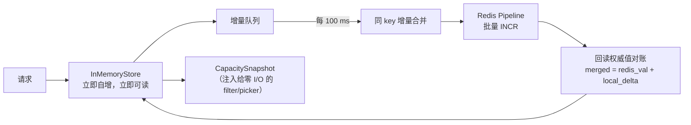
```mermaid
flowchart LR
    REQ["请求"] --> MEM["InMemoryStore<br/>立即自增，立即可读"]
    MEM --> Q["增量队列"]
    Q -->|"每 100 ms"| COMP["同 key 增量合并"]
    COMP --> PIPE["Redis Pipeline<br/>批量 INCR"]
    PIPE --> MERGE["回读权威值对账<br/>merged = redis_val + local_delta"]
    MERGE --> MEM
    MEM --> SNAP["CapacitySnapshot<br/>（注入给零 I/O 的 filter/picker）"]
```

```rust
impl DualStore {
    /// 立即返回本地值，Redis 异步批量推送——决策路径不阻塞
    async fn increment(&self, key: &str, delta: i64, ttl: Duration) -> i64 { ... }

    /// 每请求一次，把该 tier 所有部署的状态打包成快照
    async fn snapshot(&self, deployments: &[DeploymentRef]) -> CapacitySnapshot {
        // ★ 批量读（MGET），不是循环 get
        let keys = deployments.iter().flat_map(|d| d.state_keys()).collect();
        CapacitySnapshot::from_flat(deployments, self.mget(&keys).await)
    }
}
```

对账逻辑：`delta = after - before; merged = if after <= redis_val { redis_val + delta } else { 跳过 }`。

**v3 新增**：`CredentialStore` 的 `modify()` 需要**跨实例互斥**（Redis 分布式锁或数据库行锁），否则多实例并发刷新 OAuth 会作废 refresh token（§5.6 规则 ②）。这是 `DualStore` 之外的一个独立需求——它需要的是真正的互斥，不是最终一致。

### 12.3 故障语义必须显式声明

LiteLLM 的做法是全局 fail-open——取舍合理但**隐式**，故障时保护静默失效。uRouter **按状态种类分别决策并写进文档**：

| 状态 | Redis 不可用时 | 理由 |
|---|---|---|
| 冷却 | fail-open（当作无冷却） | 可用性优先；本地内存里仍有本实例的观测 |
| 配额 | fail-open（放行） | 略微超发 < 服务不可用 |
| **预算硬上限** | **fail-closed**（强制 `hard_floor`） | 钱不能失控。降级而非拒绝服务 |
| 会话亲和 | fail-open（降级为无会话） | 与"宁可没有历史也不共享错误历史"一致 |
| 缓存亲和 | fail-open | 只是少省点钱 |
| **OAuth 刷新锁（v3）** | **fail-closed**（拒绝刷新，用现有 token 直到过期） | 并发刷新会把 provider 打死；宁可等过期后整体降级 |

每一种 fail-open **必须有指标**：`urouter_state_fail_open_total{kind}`。

---

## 13. L-Feedback：决策记录与闭环回流

### 13.1 DecisionRecord

```json
{
  "record_version": 3,
  "ts": "2026-08-25T03:12:44.918Z",
  "request_id": "req_01J...",
  "session_id": "sess_abc",
  "route": "auto",
  "catalog": { "version": 3, "structure_hash": "sha256:9f2c…" },

  "features": {
    "schema_version": 3,
    "statics": {"prompt_tokens_est": 14203, "tool_count": 12,
                "prefix_hash": "0x9a3f…", "cacheable_prefix_tokens": 11800},
    "trajectory": {"severity": 0.7, "no_error_streak": 0, "recent_edit_count": 3},
    "session": {"turn_count": 17, "escalation_streak": 1,
                "spent_cost_usd": 0.84, "cache_hit_ratio": 0.72,
                "had_cross_provider_handoff": false},
    "semantic": {"embedder_id": "qwen3-embedding-0.6b-int8",
                 "vector_ref": "vec:20260825/00417.f32#912"}
  },

  "quality": {
    "cascade": [
      {"decider": "rules",   "verdict": null, "latency_us": 8},
      {"decider": "signals", "verdict": null, "latency_us": 21, "confidence": 0.41},
      {"decider": "model",   "verdict": "capable", "latency_us": 1340, "confidence": 0.78}
    ],
    "tier": "capable", "source": "model", "confidence": 0.78,
    "artifact_id": "coding-agent-v6", "budget_bias": 0.12,
    "exploration": false, "propensity": null
  },

  "capacity": {
    "tier_size": 3,
    "filters": [
      {"filter": "tenant",   "in": 3, "out": 3, "latency_us": 2},
      {"filter": "cooldown", "in": 3, "out": 2, "latency_us": 4,
       "removed": [{"id": "opus-azure-west", "reason": "fail_rate_0.67"}]},
      {"filter": "context_window", "in": 2, "out": 2, "latency_us": 3},
      {"filter": "quota",    "in": 2, "out": 2, "latency_us": 6}
    ],
    "picker": "lowest_latency",
    "selected": "opus-azure-east",
    "runners_up": ["opus-direct"],
    "cache_affinity_hit": true,
    "rationale": {"latency_ms": 812, "buffer_tied_with": 1, "affinity_bonus": 0.6}
  },

  "shadow": {"artifact_id": "coding-agent-v7", "tier": "balanced", "agreed": false},

  "execution": {
    "ok": true, "latency_ms": 8412,
    "attempts": [{"deployment": "opus-azure-east", "ok": true, "status": 200, "ms": 8412}],
    "fallback_depth": 0,
    "provider": "azure-openai", "model": "claude-opus-4.7", "api": "anthropic_messages",
    "usage": {"input": 2403, "output": 1876, "cache_read": 11800,
              "cache_write": 0, "cache_write_long": 0, "reasoning": 420},
    "usage_unavailable": false,
    "price_source": "catalog",
    "cost_breakdown": {"input": 0.0360, "output": 0.1407,
                       "cache_read": 0.0177, "cache_write": 0.0, "total": 0.1944},
    "cost_tier_applied": null,
    "cost_usd_uncached": 0.3177
  },

  "outcome": {
    "quality_label": null,
    "proxy_signals": {"next_turn_tool_error": false, "user_retried": false,
                      "client_disconnected": false, "escalated_after": false}
  }
}
```

**v3 相对 v2 新增**：`catalog` 版本块、`execution.provider/model/api`、`usage` 细分为五项、`usage_unavailable`、`price_source`、`cost_breakdown` 四项分列、`cost_tier_applied`（命中了哪个阶梯档）、`features.session.had_cross_provider_handoff`。

### 13.2 四个设计决策

**① 特征快照原样入库，embedding 走 side-store**

`vector_ref` 指向按天分片的 float32 平铺文件。沿用 LLMRouter `embedding_id` 的思路——内联 1024 维向量会让 JSONL 膨胀 20 倍以上。

**存特征而不是只存 query 的意义**：离线训练不必重算 embedding，更重要的是**保证训练用的特征就是线上决策时用的那份**（**I2**）。

**② `outcome` 是设计中最难、最关键的部分**

路由训练的核心困难：**你不知道另一个模型会不会做得更好**。三条标签来源：

| 来源 | 可靠性 | 覆盖率 | 实现 |
|---|---|---|---|
| **显式反馈** | 高 | < 1% | thumbs、编辑后采纳、任务通过率 |
| **离线判官标注** | 中高 | 采样 1–5% | 强模型对 `(请求, 回答)` 打分 |
| **隐式代理信号** | 中 | ~100% | 下一回合工具错误、用户重试、被升级、客户端断连 |

训练时加权融合。**不假装隐式信号等于质量**——它们是有偏代理，在文档和指标里都显式标注。

**③ ε-探索：打破策略自证循环**

如果永远按当前策略路由，回流数据里就**只有当前策略选过的组合**，训下一版只会强化现有偏好。

解法：以概率 ε（默认 3%）**随机偏离当前决策**，记录 `exploration: true` 与采样概率（propensity）。这让回流数据成为合法的 **logged bandit feedback** 数据集。

风险控制：默认关闭；默认 `up_only`（只选更强的 tier，牺牲成本而非质量）；propensity 必须记录；ε 上限硬编码 0.1。

**探索只在 L-Quality（tier 选择）上做，L-Capacity 不做**——部署级选择的目标是容量与健康，随机化对训练无价值，只会增加尾延迟。

**④ 成本精度就是标签精度（v3 新增）**

`cost_breakdown` 四项分列 + `cost_tier_applied` + `price_source` 三个字段合起来保证：半年后回看数据集时，任何一条记录的成本都能被**完整复现和审计**。

这不是过度记录。reward 是 `α·quality − β·cost`，**成本算错等价于标签错**。而成本可能因为三个原因算错：目录价格变了、部署有企业折扣覆盖、命中了长上下文阶梯档。三者都必须在记录里留痕（**I6**）。

---

## 14. L-Transport：Step 卸载、翻译、取消传播

### 14.1 Step / Driver

```rust
pub enum Step {
    CallModel(Box<CallModel>),   // 决策核需要一次模型调用，宿主执行并 respond
    Done(Box<QualityDecision>),
}
```

沿用 Switchyard 的关键保证：Driver channel 容量为 1（背压，但已取出的调用仍可并发）；panic 捕获转错误，**每次运行必定发出且仅发出一个终端项**；流被丢弃 → 算法任务立即 abort；失败语义分层（模型调用失败走 `respond(Err)`，基础设施失败中止运行）。

### 14.2 协议翻译

三向互译（OpenAI Chat / OpenAI Responses / Anthropic Messages），永远经过中立 IR 而非 N² 直接映射。`format` 必填不探测。无损往返测试是质量核心。无法映射的字段产生 diagnostic 而非静默丢弃。

**v3 的变化**：翻译层的 provider 怪癖处理从硬编码改为**消费 `urouter-ai::Compat`**（§5.7）。同一个 `openai_chat` 出站，DeepSeek / Together / Baseten / 自建 vLLM 的实际 body 是不同的，这些差异由目录声明而非代码分支决定。

### 14.3 明确修复参考项目的已知问题

| 来源 | 已知问题 | uRouter 的处理 |
|---|---|---|
| Switchyard 🔴 | 客户端断连后上游继续计费 | `run()` 持有 `CancellationToken`，断连时传播取消；无法取消的缓冲请求标 `abandoned: true` |
| Switchyard 🟠 | 路由层归因缺失 | `CascadeTrace` + `FilterTrace` 类型化字段 + 指标 |
| Switchyard 🟠 | 重试恢复计数器恒为 0 | 计数点在 `ClientRouter` 的尝试循环内，配单测 |
| Switchyard 🟠 | `message_hash_fallback` 让不同会话共享决策 | 不提供该兜底。无 session id 时会话级能力自动禁用并计数 |
| LiteLLM 🔴 | God Object（单文件 7672 行） | crate 边界已切好，CI 加单文件行数上限（1500 行） |
| LiteLLM 🔴 | 策略状态挂全局 | 状态显式属于 `Router` 实例，依赖注入 |
| LiteLLM 🟠 | 单 key 存整组状态并读改写 | 每部署独立 key + 原子自增 |
| LiteLLM 🟠 | 隐式 fail-open | 按状态种类显式决策（§12.3）+ 指标 |
| LiteLLM 🟠 | 自定义策略绕过过滤管线 | 扩展点只开放 `DeploymentPicker`，过滤链由框架强制 |
| LiteLLM 🟠 | 未知模型默认单价 `5.0` 魔数 | 缺 `cost` → **启动失败**（§16.1 第 5 条） |
| **pi/ai ⚠️** | compat 未设置时按 base_url 自动探测 | **收紧**：自动探测仅对目录内置厂商生效，自定义端点必须显式声明 `compat`（§5.7 ③） |

---

# 第三部分：工程

## 15. 端到端流程

本章把前面各层的**静态契约**串成**动态流程**：15.1–15.3 是主链路，15.4–15.11 是八条必须画清楚的分支路径与后台流程，15.12–15.13 是状态机与时延预算。

> 每张时序图的参与者命名与 §4.1 的 crate 一一对应；每一条分支路径都标注了它对应的不变量（I1–I6）与指标名，便于对照 §18 的指标表排障。

### 15.1 请求生命周期总览

一次请求经过 **7 个阶段**，每个阶段有明确的输入、输出、失败出口。**没有任何阶段允许"失败了但继续往下走"**——每个失败出口都是类型化的（**I5**）。

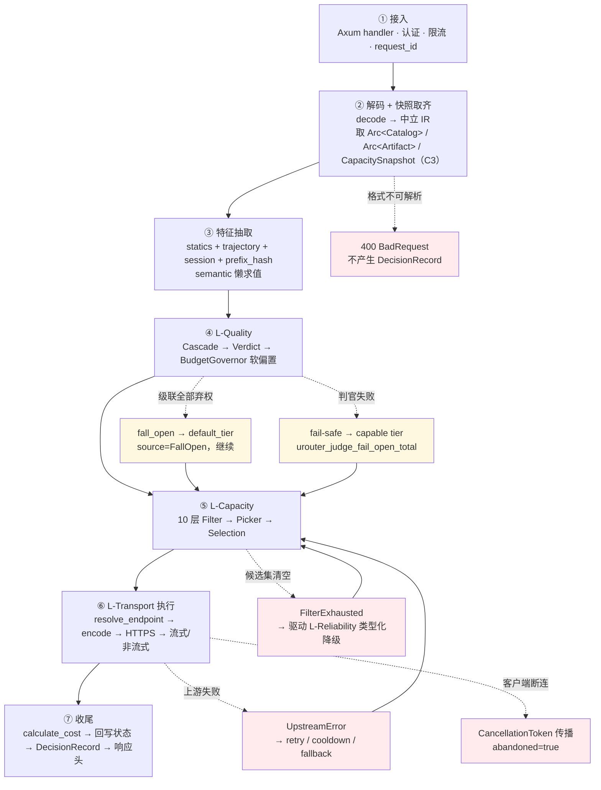
```mermaid
flowchart TB
    S0["① 接入<br/>Axum handler · 认证 · 限流 · request_id"]
    S1["② 解码 + 快照取齐<br/>decode → 中立 IR<br/>取 Arc&lt;Catalog&gt; / Arc&lt;Artifact&gt; / CapacitySnapshot（C3）"]
    S2["③ 特征抽取<br/>statics + trajectory + session + prefix_hash<br/>semantic 懒求值"]
    S3["④ L-Quality<br/>Cascade → Verdict → BudgetGovernor 软偏置"]
    S4["⑤ L-Capacity<br/>10 层 Filter → Picker → Selection"]
    S5["⑥ L-Transport 执行<br/>resolve_endpoint → encode → HTTPS → 流式/非流式"]
    S6["⑦ 收尾<br/>calculate_cost → 回写状态 → DecisionRecord → 响应头"]

    S0 --> S1 --> S2 --> S3 --> S4 --> S5 --> S6

    S1 -.->|"格式不可解析"| E1["400 BadRequest<br/>不产生 DecisionRecord"]
    S3 -.->|"级联全部弃权"| FO["fall_open → default_tier<br/>source=FallOpen，继续"]
    S3 -.->|"判官失败"| FS["fail-safe → capable tier<br/>urouter_judge_fail_open_total"]
    S4 -.->|"候选集清空"| E2["FilterExhausted<br/>→ 驱动 L-Reliability 类型化降级"]
    S5 -.->|"上游失败"| E3["UpstreamError<br/>→ retry / cooldown / fallback"]
    S5 -.->|"客户端断连"| E4["CancellationToken 传播<br/>abandoned=true"]
    E2 --> S4
    E3 --> S4
    FO --> S4
    FS --> S4

    style FO fill:#fff8e1
    style FS fill:#fff8e1
    style E1 fill:#ffebee
    style E2 fill:#ffebee
    style E3 fill:#ffebee
    style E4 fill:#ffebee
```

**三个易被忽略的语义**：

1. **③ 的 semantic 特征是懒的**（§6.3）。级联在 L0/L1 就出结论时，embedding **根本不会被计算**——这是级联设计的主要收益来源，也是为什么特征抽取不能一次性算全。
2. **④ 的 `fall_open` 与 ⑤ 的 `FilterExhausted` 方向相反**。质量层"不确定 → 用默认值继续"，容量层"没候选 → 必须抛错"。这不是不一致，而是 §8.1 那张对比表的直接后果：Cascade 是 OR，Filter 链是 AND。
3. **⑥ 失败后回到 ④ 而不是 ⑤**。重试必须**重新过滤 + 重新选择**，因为失败的部署此时可能已进冷却（§9.3）。这是整张图里唯一一条"往回走"的边，也是最容易实现错的一条。

### 15.2 数据在层间的形态变化

同一份请求在六层之间以五种不同形态存在。**每一次形态转换都是一个可测试的纯函数边界**。

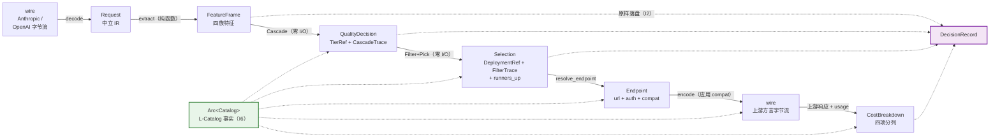
```mermaid
flowchart LR
    W1["wire<br/>Anthropic /<br/>OpenAI 字节流"] -->|"decode"| IR["Request<br/>中立 IR"]
    IR -->|"extract（纯函数）"| FF["FeatureFrame<br/>四族特征"]
    FF -->|"Cascade（零 I/O）"| QD["QualityDecision<br/>TierRef + CascadeTrace"]
    QD -->|"Filter+Pick（零 I/O）"| SEL["Selection<br/>DeploymentRef + FilterTrace<br/>+ runners_up"]
    SEL -->|"resolve_endpoint"| EP["Endpoint<br/>url + auth + compat"]
    EP -->|"encode（应用 compat）"| W2["wire<br/>上游方言字节流"]
    W2 -->|"上游响应 + usage"| CB["CostBreakdown<br/>四项分列"]
    FF -.->|"原样落盘（I2）"| DR["DecisionRecord"]
    QD -.-> DR
    SEL -.-> DR
    CB -.-> DR

    CAT["Arc&lt;Catalog&gt;<br/>L-Catalog 事实（I6）"] -.-> QD
    CAT -.-> SEL
    CAT -.-> EP
    CAT -.-> W2
    CAT -.-> CB

    style CAT fill:#e8f5e9,stroke:#2e7d32,stroke-width:2px
    style DR fill:#f3e5f5,stroke:#7b1fa2,stroke-width:2px
```

这张图解释了 §4.1 里"`urouter-ai` 是扇入最高的 crate"的原因：**五次形态转换里有五次要读目录**。也解释了 **I2** 为什么必须成立——落盘的 `FeatureFrame` 必须是决策时用的那一份，中途重算就断了训练与线上的同源性。

### 15.3 主链路时序图（成功路径）

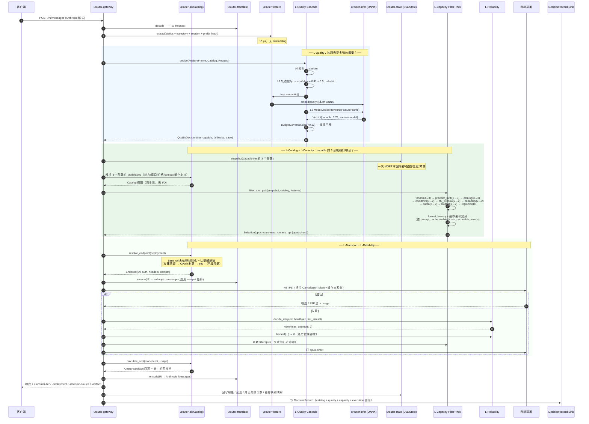
```mermaid
sequenceDiagram
    autonumber
    participant C as 客户端
    participant GW as urouter-gateway
    participant AI as urouter-ai (Catalog)
    participant T as urouter-translate
    participant F as urouter-feature
    participant CAS as L-Quality Cascade
    participant INF as urouter-infer (ONNX)
    participant ST as urouter-state (DualStore)
    participant CAP as L-Capacity Filter+Pick
    participant REL as L-Reliability
    participant M as 目标部署
    participant REC as DecisionRecord Sink

    C->>GW: POST /v1/messages (Anthropic 格式)
    GW->>T: decode → 中立 Request
    GW->>F: extract(statics + trajectory + session + prefix_hash)
    Note over F: ~15 μs，无 embedding

    rect rgb(240, 248, 255)
    Note over CAS,INF: ── L-Quality：这题需要多强的模型？──
    GW->>CAS: decide(FeatureFrame, Catalog, Request)
    CAS->>CAS: L0 规则 → abstain
    CAS->>CAS: L1 轨迹信号 → confidence 0.41 < 0.5，abstain
    CAS->>F: lazy_semantic()
    F->>INF: embed(query) [本地 ONNX]
    CAS->>INF: L2 ModelDecider.forward(FeatureFrame)
    INF-->>CAS: Verdict{capable, 0.78, source=model}
    CAS->>CAS: BudgetGovernor.bias(+0.12) → 阈值平移
    CAS-->>GW: QualityDecision{tier=capable, fallbacks, trace}
    end

    rect rgb(232, 245, 233)
    Note over AI,CAP: ── L-Catalog + L-Capacity：capable 的 3 台机器打哪台？──
    GW->>ST: snapshot(capable tier 的 3 个部署)
    Note over ST: 一次 MGET 拿回冷却/配额/延迟/预算
    GW->>AI: 解析 3 个部署的 ModelSpec（能力/窗口/价格/compat/缓存支持）
    AI-->>GW: Catalog 视图（同步读，无 I/O）
    GW->>CAP: filter_and_pick(snapshot, catalog, features)
    CAP->>CAP: tenant(3→3) → provider_auth(3→3) → catalog(3→3)<br/>→ cooldown(3→2) → ctx_window(2→2) → capability(2→2)<br/>→ quota(2→2) → budget(2→2) → region/order
    CAP->>CAP: lowest_latency + 缓存亲和加分<br/>（查 prompt_cache.enabled / min_cacheable_tokens）
    CAP-->>GW: Selection{opus-azure-east, runners_up=[opus-direct]}
    end

    rect rgb(248, 255, 248)
    Note over AI,M: ── L-Transport + L-Reliability ──
    GW->>AI: resolve_endpoint(deployment)
    Note over AI: base_url 占位符材料化 + 认证解析链<br/>（存储凭证 → OAuth 刷新 → env → 环境凭据）
    AI-->>GW: Endpoint{url, auth, headers, compat}
    GW->>T: encode(IR → anthropic_messages, 应用 compat 怪癖)
    GW->>M: HTTPS（携带 CancellationToken + 缓存亲和头）
    alt 成功
        M-->>GW: 响应 / SSE 流 + usage
    else 失败
        GW->>REL: decide_retry(err, healthy=1, tier_size=3)
        REL-->>GW: Retry{max_attempts: 2}
        GW->>REL: backoff(...) → 0（还有健康部署）
        GW->>CAP: 重新 filter+pick（失败的已进冷却）
        GW->>M: 打 opus-direct
    end
    end

    GW->>AI: calculate_cost(model.cost, usage)
    AI-->>GW: CostBreakdown 四项 + 命中的阶梯档
    GW->>T: encode(IR → Anthropic Messages)
    GW-->>C: 响应 + x-urouter-tier / -deployment / -decision-source / -artifact
    GW->>ST: 回写用量 / 延迟 / 成功失败计数 / 缓存亲和映射
    GW->>REC: 写 DecisionRecord（catalog + quality + capacity + execution 四段）
```

**一个必须保证的语义**：重试时**重新走一遍 L-Capacity 的过滤 + 选择**，而不是重试同一个部署。这是 §9.3 零退避规则成立的前提，必须有集成测试覆盖。

### 15.4 启动与就绪时序

**启动是唯一允许"因为事实不全而拒绝服务"的时刻。** §16.1 的 16 项校验全部在这里执行，任何一项失败都不进入监听状态——对比 LLMRouter"缺字段只 print warning"，uRouter 明确选择启动即失败（**I2/I6**）。

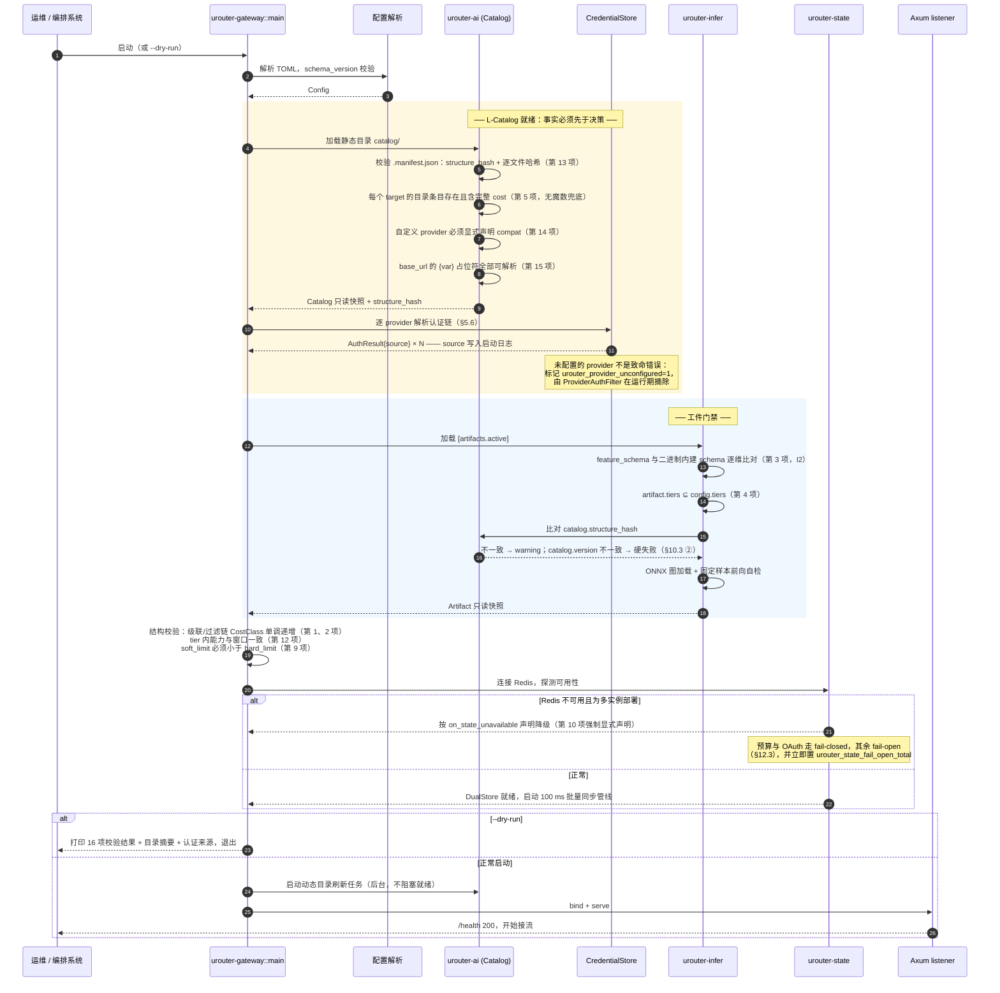
```mermaid
sequenceDiagram
    autonumber
    participant OP as 运维 / 编排系统
    participant GW as urouter-gateway::main
    participant CFG as 配置解析
    participant AI as urouter-ai (Catalog)
    participant CR as CredentialStore
    participant INF as urouter-infer
    participant ST as urouter-state
    participant AX as Axum listener

    OP->>GW: 启动（或 --dry-run）
    GW->>CFG: 解析 TOML，schema_version 校验
    CFG-->>GW: Config

    rect rgb(255, 248, 225)
    Note over AI,CR: ── L-Catalog 就绪：事实必须先于决策 ──
    GW->>AI: 加载静态目录 catalog/
    AI->>AI: 校验 .manifest.json：structure_hash + 逐文件哈希（第 13 项）
    AI->>AI: 每个 target 的目录条目存在且含完整 cost（第 5 项，无魔数兜底）
    AI->>AI: 自定义 provider 必须显式声明 compat（第 14 项）
    AI->>AI: base_url 的 {var} 占位符全部可解析（第 15 项）
    AI-->>GW: Catalog 只读快照 + structure_hash
    GW->>CR: 逐 provider 解析认证链（§5.6）
    CR-->>GW: AuthResult{source} × N —— source 写入启动日志
    Note over CR: 未配置的 provider 不是致命错误：<br/>标记 urouter_provider_unconfigured=1，<br/>由 ProviderAuthFilter 在运行期摘除
    end

    rect rgb(240, 248, 255)
    Note over INF: ── 工件门禁 ──
    GW->>INF: 加载 [artifacts.active]
    INF->>INF: feature_schema 与二进制内建 schema 逐维比对（第 3 项，I2）
    INF->>INF: artifact.tiers ⊆ config.tiers（第 4 项）
    INF->>AI: 比对 catalog.structure_hash
    AI-->>INF: 不一致 → warning；catalog.version 不一致 → 硬失败（§10.3 ②）
    INF->>INF: ONNX 图加载 + 固定样本前向自检
    INF-->>GW: Artifact 只读快照
    end

    GW->>GW: 结构校验：级联/过滤链 CostClass 单调递增（第 1、2 项）<br/>tier 内能力与窗口一致（第 12 项）<br/>soft_limit 必须小于 hard_limit（第 9 项）
    GW->>ST: 连接 Redis，探测可用性
    alt Redis 不可用且为多实例部署
        ST-->>GW: 按 on_state_unavailable 声明降级（第 10 项强制显式声明）
        Note over ST: 预算与 OAuth 走 fail-closed，其余 fail-open<br/>（§12.3），并立即置 urouter_state_fail_open_total
    else 正常
        ST-->>GW: DualStore 就绪，启动 100 ms 批量同步管线
    end

    alt --dry-run
        GW-->>OP: 打印 16 项校验结果 + 目录摘要 + 认证来源，退出
    else 正常启动
        GW->>AI: 启动动态目录刷新任务（后台，不阻塞就绪）
        GW->>AX: bind + serve
        AX-->>OP: /health 200，开始接流
    end
```

**一条明确的取舍**：动态目录刷新**不是就绪条件**。首轮刷新失败时用静态目录里的条目开服（`urouter_catalog_staleness_secs` 立即开始增长），而不是卡在启动上——否则一个 OpenRouter 抖动就能让整个网关起不来。

### 15.5 失败路径：重试 → 冷却 → 类型化降级

这是 §9 三层分工的时序展开。**三层各自的作用域不同**：重试作用于本次请求，冷却作用于后续所有请求，降级作用于 tier。

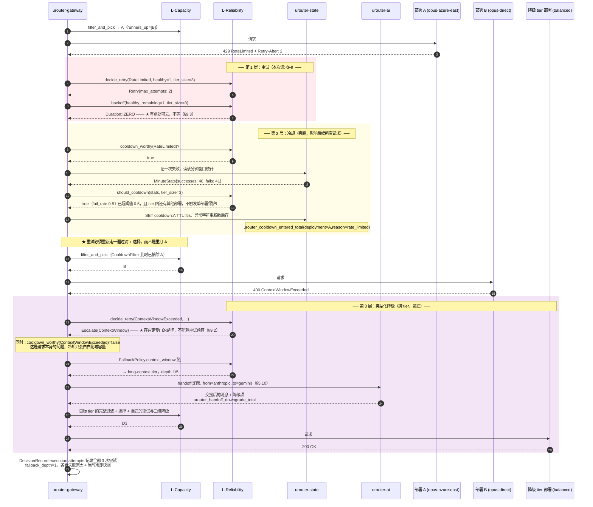
```mermaid
sequenceDiagram
    autonumber
    participant GW as urouter-gateway
    participant CAP as L-Capacity
    participant REL as L-Reliability
    participant ST as urouter-state
    participant AI as urouter-ai
    participant D1 as 部署 A (opus-azure-east)
    participant D2 as 部署 B (opus-direct)
    participant D3 as 降级 tier 部署 (balanced)

    GW->>CAP: filter_and_pick → A（runners_up=[B]）
    GW->>D1: 请求
    D1-->>GW: 429 RateLimited + Retry-After: 2

    rect rgb(255, 235, 238)
    Note over REL,ST: ── 第 1 层：重试（本次请求内）──
    GW->>REL: decide_retry(RateLimited, healthy=1, tier_size=3)
    REL-->>GW: Retry{max_attempts: 2}
    GW->>REL: backoff(healthy_remaining=1, tier_size=3)
    REL-->>GW: Duration::ZERO —— ★ 有别处可去，不等（§9.3）
    end

    rect rgb(255, 253, 231)
    Note over ST: ── 第 2 层：冷却（旁路，影响后续所有请求）──
    GW->>REL: cooldown_worthy(RateLimited)?
    REL-->>GW: true
    GW->>ST: 记一次失败，读该分钟窗口统计
    ST-->>GW: MinuteStats{successes: 40, fails: 41}
    GW->>REL: should_cooldown(stats, tier_size=3)
    REL-->>GW: true（fail_rate 0.51 已超阈值 0.5，且 tier 内还有其他部署，不触发单部署保护）
    GW->>ST: SET cooldown:A TTL=5s，异常字符串脱敏后存
    Note over ST: urouter_cooldown_entered_total{deployment=A,reason=rate_limited}
    end

    Note over GW,CAP: ★ 重试必须重新走一遍过滤 + 选择，而不是重打 A
    GW->>CAP: filter_and_pick（CooldownFilter 此时已摘除 A）
    CAP-->>GW: B
    GW->>D2: 请求
    D2-->>GW: 400 ContextWindowExceeded

    rect rgb(243, 229, 245)
    Note over REL,D3: ── 第 3 层：类型化降级（跨 tier，递归）──
    GW->>REL: decide_retry(ContextWindowExceeded, ...)
    REL-->>GW: Escalate{ContextWindow} —— ★ 存在更专门的路径，不消耗重试预算（§9.2）
    Note over GW: 同时：cooldown_worthy(ContextWindowExceeded)=false<br/>这是请求本身的问题，冷却只会白白削减容量
    GW->>REL: FallbackPolicy.context_window 链
    REL-->>GW: → long-context tier，depth 1/5
    GW->>AI: handoff(消息, from=anthropic, to=gemini)（§5.10）
    AI-->>GW: 交接后的消息 + 降级项<br/>urouter_handoff_downgrade_total
    GW->>CAP: 目标 tier 的完整过滤 + 选择 + 自己的重试与二级降级
    CAP-->>GW: D3
    GW->>D3: 请求
    D3-->>GW: 200 OK
    end

    GW->>GW: DecisionRecord.execution.attempts 记录全部 3 次尝试<br/>fallback_depth=1，各自失败原因 + 当时冷却快照
```

**三个必须有集成测试覆盖的点**：

| 点 | 断言 | 对应缺陷 |
|---|---|---|
| 重试重新过滤 | 第二次尝试的目标 ≠ 第一次，且是过滤链重新算出来的 | §9.3 零退避规则的前提 |
| 尝试计数点在循环内 | `urouter_upstream_attempts_total` = 3 而非 1 | Switchyard「重试恢复计数器恒为 0」🟠 |
| 错误信息累加 | 最终错误含 3 次尝试 + 2 个 tier + 冷却快照 | §9.5 |

### 15.6 Step::CallModel 卸载时序（L3 判官 / L4 事后升级）

**决策核零 I/O（I1）的全部重量都压在这张图上。** L3/L4 需要一次真实的 LLM 调用，但 `urouter-decide` 不允许持有任何 HTTP 客户端——它把调用需求**卸载**成 `Step`，由宿主执行后 `respond` 回来。

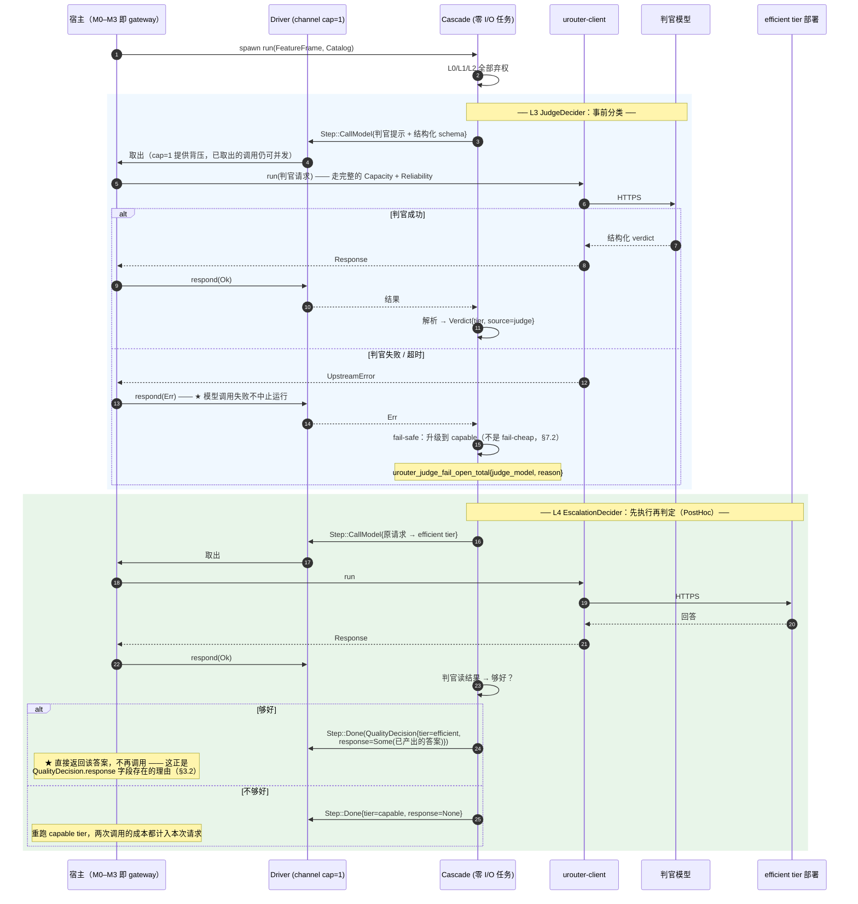
```mermaid
sequenceDiagram
    autonumber
    participant GW as 宿主（M0–M3 即 gateway）
    participant DRV as Driver (channel cap=1)
    participant CAS as Cascade (零 I/O 任务)
    participant CL as urouter-client
    participant J as 判官模型
    participant E as efficient tier 部署

    GW->>CAS: spawn run(FeatureFrame, Catalog)
    CAS->>CAS: L0/L1/L2 全部弃权

    rect rgb(240, 248, 255)
    Note over CAS,J: ── L3 JudgeDecider：事前分类 ──
    CAS->>DRV: Step::CallModel{判官提示 + 结构化 schema}
    DRV->>GW: 取出（cap=1 提供背压，已取出的调用仍可并发）
    GW->>CL: run(判官请求) —— 走完整的 Capacity + Reliability
    CL->>J: HTTPS
    alt 判官成功
        J-->>CL: 结构化 verdict
        CL-->>GW: Response
        GW->>DRV: respond(Ok)
        DRV-->>CAS: 结果
        CAS->>CAS: 解析 → Verdict{tier, source=judge}
    else 判官失败 / 超时
        CL-->>GW: UpstreamError
        GW->>DRV: respond(Err) —— ★ 模型调用失败不中止运行
        DRV-->>CAS: Err
        CAS->>CAS: fail-safe：升级到 capable（不是 fail-cheap，§7.2）
        Note over CAS: urouter_judge_fail_open_total{judge_model, reason}
    end
    end

    rect rgb(232, 245, 233)
    Note over CAS,E: ── L4 EscalationDecider：先执行再判定（PostHoc）──
    CAS->>DRV: Step::CallModel{原请求 → efficient tier}
    DRV->>GW: 取出
    GW->>CL: run
    CL->>E: HTTPS
    E-->>CL: 回答
    CL-->>GW: Response
    GW->>DRV: respond(Ok)
    CAS->>CAS: 判官读结果 → 够好？
    alt 够好
        CAS->>DRV: Step::Done(QualityDecision{tier=efficient,<br/>response=Some(已产出的答案)})
        Note over GW: ★ 直接返回该答案，不再调用 —— 这正是<br/>QualityDecision.response 字段存在的理由（§3.2）
    else 不够好
        CAS->>DRV: Step::Done{tier=capable, response=None}
        Note over GW: 重跑 capable tier，两次调用的成本都计入本次请求
    end
    end
```

**沿用 Switchyard 的四条关键保证**（§14.1），在图里的位置分别是：

1. **channel 容量为 1** —— `DRV` 的背压点，防止级联无节制地并发发起判官调用。
2. **每次运行必定发出且仅发出一个终端项** —— 图中每条分支最终都到 `Step::Done`；panic 被捕获转为错误终端项。
3. **流被丢弃 → 算法任务立即 abort** —— 客户端断连时 `GW` 丢弃 `DRV`，`CAS` 立刻停止，判官调用不会继续计费。
4. **失败语义分层** —— 判官失败走 `respond(Err)` 由级联自己处理（fail-safe 升级）；基础设施失败（channel 断裂）直接中止运行。

### 15.7 流式与取消传播时序

Switchyard 报告里最高优先级的 🔴 问题是"客户端断连后上游继续计费"。uRouter 的处理方式是让 `CancellationToken` 贯穿整条链路。

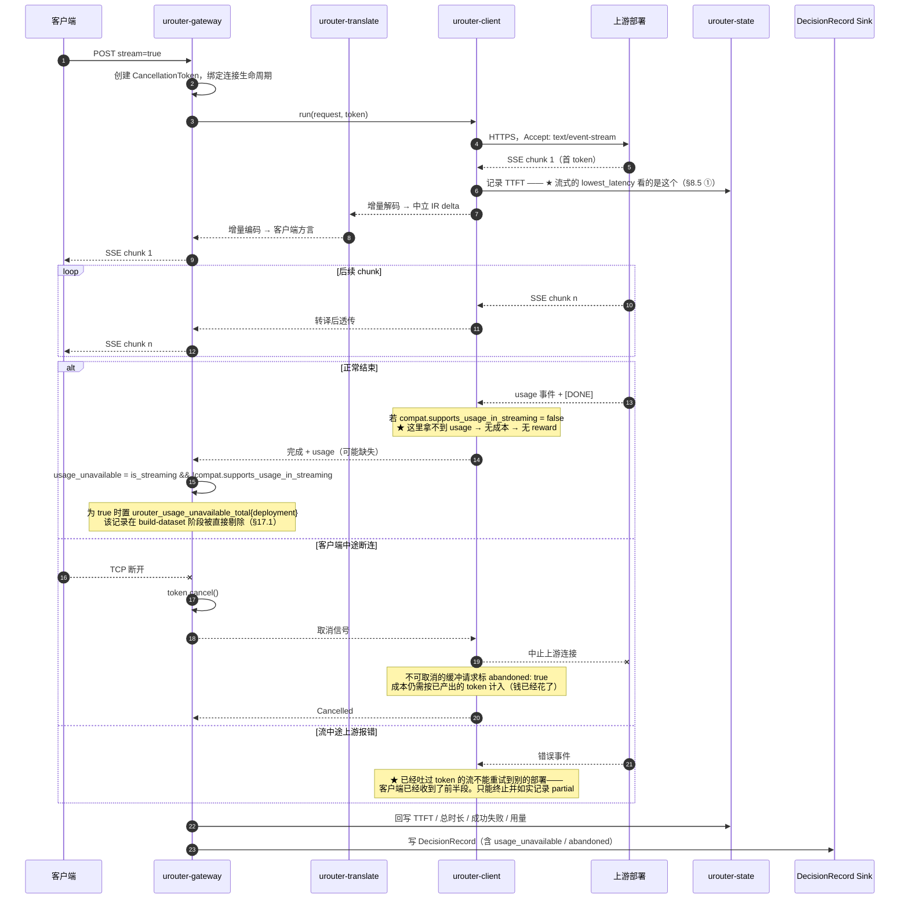
```mermaid
sequenceDiagram
    autonumber
    participant C as 客户端
    participant GW as urouter-gateway
    participant T as urouter-translate
    participant CL as urouter-client
    participant M as 上游部署
    participant ST as urouter-state
    participant REC as DecisionRecord Sink

    C->>GW: POST stream=true
    GW->>GW: 创建 CancellationToken，绑定连接生命周期
    GW->>CL: run(request, token)
    CL->>M: HTTPS，Accept: text/event-stream
    M-->>CL: SSE chunk 1（首 token）
    CL->>ST: 记录 TTFT —— ★ 流式的 lowest_latency 看的是这个（§8.5 ①）
    CL-->>T: 增量解码 → 中立 IR delta
    T-->>GW: 增量编码 → 客户端方言
    GW-->>C: SSE chunk 1

    loop 后续 chunk
        M-->>CL: SSE chunk n
        CL-->>GW: 转译后透传
        GW-->>C: SSE chunk n
    end

    alt 正常结束
        M-->>CL: usage 事件 + [DONE]
        Note over CL: 若 compat.supports_usage_in_streaming = false<br/>★ 这里拿不到 usage → 无成本 → 无 reward
        CL-->>GW: 完成 + usage（可能缺失）
        GW->>GW: usage_unavailable = is_streaming && !compat.supports_usage_in_streaming
        Note over GW: 为 true 时置 urouter_usage_unavailable_total{deployment}<br/>该记录在 build-dataset 阶段被直接剔除（§17.1）
    else 客户端中途断连
        C--xGW: TCP 断开
        GW->>GW: token.cancel()
        GW-->>CL: 取消信号
        CL--xM: 中止上游连接
        Note over CL: 不可取消的缓冲请求标 abandoned: true<br/>成本仍需按已产出的 token 计入（钱已经花了）
        CL-->>GW: Cancelled
    else 流中途上游报错
        M-->>CL: 错误事件
        Note over CL: ★ 已经吐过 token 的流不能重试到别的部署——<br/>客户端已经收到了前半段。只能终止并如实记录 partial
    end

    GW->>ST: 回写 TTFT / 总时长 / 成功失败 / 用量
    GW->>REC: 写 DecisionRecord（含 usage_unavailable / abandoned）
```

**流式带来的两个非对称性**，是设计里必须显式承认的：

| 非对称 | 内容 | 后果 |
|---|---|---|
| **延迟指标** | 流式看 TTFT，非流式看总时长 | `lowest_latency` picker 必须区分（§8.5 ①）；四个参考项目里只有 LiteLLM 做对了 |
| **重试边界** | 首 chunk 一旦发出，本次调用就**不可重试** | 重试与降级只在"尚未发出任何 chunk"的窗口内可用；这个窗口的长度就是 TTFT |

### 15.8 DualStore 同步与 Redis 故障降级时序

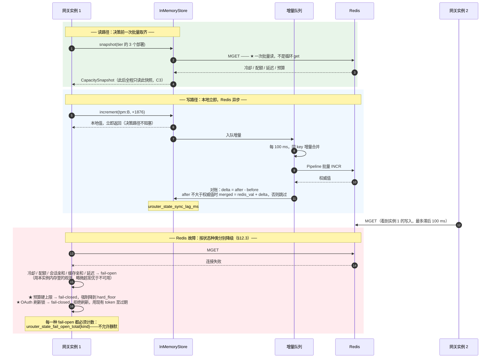
```mermaid
sequenceDiagram
    autonumber
    participant R1 as 网关实例 1
    participant MEM as InMemoryStore
    participant Q as 增量队列
    participant RD as Redis
    participant R2 as 网关实例 2

    rect rgb(232, 245, 233)
    Note over R1,MEM: ── 读路径：决策前一次批量取齐 ──
    R1->>MEM: snapshot(tier 的 3 个部署)
    MEM->>RD: MGET —— ★ 一次批量读，不是循环 get
    RD-->>MEM: 冷却 / 配额 / 延迟 / 预算
    MEM-->>R1: CapacitySnapshot（此后全程只读此快照，C3）
    end

    rect rgb(240, 248, 255)
    Note over R1,RD: ── 写路径：本地立即，Redis 异步 ──
    R1->>MEM: increment(tpm:B, +1876)
    MEM-->>R1: 本地值，立即返回（决策路径不阻塞）
    MEM->>Q: 入队增量
    Q->>Q: 每 100 ms，同 key 增量合并
    Q->>RD: Pipeline 批量 INCR
    RD-->>Q: 权威值
    Q->>MEM: 对账：delta = after - before<br/>after 不大于权威值时 merged = redis_val + delta，否则跳过
    Note over MEM: urouter_state_sync_lag_ms
    end

    R2->>RD: MGET（看到实例 1 的写入，最多滞后 100 ms）

    rect rgb(255, 235, 238)
    Note over R1,RD: ── Redis 故障：按状态种类分别降级（§12.3）──
    R1->>RD: MGET
    RD--xR1: 连接失败
    R1->>R1: 冷却 / 配额 / 会话亲和 / 缓存亲和 / 延迟 → fail-open<br/>（用本实例内存里的观测，略微超发优于不可用）
    R1->>R1: ★ 预算硬上限 → fail-closed，强制降到 hard_floor<br/>★ OAuth 刷新锁 → fail-closed，拒绝刷新，用现有 token 至过期
    Note over R1: 每一种 fail-open 都必须计数：<br/>urouter_state_fail_open_total{kind}——不允许静默
    end
```

**为什么预算与 OAuth 是唯二 fail-closed 的**：其余状态失效的代价是"多花一点容量"，这两者失效的代价分别是"钱失控"和"把 provider 打死"。LiteLLM 全局 fail-open 的取舍本身合理，问题在于它是**隐式**的——故障时保护静默失效，没人知道。

### 15.9 目录刷新与 OAuth 并发刷新时序

两条后台流程共享同一个原则：**请求路径只读最后已知值，永不等待刷新**。

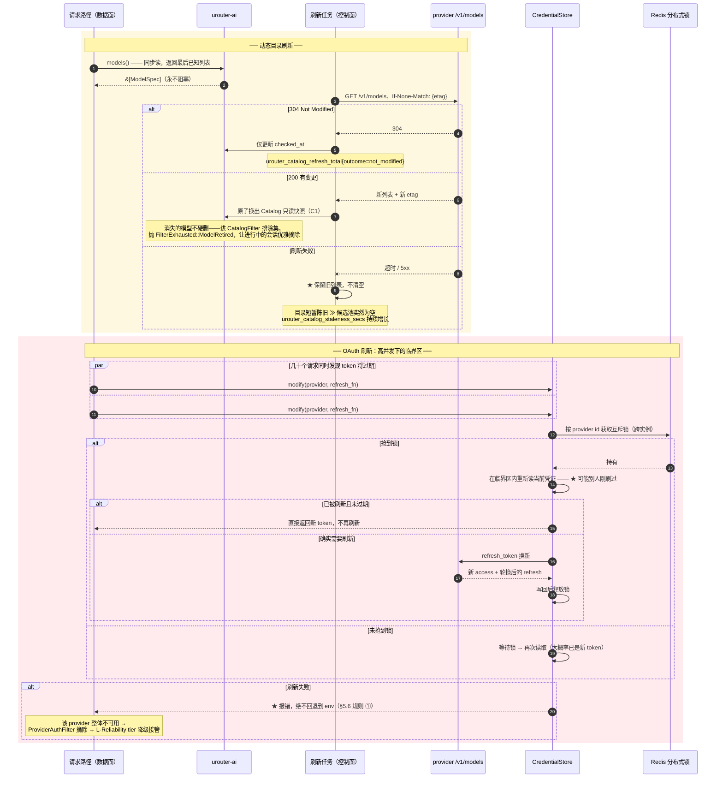
```mermaid
sequenceDiagram
    autonumber
    participant REQ as 请求路径（数据面）
    participant AI as urouter-ai
    participant RF as 刷新任务（控制面）
    participant UP as provider /v1/models
    participant CR as CredentialStore
    participant RD as Redis 分布式锁

    rect rgb(255, 248, 225)
    Note over REQ,UP: ── 动态目录刷新 ──
    REQ->>AI: models() —— 同步读，返回最后已知列表
    AI-->>REQ: &[ModelSpec]（永不阻塞）
    RF->>UP: GET /v1/models，If-None-Match: {etag}
    alt 304 Not Modified
        UP-->>RF: 304
        RF->>AI: 仅更新 checked_at
        Note over RF: urouter_catalog_refresh_total{outcome=not_modified}
    else 200 有变更
        UP-->>RF: 新列表 + 新 etag
        RF->>AI: 原子换出 Catalog 只读快照（C1）
        Note over AI: 消失的模型不硬删——进 CatalogFilter 排除集，<br/>抛 FilterExhausted::ModelRetired，让进行中的会话优雅摘除
    else 刷新失败
        UP--xRF: 超时 / 5xx
        RF->>RF: ★ 保留旧列表，不清空
        Note over RF: 目录短暂陈旧 ≫ 候选池突然为空<br/>urouter_catalog_staleness_secs 持续增长
    end
    end

    rect rgb(255, 235, 238)
    Note over REQ,RD: ── OAuth 刷新：高并发下的临界区 ──
    par 几十个请求同时发现 token 将过期
        REQ->>CR: modify(provider, refresh_fn)
    and
        REQ->>CR: modify(provider, refresh_fn)
    end
    CR->>RD: 按 provider id 获取互斥锁（跨实例）
    alt 抢到锁
        RD-->>CR: 持有
        CR->>CR: 在临界区内重新读当前凭证 —— ★ 可能别人刚刷过
        alt 已被刷新且未过期
            CR-->>REQ: 直接返回新 token，不再刷新
        else 确实需要刷新
            CR->>UP: refresh_token 换新
            UP-->>CR: 新 access + 轮换后的 refresh
            CR->>CR: 写回后释放锁
        end
    else 未抢到锁
        CR->>CR: 等待锁 → 再次读取（大概率已是新 token）
    end
    alt 刷新失败
        CR-->>REQ: ★ 报错，绝不回退到 env（§5.6 规则 ①）
        Note over REQ: 该 provider 整体不可用 →<br/>ProviderAuthFilter 摘除 → L-Reliability tier 降级接管
    end
    end
```

**没有这个临界区会发生什么**：token 过期的瞬间几十个请求同时刷新，多数 OAuth 实现会轮换 refresh token，第二个刷新拿着已作废的 token——**直接把这个 provider 打死**。这个 bug 只在高并发且 token 恰好过期时出现，极难复现，所以必须在设计上排除而不是靠测试发现。

### 15.10 工件热加载 / 影子 / 灰度 / 回滚时序

```mermaid
sequenceDiagram
    autonumber
    participant OP as 运维
    participant GW as urouter-gateway
    participant INF as urouter-infer
    participant CAS as Cascade
    participant REC as DecisionRecord Sink

    OP->>GW: POST /v1/artifacts/reload（或 SIGHUP）
    GW->>INF: 加载 candidate 工件
    INF->>INF: feature_schema 逐维比对（I2）
    alt schema 不匹配
        INF-->>GW: 拒绝加载
        GW-->>OP: 400 + 具体不匹配的维度 —— ★ active 不受影响，服务继续
    else 通过
        INF->>INF: catalog.structure_hash 比对 → 不一致仅 warning<br/>catalog.version 不一致 → 拒绝
        INF-->>GW: candidate 就绪，原子挂载到 candidate slot
        Note over GW: urouter_artifact_info{slot=candidate, artifact_id}
    end

    rect rgb(240, 248, 255)
    Note over CAS,REC: ── shadow：零风险验证 ──
    GW->>CAS: decide(FeatureFrame) —— active
    CAS-->>GW: tier=capable
    GW->>CAS: decide(同一个 FeatureFrame) —— candidate
    Note over CAS: ★ 共享同一份特征，只多一次 ONNX 前向（~1 ms）<br/>不产生任何额外的模型调用，成本近似为零
    CAS-->>GW: tier=balanced
    GW->>GW: 只有 active 生效
    GW->>REC: shadow{artifact_id, tier, agreed: false}
    Note over REC: urouter_shadow_disagreement_total{active, candidate, direction}
    end

    rect rgb(232, 245, 233)
    Note over GW: ── canary：按会话 hash 真实放量 ──
    GW->>GW: hash(session_id) % 100 落入 traffic_split 区间
    Note over GW: ★ 按会话而非按请求分流——同一会话中途换策略<br/>会让轨迹特征（escalation_streak / latch）失去意义
    end

    alt 指标恶化
        OP->>GW: 改 [artifacts.active].path + SIGHUP
        GW->>INF: 换回旧工件
        Note over OP: 回滚路径与加载路径完全相同，无特殊代码分支
    end
```

**影子模式的价值在于它测的是策略而非实现**：两个工件消费同一份 `FeatureFrame`，唯一的差异就是模型权重与阈值，所以不一致率可以直接归因到策略变更上。这也是 **I2**（特征只算一次）除训练同源之外的第二个收益。

### 15.11 闭环回流的慢环时序

前面十张图都是毫秒到秒级的快环，这一张是**天到周级的慢环**——也是 §1.4 那条"四个参考项目共同断裂"的缝。

```mermaid
sequenceDiagram
    autonumber
    participant GW as 线上网关
    participant REC as DecisionRecord JSONL<br/>+ vector side-store
    participant LAB as urouter-lab
    participant CI as CI 门禁
    participant OP as 运维

    loop 每请求（快环，微秒级）
        GW->>REC: 特征快照 + 级联 trace + 过滤 trace + 成本四项 + 结果
        opt ε = 3%（默认关闭）
            GW->>GW: 随机偏离当前决策（默认 up_only）
            GW->>REC: exploration=true + propensity
            Note over GW: ★ 没有随机化，p_log(a) 对未选中动作恒为 0，<br/>IPS 分母无定义——反事实评估根本做不了
        end
    end

    Note over REC,LAB: ── 以下为天/周级的慢环 ──

    LAB->>REC: build-dataset
    LAB->>GW: PyO3 调 urouter-ai::calculate_cost 复算成本（I6）
    Note over LAB: ★ 不直接读 cost_breakdown.total——<br/>复算才能做「路由到 tier B 会花多少」的假设分析，<br/>顺带交叉校验目录漂移
    LAB->>LAB: 三类污染样本打标：<br/>usage_unavailable → 直接剔除<br/>capacity_constrained → 权重减半 + 评估分列<br/>catalog_drift → 按 structure_hash 分区
    LAB->>LAB: evaluate：IPS / SNIPS / DR 三者同时报告
    Note over LAB: 三者结论不一致 = 数据不足以支撑，不是选一个最好看的
    LAB->>LAB: train → sweep（α/β 帕累托）→ export ONNX

    LAB->>CI: 七项门禁
    alt 任一项不过
        CI-->>LAB: 拒绝出工件（如：无 95% 置信区间 /<br/>未帕累托支配任何基线 / usage_unavailable 剔除率超过 10%）
    else 全过
        CI-->>OP: RouterArtifact 可发布
        OP->>GW: shadow → 观察不一致率 → canary → 全量（§15.10）
    end
```

**这条环的精度上限由成本核算的精度决定**——reward 是 `α·quality − β·cost`，成本算错等价于标签错。这就是 v3 把 L-Catalog 提升为独立层的**唯一理由**（§5.1、**I6**）。

### 15.12 部署健康状态机

前面的时序图描述的是"一次请求发生了什么"，这张状态机描述的是"**一个部署在时间轴上的处境**"——它跨请求存在，是冷却机制真正作用的对象。

```mermaid
stateDiagram-v2
    [*] --> Configured: 配置加载
    Configured --> Unconfigured: 认证解析失败 / 未配置
    Configured --> Healthy: 启动校验通过

    Unconfigured --> Healthy: 凭证补齐（热重载）
    note right of Unconfigured
        ProviderAuthFilter 摘除
        urouter_provider_unconfigured=1
    end note

    Healthy --> Cooling: should_cooldown 为真：失败率超阈值，或上次是 429
    Cooling --> Healthy: TTL 自然过期（默认 5s）
    note right of Cooling
        CooldownFilter 摘除
        ★ 单部署保护：tier 内只剩一个部署时永不进入此态
        （冷掉唯一部署 = 该 tier 完全不可用）
    end note

    Healthy --> Saturated: 预估 tpm 超出该部署配额
    Saturated --> Healthy: 分钟窗口滚动
    note right of Saturated
        QuotaFilter 摘除
        判据是「加上这次会不会超」，不是「现在超没超」
    end note

    Healthy --> BudgetBlocked: 作用域花费达到 hard_limit
    BudgetBlocked --> Healthy: 预算窗口滚动
    note right of BudgetBlocked
        BudgetFilter 摘除
        Redis 故障时 fail-closed 强制进入此态
    end note

    Healthy --> Retired: 动态目录中模型消失
    Retired --> Healthy: 目录刷新后重新出现
    note right of Retired
        CatalogFilter 摘除，抛 ModelRetired
        ★ 优雅摘除而非硬删——硬删会让进行中的会话中途失去 tier
    end note

    Configured --> [*]: 配置移除
```

**五个非健康态对应五个不同的 `FilterExhausted` 变体**，这不是巧合：**I5**（失败必须类型化）要求"候选集为什么空了"必须能被机器读取，因为错误类型直接决定走哪条降级链。状态机的每条边都对应指标表里的一个计数器——`urouter_filter_removed_total{filter}` 就是这张图上各条边的流量。

### 15.13 时延预算与关键路径

路由本身的开销必须**远小于它节省的时间与金钱**，否则整个命题不成立。下表是各阶段的目标预算（p99），`urouter_routing_overhead_ms` 的直方图桶据此设计（从 0.1 ms 起）。

| 阶段 | 目标 p99 | 是否在关键路径 | 说明 |
|---|---:|:---:|---|
| decode（wire → IR） | 200 μs | 是 | 与请求体大小线性相关 |
| 特征抽取（statics + trajectory + session） | **15 μs** | 是 | 纯函数，无 embedding |
| L0 RuleDecider | 10 μs | 是 | 正则 / 关键词 |
| L1 SignalDecider | 25 μs | 是 | 互证打分 |
| `lazy_semantic()` + embedding | **1–3 ms** | **仅在下沉到 L2 时** | 级联的主要收益：L0/L1 命中时这项为 0 |
| L2 ModelDecider（ONNX 前向） | **5 ms**（门禁第 5 项） | 仅在下沉到 L2 时 | 超过则 CI 拒绝出工件 |
| L3 JudgeDecider | 100 ms+ | 仅在配置且下沉时 | 真实 LLM 调用，产生费用 |
| `DualStore::snapshot`（一次 MGET） | 1 ms | 是 | 同机房 Redis；故障时走本地内存 |
| L-Capacity 全链（10 filter + picker） | **50 μs** | 是 | 零 I/O，全部读注入的快照 |
| resolve_endpoint + 认证解析 | 30 μs | 是 | 命中缓存；OAuth 刷新在控制面 |
| encode（IR → 上游方言） | 200 μs | 是 | 应用 compat 开关 |
| **路由总开销（不含 L3/L4）** | **≈ 8 ms** | | 其中 ONNX 前向占 60%+ |
| calculate_cost + 回写 + 落盘 | — | **否** | 响应发出后异步执行 |

**三条据此得出的设计结论**：

1. **级联的价值可以量化**：L0/L1 命中的请求路由开销约 **1.5 ms**，下沉到 L2 才是 8 ms。所以 `urouter_cascade_depth` 直方图不只是归因指标，**它直接就是延迟指标**。
2. **ONNX 前向是唯一值得优化的热点**，其余各项加起来不到 2 ms。这也是门禁第 5 项（p99 < 5 ms）存在的理由。
3. **收尾阶段必须在响应之后**。成本核算、状态回写、`DecisionRecord` 落盘全部移出关键路径——它们的失败也因此不能影响响应（C2）。

---

## 16. 配置模型

**v3 的核心变化**：`[targets.*]` 从"手抄事实"改为"引用目录 + 显式覆盖"（§5.9），新增 `[providers.*]` 与 `[catalog]` 两块。

```toml
schema_version = 3

# ═════ 目录：模型事实的单一来源（v3 新增）═════
[catalog]
path = "catalog/"                      # 构建期生成的静态目录 + .manifest.json
verify_manifest = true                 # 启动时校验 structure_hash 与逐文件哈希
refresh_interval = "1h"                # 动态 provider 的刷新周期（不阻塞请求）

# ═════ 厂商（v3 新增）═════
[providers.anthropic]
# id / base_url / 内置模型列表来自目录，此处只写部署侧的认证与覆盖
auth = { api_key_env = "ANTHROPIC_API_KEY" }

[providers.azure_east]
catalog_provider = "anthropic"         # 复用 anthropic 的模型定义
base_url = "https://eastus.openai.azure.com"
auth = { api_key_env = "AZURE_EAST_KEY" }
region = "us-east"

[providers.vllm_local]
base_url = "http://10.0.1.20:8000/v1"
auth = { kind = "none" }               # 本地端点免认证
catalog_source = { kind = "dynamic", endpoint = "/v1/models" }
# ★ 自定义端点必须显式声明 compat，不做自动探测（§5.7 ③）
compat = { max_tokens_field = "max_tokens", supports_usage_in_streaming = true,
           supports_developer_role = false, thinking_format = "chat-template" }

[providers.cloudflare_gw]
base_url = "https://gateway.ai.cloudflare.com/v1/{CF_ACCOUNT_ID}/{CF_GATEWAY_ID}/openai"
env = { CF_ACCOUNT_ID = "$env:CF_ACCOUNT_ID", CF_GATEWAY_ID = "prod-gw" }
auth = { api_key_env = "CF_API_TOKEN" }

# ═════ 部署（deployment）═════
[targets.opus-azure-east]
model = "anthropic/claude-opus-4.7"    # ← 指向目录条目
provider = "azure_east"
rpm = 1000                              # 部署级配额（目录不含）
tpm = 200000
weight = 3
# context_window / capabilities / compat / cost 全部来自目录

[targets.opus-azure-east.cost_override]  # ← 企业议价，必须显式且带 reason
reason = "2026 Q3 EA discount"
input = 12.0
output = 60.0

[targets.opus-azure-west]
model = "anthropic/claude-opus-4.7"
provider = "azure_west"
rpm = 500
weight = 1

[targets.opus-direct]
model = "anthropic/claude-opus-4.7"
provider = "anthropic"
order = 2                               # 主备语义：order=1 都不可用时才用

# ═════ 能力层级（tier）═════
[tiers.capable]
targets = ["opus-azure-east", "opus-azure-west", "opus-direct"]
picker = "lowest_latency"
[tiers.capable.picker_args]
buffer_ratio = 0.1
cache_affinity_weight = 0.6

[tiers.balanced]
targets = ["sonnet-azure-east", "sonnet-vllm-a", "sonnet-vllm-b"]
picker = "lowest_quota_usage"

[tiers.efficient]
targets = ["kimi-openrouter"]
picker = "weighted"

[tiers.long-context]
targets = ["gemini-1m"]
picker = "weighted"

# ═════ 过滤链：按 CostClass 单调递增 ═════
[[filters]]
filter = "tenant"
[[filters]]
filter = "provider_auth"                # v3
[[filters]]
filter = "catalog"                      # v3
[[filters]]
filter = "cooldown"
[[filters]]
filter = "context_window"
[[filters]]
filter = "capability"
[[filters]]
filter = "quota"
[[filters]]
filter = "budget"
[[filters]]
filter = "region"
[[filters]]
filter = "order"

# ═════ 冷却策略 ═════
[cooldown]
duration = "5s"
failure_threshold = 0.5
min_traffic_for_total_failure = 1000
protect_sole_deployment = true          # ★ 单部署 tier 永不冷却

# ═════ 预算：软偏置 + 硬闸 ═════
[budgets.team_monthly]
scope = "tenant"
window = "30d"
soft_limit_usd = 2400
hard_limit_usd = 3000
gain = 1.5
hard_floor = "efficient"
on_state_unavailable = "fail_closed"

# ═════ 可靠性 ═════
[reliability]
max_fallback_depth = 5
[reliability.retries]
rate_limited = 2
server_error = 2
timeout = 1
transport = 2
[reliability.fallback]
generic        = ["balanced", "efficient"]
context_window = ["long-context"]
content_policy = ["permissive"]

# ═════ 路由 ═════
[routes.auto]
id = "urouter/auto"
default_tier = "balanced"
budget = "team_monthly"

[[routes.auto.cascade]]
decider = "rules"
[[routes.auto.cascade.rules]]
when = "statics.has_images"
then = "capable"
[[routes.auto.cascade.rules]]
when = "statics.prompt_tokens_est > 200000"
then = "long-context"

[[routes.auto.cascade]]
decider = "signals"
confidence_threshold = 0.5

[[routes.auto.cascade]]
decider = "model"
artifact = "active"
confidence_threshold = 0.6

[[routes.auto.cascade]]
decider = "judge"
judge_tier = "efficient"
classify_trigger = "user_turn"

# ═════ 工件 ═════
[artifacts.active]
path = "artifacts/coding-agent-v6"
[artifacts.candidate]
path = "artifacts/coding-agent-v7"
mode = "shadow"

# ═════ 探索（默认关闭）═════
[routes.auto.exploration]
enabled = true
epsilon = 0.03
direction = "up_only"

# ═════ 状态 ═════
[state]
redis_url_env = "UROUTER_REDIS_URL"
sync_interval = "100ms"
credential_lock = "redis"               # v3：OAuth 刷新的跨实例互斥

# ═════ 回流 ═════
[recording]
path = "/var/lib/urouter/decisions"
rotate = "1d"
vector_store = "/var/lib/urouter/vectors"
sample_rate = 1.0
```

### 16.1 启动校验（`--dry-run`）强制的 16 项

| # | 校验 | 违反后果 |
|---|---|---|
| 1 | 级联的 `CostClass` 单调递增 | 失败 |
| 2 | 过滤链的 `CostClass` 单调递增 | 失败 |
| 3 | 工件的 `feature_schema` 与二进制内建 schema 一致（**I2**） | 失败 |
| 4 | 工件的 `tiers` 是配置 `[tiers.*]` 键集合的子集 | 失败 |
| 5 | **每个 target 引用的目录条目存在，且含完整 `cost`** | 失败（**绝不用魔数兜底**） |
| 6 | `auth` 引用的环境变量存在（或声明 `kind = "none"`） | 失败 |
| 7 | `exploration.enabled = true` 时 `recording` 必须开启 | 失败 |
| 8 | 每个 tier 至少一个 target；fallback 链引用的 tier 都存在 | 失败 |
| 9 | `soft_limit_usd < hard_limit_usd` | 失败 |
| 10 | 多实例部署时 `on_state_unavailable` 必须显式声明 | 失败 |
| 11 | route 预期无工具调用却未配 `model` decider | **warning** |
| 12 | **同一 tier 内所有 target 的 `capabilities` 与 `context_window` 一致** | 失败（避免 LiteLLM 的"能力不等价 model_group"陷阱） |
| 13 | **（v3）目录 manifest 的 `structure_hash` 与逐文件哈希校验通过** | 失败 |
| 14 | **（v3）自定义 provider（不在内置目录中）必须显式声明 `compat`** | 失败 |
| 15 | **（v3）`base_url` 中所有 `{var}` 占位符都能从 `env` 解析** | 失败 |
| 16 | **（v3）`cost_override` 必须带 `reason`** | 失败 |

第 5、13、14、15、16 条全部是 **I6**（模型事实单一来源）的强制点。

---

## 17. 离线管线 urouter-lab

```mermaid
flowchart TB
    A["DecisionRecord JSONL<br/>+ vector side-store"]
    B["1. build-dataset<br/>标签融合 · 成本复核 · reward 列 · 三类打标"]
    C["2. evaluate<br/>反事实估计 IPS / SNIPS / DR"]
    D["3. train<br/>MLP / KNN / 对比学习"]
    E["4. sweep<br/>α/β 帕累托扫参"]
    F["5. export<br/>ONNX + manifest + 七项 CI 校验"]
    G["6. replay<br/>新工件 vs 线上策略离线对比"]
    ART["RouterArtifact"]

    A --> B --> C
    B --> D --> E --> F --> ART
    C --> E
    ART --> G
    G -->|"通过 → shadow → canary"| ART
```

### 17.1 `build-dataset`：reward 列与三类样本打标

#### reward 列的设计杠杆

沿用 LLMRouter 最漂亮的杠杆：**不改任何算法代码，只改 reward 列的语义**。

```
reward = α · norm(quality) − β · norm(cost)
```

**`cost` 必须由 `urouter-ai::calculate_cost` 通过 PyO3 复算，而不是直接读 `DecisionRecord.execution.cost_breakdown.total`**（**I6**）。

理由：这样离线管线可以做**假设分析**——"如果当时路由到 tier B，成本会是多少"需要用 B 的价格重算，而不能只读实际发生的成本。同时它也是一道交叉校验：复算结果与记录值不符，说明目录版本漂移或有未记录的覆盖。

#### 三类必须打标并特殊处理的样本（v3 扩展）

| 打标 | 判据 | 处理 | 引入版本 |
|---|---|---|---|
| `usage_unavailable` | `execution.usage_unavailable == true` | **直接剔除**——没有 usage 就没有成本、没有 reward，无法构造标签 | **v3** |
| `capacity_constrained` | `capacity.filters` 中 cooldown 或 quota 移除了 > 50% 候选 | **权重减半 + 评估分列**——这次"选了什么"是被容量约束逼出来的，不是质量决策的结果 | v2 |
| `catalog_drift` | `record.catalog.structure_hash != 当前目录` | **分区**——价格变动后的成本不能与变动前混算 | **v3** |

前两类在 v2 就有一类，v3 补上了另外两类。**这三个污染源的共同特点是：它们都不会让任何环节报错，只会安静地让训练出的策略变差。**

### 17.2 `evaluate`：为什么不能用 LLMRouter 的回放评测

xRouteBench 可以直接回放，因为它有 `|query| × |所有候选模型|` 的**全矩阵**。线上回流数据是**稀疏的**。要评估"换成策略 B 会怎样"，必须用反事实估计：

| 估计器 | 要点 | 特性 |
|---|---|---|
| **IPS** | `E[r · 1(π_new = a) / p_log(a)]` | 无偏，propensity 小时方差爆炸 |
| **SNIPS** | 自归一化 IPS | 轻微偏差，方差显著更低 |
| **DR** | 结合 reward 回归模型作为基线 | 通常最优 |

**默认用 DR，同时报告三者**——结论不一致本身就是"数据不足以支撑"的信号。

这也是 ε-探索**必须存在**的原因：没有随机化，`p_log(a)` 对未被选中的动作恒为 0，分母无定义。

**反事实的成本项必须用目标 tier 的目录价格重算**，包括阶梯档的重新匹配——同一份 usage 在 tier A 和 tier B 上可能命中不同的阶梯档。

### 17.3 `export`：CI 门禁（七项）

| # | 门禁 | 引入版本 |
|---|---|---|
| 1 | `offline_metrics` 必须含 95% 置信区间 | v1 |
| 2 | 必须帕累托支配 `always_capable` / `always_efficient` / `random` 至少一个 | v1 |
| 3 | ONNX 图能被 `urouter-infer` 加载，对固定样本产出与 Python 侧**逐位一致**的输出 | v1 |
| 4 | `feature_schema` 与当前 `urouter-feature` 版本一致 | v1 |
| 5 | 推理延迟 p99 < 5 ms | v1 |
| 6 | `capacity_constrained` 样本占比 ≤ 30% | v2 |
| 7 | **`usage_unavailable` 剔除率 ≤ 10%，且不集中在单个 tier** | **v3** |

第 7 条的理由：如果某个 tier 的主力部署恰好不支持流式 usage，你会在毫不知情的情况下损失掉该 tier 绝大部分训练数据，训出的工件会系统性低估那个 tier。这是一个只有在把 compat 纳入数据质量考量后才能发现的失败模式。

---

## 18. 可观测性

### 18.1 指标表

| Metric | 类型 | Labels | 含义 |
|---|---|---|---|
| **通用 / L-Transport** | | | |
| `urouter_requests_total` / `_errors_total` | counter | `route`,`tier`,`deployment` | 终端调用 |
| `urouter_llm_calls_total` | counter | `route`,`tier`,`outcome` | **逻辑**调用（含判官） |
| `urouter_upstream_attempts_total` | counter | `deployment`,`outcome`,`code` | **物理** HTTP 尝试（比值 = 重试放大倍数） |
| `urouter_total_latency_ms` | histogram | `route`,`tier` | 全回合延迟 |
| **L-Quality** | | | |
| `urouter_routing_overhead_ms` | histogram | `route`,`layer` | `layer ∈ {quality, capacity}`，桶从 0.1 ms 起 |
| `urouter_cascade_depth` | histogram | `route` | 级联下沉到第几层 |
| `urouter_decider_latency_us` | histogram | `decider` | 每层耗时 |
| `urouter_decision_source_total` | counter | `route`,`source`,`tier` | 归因分布（**I3**） |
| `urouter_artifact_info` | gauge | `slot`,`artifact_id` | 工件版本 |
| `urouter_shadow_disagreement_total` | counter | `active`,`candidate`,`direction` | 影子不一致 |
| `urouter_exploration_total` | counter | `route`,`direction` | 探索采样 |
| `urouter_judge_fail_open_total` | counter | `judge_model`,`reason` | 判官失败 |
| **L-Capacity** | | | |
| `urouter_filter_removed_total` | counter | `filter`,`tier` | 各过滤器摘除数——**定位容量瓶颈的主力指标** |
| `urouter_filter_exhausted_total` | counter | `filter`,`tier` | 候选集被清空次数 |
| `urouter_candidates_remaining` | histogram | `tier` | 过滤后剩余候选数。**p50 接近 1 是危险信号** |
| `urouter_picker_latency_us` | histogram | `picker` | 选择器耗时 |
| `urouter_deployment_selected_total` | counter | `tier`,`deployment` | 部署级流量分布 |
| **L-Reliability** | | | |
| `urouter_cooldown_active` | gauge | `tier`,`deployment` | 当前冷却中（1/0） |
| `urouter_cooldown_entered_total` | counter | `deployment`,`reason` | 进入冷却次数 |
| `urouter_retry_total` | counter | `tier`,`error_kind`,`outcome` | 重试次数与结果 |
| `urouter_fallback_total` | counter | `from_tier`,`to_tier`,`chain` | 降级次数 |
| `urouter_fallback_depth` | histogram | `route` | 降级递归深度 |
| **L-Catalog（v3 新增）** | | | |
| `urouter_catalog_info` | gauge | `version`,`structure_hash` | 当前目录版本 |
| `urouter_catalog_models` | gauge | `provider`,`source` | 各厂商模型数，`source ∈ {static, dynamic}` |
| `urouter_catalog_refresh_total` | counter | `provider`,`outcome` | 动态刷新结果（`not_modified` / `updated` / `failed`） |
| `urouter_catalog_staleness_secs` | gauge | `provider` | 距上次成功刷新的秒数 |
| `urouter_auth_resolve_total` | counter | `provider`,`source`,`outcome` | 认证解析（`source` = 凭证来源标签） |
| `urouter_oauth_refresh_total` | counter | `provider`,`outcome` | OAuth 刷新 |
| `urouter_provider_unconfigured` | gauge | `provider` | 未配置认证的厂商（1/0） |
| **`urouter_usage_unavailable_total`** | counter | `deployment` | **拿不到 usage 的调用——直接等于损失的训练样本** |
| `urouter_cost_tier_applied_total` | counter | `model`,`tier_threshold` | 命中长上下文阶梯档的次数 |
| `urouter_price_override_active` | gauge | `deployment` | 使用了 `cost_override`（1/0） |
| `urouter_handoff_downgrade_total` | counter | `from_provider`,`to_provider`,`kind` | 跨厂商交接的信息降级 |
| **成本** | | | |
| `urouter_cost_usd_total` | counter | `route`,`tier`,`deployment`,`component` | 实际花费，`component ∈ {input, output, cache_read, cache_write}` |
| `urouter_counterfactual_cost_usd_total` | counter | `route`,`baseline` | **反事实基线成本** |
| `urouter_cache_hit_ratio` | gauge | `tier`,`deployment` | 缓存命中率 |
| `urouter_cache_savings_usd_total` | counter | `tier` | **缓存带来的节省**（与降级节省分开算） |
| `urouter_budget_bias` | gauge | `budget_scope` | 当前软偏置 |
| `urouter_budget_spent_ratio` | gauge | `budget_scope` | 花费/硬上限 |
| **状态** | | | |
| `urouter_state_fail_open_total` | counter | `kind` | Redis 不可用导致的降级（**不允许静默**） |
| `urouter_state_sync_lag_ms` | histogram | — | 本地与 Redis 的同步滞后 |

### 18.2 价值论证的三元组

单看节省率是有害的——把所有流量路由到最便宜的模型能"省 95%"，但那不是路由，那是降级。仪表盘强制三元组展示：

```
总节省率 61.2%
  ├─ 降级贡献 43.7%   ← 有质量代价，必须配置信区间
  └─ 缓存贡献 17.5%   ← 零质量代价
影子质量回归 −2.1% (CI95: −3.4% ~ −0.8%)
```

**v3 的必要条件**：这个分解只有在 `CostBreakdown` 四项分列 + `cost_usd_uncached` 同时记录时才算得出来（§13.1）。如果只记 total，缓存节省会被系统性误归因给降级策略——一个几乎不降级但缓存命中率很高的部署，看起来会像"降级策略很成功"，直接导致训练目标错误。

### 18.3 管理端点

| 方法 | 路径 | 用途 |
|---|---|---|
| POST | `/v1/decision` | **只出决策不调模型**，返回 tier + 部署 + 有序回退 + 完整 trace |
| POST | `/v1/explain` | 逐层归因：每个 decider 的特征值/分数/阈值/是否弃权，**以及每个 filter 摘除了谁、为什么** |
| GET | `/v1/tiers` | 各 tier 的部署健康状态、冷却情况、配额余量、**认证来源** |
| **GET** | **`/v1/catalog`** | **当前目录：厂商、模型、价格、能力、compat、刷新状态（v3）** |
| **POST** | **`/v1/catalog/refresh`** | **手动触发动态目录刷新（v3）** |
| GET | `/v1/artifacts` | 当前工件及 manifest 摘要 |
| POST | `/v1/artifacts/reload` | 热加载 |
| GET | `/v1/stats` | 用量 + 级联统计 + 过滤统计 + 预算状态 |
| GET | `/metrics` | Prometheus |
| GET | `/health` | 存活探针 |

`/v1/catalog` 是 v3 新增的排障入口。"为什么这个请求算出来这么贵"的第一个问题永远是"系统认为这个模型多少钱"。

---

## 19. 目录骨架

```
uRouter/
├── Cargo.toml                     # workspace
├── crates/
│   ├── urouter-proto/             # 中立类型 + FeatureFrame + Verdict
│   │   └── src/errors.rs          #   FilterExhausted / UpstreamError（封闭枚举，I5）
│   ├── urouter-ai/                # ★ L-Catalog（v3）
│   │   ├── src/catalog/           #   spec.rs registry.rs refresh.rs generated/
│   │   ├── src/pricing/           #   cost.rs calculate.rs（PyO3 导出）
│   │   ├── src/auth/              #   resolve.rs store.rs oauth.rs
│   │   ├── src/endpoint/          #   占位符材料化 + header 合并顺序
│   │   ├── src/compat/            #   matrix.rs detect.rs
│   │   ├── src/handoff/           #   跨 provider 消息语义降级
│   │   └── tools/catalogen/       #   目录生成器（models.dev / /v1/models / 企业 YAML）
│   ├── urouter-feature/           # 四族特征抽取（纯函数，逐维单测）
│   ├── urouter-decide/            # L-Quality（零 I/O）
│   │   ├── src/deciders/          #   rules signals model judge escalation
│   │   └── src/budget.rs          #   BudgetGovernor 软偏置
│   ├── urouter-capacity/          # L-Capacity（零 I/O，快照 + 目录注入）
│   │   ├── src/filters/           #   tenant provider_auth catalog cooldown
│   │   │                          #   context_window capability quota budget region order
│   │   ├── src/pickers/           #   weighted least_loaded lowest_latency lowest_quota_usage
│   │   └── src/cooldown_policy.rs #   失败率判定律（纯函数）
│   ├── urouter-reliability/       # L-Reliability（纯决策函数，不执行）
│   │   ├── src/retry.rs           #   decide_retry 决策表
│   │   ├── src/backoff.rs         #   零退避规则
│   │   └── src/fallback.rs        #   类型化降级链解析
│   ├── urouter-state/             # DualStore + 凭证互斥锁
│   ├── urouter-infer/             # RouterArtifact 加载 + ONNX
│   ├── urouter-translate/         # 三向翻译 + 流式 + 无损往返测试（消费 Compat）
│   ├── urouter-client/            # HTTP 客户端 + run() + 取消传播（消费 Endpoint）
│   ├── urouter-gateway/           # Axum + TOML + 热加载 + 回流 sink
│   ├── urouter-py/                # PyO3（暴露 feature 抽取 + calculate_cost）
│   └── urouter-soak/              # 长时浸泡测试（发布门禁）
├── catalog/                       # ★ 生成的目录数据 + .manifest.json（v3）
│   ├── .manifest.json
│   ├── anthropic.json
│   ├── openai.json
│   └── ...
├── lab/                           # Python 包 urouter-lab
│   ├── urouter_lab/
│   │   ├── dataset.py             # 标签融合 + reward + 三类打标
│   │   ├── estimators.py          # IPS / SNIPS / DR
│   │   ├── models/                # mlp.py knn.py contrastive.py
│   │   ├── sweep.py               # α/β 帕累托扫参
│   │   ├── export.py              # ONNX 导出 + manifest + 七项 CI 校验
│   │   └── replay.py              # 离线对比
│   └── pyproject.toml
├── artifacts/                     # 策略工件（LFS 或对象存储）
├── configs/                       # routes.toml 示例
├── docs/
│   ├── architecture.md
│   ├── layers/                    # 六层各一篇
│   ├── catalog_spec.md            # ★ 目录数据格式规范（对外契约，需版本化）
│   ├── compat_matrix.md           # ★ 各厂商兼容性开关的实测依据
│   ├── deciders/ · filters/       # 每个组件：原理 + 调参 + "何时不要用"
│   ├── artifact_spec.md
│   ├── calibration.md
│   ├── state_semantics.md         # 每种状态的一致性与故障语义
│   └── known_issues.md            # 诚实披露
└── benchmark/                     # 端到端评测（Terminal-Bench / SWE-Bench）
```

---

## 20. 里程碑路线图

> **排期的前置定义（§1.5）**：M0–M3 的交付物**全部是独立网关（形态 B）**，每条交付判据都以"网关跑起来能做到什么"验收。可嵌入决策库（形态 A）排在 M4，在此之前它只作为 CI 约束存在（`cargo-deny` 依赖白名单守住 I1），不占用任何实现工期。

| 里程碑 | 范围 | 交付判据 |
|---|---|---|
| **M0 — 目录 + 双层骨架**<br/>约 5 周 | **`urouter-ai`（静态目录 + 计费 + api_key 认证 + compat）** + `proto` + `feature` + `decide`(L0/L1) + `capacity`（filter 链 + weighted picker）+ `state`（内存版）+ `translate`(openai_chat) + `client` + `gateway` | 规则 + 轨迹信号选 tier；tier 内多部署过滤 + 加权选择；成本按目录精确核算（含阶梯）；`--dry-run` 16 项校验可用 |
| **M1 — 可靠 + 闭环数据**<br/>约 4 周 | `reliability` 三层完整 + `state` Redis 版 + 缓存亲和 + `DecisionRecord`（四段）+ vector side-store + ε-探索 + 全套 metrics + `/v1/explain` + `/v1/catalog` | 跑一周真实流量产出可训练数据集；能回答"省了多少（降级 vs 缓存分列）、质量掉了多少" |
| **M2 — 可训练**<br/>约 5 周 | `infer` + `RouterArtifact` 规范 + `urouter-py`（feature + calculate_cost）+ `lab`（dataset/DR 估计/MLP/export 七项门禁） | 用 M1 数据训出 v1 工件，通过导出门禁，shadow 跑通 |
| **M3 — 生产化**<br/>约 6 周 | 三向翻译补齐 + **OAuth + 动态目录刷新 + 跨 provider 交接** + `BudgetGovernor` + 预算硬闸 + canary + L3/L4 判官层 + `lowest_latency`/`lowest_quota_usage` picker + soak 门禁 | 24h soak 通过；canary 放量 10% 且有质量回归置信区间 |
| **M4 — 嵌入形态**<br/>约 2 周 | **形态 A**：`urouter-embed` 门面 crate（构造器 API、`Driver` 示例宿主、`CapacitySnapshot` 手工注入）+ 文档 + 两个示例 | 一个不含 gateway/state/client 依赖的宿主程序，用同一份 `RouterArtifact` 复现网关的 tier 决策，逐条比对一致 |

### 20.1 为什么形态 A 排在最后而不是 M0

**因为它不是一个功能，而是一条不变量的副产品**（§1.5、§4.4）。

M0 就要求决策核零 I/O（**I1**）并由 `cargo-deny` 白名单强制，网关本身就是它的第一个宿主——`Step::CallModel` 的卸载链路（§15.6）在网关里每天都在跑 L3/L4。所以到 M4 时，形态 A 需要的**架构条件已经全部就绪**，剩下的是门面 crate、构造器人体工学、文档与示例。

反过来，如果把形态 A 提到 M0 与网关并行，代价是每个抽象都要在两种上下文里各论证一遍：`CapacitySnapshot` 要不要可选？配置从 TOML 还是构造器来？metrics 怎么抽象？——**这些问题在只有网关一个形态时根本不存在**，而它们每一个都会在决策核里留下一条额外的代码路径。

M4 的交付判据刻意选成"**两种形态用同一份工件产出逐条一致的 tier 决策**"：这既验证了形态 A 可用，也反过来证明了 M0–M3 期间 I1 没有被侵蚀。

### 20.2 为什么 `urouter-ai` 必须在 M0

**这是 v3 最重要的排期结论，理由与 v2 把 L-Capacity 提前到 M0 是同一类。**

三条依赖链：

```
① 成本核算 → reward → 训练标签
   M1 要采集一周训练数据。如果这周的成本是按 v2 的平价模型算的，
   长上下文请求会被系统性低估（§5.5），整批数据的 reward 都是错的。
   M2 训出的工件会学到"升级很便宜"。

② capabilities / context_window → L-Capacity 的 filter
   ContextWindowFilter 和 CapabilityFilter 的判据必须来自目录。
   M0 就要有 filter 链，所以 M0 就要有目录。

③ compat.supports_usage_in_streaming → 数据可用性
   不知道哪些部署拿不到 usage，就会把一批无法构造标签的样本
   混进数据集，且完全无感。
```

**与 L-Capacity 相同的道理：目录不是优化，是数据正确性的前提。** M0 也不能只做"简化版目录"——`cost` 的阶梯结构和 `compat` 的关键三项如果留到后面补，`ModelSpec` 的类型定义会渗透进 proto、gateway 配置解析、DecisionRecord schema，M1 再改是伤筋动骨的重构。

**可以延后到 M3 的部分**：OAuth（M0/M1 用 api_key 足够）、动态目录刷新（先只支持静态目录）、跨 provider 交接（M0/M1 的 escalation 可以限制在同厂商内）。这三项都是**增量能力**，不改变类型契约。

总工期：M0–M3 共 20 周（v2 为 18 周），**这 20 周的产出全部是网关**；形态 A 的 M4 追加约 2 周。

---

## 21. 风险清单

| 严重度 | 风险 | 缓解 |
|:---:|---|---|
| 🔴 高 | **质量标签不可靠**——隐式代理信号与真实质量相关性可能很弱 | 强制采样离线判官标注做校准；`manifest` 记录各标签源权重与相关系数；相关性低于阈值时导出门禁失败 |
| 🔴 高 | **反事实估计方差过大**，得出"省了 50% 质量没掉"的假结论 | 三估计器并报 + 强制置信区间 + shadow 实测校验 |
| 🔴 高 | **ε-探索伤害用户体验** | 默认关闭；默认 `up_only`；限制在低风险路由；ε 上限硬编码 0.1 |
| 🔴 高 | **容量故障污染训练数据** | `FilterTrace` 打标 `capacity_constrained`，训练降权、评估分列；占比 > 30% 拒绝导出 |
| 🔴 高 | **（v3）目录价格错误导致全局成本错算** | 目录 manifest 哈希校验；`cost_override` 强制 `reason`；`urouter-lab` 复算与记录值交叉校验；目录版本进 `DecisionRecord` 与工件 |
| 🔴 高 | **（v3）长上下文阶梯定价被忽略** | `ModelCost.tiers` 一等字段；`cost_tier_applied` 落盘；`urouter_cost_tier_applied_total` 指标；反事实评估必须重新匹配阶梯档 |
| 🟠 中 | **训练/服务 skew** | `feature_schema` 加载门禁 + PyO3 复用同一份 Rust 实现（特征**与成本**，**I2**+**I6**）+ 导出时逐位一致性校验 |
| 🟠 中 | **判别式模型冷启动** | 级联天然降级——无工件时 L2 弃权，L0/L1 仍工作 |
| 🟠 中 | **网关成为 SPOF** | **网关优先（§1.5）意味着 M4 之前没有库形态兜底**，高可用必须由网关自己解决：无状态多副本（状态全在 DualStore）+ 按种类的故障语义（§12.3）+ 客户端侧多网关地址与本地 failover；`/health` 与就绪探针分离，工件热加载失败不影响 active（§15.10）。M4 后库形态才作为第二道兜底 |
| 🟠 中 | **纯 chat 流量下轨迹信号失效** | L2 判别式模型补位；配置校验发 warning |
| 🟠 中 | **模型代次更新使工件过期** | 工件只用语义 tier 名解耦；监控 shadow disagreement 与代理信号漂移作为重训触发；目录 `structure_hash` 变化时告警 |
| 🟠 中 | **缓存节省被误归因给降级策略** | 成本核算区分 cached/uncached；指标强制分列；训练 reward 用分离后的成本 |
| 🟠 中 | **多实例状态不一致导致配额超发 / 冷却不同步** | DualStore 100ms 同步 + 对账；配额 fail-open 但有指标；预算 fail-closed |
| 🟠 中 | **tier 内部署能力不等价** | 配置校验第 12 条：同 tier 内 `capabilities` 与 `context_window` 必须一致，不一致启动失败。**有了目录，这条可以自动执行** |
| 🟠 中 | **（v3）compat 猜错导致请求静默失败或数据丢失** | 自定义端点必须显式声明 `compat`（校验第 14 条）；`urouter_usage_unavailable_total` 指标；导出门禁第 7 条 |
| 🟠 中 | **（v3）并发 OAuth 刷新作废 refresh token** | `CredentialStore::modify()` 跨实例互斥；刷新锁 fail-closed；`urouter_oauth_refresh_total{outcome}` 指标 |
| 🟠 中 | **（v3）动态目录刷新抖动导致部署反复上下线** | 读同步取异步，刷新失败保留旧列表；模型下架走 `ModelRetired` 优雅摘除而非硬删；`catalog_staleness_secs` 指标 |
| 🟡 低 | 双语言维护成本 | 边界收窄到 ONNX + manifest + PyO3 三个契约；Python 只做离线 |
| 🟡 低 | ONNX 无法表达某些算法（如 GNN） | 第一版只支持 MLP/KNN/线性 |
| 🟡 低 | 过滤链本身成为热路径开销 | 每 filter 有延迟指标；`CostClass` 单调递增强制便宜的先跑；`candidates_remaining` p50 监控 |
| 🟡 低 | **（v3）目录数据源（models.dev）不可用或数据滞后** | 目录是**构建期**产物，运行时不依赖外部源；企业可用私有 YAML 覆盖；`catalogen` 支持多源合并 |

---

## 22. 与四个参考项目的借鉴与分歧

### 22.1 直接借鉴（明确致谢，不重新发明）

| 来源 | 借鉴内容 | 理由 |
|---|---|---|
| **Switchyard** | `Step`/`Driver`/`drive()` 卸载模式 | 让决策核脱离 transport 的唯一正确解法 |
| Switchyard | 中立 IR 翻译（避免 N² 映射）+ 无损往返测试 | 翻译层的正确架构 |
| Switchyard | 互证式信号打分（单信号无法独断） | 抗单点噪声，设计极精巧 |
| Switchyard | fail-safe 默认（判官失败 → 强模型） | 失败时不静默降质 |
| Switchyard | 逻辑调用 vs 物理尝试的指标分离 | 重试放大倍数可观测 |
| Switchyard | 三层 TOML + 密钥只写环境变量名 + `format` 必填不探测 | 显式优于隐式，可审计 |
| **LLMRouter** | reward 列改写作为成本感知的杠杆 | 一处改动让全体算法成本感知 |
| LLMRouter | `embedding_id` side-store 避免 JSONL 膨胀 | 数据规模控制的关键决策 |
| **LiteLLM** | Filter → Pick 分离 | N 个过滤器 × M 个选择器自由组合 |
| LiteLLM | 类型化"过滤到空"错误驱动降级选链 | 过滤层与可靠层之间的契约（**I5**） |
| LiteLLM | 失败率式冷却 + 单部署组保护 | 高流量下不误伤；不把唯一部署冷掉 |
| LiteLLM | "有健康部署就零退避" | 退避是为了等对方恢复；有别处可去时等待是纯浪费 |
| LiteLLM | "存在更专门路径就别在此消耗重试预算" | `should_retry_this_error` 最精妙的两条 |
| LiteLLM | 配额判断用 `current + est > limit` | 判断"加上这次会不会超" |
| LiteLLM | DualCache + 批量增量管线 + 对账 | sub-100ms 延迟下多实例状态同步的正确解法 |
| LiteLLM | 缓存亲和路由 | 与降级完全正交、零质量损失的省钱路径 |
| LiteLLM | 流式看 TTFT / 非流式看总时长 | 延迟指标匹配用户感知 |
| LiteLLM | 延迟缓冲区 + 区间内随机 | 防羊群震荡 |
| LiteLLM | 递归降级 + `max_depth` 上界 | 目标 tier 享有完整的重试与二级降级 |
| LiteLLM | 异常里附加冷却快照 + 尝试记录；冷却记录脱敏 | 排障刚需；异常消息常带 API key |
| LiteLLM | `order` 字段做主备分组 | 比"权重"更适合表达"优先自建，挂了才用云厂商" |
| **pi/ai** | **厂商 / 模型 / API 三元的目录抽象** | 模型事实的单一来源（**I6**） |
| **pi/ai** | **构建期生成目录 + manifest 哈希 + CI 校验** | 加模型不用改代码；数据完整性可验证 |
| **pi/ai** | **阶梯计费 `tiers[inputTokensAbove]`** | **长上下文定价是编码 Agent 的主路径，不是边缘 case** |
| **pi/ai** | **四费率（input/output/cache_read/cache_write）+ 长缓存 2× 特例** | 缓存亲和的收益必须能被精确核算 |
| **pi/ai** | **`calculate_cost` 为纯函数** | 离线在线共用同一份实现（**I6**） |
| **pi/ai** | **认证解析链 + "存储凭证拥有 provider，刷新失败不回退 env"** | 错误凭证会让计费/配额/审计全部记到错的主体上 |
| **pi/ai** | **OAuth 刷新在 `modify()` 串行化临界区内** | 并发刷新会作废轮换的 refresh token，把 provider 打死 |
| **pi/ai** | **`AuthResult.source` 标签** | "它到底用的哪个凭证"是排障第一问 |
| **pi/ai** | **compat 怪癖矩阵** | "OpenAI 兼容"不等于"OpenAI 一致" |
| **pi/ai** | **provider env + `{var}` 占位符** | 非密钥的厂商级配置有了正确的位置 |
| **pi/ai** | **动态目录：读同步 / 取异步 + ETag + 失败保留旧列表** | 刷新绝不阻塞请求路径 |
| **pi/ai** | **跨 provider 消息交接（thinking block 降级）** | escalation 天然跨厂商 |
| **pi/ai** | **固定的 header 合并顺序** | 覆盖语义可预测 |

### 22.2 明确分歧

| 议题 | LLMRouter | Switchyard | LiteLLM | pi/ai | **uRouter 的选择与理由** |
|---|---|---|---|---|---|
| 选择空间 | 模型 | tier | 部署 | —（不路由） | **tier + 部署，两级显式分层**（**I4**） |
| 决策与执行 | 耦合 | 严格分离 | 部分 | 分离 | **严格分离** |
| 数据来源 | 全量预录制 | 无 | 无质量数据 | 无决策 | **线上回流 + ε-探索** |
| 评估方法 | 全矩阵回放 | 人工四象限 | 无 | 无 | **反事实估计（DR）+ shadow 实测双重验证** |
| 模型事实 | 手写 JSON | 手写 TOML | 手写 YAML + 魔数兜底 | **构建期生成目录** | **生成目录 + 显式覆盖 + 16 项校验**（**I6**） |
| 成本模型 | token × 平价 | 无 | `in_price + out_price`（错的） | **阶梯 + 四费率** | **采纳 pi/ai，且四项分列落盘** |
| 缺价格处理 | — | — | 魔数 `5.0` | 必填 | **启动失败**，绝不兜底 |
| compat 未声明 | — | `format` 必填 | `drop_params` | **自动探测** | **收紧**：仅内置厂商自动探测，自定义端点必须显式声明 |
| 认证 | 多 key 轮询 | env + 转发 | env | **完整解析链** | **采纳 pi/ai + 跨实例刷新互斥** |
| 会话身份缺失 | N/A | `message_hash_fallback` | N/A | N/A | **不兜底**，能力降级而非错误归并 |
| 归因信息 | 无 | `State.extra` 字符串键 | 仅文本日志 | 无 | **类型化 `CascadeTrace` + `FilterTrace`** |
| 成本约束 | 离线 α/β | 无 | 硬过滤 | 仅核算 | **软偏置 + 硬闸双机制** |
| 缓存亲和 | 无 | 无 | 硬过滤（缩到 1） | 会话亲和头 | **软加分项**，避免缓存所在部署过载时无路可走 |
| 状态故障语义 | N/A | N/A | 隐式全局 fail-open | N/A | **按状态种类显式声明 + 必须有指标** |
| 策略更新 | 重训 + 手工替换 | 改 TOML 重启 | 改配置重启 | N/A | **版本化工件 + 热加载 + shadow/canary/回滚** |
| 单文件规模 | 中等 | 小 | 7,672 行 God Object | 中等 | **CI 强制单文件 < 1500 行** |
| 语言 | Python | Rust | Python | TypeScript | **Rust 运行时 + Python 离线** |

### 22.3 五个项目的分层覆盖

| 层 | LLMRouter | Switchyard | LiteLLM | pi/ai | uRouter |
|---|:---:|:---:|:---:|:---:|:---:|
| L-Quality | ✅ 语义 | ✅ 轨迹 | ⚠️ auto_router | ❌ | ✅ 两者 + 可训练 |
| L-Capacity | ❌ | ❌ | ✅ **最强** | ❌ | ✅ 借鉴 LiteLLM |
| L-Reliability | ❌ | ⚠️ 基础 | ✅ **最强** | ⚠️ 基础重试 | ✅ 借鉴 LiteLLM |
| L-Transport | ⚠️ 仅 OpenAI | ✅ **最强** | ✅ 覆盖最广 | ✅ 多 API | ✅ 借鉴 Switchyard |
| **L-Catalog** | ⚠️ 手写 | ⚠️ 手写 | ⚠️ 手写 | ✅ **最强** | ✅ 借鉴 pi/ai |
| L-Feedback | ⚠️ 离线全矩阵 | ❌ | ❌ | ❌ | ✅ **独有** |

**没有任何一个现有项目覆盖两层以上。** 这张表就是 uRouter 的存在理由。

---

## 23. 附录

### 附录 A：核心类型速查

| 类型 | 层 | 作用 |
|---|---|---|
| `ProviderSpec` / `ModelSpec` | L-Catalog | 厂商与模型的事实（**I6** 的载体） |
| `ModelCost` / `calculate_cost` | L-Catalog | 阶梯计费；离线在线共用的纯函数 |
| `Capabilities` / `Compat` | L-Catalog | 能力矩阵与兼容性怪癖矩阵 |
| `AuthResult` | L-Catalog | 解析后的认证 + `source` 标签 |
| `Endpoint` | L-Catalog | 材料化后的 base_url + 认证 + 合并后的 headers |
| `FeatureFrame` | L-Quality | 质量决策的全部输入，落盘的锚点（**I2**） |
| `Verdict` / `CascadeTrace` | L-Quality | 判定 + 完整级联归因（**I3**） |
| `QualityDecision` | 接缝 | tier + tier_fallbacks + trace + 可选已产出答案 |
| `CapacitySnapshot` | L-Capacity | tier 内所有部署的状态快照（保证 filter 零 I/O） |
| `FilterExhausted` | L-Capacity | 候选集清空的类型化原因（**I5**），驱动降级选链 |
| `Selection` / `FilterTrace` | L-Capacity | 选中的部署 + runners_up + 完整过滤归因 |
| `UpstreamError` | L-Reliability | 上游失败的类型化枚举（**I5**） |
| `RetryDecision` / `FallbackPolicy` | L-Reliability | Retry/Escalate/Terminal；三条类型化降级链 |
| `RouterArtifact` | L-Feedback | 版本化策略工件 |
| `DecisionRecord` | L-Feedback | 闭环回流的一条记录（四段） |

### 附录 B：默认参数速查

| 参数 | 默认 | 出处 |
|---|---:|---|
| 级联 L1 `confidence_threshold` | 0.5 | Switchyard 标定值 |
| 信号互证 `SIGNAL_UNIT` / `SCORE_GAIN` | 0.10 / 5.0 | Switchyard；可由工件覆盖 |
| 冷却时长 | 5 s | LiteLLM |
| 冷却失败率阈值 | 0.5 | LiteLLM |
| 全失败冷却最小流量 | 1000 | LiteLLM |
| `max_fallback_depth` | 5 | LiteLLM |
| 延迟 `buffer_ratio` | 0.1 | LiteLLM（其默认 0，0.1 是文档推荐值） |
| 缓存亲和权重 | 0.6 | uRouter 自定，需标定 |
| 状态同步间隔 | 100 ms | LiteLLM tpm/rpm v2 |
| **目录刷新间隔** | **1 h** | **pi/ai 风格，uRouter 自定** |
| **OAuth 最小剩余有效期** | **5 min** | **pi/ai** |
| **长缓存写入倍率** | **2× 基础输入价** | **pi/ai（Anthropic 1h 缓存）** |
| ε-探索 | 0.03，`up_only`，上限 0.1 | uRouter 自定 |
| 预算 `soft/hard` 比 | 0.8 | uRouter 自定 |
| 预算控制 `gain` | 1.5 | uRouter 自定，需标定 |

### 附录 C：一句话总结五者关系

```
LLMRouter   ：这题有多难？该用多强的模型？        —— 会训练，不会跑
Switchyard  ：Agent 卡住了吗？要不要换更强的？     —— 会跑，不会训练，每个 tier 只有一个后端
LiteLLM     ：这个模型的哪台机器现在最健康？       —— 跑得很稳，但完全不管质量
pi/ai       ：这个模型是谁家的、怎么连、多少钱、
              有什么怪癖？                        —— 目录与通信做到极致，但不路由
uRouter     ：以上全部，而且要能证明省了钱、没掉质量
```

### 附录 D：版本变更说明

#### v1 → v2（源自 LiteLLM 分析）

| # | 变更 | 触发原因 |
|---|---|---|
| 1 | 新增 **L-Capacity 层**（`urouter-capacity`、Filter/Picker、8 个过滤器、4 个选择器） | v1 假设"每个 tier 只映射一个 target"，真实部署里 tier 通常对应 N 个部署 |
| 2 | 新增 **L-Reliability 层**（`urouter-reliability`、重试决策表、零退避律、失败率冷却、类型化降级链） | v1 只有扁平 `fallbacks`，缺冷却机制 |
| 3 | 新增**多实例状态管理**（`urouter-state`、DualStore、按状态种类的故障语义） | v1 的 `spent_usd` 从未说明多实例下从哪来 |
| 4 | 新增**缓存亲和路由** | v1 把"省钱"完全等同于"降级" |
| 5 | 新增不变量 **I4**（质量/容量解耦）、**I5**（失败类型化） | 上述需要架构级约束 |
| 6 | 预算扩展为**软偏置 + 硬闸** | 两者互补而非替代 |
| 7 | 成本核算区分 cached/uncached | 不分开会让缓存节省被误归因给降级 |
| 8 | `DecisionRecord` 新增 `capacity` 段等 | 记录两层的完整归因 |
| 9 | 新增 `capacity_constrained` 打标与导出门禁 | 容量故障会污染训练数据 |
| 10 | 价值论证从二元组改为三元组 | 同 #7 |
| 11 | 启动校验 6 → 11 项 | 承载新概念 |
| 12 | **里程碑重排**：L-Capacity 提前到 M0，L-Reliability 提前到 M1 | 无冷却/配额过滤时，一次后端故障会污染整个训练数据集 |
| 13 | 明确不做 `lowest_cost` picker | LiteLLM 的 cost-routing 是反面教材 |
| 14 | 新增五项风险 | 新分层带来的新失败模式 |

#### v2 → v3（源自 pi/ai 分析）

| # | 变更 | 触发原因 | 影响范围 |
|---|---|---|---|
| 1 | **新增 L-Catalog 层 / `urouter-ai` crate**（目录、计费、认证、compat、端点、跨 provider 交接） | v2 里"模型事实"散落在 `[targets]` 手写配置、translate 硬编码、client 的 env 读取三处 | §3 §4 §5 §16 §19 §20 |
| 2 | **新增不变量 I6：模型事实单一来源** | 价格抄错 → reward 算错 → 训练出错误策略，且**全程无报错**。这是 **I2 在成本维度上的延伸** | §2 全篇 |
| 3 | **计费模型重写**：阶梯定价 `tiers[input_tokens_above]` + 四费率 + 长缓存 2× 特例 | **v2 的平价模型会在长上下文（编码 Agent 的常态）系统性低估成本一倍以上**，且错得毫无征兆。这是本次分析最重要的单点修正 | §5.5 §13.1 §17.1 §21 |
| 4 | `calculate_cost` 为纯函数并经 PyO3 供离线复用 | 与 `urouter-feature` 走 PyO3 同理：reward 依赖成本，成本的训练/服务偏差等价于标签噪声 | §4 §5.5 §17.1 |
| 5 | **认证解析链**（override → 存储凭证/OAuth → env → 环境凭据 → 本地免认证），带 `source` 标签 | v2 只有 `api_key_env`。且"刷新失败不回退 env"防止计费记到错的主体 | §5.6 §16 |
| 6 | **OAuth 刷新跨实例互斥** | 并发刷新会作废轮换的 refresh token，把整个 provider 打死；只在高并发 + token 恰好过期时出现，极难复现 | §5.6 §12.1 §12.3 §16 |
| 7 | **compat 怪癖矩阵**，且**三项直接影响路由与数据质量**（usage/缓存/亲和头） | "OpenAI 兼容"不等于"OpenAI 一致"。`supports_usage_in_streaming = false` 直接等于损失训练样本 | §5.7 §14.2 §17.1 §17.3 §18.1 |
| 8 | 新增 `usage_unavailable` 打标 + 剔除 + 导出门禁第 7 条 + 指标 | 拿不到 usage 就没有成本、没有 reward，样本无法构造标签 | §13.1 §17.1 §17.3 §18.1 |
| 9 | 新增 `catalog_drift` 打标；目录版本进 `DecisionRecord` 与 `RouterArtifact` | 目录改价后，历史 reward 与新数据不可混算——目录版本是数据集分区的一部分 | §10.2 §13.1 §17.1 |
| 10 | **`[targets]` 从"手抄事实"改为"引用目录 + 显式覆盖"**；`cost_override` 强制带 `reason` 并落盘 `price_source` | 价格覆盖直接改变 reward，是训练数据的隐藏维度 | §5.9 §13.1 §16 |
| 11 | 新增过滤器 `ProviderAuthFilter` / `CatalogFilter`；`ContextWindowFilter` / `CapabilityFilter` / `BudgetFilter` 判据改为目录事实 | 认证未配置、模型已下架都应该是候选集收窄，不是运行时炸掉 | §8.2 §8.3 §16 |
| 12 | **跨 provider 消息交接**（thinking block 降级等），明确与 translate 的分工判据 | escalation 天然是"weak 跑一半 strong 接手"，很可能跨厂商；v2 完全没提 | §5.10 §6.2 §9.5 §18.1 |
| 13 | **动态目录刷新**：读同步/取异步 + ETag + 失败保留旧列表 + `ModelRetired` 优雅摘除 | 本地 vLLM / OpenRouter / 企业网关的模型列表会变；刷新绝不能阻塞请求路径 | §5.8 §8.2 §18.3 |
| 14 | 启动校验 11 → **16 项**（新增目录 manifest 校验、compat 显式声明、占位符解析、override reason、cost 完整性） | 全部是 **I6** 的强制点 | §16.1 |
| 15 | 新增 L-Catalog 指标组（11 个）；`cost_usd_total` 加 `component` 标签 | 目录状态、认证、usage 可用性、阶梯命中、价格覆盖都必须可观测 | §18.1 |
| 16 | 新增 `/v1/catalog` 与 `/v1/catalog/refresh` 端点 | "为什么这个请求算出来这么贵"的第一问是"系统认为它多少钱" | §18.3 |
| 17 | **里程碑重排**：`urouter-ai`（静态目录 + 计费 + api_key + compat）提前到 M0；OAuth / 动态刷新 / 跨 provider 交接 留到 M3 | 与 L-Capacity 同理：**目录不是优化，是数据正确性的前提**。M1 采集的一周数据若成本算错，M2 训出的工件必然错 | §20 §20.2 |
| 18 | 新增五项风险（目录价格错误、阶梯定价忽略、compat 猜错、并发 OAuth 刷新、目录刷新抖动） | 新层带来的新失败模式 | §21 |
| 19 | 对 pi/ai 的一处**明确收紧**：compat 自动探测仅限内置厂商，自定义端点必须显式声明 | uRouter 的成本核算与训练数据依赖 compat 正确性，静默猜错的代价远高于一个客户端库 | §5.7 §14.3 §16.1 |

#### v3.1：技术架构流程与时序图补全

前面 19 条讲的是"有哪些抽象"，这一轮补的是"它们在时间轴上如何协作"——原文只有一张端到端时序图，覆盖成功路径，八条真实会走的分支路径全部没有图。

| # | 变更 | 触发原因 | 位置 |
|---|---|---|---|
| 1 | 新增**运行时三平面视图**（数据面 / 控制面 / 离线面）与三条平面间硬约束 **C1 单向注入 / C2 回流不阻塞 / C3 快照一致** | 依赖图只说明编译期关系，说不清"目录刷新为什么不会卡住请求"。C3（版本三元组）此前是隐含假设，从未写明 | §4.3 |
| 2 | 新增**两种产品形态的装配差异图** | "可嵌入决策库 + 独立网关"是产品定位的一半，此前没有任何图说明二者共享什么、差异在哪 | §4.4 |
| 3 | 新增**请求生命周期总览**（7 阶段 + 全部失败出口） | 原文的失败路径散落在 §7–§9 的文字里，没有一张图能回答"这次请求可能在哪里失败、失败后去哪" | §15.1 |
| 4 | 新增**数据形态变化图**（wire → IR → FeatureFrame → QualityDecision → Selection → Endpoint → wire） | 直观解释了 `urouter-ai` 扇入最高的原因：五次形态转换里有五次读目录 | §15.2 |
| 5 | 新增**启动与就绪时序**，把 §16.1 的 16 项校验定位到具体时刻 | 校验清单是表格，看不出执行顺序与依赖（目录必须先于工件，认证失败不是致命错误） | §15.4 |
| 6 | 新增**重试 / 冷却 / 降级三层时序**，含跨 provider 交接与"重试必须重新过滤"的显式标注 | §9 三层的**作用域差异**（本次请求 / 后续所有请求 / tier）文字讲不清 | §15.5 |
| 7 | 新增 **`Step::CallModel` 卸载时序**（L3 判官 + L4 事后升级两条） | **I1（决策核零 I/O）的全部重量压在这条链路上**，此前只有 `enum Step` 的类型定义 | §15.6 |
| 8 | 新增**流式与取消传播时序**，并明确两个非对称性：延迟指标（TTFT vs 总时长）、**重试边界（首 chunk 发出后不可重试）** | 后者此前从未写明，却直接约束 L-Reliability 的可用窗口 | §15.7 |
| 9 | 新增 **DualStore 同步与 Redis 故障降级时序** | §12.3 的 fail-open/fail-closed 表格没有说明"故障是在哪一步被发现的" | §15.8 |
| 10 | 新增**目录刷新与 OAuth 并发刷新临界区时序** | OAuth 并发刷新是本设计里最难复现的 bug，必须有图把临界区画死 | §15.9 |
| 11 | 新增**热加载 / 影子 / 灰度 / 回滚时序**，含"按会话而非按请求分流"的理由 | 按请求分流会让轨迹特征失去意义，此前未写明 | §15.10 |
| 12 | 新增**闭环慢环时序**（快环每请求 / 慢环天到周） | §1.4 的闭环图只有五个方框，缺少 ε-探索、成本复算、三类打标、七项门禁的时序位置 | §15.11 |
| 13 | 新增**部署健康状态机**：五个非健康态一一对应五个 `FilterExhausted` 变体 | 前十二张图都是"一次请求"，缺一张"一个部署在时间轴上的处境"——冷却真正作用的对象 | §15.12 |
| 14 | 新增**时延预算表与关键路径分析**，据此给出三条结论（级联深度即延迟指标、ONNX 前向是唯一热点、收尾必须在响应之后） | `urouter_routing_overhead_ms` 的桶设计此前没有依据 | §15.13 |
| 15 | 全部 24 张 mermaid 图通过 `mermaid.parse` 校验 | 时序图里的 `&lt;` / `&gt;` 实体会被 `;` 截断语句——图渲染不出来等于没写 | 全篇 |

#### v3.2：确立"网关优先"为前置定义

| # | 变更 | 触发原因 | 位置 |
|---|---|---|---|
| 1 | 文档头的"产品形态"从**"双形态"**改为**"形态 B（独立网关）优先，形态 A（嵌入库）M4 交付"** | "双形态"读起来像两个平权目标，会让每个抽象都要在两种上下文里各论证一遍，最终两边都不透 | 文档头 §1.1 |
| 2 | 新增 **§1.5 前置定义**：六个维度（需求裁决 / 配置模型 / 可观测性 / 闭环回流 / 验收 / 性能预算）逐条写明"网关优先"具体约束什么 | 前置定义不写清约束就只是一句口号 | §1.5 |
| 3 | 明确表述：**网关是被实现的东西，嵌入库是被保持可能的东西** | I1（决策核零 I/O）**不是为嵌入库设的**——它首先是为了可单测、可离线回放、可被 lab 复用；嵌入库是免费副产品 | §1.5 §4.4 |
| 4 | §4.4 改为网关在前、嵌入库置灰虚线；表格加"交付时间 / 配置 / 可观测性 / 回流闭环"四行 | 图和表此前是平权排布，与前置定义矛盾 | §4.4 |
| 5 | 新增里程碑 **M4 — 嵌入形态**（约 2 周），交付判据为"两种形态用同一份工件产出逐条一致的 tier 决策" | 该判据同时验证形态 A 可用、且反证 M0–M3 期间 I1 未被侵蚀 | §20 |
| 6 | 新增 **§20.1 为什么形态 A 排在最后**；原 20.1 顺延为 **§20.2** | 排期结论需要理由：并行做形态 A 的代价是在决策核里留下额外代码路径 | §20.1 §20.2 |
| 7 | **修订 SPOF 风险的缓解措施**：删去"库形态兜底"，改为无状态多副本 + 按种类故障语义 + 客户端侧多网关地址 | **这是"网关优先"付出的代价**：M4 之前库形态不存在，不能拿它当缓解手段。必须写明而非回避 | §21 |
| 8 | 工期表述改为"M0–M3 共 20 周产出全部是网关，M4 追加约 2 周" | 与前置定义口径一致 | §20 |
